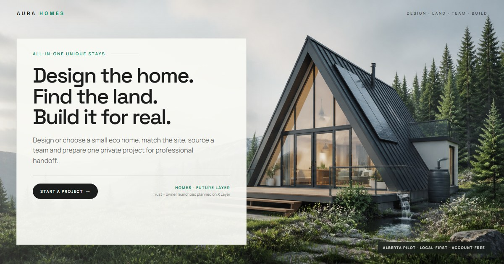
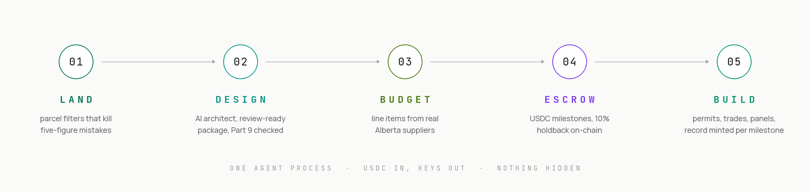
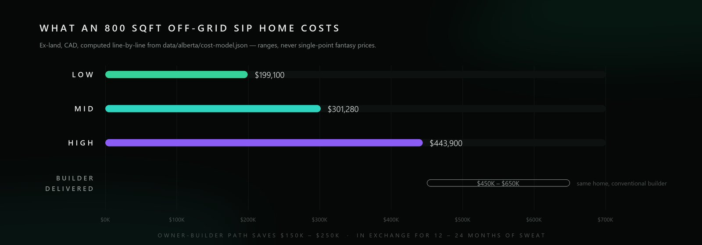

<div align="center">



<br>

<sub><code>AURA HOMES · ECO HOMES, TINY HOMES, UNIQUE STAYS · ALBERTA PILOT · OKX BUILDX AI 2026</code></sub>

# From an idea to a real small home.

**Aura Homes gives normal people one calm place to define a project, design or choose an eco-home, match it to land, source the right team, understand the budget, and prepare a verifiable build handoff. Cash works. Crypto is optional plumbing.**

[**Start a project**](https://aurahomes.fun/start) · [**Open the builder**](https://aurahomes.fun/build) · [**Explore the live site**](https://aurahomes.fun) · [**Explore the blockchain layer**](#x-layer-experiments)

[](https://aurahomes.fun)
[](https://aurahomes.fun/homes)
[](#x-layer-experiments)
[](#verification)
[](LICENSE)

<sub>Open-source product and hackathon submission by <a href="https://github.com/Matt-Aurora-Ventures">Matt Haynes / Aura Ventures</a>. Alberta first; designed to travel.</sub>

</div>

<div align="center"></div>

## The 60-second judge path

Aura is built around one provable journey rather than a collection of disconnected crypto demos.

| Time | Try this | What it proves |
| ---: | --- | --- |
| 0:00 | [Start a project](https://aurahomes.fun/start) and choose `Find land + build`, `Build on my land`, or `Buy a finished home` | A non-technical intake creates a durable, account-free project. |
| 0:15 | Open [the builder](https://aurahomes.fun/build), switch between Guided and Pro, then edit the same design | Both editor modes write one canonical document and one deterministic design hash. |
| 0:30 | Visit [land](https://aurahomes.fun/land) and [contractors](https://aurahomes.fun/contractors) | Project-fit and evidence scoring work, while pilot/demo records are labelled honestly. |
| 0:40 | Compare [finished-home routes](https://aurahomes.fun/buy) and payment readiness | Card and X Layer USDC paths stay side by side, and neither is presented as live without a real provider and destination. |
| 0:50 | Open the [HOMES dashboard](https://aurahomes.fun/homes) | The live HOMES token shows its real receipts (contract, venue, pool); the future trust stays a public zero-state ledger — no fees, property, staking, or distributions are invented. |
| 1:00 | Inspect [deployment evidence](docs/DEPLOYMENTS.md) and run the suites below | The product claims can be reproduced from code, tests, and public testnet state. |

> The strongest demo is: **brief → design → local save/reload → land fit → team evidence → quote basis → portable project handoff.** Aura prepares and explains; the person confirms.

<div align="center"></div>

## Two perspectives, one world

The landing page now asks one useful question before the story begins: **what brought you here?** Both choices use the same house, landscape, film, and product. Only the explanation changes, and a persistent switch lets a visitor cross between them at any time.

| Perspective | What the story makes clear |
| --- | --- |
| **For eco-home enthusiasts** | Design or choose an eco-home, find suitable land, source a team, compare quotes, and carry one private project toward professional review and construction. No wallet is required. The longer-term destination is a user-owned alternative to a centralized Airbnb-style marketplace: real stays with transparent operating records and optional shared ownership rails. |
| **Blockchain ecosystem** | Explore provider-supported [X Layer](https://web3.okx.com/xlayer) payments, the [OKX Build X · AI Season](https://web3.okx.com/xlayer/build-x-series) submission, the live [$HOMES token](https://aurahomes.fun/homes) and its planned property trust, and the path toward an accountable network of independently operated stays. The later owner launchpad lets people prepare a real home project before any vault or public raise exists. |

The crypto story still leads to the useful product: homes can be designed, matched to land, costed, sourced, and eventually paid for with cash or confirmed X Layer USDC where a real provider and payment destination exist. The homeowner story still explains the larger ambition in plain language: people should eventually be able to build, host, and participate in a user-owned network of distinctive stays without first becoming crypto experts.

## Three doors, one project

### Find land + build

Describe the home, budget, location, utilities, accessibility needs, and timeline. Aura turns those requirements into a design, screens land against the project, explains why a parcel may or may not fit, builds a contractor shortlist, and prepares a comparable handoff.

### Build on land I own

Skip the shopping flow. The land becomes a design constraint: site access, services, orientation, slope, foundation assumptions, and regional cost basis stay attached to the project instead of living in forgotten tabs.

### Buy a finished home

Compare manufactured and kit-home options without pretending a research directory is a checkout marketplace. Aura records destination support, shipping basis, claimed certifications, quote status, payment path, evidence freshness, and unresolved questions. A provider becomes purchasable only when a real quote and payment destination exist.

All three journeys share the same spine:

<div align="center">

</div>

`Requirements → Design → Land → Team → Quotes → Funding → Build → Operate`

## What exists now

Aura uses explicit status language throughout the interface and this submission:

- **Live** — works in the deployed browser experience now.
- **Pilot** — the engine works over deliberately limited, public, user-supplied, or demonstration inputs.
- **Testnet** — executable X Layer testnet code with no real customer funds.
- **In build** — code exists, but the complete customer outcome is not yet available.
- **Planned** — a published design, not a deployed capability.

| Capability | Status | Current boundary |
| --- | :---: | --- |
| Local-first project intake, library, autosave, archive, duplicate, recovery | **Live** | Projects stay in IndexedDB unless the person exports them. No account or cloud sync. |
| Plain and AES-256-GCM encrypted `.aura-project.json` bundles | **Live** | The passphrase is never recoverable by Aura; future file versions fail visibly without overwriting local work. |
| Guided and Pro editor modes over one `BuilderDocument` | **Live** | Design intent only. It does not certify structure, energy, manufacturing, or permits. |
| Eighty-seven-plan editable library with Alberta material/system ranges | **Live** | Aura originals (including the Nordic square set and the flat-roof glass set), three attributed open-source studies, and eight USDA/public-domain adaptations; source and licence notices travel inside every project. |
| Polygon footprints, partitions, openings, rooms, roofs, and multi-storey graph intent | **Live / in build** | The graph editor is usable; some professional export paths still describe the legacy rectangular shell and say so in the UI. |
| Every opening editable three ways — grips in 3D, handles in the plan, typed figures | **Live** | One edit, one undo step, whichever way you reach it. A change that would break a wall stops and prints the reason instead of silently refusing. |
| Design variations, a derived walkthrough, and a side-by-side impact comparison | **Live** | All three are parametric and deterministic: no image model, no rendering service, and no number the codebase does not compute. Daylight autonomy, energy use intensity and heating load are named as not modelled, in rows of the same table. |
| A co-pilot that proposes and never applies | **Live** | Deterministic, offline, and evidence-first: every card prints the figures it read and the engine that produced them. Applying anything takes an explicit confirmation, which a spec proves is the only path in. |
| Drawings, JSON, DXF, IFC4, ifcJSON, glTF/OBJ and comfort handoff | **Live / in build** | Export scope varies by geometry mode. Outputs are review-ready, never construction-ready. |
| Alberta budget ranges and quote snapshots | **Pilot** | Cost bands are explicit assumptions, not supplier offers or fixed manufacturing promises. |
| Parcel-fit discovery | **Pilot** | Demonstration/public records only today. No unauthorized MLS, REALTOR.ca, AlbertaLand, or listing-site scraping. |
| Contractor evidence scoring | **Pilot** | Explainable score model and gates exist; fictional profiles stay in demo mode. Aura does not call a contractor “vetted.” |
| Finished-home readiness catalog | **Pilot** | Research and quote preparation, not instant global purchasing. |
| Deterministic Aura brain and MCP tools | **Live locally** | Hosted, evidence-grounded concierge and `PreparedAction` confirmations remain in build. |
| X Layer payment and registry experiments | **Testnet / isolated** | Technical prototypes remain outside the customer journey. Provider-supported USDC payments are the relevant product path. |
| $HOMES token | **Live (venue)** | Launched Aug 13, 2026 through the third-party XLaunch launchpad on X Layer mainnet 196; contract, pool, locker, and creator fee-claim wallet published with a buy guide and plain risk labels on [/homes](https://aurahomes.fun/homes). A micro-cap experiment on an unaudited venue factory — not the designed token architecture. |
| HOMES trust, staking and property ledger | **Planned** | The ledger intentionally reads zero everywhere a receipt does not exist: no trust, staking, fund balance, property, or payout. Venue fees accrue but count only after claim receipts publish. |
| Owner-led unique-stay launchpad | **Planned** | Architecture published; project vaults, review, contracts and operating partners are future work. |

<div align="center"></div>

## The project is the product

Most home-building software optimizes one slice: drawing, listings, estimating, contractor leads, payments, or operations. Aura's core decision is to make those slices consumers of one durable project.

### `AuraProject`

The versioned project envelope contains:

- journey and non-technical requirements;
- one embedded `BuilderDocument` and its canonical `keccak256` hash;
- land, contractor, and manufacturer shortlists;
- RFQs, quote evidence, and immutable order snapshot references;
- milestones and artifact manifests; and
- explicit timestamps and archive state.

Camera position, active editor tab, open panels, heatmap visibility, and other transient interface state are intentionally excluded. A saved project means the home, not the screen.

### `BuilderDocument`

The builder document is the single design source of truth for home specification, graph geometry, partitions, finishes, fixtures, openings, and comfort targets. Canonical serialization, validation, migrations, deterministic hashing, undo/redo, IndexedDB storage, share/import, quotes, and exports all attach to this durable layer.

Legacy work remains readable. Unsupported future versions stop with a visible message and do not overwrite the file. Geometry changes quarantine orphaned semantic records for repair rather than quietly deleting user intent.

### `BuildingGraph`

The graph models stable vertices, wall edges, openings, room faces, slabs, voids, stairs, shafts, roof zones, storeys, and stacked-room relationships. It prevents invalid moves, derives exact room faces, and preserves semantic identifiers across edits.

The important honesty line: the graph engine is ahead of some downstream drawing/export adapters. Until every exporter consumes the graph directly, Aura labels the limitation beside the action.

### Files, hashes, and privacy

`SHA-256` is a hash, not “256-bit encryption.” Aura uses hashes to detect altered portable files and evidence. Canonical EVM-facing design and budget commitments use `keccak256`. Optional private project bundles use Web Crypto `AES-256-GCM` with PBKDF2-SHA-256 key derivation. Full homeowner documents do not belong on-chain.

<div align="center">

</div>

## Discovery without fabricated certainty

### Land

The land engine asks whether a parcel fits **this project**, not whether it merely has an attractive listing photo. The Alberta pilot considers district minimum dwelling size, access, services, utility distance, water and wastewater assumptions, setbacks supplied by the record, and project geometry.

The adapter boundary is deliberate. RESO defines interoperability; it does not grant listing access. CREA DDF and MLS data require authorization. Aura supports partner, municipal/public, pilot, and user-supplied `LandProvider` records, each with attribution, collection date, expiry, confidence, and access classification. It does not scrape restricted listing platforms.

The intended production map stack is MapLibre GL JS + PMTiles + Turf. The compliant adapter and project-fit model matter more than adding a map full of invented inventory.

### Contractors

Contractor scoring is an evidence case file, not a paid ranking:

- legal entity and service-area match;
- licence, workers' compensation, and insurance gates;
- comparable project evidence;
- dated source links and expiry;
- known gaps and unresolved questions; and
- project-type fit.

The user sees why a score changed and opens the original source. Demonstration profiles never appear as real default results. Aura does not compile BBB material or reproduce review-site content into a private database.

### RFQs, quotes, and finished homes

The next release turns project data into comparable scopes for design completion, foundation, shell, MEP, solar, water, septic, interiors, and general contracting. Original quote files remain attached, normalized line items reconcile against Aura's cost basis, omissions stay visible, and edited-after-quote projects are flagged.

The same evidence model governs finished homes. Crypto capability alone never makes a manufacturer suitable; destination, shipping, certification claims, quote basis, payment destination, dispute path, and evidence freshness all matter first.

<div align="center"></div>

## AI that stays inside the evidence

Aura's deterministic brain is available today as a browser fallback and an MCP server. It can check a parcel, produce a structured design brief, reconcile an Alberta budget, generate milestone schedules, report journey status, surface next actions, detect slips, prepare a digest, query suppliers, and return sourced Alberta facts.

The hosted concierge is intentionally bounded:

1. Ground answers only in the current `AuraProject`, approved reference material, provider evidence, and current chain state.
2. Cite the evidence and expose assumptions.
3. Draft comparisons, RFQs, and transaction payloads as `PreparedAction` records.
4. Simulate and warn before any consequential step.
5. Require an explicit human confirmation before contact, signature, or spend.

The existing x402-shaped MCP gate demonstrates the OKX Agent Payments Protocol request/receipt shape with **simulated settlement**. It does not claim a real token transfer. The planned Hostinger VPS service keeps provider keys out of the static bundle; project files remain local unless a person deliberately submits a bounded request.

## X Layer experiments

X Layer is optional infrastructure, not the front door. The relevant product path is simple: show ordinary card payments alongside X Layer USDC wherever a real manufacturer or contractor supports them, with the price, provider, recipient, network and fees visible before confirmation.

Aura also uses canonical `keccak256` commitments to verify that a portable design or budget still matches the project a person reviewed. Full plans and private homeowner records stay off-chain.

The repository retains an isolated testnet registry and earlier payment experiments for reproducible hackathon evidence. They use valueless test assets and development-only roles, are not linked from the customer navigation, and are not presented as a problem Aura has solved. Technical provenance remains available in [`docs/DEPLOYMENTS.md`](docs/DEPLOYMENTS.md).

<div align="center"></div>

## HOMES — a live token, a planned trust

**The $HOMES token is live.** The founder launched it on August 13, 2026 through
[XLaunch](https://xlaunch.fun/token/0x642855d557ada1eba8a66014aaff902e6394c0de),
a permissionless launchpad on X Layer mainnet 196:

| Receipt | Value |
| --- | --- |
| Contract | [`0x642855d557ada1eba8a66014aaff902e6394c0de`](https://web3.okx.com/explorer/x-layer/address/0x642855d557ada1eba8a66014aaff902e6394c0de) |
| Venue market | HOMES/wSPCXx on XLaunch · [GeckoTerminal pool](https://www.geckoterminal.com/x-layer/pools/0xf59d07dfe38807b398f0b4697f187d2f943b06a4) |
| Liquidity | Locked in XLaunch's locker contract — no withdraw path |
| Creator fee-claim wallet | [`0x5e8abc953f4d685943f1a0a730afffbba9df41de`](https://web3.okx.com/explorer/x-layer/address/0x5e8abc953f4d685943f1a0a730afffbba9df41de) — receives 60% of the venue's 1% swap fee |
| How to buy | [aurahomes.fun/homes](https://aurahomes.fun/homes) — wallet, OKB gas/bridge steps, the venue Buy panel, and address verification |

The facts, once: this is a micro-cap on a permissionless venue — it can go to
zero, locked liquidity is not a price floor, and the wrapped-stock quote asset
can be paused by its issuer. Every address is published so you can verify
instead of trust. The live mint is verified on-chain at block 67,921,152:
1,000,000,000 HOMES total, 94.63% in the venue pool, 0.80% in the creator
wallet — a launchpad curve, not the design split
([reproduce the read](app/scripts/verify-homes-mint.mjs)).

**The trust layer around it is being built in public.** No trust, staking,
fund balance, property, or payout exists; the venue's creator fees accrue but
appear on the ledger only after claim receipts are published — the build fails
on any unreceipted number by construction. The dashboard's zeros are declared,
not decorative.

The thesis is simple: if Aura eventually earns disclosed platform, service, API, AI-routing, or venue-agreement fees, a published allocation can route part of those fees into a property fund. The fund can acquire and operate distinctive small stays, while public on-chain records show what entered, what was allocated, what property was acquired, and what operating profit was distributed.

### Proposed parameters — not live promises

| Layer | Published concept |
| --- | --- |
| Token supply | 30% team · 10% marketing · 10% exchange/listing reserve · 20% protocol-owned liquidity · 30% public market |
| Platform/service fees | 60% property fund · 10% marketing · 10% operations · 10% development · 10% maintenance |
| Token venue fee share, if contractually available | 60% property fund · 10% marketing · 10% operations · 10% development · 5% burn reserve · 5% protocol-owned liquidity |
| First property target | Up to 200,000 USDC before any release for an acquisition path |
| Property economics | Planned 60% community / 40% team share of net property profit |
| Later distribution eligibility | Planned top 200 qualifying community stakers, prorated by the finalized stake snapshot rules |
| Wind-down concept | If a defined raise fails by its deadline, the distributable purchase-fund balance would be claimable by the top 50 qualifying community holders under published snapshot rules |
| Initial market design | The 2% launch-window wallet cap turned out to be venue-enforced by XLaunch (~6 minutes); the 30% team allocation remains a design target |
| Live market | HOMES/wSPCXx on XLaunch (the founder's launch decision superseded the earlier "SPACEX pool blocked until verified" policy); the wrapper's upgradeable/pausable risks are disclosed beside the buy path |

These percentages describe the **design**, not the live mint: the token was minted by XLaunch's factory, and its actual on-chain distribution is being verified before any design number is presented as the live one. One venue fee is now real by the venue's own rules — XLaunch routes 60% of its 1% swap fee to the creator wallet — and it still counts as revenue on the dashboard only after claim receipts are published. The public dashboard exposes contract addresses, snapshot block, fee receipts, fund balance, property receipts, eligible-holder cutoff, and USDC distribution transactions only when those values exist.

No private owner documents, guest data, title records, full plans, or personal information belong in the token ledger.

## The later owner launchpad

The broader vision is an owner-led launchpad for eco-homes and unique stays: design a real project in Aura, prepare the land and team, publish evidence, open a named project pool, build under milestone controls, and operate the stay with an exportable record.

It needs three ledgers that must never be blurred:

| Ledger | Purpose | Hard boundary |
| --- | --- | --- |
| **HOMES lock** | Time-bound support signal and later eligibility under published rules | Locked tokens are not construction cash. |
| **Project USDC vault** | Real money for one named stay, with scope, cap, deadline, milestones, refund logic, and evidence | It cannot spend market liquidity and cannot silently change projects. |
| **Market liquidity** | Independent HOMES market depth | It is not counted as money raised for land or construction. |

An owner project would carry its own design hash, budget hash, quote basis, land status, vault address, milestone evidence, operating record, and human confirmations. Aura may prepare the artifacts and on-chain actions; it may not autonomously contact, sign, bridge, or spend.

The long-term result is more than a token page: a decentralized unique-stay network with tools for people who never touch crypto, optional X Layer rails for people who do, and a repeatable route from a responsible design to an operating home.

Read the full, versioned concept in [`docs/HOMES-TOKEN-CONCEPT.md`](docs/HOMES-TOKEN-CONCEPT.md).

<div align="center"></div>

## Architecture

```text
aura-homes/
├── app/          Next.js 14 app, local-first project workspace, builder, discovery and testnet UI
├── agent/        deterministic journey brain + MCP server + x402-shaped simulated payment gate
├── contracts/    isolated X Layer testnet experiments, Hardhat and OpenZeppelin
├── design-api/   optional FastAPI design service; deterministic geometry works without model keys
├── data/         Alberta pilot costs, parcels, suppliers and evidence inputs
├── docs/         architecture, claims, research, roadmap, token concept and deployment proof
└── assets/       authored Aura brand and submission visuals
```

### Frontend

Next.js 14, React 18, TypeScript, React Three Fiber, Three.js, drei, postprocessing, Motion, viem, wagmi, TanStack Query, IndexedDB and Web Crypto. The landing film is progressive; 3D begins only after interaction. Reduced-motion, mobile, low-power, and WebGL-failure states have composed static fallbacks. The builder renders on demand rather than running a decorative infinite loop.

### Design and AI services

The browser owns the durable project. Deterministic geometry and cost logic remain available without a hosted model. The optional FastAPI service separates language-model reasoning from drawing geometry: the model proposes a structured program; deterministic code owns coordinates and exports.

The Hostinger VPS target is `api.aurahomes.fun` with FastAPI, Uvicorn, Caddy, Docker Compose, SQLite/WAL, exact-origin CORS, rate limits, and structured audit events without private project contents. That hosted API is not part of the current static production claim.

### Contracts

Solidity + OpenZeppelin + Hardhat on X Layer. The active product direction is provider-supported USDC payment preparation plus compact design/budget commitments. Earlier testnet contract work remains isolated for provenance and testing. Full documents remain off-chain.

## Verification

The current release checkpoint (August 14, 2026, deploy `8e98b68`) produced:

| Suite | Result |
| --- | ---: |
| TypeScript / production compilation | Passed |
| Deterministic app + contract-truth specs | **655 passed** |
| Playwright UI specs against a fresh static export | **132 passed** |
| Hardware scene proof (real GPU, desktop + mobile) | **Passed at `3e00c66`** — meadow settled both tiers, wind measured at 26% pixel motion on an idle scene, render p95 8.3 ms at the full tier. Not re-run since; it needs a quiet machine and a real GPU, so it is dated rather than implied. |
| Money anchor (`agent/` `npm run demo`) | **Reconciles to the dollar** — ex-land $199,100 / $301,280 / $443,900 vs `data/alberta/cost-model.json` |
| Release tooling (`npm run test:release`) | Passed — append-only two-phase gh-pages publishing with chunk recovery |

Run the same checks:

```bash
cd app
npm install
npx tsc --noEmit
npm test           # unit + contract-truth specs (includes release-truth and meadow pins)
npm run test:ui    # builds the static export, then walks it in a real browser
npm run test:release

# the hardware scene proof needs a real GPU and an approved baseline directory:
AURA_MEADOW_BASELINE=/path/to/aura-r03-baseline node scripts/meadow-proof.mjs

cd ../agent
npm install && npm run demo   # the money anchor — totals must match to the dollar

cd ../contracts
npm install && npm test
```

Some gates are deliberately adversarial: the meadow proof fails if the grass
stops moving (pixel-motion between idle frames), if any baked card stands on
the deck, walkway, or entrance steps (decoded from the shipped binary), or if
the offline atlas generator's clearance field drifts from the runtime's by
any amount at any of 3,000 sampled points. A spec that merely *says* the
scene is beautiful cannot pass for one that proves it.

Performance gates are part of the product contract: homepage LCP ≤ 2.0 s, steady-state interactions ≤ 160 ms (first-use compile ≤ 250 ms), CLS ≤ 0.08; roughly 60 fps desktop while actively editing; no automatically running mobile 3D.

## How this repo is governed

This repository is built by AI agents under an explicit engineering contract,
and the contract is itself versioned in the repo — which is exactly what makes
the work reviewable and continuable by anyone (or any model):

| Artifact | Role |
| --- | --- |
| [`docs/plans/2026-08-14-aura-full-system-graph-v1.2.md`](docs/plans/2026-08-14-aura-full-system-graph-v1.2.md) | The full-system dependency graph: every stream of work, its gates, and the calendar. The current authority. |
| [`docs/plans/registry/decisions.json`](docs/plans/registry/decisions.json) | Founder decisions, dated. A plan document cannot reverse one; only a newer decision can. |
| [`docs/plans/registry/claims.json`](docs/plans/registry/claims.json) | Every load-bearing public claim mapped to its proof. Collateral generates from this file, not the other way around. |
| [`docs/plans/execution/`](docs/plans/execution/) | Typed execution manifests: one bounded job per node with inputs, rejection gates, write-set, verification commands, and recorded evidence. `next/` holds ready-to-run scaffolds for the upcoming nodes. |
| [`docs/GRAPH-ENGINEERING.md`](docs/GRAPH-ENGINEERING.md) | The doctrine underneath it all: node contracts, fresh-context verification, frozen anchors. |
| [`docs/AUDIT-LOG.md`](docs/AUDIT-LOG.md) | Fresh-context audits of the whole system, graded and dated. |

The one-sentence version of the truth rule: **nothing unbuilt is written in
the present tense, every number has one anchored source, and a claim without
a receipt renders as a declared zero.**

## Run locally

### Web application

```bash
git clone https://github.com/kr8tiv-ai/aura-homes.git
cd aura-homes/app
npm install
npm run dev
```

Open [http://localhost:3000](http://localhost:3000). The project system, deterministic design tools, pilot marketplace records, and planned HOMES zero state work without API keys.

### Aura brain / MCP

```bash
cd agent
npm install
npm run build
npm run mcp:smoke
npm run demo
```

### Optional design service

```bash
cd design-api
python -m pip install -r requirements.txt
uvicorn app.main:app --reload --port 8000
```

`GET /health` reports which optional providers are configured. With no keys, it returns deterministic geometry and clearly marks the offline path.

### Contracts

```bash
cd contracts
npm install
npm test
```

Never commit private keys. Testnet deployment instructions and provenance are in [`docs/DEPLOYMENTS.md`](docs/DEPLOYMENTS.md).

## Safeguards

- Aura produces design intent and review-ready handoff, not structural, energy, manufacturing, title, appraisal, or permit certification.
- Licensed professionals remain responsible for regulated decisions and stamped work.
- Listing adapters require authorized, public, partner, or user-supplied data.
- Contractor scores expose evidence and missing evidence; they are not guarantees.
- Quotes show source, date, exclusions, confidence, and edited-after-quote state.
- AI cannot sign, contact, or spend without confirmation.
- No custody, mainnet funds, autonomous conversion, hidden bridge, or automatic ChangeNOW execution.
- On-chain records contain hashes and public proof, not homeowner files or personal data.
- The $HOMES token is live with published receipts; its trust, staking, properties, launchpad, and distributions remain planned until their own addresses and receipts exist.

## Documentation

| Read | Purpose |
| --- | --- |
| [`docs/SUBMISSION.md`](docs/SUBMISSION.md) | Current submission narrative, demo path, and evidence |
| [`docs/ROADMAP.md`](docs/ROADMAP.md) | Active Now / Next / Future delivery sequence |
| [`docs/ARCHITECTURE.md`](docs/ARCHITECTURE.md) | System boundaries and data flow |
| [`docs/DEPLOYMENTS.md`](docs/DEPLOYMENTS.md) | Current and retired X Layer proof |
| [`docs/HOMES-TOKEN-CONCEPT.md`](docs/HOMES-TOKEN-CONCEPT.md) | Planned trust, allocations, zero-state ledger and launchpad boundaries |
| [`docs/GAP-ANALYSIS.md`](docs/GAP-ANALYSIS.md) | What still blocks an end-to-end service |
| [`AURA_HOMES_MASTER_BRIEF.md`](AURA_HOMES_MASTER_BRIEF.md) | Archived August 9 handoff; historical context only |
| [`docs/PHASED-ROADMAP.md`](docs/PHASED-ROADMAP.md) | Archived escrow-led commercial hypothesis |
| [`docs/GRAPH-ENGINEERING.md`](docs/GRAPH-ENGINEERING.md) | How this repo is built: the AI-agent orchestration doctrine — node contracts, fresh-context verification, frozen anchors |
| [`docs/ALBERTA-PLAYBOOK.md`](docs/ALBERTA-PLAYBOOK.md) | Alberta pilot facts and handoff rules |
| [`docs/AI-BRAIN.md`](docs/AI-BRAIN.md) | Bounded agent model and MCP tools |
| [`docs/BRAND.md`](docs/BRAND.md) | Paper, ink, emerald and “crypto is plumbing” system |
| [`docs/CREDITS.md`](docs/CREDITS.md) | Third-party assets, licenses and attribution |

## Roadmap from proof to service

1. Finish the unified project workspace and graph-derived professional exports.
2. Connect authorized/public land adapters and real evidence case files.
3. Generate RFQs, reconcile real quotes, and activate providers only after evidence exists.
4. Deploy the bounded Hostinger API and prepared-action confirmations.
5. Connect card and X Layer USDC payment providers only where quotes, recipients, fees, region support and failure handling are verified.
6. Deliver milestone evidence, commissioning, warranty, maintenance and home-book operations.
7. Only then evaluate HOMES, the trust structure, venue mechanics, property operations and owner project vaults.

The project stays approachable by keeping the chain underneath the journey. A person can design, compare, export, and organize a home without a wallet. When on-chain proof helps—hash commitments, provider-supported payments, or public fund accounting—it appears at the exact point it earns its complexity.

<div align="center">


**Design your eco home. Find the land. Manage the build.**

<sub>Aura Homes · Alberta pilot · X Layer testnet · HOMES trust and owner launchpad planned</sub>

</div>
