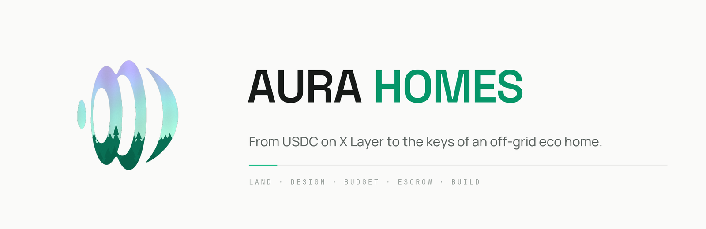
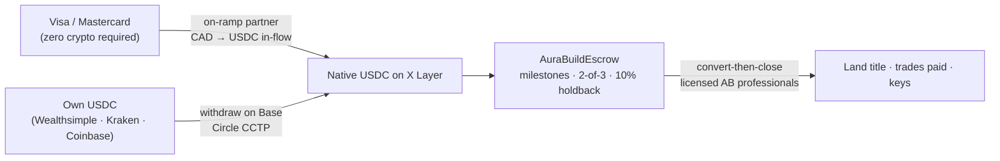
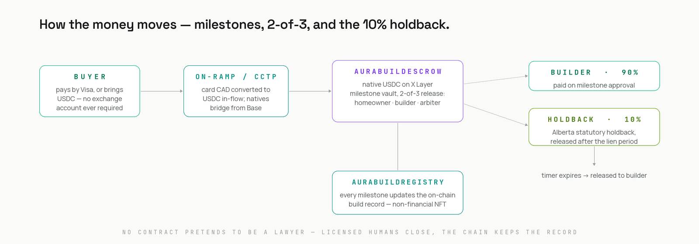

<div align="center">



<br>

<sub><code>AURA&nbsp;HOMES&nbsp;·&nbsp;A&nbsp;KR8TIV&nbsp;AI&nbsp;PRODUCT&nbsp;·&nbsp;ALBERTA&nbsp;PILOT</code></sub>

### From USDC on X Layer to the keys of an off-grid eco home.

**Aura Homes is an AI agent that orchestrates the entire journey — find the land, design the home, price it from real local suppliers, fund it in escrow, build it with local trades — with no middlemen, no black boxes, and nothing hidden.** Alberta pilot. Open source from the first commit.

[](https://web3.okx.com/xlayer/build-x-hackathon)
[](docs/FEASIBILITY.md#2-the-hackathon-verified-facts)
[](https://web3.okx.com/xlayer)
[](docs/FEASIBILITY.md#5-crypto-rails--feasible-with-the-2-hop-truth-told)
[](LICENSE)
[](docs/ALBERTA-PLAYBOOK.md)

**▶ [LIVE — aurahomes.fun](https://aurahomes.fun)** — the demo, hosted and open.

[The vision](docs/VISION.md) · [Feasibility study](docs/FEASIBILITY.md) · [Architecture](docs/ARCHITECTURE.md) · [Roadmap](docs/ROADMAP.md) · [Hackathon submission](docs/SUBMISSION.md) · [Brand](docs/BRAND.md) · [Credits](docs/CREDITS.md) · [Continue this with any AI](docs/AI-HANDOFF.md)

<sub>A **KR8TIV AI** product · sibling of Aura-H2O, Aura-Farms, and AuraBNB</sub>

</div>

<div align="center"></div>

<br>

<sub><code>01&nbsp;·&nbsp;OVERVIEW</code></sub>
## The idea, said plainly

Building an eco home today means being your own general contractor across twenty industries that don't talk to each other. Every gap between them costs money and kills dreams — a conventional builder delivers our reference home at $450,000–$650,000 ex-land; the same home, owner-built with the same materials and the same licensed trades, computes to $199,100–$443,900. That difference is mostly margin stacked on coordination, and coordination is software's job. **Aura Homes is the orchestration layer that was missing.** One agent process:

<div align="center">

<br>
<sub><code>FIG.&nbsp;1</code>&nbsp;&nbsp;The five-stage pipeline — one agent process from land to keys.</sub>
</div>

1. **LAND** — filters parcels against the things that actually kill small-home builds: district minimum-dwelling-size bylaws, aquifer reliability, power-line distance, septic soils, the GST-on-bare-land trap. Then walks the acquisition with crypto-fluent, licensed Alberta professionals. USDC in, title out.
2. **DESIGN** — an AI architect turns a questionnaire into a **review-ready design package** for a SIP-built small home: floor plan, 3D massing, energy pre-check, code-constraint report (NBC Part 9, climate zone 7A). A local designer finishes the permit set — we say *review-ready* because "AI permit-ready drawings" don't exist anywhere and we won't pretend.
3. **BUDGET** — a live line-item budget from researched Alberta data ([data/alberta](data/alberta/)): every line has an in-province supplier, a LOW/MID/HIGH range, and an owner-buildable flag. Reference build: 800 sqft off-grid SIP home, **$301,280 CAD mid-range ex-land** (LOW $199,100 / HIGH $443,900), computed line-by-line.
4. **ESCROW** — milestones funded in **native USDC on X Layer** into [`AuraBuildEscrow`](contracts/): 2-of-3 release (homeowner / builder / arbiter) and Alberta's statutory 10% construction holdback modeled directly in the contract. Every build mints a record in [`AuraBuildRegistry`](contracts/) — the real-world asset is the build itself.
5. **BUILD** — orchestrated permits, a DIY-or-hire decision on every work package, and an AI contractor-research sweep that hands you a ranked shortlist per trade. SIP shell up in days, solar + battery + wood stove, certified-installer septic, cistern or well — and every home ships with a wood-fired hot tub and a beautiful deck, because these homes are meant to be wanted, not endured.

Off-grid everything, grid-optional forever. No conventional concrete: screw piles instead of poured foundations (also *cheaper* in Alberta — [the research](docs/research/FOUNDATIONS-NO-CONCRETE.md)). Nobody needs to own crypto to start: **pay by Visa** and the app converts to USDC in-flow. What runs today versus roadmap, per stage:

| | Stage | Real today | Roadmap |
|--:|---|---|---|
| `01` | **LAND** | parcel-verdict engine over structured county data ([agent/src/parcels.ts](agent/src/parcels.ts)) | live listings, district-table lookups, the watching agent |
| `02` | **DESIGN** | AI design brief + code-constraint report, offline fallback | IFC export, in-browser 3D, HOT2000 handoff |
| `03` | **BUDGET** | full line-item table, reconciles to the JSON model | live quote ingestion, invoice learning loop |
| `04` | **ESCROW** | both contracts written and tested | testnet → mainnet deploy, audit, FINTRAC MSB, account abstraction |
| `05` | **BUILD** | sequenced milestone plan + playbook knowledge | journey brain: slip-catching, nudges, inspector-linked draws |

The pipeline is typed end-to-end (`Questionnaire → DesignBrief → Budget → MilestoneSchedule`, [agent/src/types.ts](agent/src/types.ts)) so stages deepen independently.

<br>

<sub><code>02&nbsp;·&nbsp;THE&nbsp;RESEARCH</code></sub>
## Why Alberta, SIPs, and off-grid — the short version

The full 300-source case lives in **[docs/FEASIBILITY.md](docs/FEASIBILITY.md)** and **[docs/ALBERTA-PLAYBOOK.md](docs/ALBERTA-PLAYBOOK.md)**; these are the load-bearing facts:

- **Alberta is objectively the easiest jurisdiction in Canada for this.** No architect required for 1–4 unit dwellings (Architects Act exemption); owner-builder rights are codified ($95 authorization with warranty, $750 with the opt-out — which freezes resale for 10 years via title caveat, disclosed eyes-open); a homeowner may pull their own electrical, plumbing, and gas permits (Leduc County confirms in writing); bare land within an hour of Edmonton lists at $75,000–$199,000.
- **The district-minimum trap is why software should do this.** Minimum dwelling size is set at the *district* level: in Lac Ste. Anne County, Agricultural district = 592 sqft, Country Residential = 1,076 sqft. The same 800 sqft house is permittable on one parcel and unpermittable minutes away — buyers find out after closing. One bylaw table lookup is worth five figures.
- **SIPs because the envelope is the enemy in zone 7A.** Continuous insulation, airtight by construction, 2–3 person erection with small-format panels, and in-province supply with a paved Part 9 path (Insulspan is CCMC-listed). The honest lead time is **12–20 weeks** — the app schedules around it, and no platform magic shortens a panel plant's queue.
- **Off-grid works as a system, told honestly.** Edmonton's December solar yield is ~1.3 kWh/kW/day — a 70–77% collapse — so the design pairs 8–12 kW of panels with 20–40 kWh of LiFePO4, an auto-start generator that is not optional, and a WETT-inspected wood stove. Anyone selling Alberta off-grid without a generator line item is selling January misery.
- **The venture-scale attempts died of dishonest scope.** Atmos raised US$20M pretending to be the builder and shut down; Propy closes existing homes; Higharc sells to production builders. Nobody serves the person standing on empty land — and nobody combines AI design + crypto rails + off-grid fulfillment. The lesson is in our architecture: **we are the orchestration layer, never the general contractor.**

<br>

<sub><code>03&nbsp;·&nbsp;THE&nbsp;MONEY&nbsp;RAIL</code></sub>
## Why USDC on X Layer

Chosen on compliance and timing, not vibes. **USDC is the only stablecoin with CSA approval** for registered Canadian platforms — the compliant choice. **Native USDC arrived on X Layer August 6, 2026** (Circle-issued, CCTP — not a bridge IOU; addresses pinned in code, USDC.e never touched). X Layer is EVM-equivalent, mainnet chain 196 / testnet 1952 (verified live via `eth_chainId` before any deploy), with OKB gas in pennies. The last mile is CAD: Alberta lawyers cannot hold crypto in trust, so licensed professionals convert-then-close — and the app's ledger exports the CRA barter-disposition bookkeeping automatically.



<div align="center"><sub><code>FIG.&nbsp;2</code>&nbsp;&nbsp;Two doors into one escrow — card CAD or native USDC, converging on X Layer.</sub></div>

No exchange, ever: OKX's exchange left Canada in 2023, so a buyer with zero crypto pays by card and an on-ramp partner converts in-flow; crypto-natives bring their own USDC via Base + CCTP. Prices display in CAD everywhere. The platform fee is an x402-style micro-fee on design runs, sized as cost recovery for inference, not as margin.

<br>

<sub><code>04&nbsp;·&nbsp;THE&nbsp;ECONOMICS</code></sub>
## Exact numbers, computed

<div align="center">

<br>
<sub><code>FIG.&nbsp;3</code>&nbsp;&nbsp;Budget bands for the 800 sqft reference build, ex-land — computed line-by-line, not quoted.</sub>
</div>

Every line from [data/alberta/cost-model.json](data/alberta/cost-model.json) with its basis — researched ranges, not quotes, and the JSON is the single source of truth the app, the docs, and this README all read.

| Line item | LOW | MID | HIGH | Owner-buildable? |
|---|---:|---:|---:|:---:|
| Land (1–5 acres) | $75,000 | $150,000 | $350,000 | — |
| Driveway, clearing, site prep | $4,500 | $8,000 | $12,000 | yes |
| Screw-pile foundation (16–24 piles) | $6,000 | $10,000 | $15,000 | no |
| SIP shell kit + erection | $30,000 | $45,000 | $55,000 | yes — 2–3 people, small-format panels |
| Metal roof, triple-pane windows, doors, siding | $22,000 | $32,000 | $45,000 | yes |
| Interior fit-out (kitchen, bath, drywall, floor) | $22,000 | $35,000 | $55,000 | yes |
| Mechanical: HRV, plumbing, electrical, wood stove + WETT | $22,000 | $30,000 | $40,000 | yes — homeowner permits; solar wiring excluded |
| Off-grid solar 8–12 kW + 20–40 kWh LiFePO4 + generator | $35,000 | $48,000 | $70,000 | no — CEC s.64 |
| Water: buried cistern (or well) | $8,000 | $12,000 | $18,000 | no |
| AWG summer water module (standard on every home) | $3,500 | $5,000 | $8,000 | yes |
| Private sewage (septic field or Ecoflo biofilter) | $12,000 | $18,000 | $28,000 | no — certified installer by law |
| Wood-fired hot tub + deck | $8,000 | $14,000 | $22,000 | yes |
| Permits, design, engineering, insurance | $8,000 | $12,000 | $18,000 | — |
| Contingency (10% / 12% / 15% of the ex-land lines) | $18,100 | $32,280 | $57,900 | — |
| **Total ex-land (computed)** | **$199,100** | **$301,280** | **$443,900** | |
| **Total with land (computed)** | **$274,100** | **$451,280** | **$793,900** | |

The totals rule is frozen: *totals = Σ line items × (1 + contingency), land excluded from ex-land totals, no line optional.* An optimizer that wants prettier numbers must change the lines and their sources, never the rule ([graph doctrine](docs/GRAPH-ENGINEERING.md)). For comparison: a builder delivers the same home at **$450,000–$650,000 ex-land** — the owner-builder path saves $150,000–$250,000 in exchange for 12–24 months of sweat, a trade the app makes explicit, never glosses.

<br>

<sub><code>05&nbsp;·&nbsp;THE&nbsp;ESCROW</code></sub>
## Escrow and the 10% holdback, for a normal person

<div align="center">

<br>
<sub><code>FIG.&nbsp;4</code>&nbsp;&nbsp;Milestone escrow with Alberta's statutory 10% holdback enforced in contract state.</sub>
</div>

Paying a builder up front is how people get robbed, and building unpaid is how builders go broke. Aura's answer is the traditional progress-draw pattern with the trust moved into inspectable code:

1. Your money sits in a vault contract on X Layer — not in the builder's account, not in ours. Anyone can check the balance.
2. When a milestone is done, **two of three parties** — you, the builder, an independent arbiter — must agree before money moves. No single party, including the builder, can move funds alone.
3. On each approved milestone the builder receives 90%; the contract retains **10% because Alberta law says so** (the Prompt Payment and Construction Lien Act holdback, which the paper world gets wrong constantly — here the contract cannot forget it).
4. When the lien period expires with no claims, the holdback releases automatically. The timer is contract state, not a calendar entry someone loses.
5. Every milestone appends to the build's permanent on-chain record ([`AuraBuildRegistry`](contracts/contracts/AuraBuildRegistry.sol)) — a non-financial NFT, deliberately: land title still transfers through Alberta's land titles system via licensed professionals.

What this is not: a lawyer, a title transfer, or a warranty. Both contracts are written and tested (`npx hardhat test` — passing output is the anchor, never "should pass").

<br>

<sub><code>06&nbsp;·&nbsp;THE&nbsp;BRAIN&nbsp;&amp;&nbsp;THE&nbsp;METHOD</code></sub>
## AI-run, honestly costed

The app is a client of a persistent per-journey AI ([docs/AI-BRAIN.md](docs/AI-BRAIN.md)): a typed state machine the brain reads every turn (guidance never hallucinates progress), **slip-catching as a first-class feature** (permit unsubmitted 7+ days, SIP kit unordered while a 12–20 week lead burns), email digests for the 95% of days a user doesn't open the app, and a cost-honest model strategy — code where a rule suffices, a small model with RAG for retrieval, Claude only for judgment nodes, with the x402 fee sized to cover exactly that. It ships as an MCP server, so the web app, Claude, and the OKX agent ecosystem are all just clients.

The repo itself is built the same way — AI agents run as a dependency graph under [docs/GRAPH-ENGINEERING.md](docs/GRAPH-ENGINEERING.md): every task declares JOB / IN / OUT with an enforced schema, a worker never checks its own work, and anchors cannot be argued with (tests that ran, budgets that reconcile to the dollar, `eth_chainId` read live). The standing vision audit is [docs/AUDIT-LOG.md](docs/AUDIT-LOG.md).

<br>

<sub><code>07&nbsp;·&nbsp;HONESTY</code></sub>
## Honesty policy

No black boxes, and no selective memory. Research that contradicted the founding assumptions is published, not buried — recorded in [docs/FEASIBILITY.md](docs/FEASIBILITY.md) and frozen as never-un-learn corrections in [docs/AI-HANDOFF.md](docs/AI-HANDOFF.md):

| The assumption | What verification found | The route around it |
|---|---|---|
| AWG (atmospheric water) as the water plan | Every condenser AWG cuts off ~15°C / 30% RH; Edmonton is below 15°C outdoors 7–8 months a year; outdoor winter output is **zero litres** | Cistern or well is the water plan; the AWG ships **standard on every home** as the honestly-labeled summer producer (10–20 L/day Jun–Sep) |
| Wealthsimple crypto-backed loans | **False** — its credit products are securities-collateral only (re-verified Aug 2026) | Aave V3 live on X Layer (~$85M TVL) and Ledn are the real lending paths; the app teaches them |
| "Withdraw from OKX to X Layer" | OKX's exchange left Canada in June 2023 | **Card-first**: an in-flow on-ramp sells USDC to Visa payers; crypto-natives route Wealthsimple/Kraken/Coinbase → Base → CCTP |

The same policy runs forward: negative findings get published, unverifiable numbers get labeled, every price is a range with a basis. It is also simply the only defensible way to sell someone a house.

<br>

<sub><code>08&nbsp;·&nbsp;THE&nbsp;HACKATHON</code></sub>
## The hackathon

This repo is Aura Homes' entry in the **[OKX BuildX AI Season Hackathon](https://web3.okx.com/xlayer/build-x-hackathon)** (Aug 7–21, 2026), AI-RWA track — AI-powered onchain applications on X Layer. Contracts deploy to testnet (chain 1952) during the event, mainnet (chain 196) after. Submission package and demo script: **[docs/SUBMISSION.md](docs/SUBMISSION.md)**.

<br>

<sub><code>09&nbsp;·&nbsp;FAQ</code></sub>
## FAQ

**Do I need to own crypto?**
No. Pay by Visa or Mastercard; an on-ramp partner converts to USDC in-flow, and you see prices in CAD throughout. If you already hold USDC, bring it — faster and cheaper.

**Do I need an architect?**
No. Alberta's Architects Act exempts 1–4 unit dwellings of any size; a residential designer ($1,200–$2,700) finishes the AI's review-ready package into the permit set, and truss engineering arrives stamped from the truss plant.

**Can I really build it myself?**
Much of it, legally. An Owner Builder Authorization lets you pull your own electrical, plumbing, gas, and private-sewage-application permits; small-format SIP panels are a 2–3 person job. Hard legal lines: solar wiring (CEC s.64), septic installation, and well drilling are licensed work. The budget table marks every line.

**Can I sell the house afterward?**
The honest catch: the $750 warranty opt-out places a title caveat blocking sale for **10 years** (since December 2025). If resale flexibility matters, take the $95 path with a home warranty. The app makes you choose eyes-open.

**Does off-grid actually work through an Alberta winter?**
Yes, as a system: solar collapses ~70–77% in December, so the design pairs 8–12 kW of panels with 20–40 kWh of battery, an auto-start generator, and a WETT-inspected wood stove. The AWG makes 10–20 L/day of drinking water June–September and zero in winter — physics, not a product gap — which is why the cistern or well carries winter, always.

**What does it cost, honestly?**
**$199,100 / $301,280 / $443,900** (LOW/MID/HIGH, ex-land, CAD, computed from the line-item model), plus land at $75,000–$350,000. A builder delivers the same home at $450,000–$650,000 ex-land.

**What happens to my money if the builder disappears?**
It sits in the escrow contract, which no single party can move alone. Unapproved milestones stay funded and recoverable; the arbiter path exists for exactly this. Compare: a deposit in a builder's operating account.

**Why should I trust an AI with a house?**
You shouldn't, blindly — the architecture never asks you to. The AI orchestrates; licensed humans stamp, install, inspect, and close at every legally-required boundary; deterministic code computes the money; the contract enforces the holdback; and every claim traces to a source you can check.

<br>

<sub><code>10&nbsp;·&nbsp;REPO&nbsp;MAP</code></sub>
## Repo map

| Path | What it is |
|---|---|
| [docs/VISION.md](docs/VISION.md) | The canonical brief, audited against continuously |
| [docs/FEASIBILITY.md](docs/FEASIBILITY.md) | The full feasibility study: tech, law, money, honest red flags |
| [docs/ALBERTA-PLAYBOOK.md](docs/ALBERTA-PLAYBOOK.md) | Regulatory + supplier playbook for the pilot province |
| [docs/TOKEN-RESEARCH.md](docs/TOKEN-RESEARCH.md) | Token research (verdict: no token — and exactly when that changes) |
| [docs/ARCHITECTURE.md](docs/ARCHITECTURE.md) | System design: app, agent, contracts, chain config |
| [docs/ROADMAP.md](docs/ROADMAP.md) | The 12-day sprint and the five-year software |
| [docs/AI-HANDOFF.md](docs/AI-HANDOFF.md) | How any AI or human continues this without losing the plot |
| [docs/AI-BRAIN.md](docs/AI-BRAIN.md) | The journey brain: slip-catching, email updates, model tiers |
| [docs/GRAPH-ENGINEERING.md](docs/GRAPH-ENGINEERING.md) | The graph doctrine: node contracts, verifiers, anchors |
| [docs/BRAND.md](docs/BRAND.md) | The brand: light-first palette, the mark, typography, voice |
| [docs/AUDIT-LOG.md](docs/AUDIT-LOG.md) | The standing vision-audit loop |
| [contracts/](contracts/) | `AuraBuildEscrow` + `AuraBuildRegistry`, Hardhat, tested |
| [app/](app/) | Next.js app — the five-stage pipeline UI, X Layer wallet flow |
| [agent/](agent/) | `aura-architect` — the AI design/budget/milestone pipeline |
| [data/alberta/](data/alberta/) | The researched cost model and no-middlemen supplier directory |
| [assets/](assets/) | The mark, hero, and README graphics — generated, in the house style |

<br>

<sub><code>11&nbsp;·&nbsp;RUN&nbsp;IT</code></sub>
## Run it

```bash
git clone https://github.com/kr8tiv-ai/aura-homes.git && cd aura-homes
# the AI architect pipeline (no keys needed — offline fallback included)
cd agent && npm install && npm run build && npm run demo
# the contracts
cd ../contracts && npm install && npx hardhat test
# the app
cd ../app && npm install && npm run dev
```

<br>

<sub><code>12&nbsp;·&nbsp;CONTRIBUTE</code></sub>
## Contribute

This is deliberately the software that would otherwise take five years to exist. It gets built in the open, and it needs people — Solidity reviewers, Alberta designers and safety-codes brains, IFC/BIM engineers, off-grid installers who'll sanity-check numbers. Concrete first issues:

1. **Correct a number** — a real Alberta quote or invoice that tightens a LOW/MID/HIGH range in [data/alberta/cost-model.json](data/alberta/cost-model.json) is pure signal.
2. **Add a district-minimum table** — Parkland and Sturgeon need what Lac Ste. Anne has, from the county's own bylaw PDF.
3. **Add a supplier with a basis** — [data/alberta/suppliers.json](data/alberta/suppliers.json), in-province first.
4. **Try to break the escrow** — read [AuraBuildEscrow.sol](contracts/contracts/AuraBuildEscrow.sol) and write the failing test we missed.
5. **Blower-door data** — real cold-climate SIP airtightness numbers upgrade the honesty of the research.
6. **Start a province pack** — `data/bc/` or `data/sk/` mirroring the Alberta structure; a new province is a data problem, not a rewrite.

House rules: every claim needs a basis, ranges beat point estimates, negative findings are welcome in the docs (that is the brand), and the frozen anchors in [docs/GRAPH-ENGINEERING.md](docs/GRAPH-ENGINEERING.md) apply to everyone, human or AI.

<div align="center">


<sub>Authored by <a href="https://github.com/Matt-Aurora-Ventures">Matt Aurora Ventures</a> · co-authored with Claude (Fable 5) · MIT · <b>A KR8TIV AI product</b></sub>
</div>
