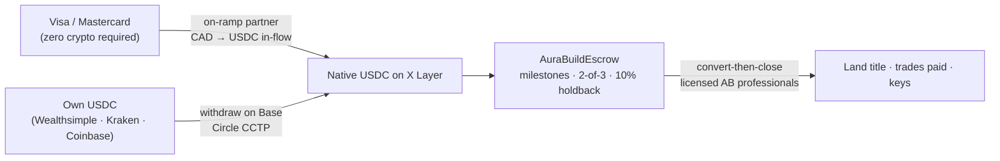

<div align="center">


<br>

<sub><code>AURA&nbsp;HOMES&nbsp;·&nbsp;A&nbsp;KR8TIV&nbsp;AI&nbsp;PRODUCT&nbsp;·&nbsp;ALBERTA&nbsp;PILOT</code></sub>

### From USDC on X Layer to the keys of an off-grid eco home.

**Aura Homes is an AI agent that orchestrates the entire journey — design the home, find the land, find the agent, price every material, fund the build, hire the right trade for every task, and babysit it to completion — with no middlemen, no black boxes, and nothing hidden.** One click to design. One agent watching every step after that. Alberta pilot. Open source from the first commit.

**Two doors, and you can take either.** *Design one* — architect your own off-grid home from a questionnaire to a dimensioned drawing, free, and walk out with the plans whether or not you ever build with us. *Or buy one* — from a maker that already accepts crypto, with Aura showing you exactly how your USDC on X Layer reaches them.

**Aura facilitates. It does not sell homes.** It holds no funds, is not a party to any purchase or build contract, and gives no legal, financial or engineering advice. You own your project and every decision in it. That boundary is a design constraint, not fine print — see [What Aura is, and is not](#what-aura-is-and-is-not).

[](https://web3.okx.com/xlayer/build-x-hackathon)
[](docs/FEASIBILITY.md#2-the-hackathon-verified-facts)
[](https://web3.okx.com/xlayer)
[](docs/FEASIBILITY.md#5-crypto-rails--feasible-with-the-2-hop-truth-told)
[](LICENSE)
[](docs/ALBERTA-PLAYBOOK.md)

**▶ [LIVE — aurahomes.fun](https://aurahomes.fun)** — the demo, hosted and open.

[The vision](docs/VISION.md) · [Feasibility study](docs/FEASIBILITY.md) · [Architecture](docs/ARCHITECTURE.md) · [Roadmap](docs/ROADMAP.md) · [Hackathon submission](docs/SUBMISSION.md) · [Brand](docs/BRAND.md) · [Credits](docs/CREDITS.md) · [Continue this with any AI](docs/AI-HANDOFF.md)

<sub>A **KR8TIV AI** product · sibling of Aura-H2O, Aura-Farms, and AuraBNB</sub>

</div>

<div align="center"></div>

<br>

<sub><code>01&nbsp;·&nbsp;OVERVIEW</code></sub>
## The idea, said plainly

Building an eco home today means being your own general contractor across twenty industries that don't talk to each other. Every gap between them costs money and kills dreams — a conventional builder delivers our reference home at $450,000–$650,000 ex-land; the same home, owner-built with the same materials and the same licensed trades, computes to $199,100–$443,900. That difference is mostly margin stacked on coordination, and coordination is software's job. **Aura Homes is the orchestration layer that was missing.** One agent process:

<div align="center">

<br>
<sub><code>FIG.&nbsp;1</code>&nbsp;&nbsp;The five-stage pipeline — one agent process from land to keys.</sub>
</div>

1. **LAND** — filters parcels against the things that actually kill small-home builds: district minimum-dwelling-size bylaws, aquifer reliability, power-line distance, septic soils, the GST-on-bare-land trap. **Already own land? Say so and skip straight to design** — the parcel you have becomes the constraint the home is drawn against. Aura aggregates listings and zoning and connects you to a licensed realtor; it is not a brokerage and never acts as one.
2. **DESIGN** — an AI architect turns a questionnaire into a **review-ready design package** for a SIP-built small home: a dimensioned floor plan at 1/4" = 1'-0" with poché walls, door swings, window cuts, a room schedule, a title block and a scale bar; plus an energy pre-check and a code-constraint report (NBC Part 9, climate zone 7A). **It runs in your browser** — no server, no key, no account — and it is free. A local designer finishes the permit set; we say *review-ready* because "AI permit-ready drawings" don't exist anywhere and we won't pretend. Take the plans and build with anyone.
3. **BUDGET** — a live line-item budget from researched Alberta data ([data/alberta](data/alberta/)): every line has an in-province supplier, a LOW/MID/HIGH range, and an owner-buildable flag. Reference build: 800 sqft off-grid SIP home, **$301,280 CAD mid-range ex-land** (LOW $199,100 / HIGH $443,900), computed line-by-line.
4. **ESCROW** — milestones funded in **native USDC on X Layer** through [`AuraBuildEscrow`](contracts/): 2-of-3 release (homeowner / builder / arbiter) and Alberta's statutory 10% construction holdback modeled directly in the contract. Every build mints a record in [`AuraBuildRegistry`](contracts/) — the real-world asset is the build itself. **Aura holds no key and takes no custody.** The contract is a tool the homeowner and builder deploy between themselves; the third approver is theirs to choose — their lawyer, an escrow agent, anyone but us. Routing other people's money is what makes an operator a money-services business in Canada, and Aura is software, not a custodian.
5. **BUILD** — orchestrated permits, a DIY-or-hire decision on every work package, and an AI contractor-research sweep that hands you a ranked shortlist per trade. SIP shell up in days, solar + battery + wood stove, certified-installer septic, cistern or well — and every home ships with a wood-fired hot tub and a beautiful deck, because these homes are meant to be wanted, not endured.

Off-grid everything, grid-optional forever. No conventional concrete: screw piles instead of poured foundations (also *cheaper* in Alberta — [the research](docs/research/FOUNDATIONS-NO-CONCRETE.md)). Nobody needs to own crypto to start: **pay by Visa** and the app converts to USDC in-flow. What runs today versus roadmap, per stage:

| | Stage | Real today | Roadmap |
|--:|---|---|---|
| `01` | **LAND** | parcel-verdict engine over structured county data ([agent/src/parcels.ts](agent/src/parcels.ts)) | MLS/listing aggregation, district-table lookups, a zoning engine, realtor matching, the watching agent |
| `02` | **DESIGN** | **a real dimensioned drawing, generated in the browser** ([app/lib/design](app/lib/design/)) — room packing, wall thickness by material, the 22% FDWR check, SVG at 1/4"=1'-0" | parcel-aware siting (setbacks, solar orientation, slope), a free-form massing builder, IFC export, HOT2000 |
| `03` | **BUDGET** | full line-item table, reconciles to the JSON model | live quote ingestion, inventory + ordering, invoice learning loop |
| `04` | **ESCROW** | both contracts written and tested | testnet → mainnet deploy, audit, FINTRAC MSB, account abstraction |
| `05` | **BUILD** | sequenced milestone plan + playbook knowledge | contractor shortlists per trade, journey brain, inspector-linked draws |

The pipeline is typed end-to-end (`Questionnaire → DesignBrief → Budget → MilestoneSchedule`, [agent/src/types.ts](agent/src/types.ts)) so stages deepen independently.

<br>

## What Aura is, and is not

Most of the hard decisions in this repo come from one line, so it is worth
stating before the architecture rather than after it.

| Aura **is** | Aura **is not** |
|---|---|
| Rails and guidance — software that walks you through a build | The seller of the home, or its builder |
| An architecture tool whose output is yours to take anywhere | An architect, engineer, or the author of a permit set |
| A directory that ranks and connects — builders, realtors, suppliers, crypto-aware counsel | A brokerage, a general contractor, or anyone's agent of record |
| A router that shows you exactly how your USDC reaches a seller | A custodian, an exchange, or a party to your payment |
| Free to design with, and open source end to end | Free of your own judgement — you own every decision |

**Nobody is asked to trust us with money.** Aura never holds funds. Where a
contract is involved the parties deploy it themselves and hold their own keys.
Where advice is needed, Aura points at a licensed human and says so.

**And nobody is asked to become a crypto person.** The initial users are
crypto-native by design — people who want to spend digital assets on something
real. Everyone after them should never have to think about it: the chain is
plumbing, and the app's job is to make it invisible while still being honest
that it is there.

Where money would eventually come from, since an open-source project should say
it out loud: small facilitation fees on the things Aura routes, and paid tools
for the supply side — never a cut of somebody's build budget. Nothing charges
anyone today, and there is **no token**.

<br>

<div align="center"></div>

<br>

<sub><code>02&nbsp;·&nbsp;THE&nbsp;PROMISE</code></sub>
## One click to design. One agent to babysit the rest.

Most "proptech" hands you a beautiful rendering and abandons you at the hard part. The hard part is the eighteen months *after* the rendering — the permit that expired, the SIP kit nobody ordered while a twenty-week queue burned, the septic installer who needs to come before the driveway is gravelled, the window package that ships to a site with no way to unload it.

Aura Homes is built around a single conviction: **the rendering is the easy part, and the babysitting is the product.**

**What "one click" actually means.** You answer a questionnaire — how many people, how much space, what you'll do out here, what you can spend. From that single click the platform produces a complete, costed, sequenced, permittable plan: a floor plan and 3D massing, a code-constraint report against NBC Part 9 in climate zone 7A, a line-item budget priced from real Alberta suppliers, a milestone schedule with the money already mapped to it, and a list of every decision you are about to have to make with the deadline attached to each one.

**What "babysitting" actually means.** From that moment the agent does not go quiet. It holds a typed state machine of your journey — not a chat log, a *state machine*, so its guidance can never hallucinate progress you haven't made. It knows the SIP plant's lead time is 12–20 weeks and starts nudging at week zero, not week nineteen. It knows your development permit has to land before the panel plant may legally begin fabricating (see §07 — this catches people). It emails you on the 95% of days you don't open the app. It catches slips: permit unsubmitted for seven days, deposit funded but nothing scheduled, an invoice that arrived and never got matched to a milestone.

**What we will never claim.** The AI does not stamp drawings, install septic, wire solar, pull title, or hold your money in trust. Licensed humans do all of those, because in Alberta they legally must. The AI orchestrates the twenty industries so *you* only ever have one conversation instead of twenty. That boundary is architectural, permanent, and the reason this can actually ship.

> **The honest state of it, today.** The design → budget → milestone pipeline runs end-to-end right now and reconciles to the dollar. The escrow contracts are written and tested. The land verdict engine rejects real parcels for real bylaw reasons. Realtor matching, contractor shortlisting, ordering, and inventory are **roadmap** — specified in this README, tracked as open issues, not yet shipped. Every table below marks which is which. We publish the gap rather than blur it; see §14.

<br>

<sub><code>03&nbsp;·&nbsp;THE&nbsp;JOURNEY</code></sub>
## A → Z: every step the platform carries

This is the full arc from *"I want to build something beautiful"* to *"here are my keys."* Twenty-two steps. The middle column is what Aura does; the right column is honest status.

**Legend** — `LIVE` runs today · `PARTIAL` exists but shallow · `SPEC` designed and issue-tracked, not built

### Phase I — Dream (steps 1–4)

| # | Step | What Aura does | Status |
|--:|---|---|:--:|
| 1 | **Questionnaire** | Household size, budget ceiling, land status, off-grid appetite, how you'll actually live out there. One page, no jargon. | `LIVE` |
| 2 | **Feasibility verdict** | An immediate, honest yes/no/it-depends against your budget and the Alberta reality — before you fall in love with anything. | `LIVE` |
| 3 | **Design brief** | Floor plan, 3D massing, envelope spec, glass strategy, orientation for winter solar gain. | `LIVE` |
| 4 | **Code pre-check** | NBC Part 9 constraints, climate-zone-7A energy path, FDWR window-to-wall ratio, district minimum dwelling size. | `LIVE` |

### Phase II — Ground (steps 5–9)

| # | Step | What Aura does | Status |
|--:|---|---|:--:|
| 5 | **Parcel filtering** | Screens listings against district bylaw minimums, aquifer reliability, power-line distance, septic soil class, road access, the GST-on-bare-land trap. | `LIVE` |
| 6 | **Parcel verdict** | A written ACCEPT/REJECT with the bylaw citation. *This is the moment the software earns its existence* — see the Lac Ste. Anne example in §04. | `LIVE` |
| 7 | **Realtor matching** | Shortlist of rural-land-literate Alberta agents, ranked, with the crypto-fluency flag that matters at closing. | `SPEC` |
| 8 | **Offer & closing** | Coordinates the licensed professionals; USDC converts to CAD at the lawyer boundary because Alberta lawyers cannot hold crypto in trust. | `SPEC` |
| 9 | **Title** | Land title lands in your name through Alberta Land Titles. The on-chain registry records the *build*, never the title. | `SPEC` |

### Phase III — Plan (steps 10–13)

| # | Step | What Aura does | Status |
|--:|---|---|:--:|
| 10 | **Line-item budget** | Every material and trade, LOW/MID/HIGH, each with an in-province supplier and a source. | `LIVE` |
| 11 | **DIY-or-hire** | Per work package: can you legally do this yourself, should you, and what does each choice cost in money and months. | `PARTIAL` |
| 12 | **Contractor shortlist** | An AI research sweep per trade, run *after* engineering completes, producing a ranked shortlist with basis. | `SPEC` |
| 13 | **Milestone schedule** | The plan becomes money: five milestones, each with an amount, a description hash, and an escrow slot. | `LIVE` |

### Phase IV — Fund (steps 14–16)

| # | Step | What Aura does | Status |
|--:|---|---|:--:|
| 14 | **On-ramp** | Visa/Mastercard → USDC in-flow, or bring your own via Base + CCTP. Prices display in CAD throughout. | `SPEC` |
| 15 | **Escrow funding** | Milestones funded into `AuraBuildEscrow` on X Layer. Your money is in a vault nobody controls alone. | `LIVE` |
| 16 | **Financing (optional)** | If you'd rather borrow than sell: Aave V3 on X Layer, or Ledn. Taught, not brokered. | `SPEC` |

### Phase V — Build (steps 17–22)

| # | Step | What Aura does | Status |
|--:|---|---|:--:|
| 17 | **Permits** | Development permit, building permit, private sewage application, owner-builder authorization — sequenced, with the traps flagged. | `PARTIAL` |
| 18 | **Ordering & inventory** | The SIP kit at week zero because of the 12–20 week queue; windows, roof, solar, tub — each ordered against its own lead time. | `SPEC` |
| 19 | **Trade coordination** | Who arrives when, what has to be finished before they can start, what happens when one slips. | `SPEC` |
| 20 | **Draw releases** | Milestone done → 2-of-3 approval → 90% to the builder, 10% held back because Alberta law says so. | `LIVE` |
| 21 | **Finishing** | Interior fit-out, furniture, deck, hot tub, landscaping — the part that makes it a home rather than a shell. | `SPEC` |
| 22 | **Possession to spec** | Final inspection, occupancy, holdback maturity, the build record closed on-chain. Keys. | `PARTIAL` |

**The point of publishing this table with honest statuses:** an orchestration platform's value is proportional to how much of the arc it actually carries. Ours carries the spine today — design, budget, verdict, escrow — and the roadmap is the arms and legs, in the order that most reduces the chance of someone getting hurt.

<br>

<div align="center"></div>

<br>

<sub><code>04&nbsp;·&nbsp;DESIGN</code></sub>
## One-click design — and knowing when to hand off

You do not need to know what a SIP is, what FDWR means, or which way the house should face. You answer questions a friend would ask, and the platform returns a design.

**What the design engine produces today.** A `DesignBrief` — a typed object, not prose — carrying floor area, room program, SIP shell specification (panel thickness, R-value, opening schedule), glass strategy and orientation, water plan, wastewater plan, energy plan, and a constraint report. Five constraint checks run against it before you ever see it:

| Check | Why it exists |
|---|---|
| **District minimum dwelling size** | The single most expensive surprise in rural Alberta. Rejects the design against *that parcel's district table*, not the county's. |
| **FDWR ≤ 22%** | Fenestration-and-door-to-wall ratio. Beautiful glass boxes fail NBC 9.36 prescriptive paths quietly; better to know at minute one. |
| **Aquifer → cistern fallback** | If the parcel's groundwater is unreliable, the water plan changes and the budget changes with it. |
| **Winter solar floor** | December yield in Edmonton is ~1.3 kWh/kW/day. The array and battery must survive that or the design is a lie. |
| **SIP chase / freeze warning** | Plumbing in an exterior SIP chase in zone 7A is how pipes freeze. Flagged, with the routing alternative. |

**Where we hand off — deliberately.** There are excellent AI-architecture products in the world, and there will be better ones next year. Aura is **not** trying to out-draw them. The design node is built as a boundary with a typed contract on both sides, so the platform can route your project to the best available tool and bring the result back into the pipeline:

- **Aura's own brief** — always produced, always free, good enough to price and to take to a designer.
- **Partner handoff** *(`SPEC`)* — for users who want a deeper architectural pass, the platform will direct you to the appropriate AI-architecture or generative-design tool, pass the constraint report so the partner designs *inside* Alberta's rules rather than around them, and ingest the result back as IFC or glTF. Service fees on those partners are payable in-flow (§08).
- **Human designer** — always the last mile. A residential designer at $1,200–$2,700 turns the review-ready package into the stamped permit set. Truss engineering arrives stamped from the truss plant.

We say **review-ready design package**, never "permit-ready AI drawings." The second thing does not exist anywhere on earth, and both building officials and hackathon judges punish the inflated claim.

<br>

<sub><code>05&nbsp;·&nbsp;LAND</code></sub>
## Finding the property — and the agent who understands it

**The verdict engine.** The platform screens parcels against the failure modes that actually end small-home projects, then writes a verdict with the citation attached. The demo case is real and it is the best thirty seconds in the product:

> **Lakeside Estates — REJECT.** Country Residential district minimum dwelling size is **1,076 sqft**; your design is 800 sqft. Minutes away, the Agricultural district minimum in the same county is **592 sqft** and the identical house is permittable. Minimum dwelling size is set at the **district** level, not the county level — which is why buyers discover this after closing, and why one bylaw table lookup is worth five figures.

**What else it screens.** Aquifer reliability and well-record density · distance to the nearest three-phase or single-phase line and the cost per metre to bring it · septic soil classification and percolation viability · road access and seasonal maintenance · the GST-on-bare-land trap that surprises private buyers · setbacks, overlays, and riparian constraints.

**Already have land?** Say so and the whole stage collapses to one question — *where is it?* Your parcel becomes the constraint the home is drawn against: buildable envelope after setbacks, whether the glazing wall can face within 30° of south, and what your slope does to a screw-pile foundation. Most people arriving at a project like this already own the dirt, and making them shop for it first is the fastest way to lose them.

**Listings and zoning** *(`SPEC`)*. For everyone else, Aura aggregates listings across sources and pairs them with what the district actually permits — one search that understands zoning instead of five tabs that don't. **Aura is not a brokerage and never acts as one**; it connects you to a licensed realtor and steps back.

**Finding the realtor** *(`SPEC`)*. Rural land is a specialist trade and most residential agents are not it. The platform will shortlist Alberta agents by rural-land transaction history, county familiarity, and the practical crypto-fluency question — because at closing, funds must arrive as CAD in a trust account and someone has to be unbothered by where they came from. Ranked, with basis, and you choose. **The ranking is never for sale** — nobody buys a higher position, and if a facilitation fee is ever charged it will be disclosed on the page it applies to. The thesis is cutting middlemen out, not quietly becoming one.

**Closing** *(`SPEC`)*. Alberta lawyers cannot hold cryptocurrency in trust, so the flow is convert-then-close: USDC exits at a licensed boundary, CAD lands in the trust account, title transfers through Alberta Land Titles like any other purchase. The app's ledger exports the CRA barter-disposition bookkeeping automatically, because a crypto-funded land purchase is a taxable disposition and pretending otherwise would be malpractice.

<br>

<sub><code>06&nbsp;·&nbsp;BUDGET,&nbsp;MATERIALS,&nbsp;CONTRACTORS</code></sub>
## Pricing every board, then finding who nails it in

### The budget is computed, never quoted

<div align="center">

<br>
<sub><code>FIG.&nbsp;3</code>&nbsp;&nbsp;Budget bands for the 800 sqft reference build, ex-land — computed line-by-line, not quoted.</sub>
</div>

Every line from [data/alberta/cost-model.json](data/alberta/cost-model.json) with its basis — researched ranges, not quotes, and the JSON is the single source of truth the app, the docs, and this README all read.

| Line item | LOW | MID | HIGH | Owner-buildable? |
|---|---:|---:|---:|:---:|
| Land (1–5 acres) | $75,000 | $150,000 | $350,000 | — |
| Driveway, clearing, site prep | $4,500 | $8,000 | $12,000 | yes |
| Screw-pile foundation (16–24 piles) | $6,000 | $10,000 | $15,000 | no |
| SIP shell kit + erection | $30,000 | $45,000 | $55,000 | yes — 2–3 people, small-format panels |
| Metal roof, triple-pane windows, doors, siding | $22,000 | $32,000 | $45,000 | yes |
| Interior fit-out (kitchen, bath, drywall, floor) | $22,000 | $35,000 | $55,000 | yes |
| Mechanical: HRV, plumbing, electrical, wood stove + WETT | $22,000 | $30,000 | $40,000 | yes — homeowner permits; solar wiring excluded |
| Off-grid solar 8–12 kW + 20–40 kWh LiFePO4 + generator | $35,000 | $48,000 | $70,000 | no — CEC s.64 |
| Water: buried cistern (or well) | $8,000 | $12,000 | $18,000 | no |
| AWG summer water module (standard on every home) | $3,500 | $5,000 | $8,000 | yes |
| Private sewage incl. greywater (septic field or Ecoflo biofilter) | $12,000 | $18,000 | $28,000 | no — certified installer by law |
| Wood-fired hot tub + deck | $8,000 | $14,000 | $22,000 | yes |
| Permits, design, engineering, insurance | $8,000 | $12,000 | $18,000 | — |
| Contingency (10% / 12% / 15% of the ex-land lines) | $18,100 | $32,280 | $57,900 | — |
| **Total ex-land (computed)** | **$199,100** | **$301,280** | **$443,900** | |
| **Total with land (computed)** | **$274,100** | **$451,280** | **$793,900** | |

The totals rule is frozen: *totals = Σ line items × (1 + contingency), land excluded from ex-land totals, no line optional.* An optimizer that wants prettier numbers must change the lines and their sources, never the rule ([graph doctrine](docs/GRAPH-ENGINEERING.md)). For comparison: a builder delivers the same home at **$450,000–$650,000 ex-land** — the owner-builder path saves $150,000–$250,000 in exchange for 12–24 months of sweat, a trade the app makes explicit, never glosses.

### DIY or hire — decided per work package, not per project

"Can I build my own house?" is the wrong question. The right question is asked thirteen times, once per line, and it has a legal answer and an economic answer:

- **Legally yours in Alberta.** An Owner Builder Authorization lets you pull your own electrical, plumbing, gas, and private-sewage-application permits. Small-format SIP panels are a genuine 2–3 person job. Interior fit-out, roofing, siding, decking, and the hot tub are all yours if you want them.
- **Legally not yours, ever.** Solar wiring (Canadian Electrical Code s.64), septic installation (certified installer by law), and well drilling. The budget table marks each.
- **The economic answer** is months. The platform prices your time against the trade rate and shows both, so "I'll do the interior myself" is a decision with a number on it rather than an optimism.

### Finding the right contractor for every part *(`SPEC`)*

When engineering completes and the design is frozen, the platform runs a **contractor research sweep per remaining trade** — a wide internet research pass producing a ranked shortlist with basis: licence status, reviews with dates, rural-service radius, whether they actually work with SIP or screw piles, and current lead time. One shortlist per trade, one decision per trade, no bidding-portal theatre.

**The ranking, specifically.** A builder's score is cross-referenced across independent signals rather than asserted: years in operation, Better Business Bureau standing, review volume *and* recency across more than one platform, social presence and whether it shows finished work, and licence/insurance status where it is publicly checkable. Each becomes a line in a short report you can read and disagree with — the basis is always shown, because a number nobody can audit is just an opinion with a decimal point.

This is deliberately **research, not a marketplace**. **Placement is never for sale** — nobody pays to rank higher, and if Aura ever charges a facilitation fee it appears on the page it applies to. We do not become the middleman the whole project exists to remove. Tracked as [issue #7](https://github.com/kr8tiv-ai/aura-homes/issues) alongside the DIY-or-hire toggle.

<br>

<div align="center"></div>

<br>

<sub><code>07&nbsp;·&nbsp;THE&nbsp;HOME&nbsp;ITSELF</code></sub>
## Eco-first, and specific about it

"Eco" is the most abused word in construction. Here is exactly what it means in an Aura home, with the physics attached.

### No concrete

Poured foundations are the largest single carbon line in a small house and the most disruptive thing you can do to a water table. Aura homes stand on **protected galvanized screw piles** — driven, not poured; reversible; minimal ground disturbance; no curing window; installable in conditions that stop concrete trucks. In Alberta they are also **cheaper**, which is the rare case where the green choice needs no defending.

The honest findings from [docs/research/FOUNDATIONS-NO-CONCRETE.md](docs/research/FOUNDATIONS-NO-CONCRETE.md):

- Galvanized / AC228-compliant screw piles are the standard. **Grouted pile variants are excluded** — they reintroduce cementitious material into the ground, which is the thing we are avoiding.
- **Hempcrete is non-structural infill only.** It is a lovely insulating, carbon-storing wall fill and it is not a foundation, not a structural wall, and not a shortcut. Anyone selling it as structure is selling you a problem.
- Water and waste tanks are poly, not concrete.
- The claim we will defend is **"cement-free, minimal-disturbance, reversible."** Not "zero carbon" — the steel has embodied carbon and we will not pretend otherwise.

### AWG — atmospheric water generation, on every home, honestly labelled

Every Aura home ships with an atmospheric water generator. It is a founder mandate and it is a genuinely good thing to own. It is also **not the water plan**, and the reason is physics, not product strategy:

> Every condenser-type AWG cuts off around **15°C and 30% relative humidity**. Edmonton is below 15°C outdoors for seven to eight months a year. **Outdoor winter output is zero litres.** Not "reduced." Zero.

So the AWG is plumbed into the cistern loop as the **summer producer** — roughly 10–20 L/day of drinking water from June to September — and a buried cistern or a drilled well carries the winter, always. We publish this rather than bury it because a family that believed the marketing would run out of water in January.

### Glass, done so it passes code

The homes are meant to be beautiful — big south-facing glass, light all winter, a view you built the whole thing for. Glass is also where beautiful designs fail code. Two rules carry it:

- **FDWR ≤ 22%** — the fenestration-and-door-to-wall ratio ceiling under the NBC 9.36 prescriptive path. Checked at design time, every time.
- **Triple-pane, oriented for gain.** Zone 7A wants the glass facing the winter sun and wants it to be excellent glass. The budget carries $900–$1,800 per window for a reason.

Where a design genuinely needs more glass than the prescriptive path allows, the performance path exists — it is a modelling exercise, not a loophole, and it costs real money. The platform tells you which path you are on before you fall in love.

### SIPs, because the envelope is the enemy

Structural insulated panels give continuous insulation with no thermal bridging, airtightness by construction rather than by caulking, and a 2–3 person erection with small-format panels. In-province supply exists with a paved NBC Part 9 path (Insulspan is CCMC-listed). The honest number: **12–20 week lead time**, and no platform magic shortens a panel plant's queue — which is precisely why ordering is step 18 and the agent starts nudging at week zero.

### Everything in between

A house is not a shell. The platform carries the parts that make it somewhere you'd actually want to be:

| System | What ships | Status |
|---|---|:--:|
| **Solar + storage** | 8–12 kW array, 20–40 kWh LiFePO4, auto-start generator (not optional in an Alberta January), WETT-inspected wood stove | `LIVE` in budget/design |
| **Water** | Buried cistern or drilled well, AWG summer module, filtration | `LIVE` |
| **Greywater & sewage** | Septic field or Ecoflo-class biofilter with subsurface drip irrigation for greywater — eco-first, SOP 8.5 compliant | `LIVE` in budget/spec |
| **Wood-fired hot tub + deck** | A costed, first-class line item, not an afterthought — $8K/$14K/$22K | `LIVE` in budget |
| **Exterior & outdoor** | Deck, glass railings, walkway, fire pit, landscaping, the outdoor rooms people actually live in | `SPEC` |
| **Interior design** | Layout, finishes, palette, lighting design tied to the off-grid load budget | `SPEC` |
| **Furniture** | Sourced and costed against the finished plan, ordered on the same rails as everything else | `SPEC` |

<br>

<div align="center"></div>

<br>

<sub><code>08&nbsp;·&nbsp;THE&nbsp;MONEY&nbsp;RAIL</code></sub>
## USDC on X Layer — and exactly which bridge carries which payment

Chosen on compliance and timing, not vibes. **USDC is the only stablecoin with CSA approval** for registered Canadian platforms — the compliant choice. **Native USDC arrived on X Layer August 6, 2026** (Circle-issued, via CCTP — not a bridge IOU; addresses pinned in code, USDC.e never touched). X Layer is EVM-equivalent, mainnet chain **196** / testnet **1952** (verified live via `eth_chainId` before any deploy), with OKB gas in pennies.



<div align="center"><sub><code>FIG.&nbsp;2</code>&nbsp;&nbsp;Two doors into one escrow — card CAD or native USDC, converging on X Layer.</sub></div>

### The two doors in

**OKX's exchange left Canada in June 2023.** That is a fact the product had to be designed around rather than wished away, and it produced the better design:

- **Door 1 — card-first.** A buyer with zero crypto pays by Visa or Mastercard; an on-ramp partner (MoonPay / Transak / Banxa class) sells USDC into the flow. The user never sees a wallet, an exchange, or a seed phrase. Prices display in CAD throughout. *Partner selection is [issue #1](https://github.com/kr8tiv-ai/aura-homes/issues) — evaluated, not yet integrated.*
- **Door 2 — bring your own.** Crypto-natives buy USDC on Wealthsimple, Kraken, or Coinbase, withdraw to **Base**, and move it to X Layer via **Circle's CCTP** — burn-and-mint of native USDC, so what lands is the real thing, not a wrapped IOU. Two hops, told honestly, and cheaper than Door 1.

**And a third door that skips the build entirely.** Some makers of prefab, modular and off-grid homes already accept crypto directly — a small, verified, evidence-tiered list rather than a hopeful one. If you would rather buy a finished home than architect one, Aura shows you who they are, what assets each takes, whether they reach Canada, the honest catch on each, and the precise route from your USDC on X Layer to their wallet. It is a facilitated handoff, not a checkout: **Aura is not a party to the purchase and never touches the funds.**

### Which rail carries which payment

Every payment in the journey, mapped to its rail. This is the section to read if you are wondering how a house gets paid for in stablecoin.

| # | Payment | Rail | Status |
|--:|---|---|:--:|
| 1 | **Platform design fee** | x402-style micro-fee on the design run, native USDC on X Layer. Sized as inference cost recovery, not margin. | `PARTIAL` — metering demo runs, settlement simulated |
| 2 | **Partner AI-architecture services** | Same x402 metering, paid in-flow so you never manage a second subscription. | `SPEC` |
| 3 | **Land purchase** | USDC → CAD at a licensed boundary → lawyer's trust account → Land Titles. Alberta lawyers cannot hold crypto in trust; the conversion is a feature, not a workaround. | `SPEC` |
| 4 | **Milestone escrow deposits** | Native USDC into `AuraBuildEscrow` on X Layer. This is the core rail and it is built. | `LIVE` |
| 5 | **Milestone releases to trades** | 2-of-3 approval → 90% released, 10% retained. Builders who want CAD convert at their end; builders who want USDC keep it. | `LIVE` |
| 6 | **Statutory holdback** | Retained in contract state until the lien period matures, then released automatically. | `LIVE` |
| 7 | **Material orders & suppliers** | Most Alberta suppliers want CAD. Off-ramp at the point of order; the ledger keeps both sides. | `SPEC` |
| 8 | **Optional borrowing** | Aave V3 on X Layer (~$85M TVL) or Ledn against crypto collateral. Taught in-app, never brokered by us. | `SPEC` |
| 9 | **Tax bookkeeping** | Every crypto-funded purchase is a CRA barter disposition. The ledger exports it automatically. | `SPEC` |
| 10 | **Buying a finished eco home** | The other door entirely: a maker that *already* accepts crypto, paid directly. Aura publishes the verified directory and the exact hop sequence from USDC on X Layer to whatever that maker takes — and is not a party to the purchase. | `IN BUILD` |

**On Wealthsimple, since people keep asking:** it has **no crypto-backed loans.** Its portfolio line of credit is securities-collateral only — re-verified August 2026. We would integrate it the day that changes. Until then, saying otherwise would be the exact kind of convenient inaccuracy this project exists to refuse.

<br>

<sub><code>09&nbsp;·&nbsp;THE&nbsp;ESCROW</code></sub>
## Escrow and the 10% holdback, for a normal person

<div align="center">

<br>
<sub><code>FIG.&nbsp;4</code>&nbsp;&nbsp;Milestone escrow with Alberta's statutory 10% holdback enforced in contract state.</sub>
</div>

Paying a builder up front is how people get robbed, and building unpaid is how builders go broke. Aura's answer is the traditional progress-draw pattern with the trust moved into inspectable code:

1. Your money sits in a vault contract on X Layer — not in the builder's account, not in ours. Anyone can check the balance.
2. When a milestone is done, **two of three parties** — you, the builder, an independent arbiter — must agree before money moves. No single party, including the builder, can move funds alone.
3. On each approved milestone the builder receives 90%; the contract retains **10% because Alberta law says so** (the Prompt Payment and Construction Lien Act holdback, which the paper world gets wrong constantly — here the contract cannot forget it).
4. When the lien period expires with no claims, the holdback releases automatically. The timer is contract state, not a calendar entry someone loses.
5. Every milestone appends to the build's permanent on-chain record ([`AuraBuildRegistry`](contracts/contracts/AuraBuildRegistry.sol)) — a non-financial NFT, deliberately: land title still transfers through Alberta's land titles system via licensed professionals.

What this is not: a lawyer, a title transfer, or a warranty. Both contracts are written and tested (`npx hardhat test` — passing output is the anchor, never "should pass"), and the narrated lifecycle demo (`npm run demo:lifecycle`) proves the whole arc reconciles to the dollar, including a deliberate `HoldbackNotMatured()` revert to show the timer is real.

<br>

<sub><code>10&nbsp;·&nbsp;THE&nbsp;BRAIN</code></sub>
## The agent that doesn't forget

The app is a client of a persistent per-journey AI ([docs/AI-BRAIN.md](docs/AI-BRAIN.md)):

- **A typed state machine**, read every turn, so guidance can never hallucinate progress you haven't made.
- **Slip-catching as a first-class feature** — permit unsubmitted 7+ days; SIP kit unordered while a 12–20 week lead burns; deposit funded but nothing scheduled; invoice unmatched to a milestone.
- **Email digests** for the 95% of days a user doesn't open the app.
- **Memory engineering** — a five-stage capture / consolidate / retrieve / reconcile / decay pipeline, so a journey that spans eighteen months and four AI models doesn't lose the plot.
- **A cost-honest model strategy** — plain code where a rule suffices, a small model with RAG for retrieval, a frontier model only for genuine judgment nodes, with the x402 fee sized to cover exactly that and nothing more.

It ships as an **MCP server**, so the web app, Claude, and the OKX agent ecosystem are all just clients of the same brain.

The repo itself is built the same way — AI agents run as a dependency graph under [docs/GRAPH-ENGINEERING.md](docs/GRAPH-ENGINEERING.md): every task declares JOB / IN / OUT with an enforced schema, a worker never checks its own work, and anchors cannot be argued with (tests that ran, budgets that reconcile to the dollar, `eth_chainId` read live). The standing vision audit is [docs/AUDIT-LOG.md](docs/AUDIT-LOG.md).

<br>

<sub><code>11&nbsp;·&nbsp;THE&nbsp;RESEARCH</code></sub>
## Why Alberta, SIPs, and off-grid — the short version

The full 300-source case lives in **[docs/FEASIBILITY.md](docs/FEASIBILITY.md)** and **[docs/ALBERTA-PLAYBOOK.md](docs/ALBERTA-PLAYBOOK.md)**; these are the load-bearing facts:

- **Alberta is objectively the easiest jurisdiction in Canada for this.** No architect required for 1–4 unit dwellings (Architects Act exemption); owner-builder rights are codified ($95 authorization with warranty, $750 with the opt-out — which freezes resale for 10 years via title caveat, disclosed eyes-open); a homeowner may pull their own electrical, plumbing, and gas permits (Leduc County confirms in writing); bare land within an hour of Edmonton lists at $75,000–$199,000.
- **The district-minimum trap is why software should do this.** Minimum dwelling size is set at the *district* level: in Lac Ste. Anne County, Agricultural district = 592 sqft, Country Residential = 1,076 sqft. The same 800 sqft house is permittable on one parcel and unpermittable minutes away — buyers find out after closing. One bylaw table lookup is worth five figures.
- **SIPs because the envelope is the enemy in zone 7A.** Continuous insulation, airtight by construction, 2–3 person erection with small-format panels, and in-province supply with a paved Part 9 path (Insulspan is CCMC-listed). The honest lead time is **12–20 weeks** — the app schedules around it, and no platform magic shortens a panel plant's queue.
- **Off-grid works as a system, told honestly.** Edmonton's December solar yield is ~1.3 kWh/kW/day — a 70–77% collapse — so the design pairs 8–12 kW of panels with 20–40 kWh of LiFePO4, an auto-start generator that is not optional, and a WETT-inspected wood stove. Anyone selling Alberta off-grid without a generator line item is selling January misery.
- **The venture-scale attempts died of dishonest scope.** Atmos raised US$20M pretending to be the builder and shut down; Propy closes existing homes; Higharc sells to production builders. Nobody serves the person standing on empty land — and nobody combines AI design + crypto rails + off-grid fulfillment. The lesson is in our architecture: **we are the orchestration layer, never the general contractor.**

<br>

<sub><code>12&nbsp;·&nbsp;THE&nbsp;PERMIT&nbsp;TRAPS</code></sub>
## Four ways Alberta owner-builders lose money on paperwork

Sequencing knowledge is a product feature. These are the ones that cost the most and appear in no brochure:

1. **Permits before fabrication.** Off-site modular and SIP assembly does **not** bypass local authority control. Even under CSA A277 factory certification, **both the Development Permit and the Building Permit must be secured before fabrication may legally begin in the plant.** People order the kit first and discover this while the queue burns.
2. **Permit fees are calculated on total value, not site work.** Municipal fees for factory-built homes are assessed on the **Prevailing Market Value of factory fabrication plus site-performed work combined** — not on site prep alone. Budget accordingly.
3. **Don't bundle the garage.** Folding a detached garage into the primary residential permit to simplify the application can legally delay **occupancy of the finished house** if garage construction lags. Separate permits, separate timelines.
4. **The "farm building" exemption is half a myth.** Accessory agricultural buildings used strictly for farming are typically exempt from *Building* Permits — but they are **never** exempt from Development Permits or Land-Use Bylaw setbacks.

Development permit vs building permit, minimum dwelling sizes, setbacks, overlays, and district tables are all in [docs/ALBERTA-PLAYBOOK.md](docs/ALBERTA-PLAYBOOK.md).

<br>

<div align="center"></div>

<br>

<sub><code>13&nbsp;·&nbsp;THE&nbsp;ROAD&nbsp;TO&nbsp;TRUE&nbsp;ONE-CLICK</code></sub>
## What "one click" becomes

Today one click produces a complete costed plan and a dimensioned drawing. The destination is one click producing a *house*, with the platform carrying every step in between. The rollout is a two-arc story ([docs/ROADMAP.md](docs/ROADMAP.md)):

> **Arc 1 — the hackathon MVP** *(now → Aug 21, 2026)*: design and fund an off-grid home with USDC on X Layer — or buy one from a maker that already takes crypto, with the route from X Layer to their wallet made explicit. The 3D site is live at aurahomes.fun, the architecture engine runs in the browser, and both contracts are deployed to X Layer testnet 1952.
> **Arc 2 — the Locality Hub**: design an eco-only home (SIP sandwich panels, solar setups), source materials and contractors locally, choose buy-vs-build, a vendor directory purchasable in USDC, contractor payments, inventory, build tracking, and latest-technology discovery — rolled out locality by locality, Alberta counties first.

**There is no third arc, and no token.** One was announced here previously; announcing a token is a promise however carefully the utility is hedged, and this project would rather ship two honest arcs than keep a third for the rhythm. If an arc three ever returns it will be a product, not an asset.

The honest sequence within those arcs, in the order that most reduces the chance of someone getting hurt:

| Horizon | What lands | Why this order |
|---|---|---|
| **Now → hackathon** | Testnet escrow deployed; the full design → budget → milestone → escrow arc demonstrable end-to-end on a live chain | Nothing else matters if the money rail isn't real |
| **Next** | Card on-ramp integrated; realtor and contractor shortlisting; DIY-or-hire toggle per line | These are the steps where users currently fall out of the funnel |
| **Then** | Ordering and inventory against real lead times; permit packet assembly; inspector-linked draw releases | Turns the plan into a schedule that executes itself |
| **Then** | IFC export and partner AI-architecture handoff; in-browser 3D of *your* design, not a reference home | The design node deepens once the spine is load-bearing |
| **Then** | Interior design, furniture, landscaping sourced and ordered on the same rails | The difference between a shell and a home |
| **Horizon** | Second province pack (`data/bc/`, `data/sk/`) — a new province is a data problem, not a rewrite | Proves the architecture generalises |

**What will never be one click:** a licensed septic installer, a stamped truss drawing, an electrical inspection, a land title transfer. Those are humans, by law, forever. One click means *you* only click once — not that nobody does the work.

<br>

<sub><code>14&nbsp;·&nbsp;HONESTY</code></sub>
## Honesty policy

No black boxes, and no selective memory. Research that contradicted the founding assumptions is published, not buried — recorded in [docs/FEASIBILITY.md](docs/FEASIBILITY.md) and frozen as never-un-learn corrections in [docs/AI-HANDOFF.md](docs/AI-HANDOFF.md):

| The assumption | What verification found | The route around it |
|---|---|---|
| AWG (atmospheric water) as the water plan | Every condenser AWG cuts off ~15°C / 30% RH; Edmonton is below 15°C outdoors 7–8 months a year; outdoor winter output is **zero litres** | Cistern or well is the water plan; the AWG ships **standard on every home** as the honestly-labeled summer producer (10–20 L/day Jun–Sep) |
| Wealthsimple crypto-backed loans | **False** — its credit products are securities-collateral only (re-verified Aug 2026) | Aave V3 live on X Layer (~$85M TVL) and Ledn are the real lending paths; the app teaches them |
| "Withdraw from OKX to X Layer" | OKX's exchange left Canada in June 2023 | **Card-first**: an in-flow on-ramp sells USDC to Visa payers; crypto-natives route Wealthsimple/Kraken/Coinbase → Base → CCTP |
| "AI permit-ready drawings" | Do not exist anywhere; building officials reject the claim | **Review-ready design package**; a residential designer finishes the permit set |
| Fractional ownership of the homes as a token | Very likely an unregistered security under CSA guidance | No fractional token. The registry NFT is deliberately non-financial |
| Hempcrete as a structural concrete replacement | Non-structural infill only | Protected screw piles are the foundation standard; hempcrete stays an optional wall fill |

The same policy runs forward: negative findings get published, unverifiable numbers get labeled, every price is a range with a basis, and every roadmap item in this README is marked `SPEC` rather than described in the present tense. It is also simply the only defensible way to sell someone a house.

<br>

<sub><code>15&nbsp;·&nbsp;THE&nbsp;HACKATHON</code></sub>
## The hackathon

This repo is Aura Homes' entry in the **[OKX BuildX AI Season Hackathon](https://web3.okx.com/xlayer/build-x-hackathon)** (Aug 7–21, 2026), **AI-RWA track** — AI-powered onchain applications on X Layer. Contracts deploy to testnet (chain 1952) during the event, mainnet (chain 196) after. Submission package and demo script: **[docs/SUBMISSION.md](docs/SUBMISSION.md)**.

Why it fits the track: the real-world asset here is **the build itself** — a physical house, progressively financed, with each milestone attested on-chain and Alberta's statutory holdback enforced in contract state rather than in a spreadsheet somebody forgot to update. The AI is not decoration; it is the thing that makes the twenty-industry coordination problem tractable enough for one person to attempt.

<br>

<sub><code>16&nbsp;·&nbsp;FAQ</code></sub>
## FAQ

**Do I need to own crypto?**
No. Pay by Visa or Mastercard; an on-ramp partner converts to USDC in-flow, and you see prices in CAD throughout. If you already hold USDC, bring it — faster and cheaper.

**Is it really one click?**
One click to *design* — you answer a questionnaire and get a complete, costed, sequenced, code-checked plan. After that the platform babysits every step, but you still make decisions and licensed humans still do the licensed work. Anyone promising a house from a single button is lying to you.

**Do I need an architect?**
No. Alberta's Architects Act exempts 1–4 unit dwellings of any size; a residential designer ($1,200–$2,700) finishes the AI's review-ready package into the permit set, and truss engineering arrives stamped from the truss plant.

**Can I really build it myself?**
Much of it, legally. An Owner Builder Authorization lets you pull your own electrical, plumbing, gas, and private-sewage-application permits; small-format SIP panels are a 2–3 person job. Hard legal lines: solar wiring (CEC s.64), septic installation, and well drilling are licensed work. The budget table marks every line.

**Will you find me a contractor?**
That's the plan — a ranked shortlist per trade from a research sweep run once engineering completes, with licence status, dated reviews, rural service radius, and real lead times. Research, not a marketplace: we take no referral fee and sell no placement. Currently `SPEC`.

**Will you find me the land and the realtor?**
The parcel verdict engine runs today and will tell you why a listing is a trap. Realtor matching is `SPEC` — shortlisted on rural-land transaction history and county familiarity, with no referral fee to us.

**Can I sell the house afterward?**
The honest catch: the $750 warranty opt-out places a title caveat blocking sale for **10 years** (since December 2025). If resale flexibility matters, take the $95 path with a home warranty. The app makes you choose eyes-open.

**Does off-grid actually work through an Alberta winter?**
Yes, as a system: solar collapses ~70–77% in December, so the design pairs 8–12 kW of panels with 20–40 kWh of battery, an auto-start generator, and a WETT-inspected wood stove. The AWG makes 10–20 L/day of drinking water June–September and zero in winter — physics, not a product gap — which is why the cistern or well carries winter, always.

**Why no concrete?**
It's the largest carbon line in a small house and the most disruptive thing you can do to a water table. Protected screw piles are reversible, minimally disturbing, installable outside concrete season — and in Alberta, cheaper. We claim "cement-free, minimal-disturbance, reversible," not "zero carbon."

**What does it cost, honestly?**
**$199,100 / $301,280 / $443,900** (LOW/MID/HIGH, ex-land, CAD, computed from the line-item model), plus land at $75,000–$350,000. A builder delivers the same home at $450,000–$650,000 ex-land.

**What happens to my money if the builder disappears?**
It sits in the escrow contract, which no single party can move alone. Unapproved milestones stay funded and recoverable; the arbiter path exists for exactly this. Compare: a deposit in a builder's operating account.

**Is there a token?**
No. Not for the hackathon and not on the roadmap — the token arc was removed from this repo and the site on Aug 10, 2026. The build registry NFT is deliberately non-financial: it records that a real home came into existence, and it is not a claim on anything. The research that informed the decision, including the conditions that would have to change: [docs/TOKEN-RESEARCH.md](docs/TOKEN-RESEARCH.md).

**So how does Aura make money?**
Today it does not — nothing on the site charges anyone and there is no fee anywhere in the escrow contract. The likely shape is small facilitation fees on the things Aura routes, plus paid tools for the supply side, decided once the product is in real use rather than guessed at now. What is already ruled out is taking a large cut of somebody's build: the budget shown is the budget, and every line of it goes to land, materials, trades and permits.

**Why should I trust an AI with a house?**
You shouldn't, blindly — the architecture never asks you to. The AI orchestrates; licensed humans stamp, install, inspect, and close at every legally-required boundary; deterministic code computes the money; the contract enforces the holdback; and every claim traces to a source you can check.

<br>

<sub><code>17&nbsp;·&nbsp;REPO&nbsp;MAP</code></sub>
## Repo map

| Path | What it is |
|---|---|
| [docs/VISION.md](docs/VISION.md) | The canonical brief, audited against continuously |
| [docs/FEASIBILITY.md](docs/FEASIBILITY.md) | The full feasibility study: tech, law, money, honest red flags |
| [docs/ALBERTA-PLAYBOOK.md](docs/ALBERTA-PLAYBOOK.md) | Regulatory + supplier playbook for the pilot province |
| [docs/research/FOUNDATIONS-NO-CONCRETE.md](docs/research/FOUNDATIONS-NO-CONCRETE.md) | Screw piles, hempcrete truth, the concrete audit |
| [docs/TOKEN-RESEARCH.md](docs/TOKEN-RESEARCH.md) | Token research (verdict: no token — and exactly when that changes) |
| [docs/ARCHITECTURE.md](docs/ARCHITECTURE.md) | System design: app, agent, contracts, chain config |
| [docs/ROADMAP.md](docs/ROADMAP.md) | The 12-day sprint and the five-year software |
| [docs/AI-HANDOFF.md](docs/AI-HANDOFF.md) | How any AI or human continues this without losing the plot |
| [docs/AI-BRAIN.md](docs/AI-BRAIN.md) | The journey brain: slip-catching, email updates, model tiers |
| [docs/GRAPH-ENGINEERING.md](docs/GRAPH-ENGINEERING.md) | The graph doctrine: node contracts, verifiers, anchors |
| [docs/SEO.md](docs/SEO.md) | Search + answer-engine strategy for the live site |
| [docs/BRAND.md](docs/BRAND.md) | The brand: light-first palette, the mark, typography, voice |
| [docs/CREDITS.md](docs/CREDITS.md) | Every third-party asset, author, and licence |
| [docs/AUDIT-LOG.md](docs/AUDIT-LOG.md) | The standing vision-audit loop |
| [contracts/](contracts/) | `AuraBuildEscrow` + `AuraBuildRegistry`, Hardhat, tested |
| [app/](app/) | Next.js app — the 3D story site, the five-stage pipeline UI, X Layer wallet flow |
| [app/lib/design/](app/lib/design/) | **The architecture engine that runs in your browser** — room packing, wall thickness by material, the 22% FDWR check, and the SVG drawing at 1/4"=1'-0". No server, no key, free |
| [design-api/](design-api/) | The optional Python service: the same geometry plus LLM-authored room programs, AI renders, and PDF/DXF export. The site works without it |
| [agent/](agent/) | `aura-architect` — the AI design/budget/milestone pipeline and the Brain MCP server |
| [data/alberta/](data/alberta/) | The researched cost model and no-middlemen supplier directory |
| [assets/](assets/) | The mark, hero, and README graphics — generated, in the house style |
| [assets/brand-kit/](assets/brand-kit/) | The distilled brand kit — logo suite, palette + tokens, type specimen, card template ([docs/BRAND-KIT.md](docs/BRAND-KIT.md)) |

<br>

<sub><code>18&nbsp;·&nbsp;RUN&nbsp;IT</code></sub>
## Run it

```bash
git clone https://github.com/kr8tiv-ai/aura-homes.git && cd aura-homes

# the AI architect pipeline (no keys needed — offline fallback included)
cd agent && npm install && npm run build && npm run demo

# the journey brain + its MCP server
npm run brain && npm run mcp:smoke

# the contracts, and the narrated escrow lifecycle
cd ../contracts && npm install && npx hardhat test && npm run demo:lifecycle

# the app (3D story site + dashboard + the in-browser architecture engine)
cd ../app && npm install && npm run dev

# OPTIONAL — the design service, for LLM room programs, renders and PDF/DXF.
# The design step works fully without it; this only adds the AI half.
cd ../design-api && python -m pip install -r requirements.txt && uvicorn app.main:app --port 8000
```

Anchors, in the project's own sense of the word — output you can read, not claims you have to trust:

| Command | What it proves |
|---|---|
| `npx hardhat test` | 10/10 passing — escrow, holdback, 2-of-3, arbiter tie-break, cancel/refund |
| `npm run demo:lifecycle` | The full money arc, reconciled to the dollar, with a real `HoldbackNotMatured()` revert |
| `npm run demo` (agent) | LOW/MID/HIGH totals that equal `cost-model.json` exactly, and a live district-minimum REJECT |
| `npm run build` (app) | The static export that ships to aurahomes.fun |
| Open `/design`, press **Generate design** | A real dimensioned drawing, produced in the browser with no server running. The default 800 sqft / 2 bed / SIP brief solves to **34'-0" × 23'-6", 799 sq ft gross, 165 mm wall, 10 windows, FDWR 12.8%, 0 warnings** — the same numbers the Python service produces, verified by diffing the two |

<br>

<sub><code>19&nbsp;·&nbsp;CONTRIBUTE</code></sub>
## Contribute

This is deliberately the software that would otherwise take five years to exist. It gets built in the open, and it needs people — Solidity reviewers, Alberta designers and safety-codes brains, IFC/BIM engineers, off-grid installers who'll sanity-check numbers. Concrete first issues:

1. **Correct a number** — a real Alberta quote or invoice that tightens a LOW/MID/HIGH range in [data/alberta/cost-model.json](data/alberta/cost-model.json) is pure signal.
2. **Add a district-minimum table** — Parkland and Sturgeon need what Lac Ste. Anne has, from the county's own bylaw PDF.
3. **Add a supplier with a basis** — [data/alberta/suppliers.json](data/alberta/suppliers.json), in-province first.
4. **Try to break the escrow** — read [AuraBuildEscrow.sol](contracts/contracts/AuraBuildEscrow.sol) and write the failing test we missed.
5. **Blower-door data** — real cold-climate SIP airtightness numbers upgrade the honesty of the research.
6. **Start a province pack** — `data/bc/` or `data/sk/` mirroring the Alberta structure; a new province is a data problem, not a rewrite.
7. **Take a `SPEC` row** — anything in §03 marked `SPEC` is a well-defined, self-contained contribution with the contract already written down.

House rules: every claim needs a basis, ranges beat point estimates, negative findings are welcome in the docs (that is the brand), roadmap is never written in the present tense, and the frozen anchors in [docs/GRAPH-ENGINEERING.md](docs/GRAPH-ENGINEERING.md) apply to everyone, human or AI.

<div align="center">


<sub>Authored by <a href="https://github.com/Matt-Aurora-Ventures">Matt Aurora Ventures</a> · co-authored with Claude · MIT · <b>A KR8TIV AI product</b></sub>
</div>
