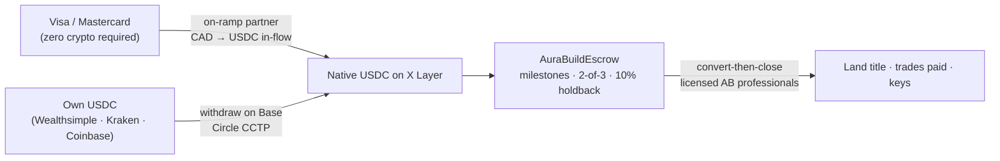

<div align="center">


<br>

<sub><code>AURA&nbsp;HOMES&nbsp;·&nbsp;A&nbsp;KR8TIV&nbsp;AI&nbsp;PRODUCT&nbsp;·&nbsp;ALBERTA&nbsp;PILOT</code></sub>

### From USDC on X Layer to the keys of an off-grid eco home.

**Aura Homes is an AI agent that orchestrates the entire journey — find the land, design the home, price it from real local suppliers, fund it in escrow, build it with local trades — with no middlemen, no black boxes, and nothing hidden.** Alberta pilot. Open source from the first commit.

[](https://web3.okx.com/xlayer/build-x-hackathon)
[](docs/FEASIBILITY.md#2-the-hackathon-verified-facts)
[](https://web3.okx.com/xlayer)
[](docs/FEASIBILITY.md#5-crypto-rails--feasible-with-the-2-hop-truth-told)
[](LICENSE)
[](docs/ALBERTA-PLAYBOOK.md)

**▶ [LIVE — aurahomes.fun](https://aurahomes.fun)** — the demo, hosted and open.

[The vision](docs/VISION.md) · [Feasibility study](docs/FEASIBILITY.md) · [Architecture](docs/ARCHITECTURE.md) · [Roadmap](docs/ROADMAP.md) · [Hackathon submission](docs/SUBMISSION.md) · [Brand](docs/BRAND.md) · [Credits](docs/CREDITS.md) · [Continue this with any AI](docs/AI-HANDOFF.md)

<sub>A **KR8TIV AI** product · sibling of Aura-H2O, Aura-Farms, and AuraBNB</sub>

</div>

<div align="center"></div>

<br>

<sub><code>01&nbsp;·&nbsp;OVERVIEW</code></sub>
## The idea, said plainly

Building an eco home today means being your own general contractor across twenty industries that don't talk to each other: land agents, county planners, designers, engineers, panel plants, solar installers, septic designers, water haulers, WETT inspectors, lawyers. Every gap between them costs money and kills dreams. Meanwhile "AI + real estate" produces chatbots, and "crypto + real estate" produces tokens of houses nobody builds.

**Aura Homes is the orchestration layer that was missing.** One agent process:

<div align="center">

<br>
<sub><code>FIG.&nbsp;1</code>&nbsp;&nbsp;The five-stage pipeline — one agent process from land to keys.</sub>
</div>

1. **LAND** — the agent finds and filters parcels against the things that actually kill small-home builds: district minimum-dwelling-size bylaws, aquifer reliability, power-line distance, septic soils. Then it walks the acquisition with crypto-fluent, licensed Alberta professionals. USDC in, title out.
2. **DESIGN** — an AI architect turns a questionnaire into a **review-ready design package** for a SIP-built small home: floor plan, 3D massing, energy pre-check, and a code-constraint report (NBC Part 9, climate zone 7A, glazing ratios). In Alberta no architect stamp is needed for a house — a local designer finishes the permit set, truss engineering ships stamped from the truss plant. Honest labels only: we say *review-ready*, because "AI permit-ready drawings" don't exist anywhere and we won't pretend.
3. **BUDGET** — a live line-item budget built from researched Alberta data ([data/alberta](data/alberta/)) — every line has an in-province supplier and a LOW/MID/HIGH range. Reference build: 800 sqft off-grid SIP home, **$301,280 CAD mid-range ex-land** (computed line-by-line, LOW $199,100 / HIGH $443,900) — 30–40% under a conventional builder, because the owner-builder path is a first-class citizen here.
4. **ESCROW** — the buyer funds milestones in **native USDC on X Layer** into [`AuraBuildEscrow`](contracts/): 2-of-3 release (homeowner / builder / arbiter), and — to our knowledge a first — **Alberta's statutory 10% construction holdback modeled directly in the contract**. Every build mints a record in [`AuraBuildRegistry`](contracts/) — the real-world asset is the build itself, on-chain from day one.
5. **BUILD** — orchestrated permits (the app knows which county lets homeowners pull their own trade permits — Leduc County does), then a **DIY-or-hire decision on every work package**: each budget line carries an `ownerBuildable` flag, and for anything you'd rather not do yourself, the app runs a **contractor research sweep** — a wide, internet-scale AI pass over reviews, ratings, trade records, and the open supplier directory that fires automatically once engineering, architecture, and the per-build feasibility check are complete — and hands you a ranked shortlist per trade so hiring is an easy decision, not a gamble. SIP shell up in days with a small crew (or theirs), solar + battery + wood stove, certified-installer septic, cistern or well — and yes, **every home ships with a wood-fired hot tub and a beautiful deck**, because these homes are meant to be wanted, not endured.

Off-grid everything, grid-optional forever. Solar with honest winter math. Wood heat with WETT inspection. Eco septic (Ecoflo biofilter) where soils allow. Atmospheric water generation **standard on every home** — plumbed in as the summer producer, while the cistern carries winter. **And no conventional concrete**: every Aura home stands on protected driven screw piles instead of poured foundations — nothing curing in the ground, no cement leachate near the water table — with hemp-lime (hempcrete) as the preferred material anywhere mass is genuinely needed, and poly tanks over precast below grade. The quiet win: in Alberta, piles are also the *cheaper* foundation ($6–15K vs $25–45K poured) — see [the foundations research](docs/research/FOUNDATIONS-NO-CONCRETE.md). And nobody needs to own crypto to start: **pay by Visa** and the app converts to USDC in-flow; bring your own USDC if you're already on-chain. The feasibility study tells the truth about every one of these tradeoffs: **[docs/FEASIBILITY.md](docs/FEASIBILITY.md)**.

<br>

<sub><code>02&nbsp;·&nbsp;THE&nbsp;PROBLEM</code></sub>
## The problem — why building an eco home is broken

The numbers behind the sentence "every gap costs money and kills dreams," from the 300-source research sweep behind [docs/FEASIBILITY.md](docs/FEASIBILITY.md):

- **The coordination tax is the biggest line item nobody quotes.** A conventional builder delivers our 800 sqft reference home at **$450,000–$650,000 ex-land**. The same home, owner-built with the same materials and the same licensed trades where the law requires them, computes to **$199,100–$443,900** ($301,280 mid). The difference — $150,000–$250,000 — is mostly margin stacked on coordination: general-contractor markup, dealer markups on panels and windows, and the soft-cost drag of twenty parties re-discovering each other's requirements. That margin exists because the knowledge of *how to sequence a build* is scarce. Software makes it not scarce.
- **The knowledge is genuinely hard to assemble.** To owner-build legally in Alberta you need to know, among other things: that your district (not county) sets a minimum dwelling size; that trusses have needed a P.Eng's authentication since March 1, 2026 (STANDATA 23-BCB-002) but the truss plant supplies it; that you may pull your own electrical, plumbing, and gas permits on your own residence but *not* wire your own solar (CEC s.64); that septic requires a certified installer by law; that an airtight home requires an HRV; and that drywall is still required over interior SIP faces as a fire barrier. Each of those facts is public. Nobody has ever put them in one place that executes.
- **Off-grid knowledge is worse.** Solar vendors quote summer. Alberta's grid-tie industry has little incentive to tell you that Edmonton's December yield is ~1.3 kWh per kW per day, or that an auto-start generator is not optional. People discover the physics in January.
- **The venture-scale attempts died of dishonest scope.** Atmos raised US$20M ("design online, we build it," Sam Altman on the cap table) and shut down in March 2025 — it pretended to be the builder. Propy closes sales of homes that already exist. Higharc sells software to production builders. Nobody serves the person standing on empty land. The lesson is written into this repo's architecture: **we are the orchestration layer, never the general contractor.**
- **And the buyer who *has* the money often has it in the wrong form.** A crypto-native buyer with six figures of USDC has no clean path to a rural Alberta closing; a normie buyer has no idea crypto is even involved anywhere. Both deserve one product.

None of these problems is a technology miracle. Every one is an orchestration problem. That is the product.

<br>

<sub><code>03&nbsp;·&nbsp;WHY&nbsp;ALBERTA</code></sub>
## Why Alberta first

Alberta is not just where this project lives — it is objectively the easiest jurisdiction in Canada to do exactly this, for five researched reasons ([docs/ALBERTA-PLAYBOOK.md](docs/ALBERTA-PLAYBOOK.md)):

1. **No architect, by statute.** The Alberta Architects Act exempts residential buildings of 1–4 units *of any size* from requiring an architect. A house is governed by Part 9 of the NBC 2023 Alberta Edition, and a residential designer ($1,200–$2,700) turns our AI's review-ready package into the permit set. In provinces without this exemption, the AI-architect story runs into a stamped-drawings wall immediately.
2. **Owner-builder rights are real and codified.** An Owner Builder Authorization costs $95 with a home warranty or **$750 with the warranty opt-out**, decided in about 14 business days — and a homeowner may pull their own electrical, plumbing, gas, and private-sewage-application permits on a home they own and will occupy (Leduc County confirms this explicitly, in writing). The honest catch, disclosed in-app: opting out of warranty freezes resale for **10 years** via a title caveat (in force since December 2025).
3. **Land a normal person can afford.** Verified against live realtor.ca listings in August 2026: Lac Ste. Anne County had 75 active bare-land listings at **$75,000–$199,000** for 1–5 acre parcels within about an hour of Edmonton. That is a land cost that fits under a $300K build instead of dwarfing it.
4. **The district-minimum trap — the story that explains why software should do this.** Minimum dwelling size in Alberta is set at the *district* level, not the county level. In Lac Ste. Anne County, the Agricultural district's minimum is **592 sqft** — an 800 sqft build sails through. The *same county's* Country Residential district requires **1,076 sqft** — the same house on the wrong parcel is unpermittable, and the buyer finds out after closing. Two parcels, minutes apart, same county website. A human misses this; the LAND stage checks the district table before you ever make an offer. One bylaw table lookup is worth five figures.
5. **A one-stop pilot county exists.** Leduc County issues all safety-codes permits in-house (development permit ~$231) with typical rural approvals in 2–6 weeks. The permit stack is legible enough to encode.

Canada-first ordering after the pilot is a data problem, not a rewrite: the architecture keeps provincial rules in [data/alberta/](data/alberta/), and `data/bc/`, `data/sk/` are roadmap expansion packs.

<br>

<sub><code>04&nbsp;·&nbsp;WHY&nbsp;SIPS</code></sub>
## Why SIPs

Structural insulated panels — foam cores laminated between OSB skins, cut to the design at the plant — are the build system, chosen for reasons the data supports:

- **Envelope performance where it counts.** In climate zone 7A the enemy is the envelope. A SIP wall is continuous insulation with no stud cavity: nominal values around R-24 for a typical 6.5" EPS wall panel and R-40+ for thick roof panels, and — the part that matters more — whole-wall performance stays near nominal because there is no wood framing short-circuiting the insulation every 16 inches, where a conventional 2x6 wall loses a meaningful fraction of its rated value to thermal bridging.
- **Airtightness by construction, not by heroics.** A SIP shell is a small number of large, factory-cut joints instead of thousands of field-cut ones. SIP builds routinely blower-door-test dramatically tighter than stick framing — which is exactly what an off-grid energy budget needs, and why an HRV is effectively mandatory in every Aura design (stale-air physics doesn't care about your intentions).
- **The 2–3 person erection story is true — with the honest asterisk.** Small-format panels (4x8, roughly 100 lb) are hand-settable by two or three people, and a weathertight shell in days is documented reality. Jumbo panels (8x24, roughly 800 lb) need a telehandler. Our catalog designs to small-format so the owner-builder story stays real.
- **Alberta supply exists, with a paved permit path.** Insulspan (Calgary) is **CCMC 13016-R listed** — a listed system is recognized under Part 9 without an alternative-solutions fight. EnerSmart (Cochrane/Claresholm) and Premier SIPS (Calgary) round out in-province supply. Off-list systems need a P.Eng stamp; the app knows which path each supplier is on.
- **The honest lead time: 12–20 weeks** from approved drawings to panels on a truck. No platform magic shortens a panel plant's queue. Aura's speed claim is design-to-contract speed — the months of fumbling before drawings exist — never build speed. The app schedules the build *around* the lead time (order panels before the screw piles go in, not after).
- **The failure modes are known, so they're encoded.** Electrical chases are frozen at fabrication (change orders after cutting are real money). No plumbing in exterior SIP walls, ever. Joints get continuous sealant plus interior seam tape plus a vented over-roof — the Juneau ridge-rot episode is the reason, and it lives in the design rules. Drywall goes over interior faces regardless (15-minute fire barrier). These constraints are in the AI's catalog rules, not in a PDF nobody reads.

<br>

<sub><code>05&nbsp;·&nbsp;WHY&nbsp;OFF-GRID</code></sub>
## Why off-grid — with the physics told honestly

Every number here is the planning number, not the brochure number.

**Solar collapses in December, so the design assumes it.** Edmonton's December solar yield is roughly **1.3 kWh per installed kW per day** — a 70–77% collapse from summer. An honest off-grid Alberta system is therefore a *system*: 8–12 kW of ground-mount panels at latitude tilt, 20–40 kWh of LiFePO4 storage, an **auto-start generator that is not optional** ($35,000–$70,000 all-in for the energy stack), a wood stove as primary winter heat (Drolet Escape 1200 class, WETT-inspected because insurers demand it), and propane for water heating. Anyone selling Alberta off-grid without a generator line item is selling January misery.

**The AWG truth, told proudly.** The founder's original vision had atmospheric water generation as the water plan. The research killed that — and we published the physics instead of burying it: every condenser-type AWG cuts off around **15°C and 30% relative humidity**; Edmonton is below 15°C outdoors for 7–8 months of the year; outdoor winter output is **zero litres**. Indoors it would just re-condense the house's own shower steam at 1.5–5 kWh per litre in the worst solar month. So the water plan is a buried cistern ($8,000–$18,000, hauled potable water at 1.5–3¢/L) or a well ($10,000–$18,000 where the aquifer cooperates — and in Lac Ste. Anne it famously often doesn't, which is why locals run cisterns and why the LAND stage checks aquifer reliability). **And yet every Aura home still ships an AWG module, standard** — $3,500–$8,000, plumbed into the cistern loop, producing 10–20 L/day of drinking water June through September. Founder mandate, honestly labeled: the summer glacier tap, never the water plan. Selling AWG as the hero would be a lie that surfaces the first November. Selling it as the summer producer is charming *and true* — and the module keeps a hook in the water loop for the day cold-climate AWG tech actually arrives.

**Wastewater is licensed territory with a genuinely eco option.** Composting toilets do not remove the septic requirement for any plumbed dwelling (greywater is legally wastewater). The certified-installer requirement is absolute — this line is never DIY. The eco headline is the **Ecoflo peat/coco biofilter** (NSF-certified, zero-energy), at $12,000–$28,000 installed for the sewage system overall.

**Grid-optional forever.** Every home is designed to connect later under Alberta's Micro-generation Regulation *if* a line passes the property — which is why the LAND stage runs the FortisAlberta service estimator before you buy, not after.

<br>

<sub><code>06&nbsp;·&nbsp;THE&nbsp;MONEY&nbsp;RAIL</code></sub>
## Why USDC on X Layer

The money rail was chosen on compliance and timing, not vibes:

- **USDC is the only stablecoin a Canadian platform should touch.** It is the single stablecoin with CSA approval for trading on registered Canadian platforms (via Circle's undertaking with the OSC). Choosing it is not just convenient — it is the compliant choice, and this product is aimed at regulated reality, not around it.
- **Native USDC arrived on X Layer on August 6, 2026 — three days before this repo's feasibility study was written.** Mainnet `0xB6CEceAB302E2E4948951eE7843FC24E92933061`, testnet `0xDec90b78111Ba2fc6FC6d84d8B9ec159A2d4b9B3`. Native means Circle-issued with CCTP support — not a bridge IOU. Three USDC variants circulate on X Layer and pointing at the wrong one strands funds, so the addresses are pinned here and in code, and **USDC.e is never touched**.
- **X Layer itself:** EVM-equivalent (Hardhat works unmodified), mainnet chain ID **196**, testnet **1952** (legacy docs say 195 — we verify `eth_chainId` live before any deploy), OKB gas measured in pennies, and Aave V3 already live on-chain (~$85M TVL) — which matters because crypto-collateral borrowing is the honest financing answer (see FAQ).
- **Card-first onboarding — no exchange, ever.** OKX's exchange left Canada in June 2023; instead of treating that as a blocker, the product treats exchanges as unnecessary: a buyer with zero crypto **pays by Visa or Mastercard**, and an in-flow on-ramp partner (MoonPay/Transak class) converts card CAD to USDC headed for the escrow — direct to X Layer where supported, else via Base with a Circle CCTP hop under the hood. Prices display in CAD everywhere. Crypto-natives take the second door: Wealthsimple sells USDC at 0% trading fee → withdraw on Base → CCTP to X Layer; Kraken and Coinbase Canada are alternates.



<div align="center"><sub><code>FIG.&nbsp;2</code>&nbsp;&nbsp;Two doors into one escrow — card CAD or native USDC, converging on X Layer.</sub></div>

- **The last mile is CAD, and licensed humans close.** Alberta lawyers cannot hold crypto in trust; the proven pattern (an $800K-in-BTC Calgary purchase closed by Greater Property Group, with McLeod Law taking crypto for fees) is convert-then-close. Every crypto payment is a CRA barter disposition at CAD fair market value — the app's ledger exports that bookkeeping automatically, turning a tax nuisance into a feature. Stablecoin dispositions ≈ nil gain, one more reason USDC-first is the tax-clean route.
- **The agent-payments fit.** OKX shipped its Agent Payments Protocol (x402 family) in April 2026, settling on X Layer. Aura's platform fee is an x402-style micro-fee on design runs — "ridiculously affordable" is a founder requirement, so the fee is sized as cost recovery for frontier-model inference, not as margin.

<br>

<sub><code>07&nbsp;·&nbsp;THE&nbsp;FIVE&nbsp;STAGES</code></sub>
## The five stages, deeper

Each stage below states plainly what runs today in this repo versus what is roadmap. The pipeline is typed end-to-end (`Questionnaire → DesignBrief → Budget → MilestoneSchedule` in [agent/src/types.ts](agent/src/types.ts)) so stages can deepen independently. At a glance:

| | Stage | Real today | Roadmap |
|--:|---|---|---|
| `01` | **LAND** | parcel-verdict engine over structured county data | live listings, district-table lookups, the watching agent |
| `02` | **DESIGN** | AI design brief + code-constraint report, offline fallback | IFC export, in-browser 3D, HOT2000 handoff |
| `03` | **BUDGET** | full line-item table, reconciles to the JSON model | live quote ingestion, invoice learning loop |
| `04` | **ESCROW** | both contracts written and tested | testnet → mainnet deploy, audit, FINTRAC MSB, account abstraction |
| `05` | **BUILD** | sequenced milestone plan + playbook knowledge | journey brain: slip-catching, nudges, inspector-linked draws |

### 01 · LAND

<sub><code>IN</code>&nbsp;&nbsp;parcel shortlist&nbsp;&nbsp;→&nbsp;&nbsp;<code>OUT</code>&nbsp;&nbsp;pass/fail verdicts with reasons</sub>

**What it does:** takes a shortlist of parcels and runs the kill-shot filters *in order of expense saved*: district minimum dwelling size (the 592 vs 1,076 sqft trap), aquifer reliability (well vs cistern country), FortisAlberta line proximity (grid-optional feasibility), septic soil suitability, and the GST trap (bare land from a corporation or subdivider carries 5% GST; from an individual it is generally exempt — a $10,000 swing on a $200,000 parcel that depends on who the seller is). Then the acquisition path: USDC converted through a registered exchange, closing through crypto-fluent licensed professionals. The app orchestrates; licensed humans convey title.

**Real today:** the parcel-verdict engine ([agent/src/parcels.ts](agent/src/parcels.ts)) runs the filters against structured parcel data and produces pass/fail verdicts with reasons (`npm run demo` writes `agent/out/land-verdicts.json`). County knowledge is encoded in [docs/ALBERTA-PLAYBOOK.md](docs/ALBERTA-PLAYBOOK.md) and [data/alberta/](data/alberta/).
**Roadmap:** live listing ingestion, automated district-table lookup per parcel, FortisAlberta estimator integration, and the watching agent that flags underpriced suitable parcels.

### 02 · DESIGN

<sub><code>IN</code>&nbsp;&nbsp;questionnaire + parcel constraints&nbsp;&nbsp;→&nbsp;&nbsp;<code>OUT</code>&nbsp;&nbsp;review-ready design package</sub>

**What it does:** a questionnaire (size, style, energy, water, extras) feeds the AI architect, which reasons over a parametric catalog of SIP-buildable forms and emits a design brief with a floor plan, 3D massing, an energy pre-check, and a code-constraint report: Part 9 applicability, climate zone 7A assemblies, the district's minimum dwelling size, and FDWR (glazing over 22% of wall area kicks a design out of the prescriptive path into paid energy modeling — the catalog respects the ratio and compensates feature walls with triple-pane, up to quint-pane from Duxton).

**Real today:** the Claude-powered design node (with a deterministic offline fallback so the demo runs without keys) produces the brief and constraint report from the sample questionnaire (`agent/out/design-brief.json`).
**Roadmap:** IFC export via IfcOpenShell, in-browser 3D via That Open Company, HOT2000 handoff for the 9.36 performance path, and Hypar integration for parametric variants. The label stays **review-ready design package** at every depth — a designer finishes the permit set, and no roadmap item changes that sentence.

### 03 · BUDGET

<sub><code>IN</code>&nbsp;&nbsp;design brief&nbsp;&nbsp;→&nbsp;&nbsp;<code>OUT</code>&nbsp;&nbsp;line-item budget, LOW/MID/HIGH with sources</sub>

**What it does:** prices the design line-by-line from [data/alberta/cost-model.json](data/alberta/cost-model.json) — every line carries LOW/MID/HIGH, a sourcing basis, an owner-buildable flag, and an in-province supplier from [data/alberta/suppliers.json](data/alberta/suppliers.json). No middlemen: panels from the plant, windows from the manufacturer, solar from the installer-distributor.

**Real today:** the budget node computes the full table and the totals rule (`npm run demo` writes `agent/out/budget.json`, which reconciles to the dollar with the JSON model — that reconciliation is a frozen verification anchor in [docs/GRAPH-ENGINEERING.md](docs/GRAPH-ENGINEERING.md)).
**Roadmap:** live quote ingestion (SIP plants publish no pricing — quotes are the data moat), and the learning loop that tightens ranges from real invoices.

### 04 · ESCROW

<sub><code>IN</code>&nbsp;&nbsp;budget milestones&nbsp;&nbsp;→&nbsp;&nbsp;<code>OUT</code>&nbsp;&nbsp;funded escrow + on-chain build record</sub>

**What it does:** the buyer funds milestones in native USDC into [`AuraBuildEscrow`](contracts/contracts/AuraBuildEscrow.sol). Releases are 2-of-3 (homeowner, builder, arbiter) — a builder never approves their own milestone alone. On every release the contract retains **10%** as Alberta's statutory holdback and starts the lien-period timer; the holdback releases separately when the timer expires. [`AuraBuildRegistry`](contracts/contracts/AuraBuildRegistry.sol) mints one record per build and appends a milestone entry on each completion — a non-financial NFT, deliberately (see FAQ).

**Real today:** both contracts, written and tested (`npx hardhat test` — passing output is the anchor, never "should pass").
**Roadmap:** testnet then mainnet deployment during the hackathon window, an independent audit (US$15–60K, budgeted) before any real funds, FINTRAC MSB registration before any custodial production flow, and account abstraction (Particle + Safe) so normies never see a seed phrase.

### 05 · BUILD

<sub><code>IN</code>&nbsp;&nbsp;milestone schedule&nbsp;&nbsp;→&nbsp;&nbsp;<code>OUT</code>&nbsp;&nbsp;permits, shell, systems, keys</sub>

**What it does:** turns the schedule into an orchestrated checklist with the dependencies encoded: development permit → Owner Builder Authorization → building and trade permits (pulling the homeowner-legal ones yourself, hiring licensed trades where the law requires — solar wiring, septic, gas final) → SIP order placed *early* against the 12–20 week lead → screw piles (winter-installable, no 28-day cure, $6,000–$15,000) → shell in days → mechanical, septic, solar → wood stove with WETT inspection → hot tub on a sub-24" deck (no permit needed at that height). Each completed milestone updates the on-chain record.

**Real today:** the milestone scheduler emits the sequenced plan (`agent/out/milestones.json` from `npm run demo`); the checklist knowledge lives in the playbook.
**Roadmap:** the full Aura Brain journey loop below — slip-catching, nudges, email digests, inspector-linked escrow draws.

<br>

<sub><code>08&nbsp;·&nbsp;THE&nbsp;ECONOMICS</code></sub>
## The economics — exact numbers, computed

<div align="center">

<br>
<sub><code>FIG.&nbsp;3</code>&nbsp;&nbsp;Budget bands for the 800 sqft reference build, ex-land — computed line-by-line, not quoted.</sub>
</div>

Reference build: 800 sqft off-grid SIP home within about an hour of Edmonton. Every line from [data/alberta/cost-model.json](data/alberta/cost-model.json) with its basis — these are researched ranges, not quotes, and the JSON is the single source of truth the app, the docs, and this README all read.

| Line item | LOW | MID | HIGH | Owner-buildable? |
|---|---:|---:|---:|:---:|
| Land (1–5 acres) | $75,000 | $150,000 | $350,000 | — |
| Driveway, clearing, site prep | $4,500 | $8,000 | $12,000 | yes |
| Screw-pile foundation (16–24 piles) | $6,000 | $10,000 | $15,000 | no |
| SIP shell kit + erection | $30,000 | $45,000 | $55,000 | yes — 2–3 people, small-format panels |
| Metal roof, triple-pane windows, doors, siding | $22,000 | $32,000 | $45,000 | yes |
| Interior fit-out (kitchen, bath, drywall, floor) | $22,000 | $35,000 | $55,000 | yes |
| Mechanical: HRV, plumbing, electrical, wood stove + WETT | $22,000 | $30,000 | $40,000 | yes — homeowner permits; solar wiring excluded |
| Off-grid solar 8–12 kW + 20–40 kWh LiFePO4 + generator | $35,000 | $48,000 | $70,000 | no — CEC s.64 |
| Water: buried cistern (or well) | $8,000 | $12,000 | $18,000 | no |
| AWG summer water module (standard on every home) | $3,500 | $5,000 | $8,000 | yes |
| Private sewage (septic field or Ecoflo biofilter) | $12,000 | $18,000 | $28,000 | no — certified installer by law |
| Wood-fired hot tub + deck | $8,000 | $14,000 | $22,000 | yes |
| Permits, design, engineering, insurance | $8,000 | $12,000 | $18,000 | — |
| Contingency (10% / 12% / 15% of the ex-land lines) | $18,100 | $32,280 | $57,900 | — |
| **Total ex-land (computed)** | **$199,100** | **$301,280** | **$443,900** | |
| **Total with land (computed)** | **$274,100** | **$451,280** | **$793,900** | |

The totals rule is frozen: *totals = Σ line items × (1 + contingency), land excluded from ex-land totals, no line currently optional (the AWG module is standard on every home).* An optimizer that wants prettier numbers must change the lines and their sources, never the rule — that constraint is written into the [graph doctrine](docs/GRAPH-ENGINEERING.md) precisely because it is the rule an eager agent would bend.

For comparison, a conventional builder delivers the same home at **$450,000–$650,000 ex-land** ($250–$450/sqft hard costs plus 25–40% soft). The owner-builder path saves $150,000–$250,000 in exchange for 12–24 months of sweat — a trade the app makes explicit, never glosses.

<br>

<sub><code>09&nbsp;·&nbsp;THE&nbsp;ESCROW</code></sub>
## Escrow and the 10% holdback, for a normal person

<div align="center">

<br>
<sub><code>FIG.&nbsp;4</code>&nbsp;&nbsp;Milestone escrow with Alberta's statutory 10% holdback enforced in contract state.</sub>
</div>

If you have never bought construction before, here is the problem escrow solves: **paying a builder up front is how people get robbed, and builders doing work unpaid is how builders go broke.** The traditional answer is progress draws held by a lawyer or lender. Aura's answer is the same idea with the trust moved into inspectable code:

1. Your money sits in a vault contract on X Layer — not in the builder's account, not in ours. You can look at the balance any time; so can the builder. Neither of you has to trust the other's bookkeeping, or ours.
2. The build is divided into milestones (foundation set, shell weathertight, mechanical roughed-in, and so on). When a milestone is done, **two of three parties** — you, the builder, and an independent arbiter — must agree before money moves. You and the builder agreeing is the normal case; the arbiter exists for the abnormal one. No single party, including the builder, can move money alone.
3. On each approved milestone the builder receives **90%**. The contract retains **10%** — not because we distrust builders, but because **Alberta law says so**: the Prompt Payment and Construction Lien Act requires a 10% holdback so that subcontractors and suppliers who haven't been paid can register a lien against the project. Contractors and homeowners get this wrong constantly in the paper world; here the contract simply cannot forget it.
4. When the lien period expires with no claims, the holdback releases to the builder automatically. The timer is contract state, not a calendar entry someone loses.
5. Separately, every milestone appends to the build's on-chain record — a permanent, public construction history of the home. That record is the "RWA": the real-world asset is the build itself, not a financial token (see FAQ).

What this is not: it is not a lawyer, a title transfer, or a warranty. Land closes through licensed Alberta professionals; the contract holds and releases construction funds and keeps the record straight.

<br>

<sub><code>10&nbsp;·&nbsp;THE&nbsp;BRAIN</code></sub>
## The Aura Brain

The management layer is not a feature bolted onto an app — the app is a client of a persistent per-journey AI. Full design in [docs/AI-BRAIN.md](docs/AI-BRAIN.md); the shape:

- **A typed state machine, AI-narrated.** Every journey is a state object (stage, blockers, waiting-on, escrow position, dates). The brain reads it every turn, so guidance never hallucinates progress. Determinism where a rule suffices; judgment where it doesn't.
- **Slip-catching as a first-class feature.** Permit application unsubmitted 7+ days, SIP drawings approved but the kit unordered while a 12–20 week lead time burns, milestone complete but the holdback timer unnoticed — slips raise flags, flags become nudges. This ball-drop pattern is ported from the founder's field-operations OS, where it is proven daily.
- **Email is the product** for the 95% of days a user doesn't open the app: every material state change plus a weekly digest — what moved, what's blocked, what's next, where the money sits.
- **Cost-honest model strategy**, because "AI-run" dies at scale if every turn hits a frontier API: Tier 0 is code (state machine, budget math, slip rules — a model deciding what a rule can decide is waste), Tier 1 is a small open-weight model with RAG over this repo's own corpus, Tier 2 is Claude for the judgment nodes, prompt-cached and schema-forced — and the x402 usage fee is sized to cover exactly that tier. Fine-tuning waits until ~thousands of real transcripts exist to distill from; pretraining is never.
- **MCP-first interface:** the brain ships as an MCP server (`journey_status`, `next_actions`, `check_parcel`, `escrow_status`, …) so the web app, Claude, and the OKX agent ecosystem are all just clients.

<br>

<sub><code>11&nbsp;·&nbsp;THE&nbsp;METHOD</code></sub>
## Built as a graph

This repo is itself built the way the product works — by AI agents run as a dependency graph, under [docs/GRAPH-ENGINEERING.md](docs/GRAPH-ENGINEERING.md). The rules that matter most:

- **Nodes with contracts.** Every agent task declares JOB / IN / OUT with an enforced schema; free-text is for humans, schema is for the next node.
- **The fake-edge test.** Before any sequence, ask whether step B actually consumes step A's output. If not, cut the edge and run wide. Sequence is a claim, not a default.
- **A worker never checks its own work.** Verifiers run context-fresh, receive only the finding, and try to kill it. The standing vision-audit loop ([docs/AUDIT-LOG.md](docs/AUDIT-LOG.md)) is a permanent checker node with authority to flag drift.
- **Anchors that cannot be argued with:** tests that *ran and passed* with pasted output; builds with exit codes; a demo whose budget reconciles to the dollar with the JSON model; `eth_chainId` read live before any deploy; every published figure tracing to a sourced line. A graph that only reads its own reports is consistent, not verified.

The product inherits the same shape: the five stages have real edges (each consumes the previous stage's artifact), the work inside each stage fans out, and the escrow's 2-of-3 is itself a checker-separation pattern with the on-chain balance as the anchor.

<br>

<sub><code>12&nbsp;·&nbsp;THE&nbsp;BRAND</code></sub>
## The brand

The full researched rationale is in **[docs/BRAND.md](docs/BRAND.md)** — why emerald (the one green that signals both "sustainable" and "worth $300,000"), why the near-black ground, why the violet is rationed to on-chain surfaces, why the mark is the KR8TIV aura silhouette refilled with an aurora over a treeline, and why the strongest brands in every adjacent category — Aesop, Arc'teryx, Patagonia, and the crypto products normies actually trust — all converge on the same rule this repo runs on: **restraint is the premium signal, and honesty is the trust argument.** House style in one line: dark aurora ground, tracked-caps labels, sentence-case body, ranges over point estimates, no exclamation marks, no crypto-glow, no AI slop.

<br>

<sub><code>13&nbsp;·&nbsp;THE&nbsp;FIELD</code></sub>
## Why this doesn't exist yet

After a 300-source research sweep: **nobody combines AI home design + crypto rails + off-grid eco fulfillment.** Propy closes sales of existing homes. RealT and Lofty fractionalize rentals. Higharc sells to production builders. Welcome Homes is US-only and fiat-only. Atmos raised $20M for "design online, we build it" and died in 2025. The unclaimed ground is the *agent that orchestrates the physical world* — and agent-payments infrastructure (native USDC on X Layer, launched **August 6, 2026**; OKX's Agent Payments Protocol, April 2026) just made it buildable. Full competitive teardown in the [feasibility study](docs/FEASIBILITY.md#7-what-we-do-not-build-integrate-instead).

<br>

<sub><code>14&nbsp;·&nbsp;THE&nbsp;HACKATHON</code></sub>
## The hackathon

This repo is Aura Homes' entry in the **[OKX BuildX AI Season Hackathon](https://web3.okx.com/xlayer/build-x-hackathon)** (Aug 7–21, 2026) — AI-powered onchain applications on X Layer, up to 300K USDT, AI-RWA track. Contracts deploy to X Layer testnet (chain 1952) during the event and mainnet (chain 196) after. Submission package, demo script, and the judge-facing pitch live in **[docs/SUBMISSION.md](docs/SUBMISSION.md)**.

<br>

<sub><code>15&nbsp;·&nbsp;HONESTY</code></sub>
## Honesty policy

No black boxes, and no selective memory. Research that contradicted the founding assumptions is published, not buried — each collision is recorded in [docs/FEASIBILITY.md](docs/FEASIBILITY.md) and frozen as a never-un-learn correction in [docs/AI-HANDOFF.md](docs/AI-HANDOFF.md):

| The assumption | What verification found | The route around it |
|---|---|---|
| AWG (atmospheric water) as the water plan | Every condenser AWG cuts off ~15°C / 30% RH; Edmonton is below 15°C outdoors 7–8 months a year; outdoor winter output is **zero litres**, and indoor operation just re-condenses the house's own humidity at 1.5–5 kWh/L in the worst solar month | Cistern or well is the water plan; the AWG ships **standard on every home** as the honestly-labeled summer producer (10–20 L/day Jun–Sep), plumbed into the cistern loop |
| Wealthsimple crypto-backed loans | **False** — Wealthsimple's credit products are securities-collateral only (re-verified Aug 2026) | Aave V3 live on X Layer (~$85M TVL) and Ledn (Toronto, BTC-collateral, disburses USDC/CAD) are the real lending paths; the app teaches them, and integrates Wealthsimple the day it ships crypto collateral |
| "Withdraw from OKX to X Layer" | OKX's exchange left Canada in June 2023 and has not returned | **Card-first**: an in-flow fiat on-ramp sells USDC to Visa payers so no user ever needs any exchange; crypto-natives route Wealthsimple/Kraken/Coinbase → Base → CCTP |

The same policy runs forward: negative findings get published, unverifiable numbers get labeled, and every price is a range with a basis. The product is stronger for it, and it is also simply the only defensible way to sell someone a house.

<div align="center"></div>

<br>

<sub><code>16&nbsp;·&nbsp;FAQ</code></sub>
## FAQ

**Do I need to own crypto?**
No. Pay by Visa or Mastercard; an on-ramp partner converts to USDC in-flow. You will see prices in CAD throughout. If you already hold USDC, bring it — that path is faster and cheaper.

**Do I need an architect?**
No. Alberta's Architects Act exempts 1–4 unit dwellings of any size. Your design is governed by Part 9 of the building code; a residential designer ($1,200–$2,700) finishes the AI's review-ready package into the permit set, and truss engineering arrives stamped from the truss plant.

**Can I really build it myself?**
Much of it, legally. With an Owner Builder Authorization you may pull your own electrical, plumbing, gas, and private-sewage-application permits on a home you own and will occupy. Small-format SIP panels are a 2–3 person job. The hard legal lines: solar/battery wiring needs a licensed electrical contractor (CEC s.64), septic needs a certified installer, well drilling is licensed work. The budget table marks every line owner-buildable or not.

**Can I sell the house afterward?**
Here is the honest catch: the $750 Owner Builder Authorization with the warranty opt-out places a title caveat blocking sale for **10 years** (since December 2025). If resale flexibility matters, take the $95 path with a home warranty instead. The app makes you choose this eyes-open.

**Is the atmospheric water generator real?**
In summer, yes — 10–20 litres of drinking water a day, June through September. In an Alberta winter, no — outdoor output is zero, which is physics, not a product gap. That is why the AWG is standard on every home *and* never the water plan: the cistern or well carries winter.

**Does off-grid actually work through an Alberta winter?**
Yes, as a system: solar collapses ~70–77% in December (~1.3 kWh/kW/day in Edmonton), so the design pairs 8–12 kW of panels with 20–40 kWh of battery, an auto-start generator, and a WETT-inspected wood stove for heat. Anyone who quotes you off-grid without a generator is quoting you July.

**Why USDC and not your own token?**
USDC is the only CSA-approved stablecoin in Canada — the compliant choice, not just the convenient one. There is no Aura token: the researched decision (including exactly when that answer could change) is public in [docs/TOKEN-RESEARCH.md](docs/TOKEN-RESEARCH.md).

**Is the NFT ownership of my house?**
No, deliberately. Land title transfers through Alberta's land titles system via licensed professionals, like every other property. The NFT is a non-financial build record — the home's permanent construction history. Tokenizing fractional ownership for Canadians without securities counsel would run into CSA SN 46-308, so we don't.

**What does it cost, honestly?**
For the 800 sqft off-grid reference: **$199,100 / $301,280 / $443,900** (LOW/MID/HIGH, ex-land, CAD, computed from the line-item model), plus land at $75,000–$350,000 for 1–5 acres in the Edmonton ring. A builder delivers the same home at $450,000–$650,000 ex-land.

**How long does it take?**
Design-to-contract is where the platform is fast. Physics and industry are honest constraints after that: SIP panels are 12–20 weeks from approved drawings, rural permits 2–6 weeks, and the build itself months more. The shell going weathertight in days is real; the whole journey is a year-scale project the brain keeps on rails.

**What happens to my money if the builder disappears?**
It sits in the escrow contract, which no single party — including the builder — can move alone. Unapproved milestones stay funded and recoverable; the arbiter path exists for exactly this. Compare that with the paper-world alternative: a deposit in a builder's operating account.

**Can I get a mortgage for this?**
Banks generally will not mortgage an off-grid, owner-built, sub-1,000 sqft home — published plainly because it is true. The honest financing story is cash or progress-funding, plus crypto-collateral borrowing (Aave V3 on X Layer, Ledn) for crypto-native buyers. The app teaches those paths; it never gives financial advice.

**Is this legal to operate?**
The hackathon demo runs on testnet and custodies nothing. Before any production flow that routes real user funds: FINTRAC MSB registration (8–16 weeks), an independent contract audit (US$15–60K), both on the funded roadmap. The legal lines we will not cross are documented, which is more than most of this category can say.

**Why should I trust an AI with a house?**
You shouldn't, blindly — that is why the architecture never asks you to. The AI orchestrates; licensed humans stamp, install, inspect, and close at every legally-required boundary; deterministic code computes the money; the contract enforces the holdback; and every claim in the repo traces to a source you can check. The honesty policy above is the trust model.

<br>

<sub><code>17&nbsp;·&nbsp;REPO&nbsp;MAP</code></sub>
## Repo map

| Path | What it is |
|---|---|
| [docs/VISION.md](docs/VISION.md) | The canonical brief — what we're building and why, audited against continuously |
| [docs/FEASIBILITY.md](docs/FEASIBILITY.md) | The full feasibility study: tech, law, money, honest red flags, hackathon odds |
| [docs/ALBERTA-PLAYBOOK.md](docs/ALBERTA-PLAYBOOK.md) | The regulatory + supplier playbook for the pilot province |
| [docs/TOKEN-RESEARCH.md](docs/TOKEN-RESEARCH.md) | Token launch research (verdict: not yet, and here's exactly when and how) |
| [docs/ARCHITECTURE.md](docs/ARCHITECTURE.md) | System design: app, agent, contracts, chain config |
| [docs/ROADMAP.md](docs/ROADMAP.md) | The 12-day sprint and the five-year software |
| [docs/AI-HANDOFF.md](docs/AI-HANDOFF.md) | How any AI (or human) continues this work without losing the plot |
| [docs/AI-BRAIN.md](docs/AI-BRAIN.md) | The journey brain: AI-run management, slip-catching, email updates, cost-honest model tiers |
| [docs/GRAPH-ENGINEERING.md](docs/GRAPH-ENGINEERING.md) | The graph doctrine this project is built with — node contracts, verifiers, anchors |
| [docs/BRAND.md](docs/BRAND.md) | The brand: researched palette rationale, the mark, typography, voice, do/don't |
| [docs/AUDIT-LOG.md](docs/AUDIT-LOG.md) | The standing vision-audit loop — every pass appended, nothing buried |
| [contracts/](contracts/) | `AuraBuildEscrow` (USDC milestones + 10% Alberta holdback) + `AuraBuildRegistry` (build-record NFT), Hardhat, tested |
| [app/](app/) | Next.js app — the five-stage pipeline UI, X Layer wallet flow |
| [agent/](agent/) | `aura-architect` — the AI design/budget/milestone pipeline (Claude-powered, offline-capable) |
| [data/alberta/](data/alberta/) | The researched cost model and no-middlemen supplier directory |
| [assets/](assets/) | The mark, hero, and README graphics — generated, in the house style |

<br>

<sub><code>18&nbsp;·&nbsp;RUN&nbsp;IT</code></sub>
## Run it

```bash
git clone https://github.com/kr8tiv-ai/aura-homes.git && cd aura-homes
# the AI architect pipeline (no keys needed — offline fallback included)
cd agent && npm install && npm run build && npm run demo
# the contracts
cd ../contracts && npm install && npx hardhat test
# the app
cd ../app && npm install && npm run dev
```

<br>

<sub><code>19&nbsp;·&nbsp;CONTRIBUTE</code></sub>
## Contribute

This is deliberately the software that would otherwise take five years to exist. It gets built in the open, in slices, and it needs people — Solidity reviewers, Alberta designers and safety-codes brains, IFC/BIM engineers, off-grid installers who'll sanity-check numbers, and anyone who wants normal people to be able to build eco homes.

Concrete first issues, in rising order of effort:

1. **Correct a number.** Every line in [data/alberta/cost-model.json](data/alberta/cost-model.json) and [data/alberta/suppliers.json](data/alberta/suppliers.json) cites its basis. If you have a real Alberta quote or invoice that tightens a LOW/MID/HIGH range, that PR is pure signal — the ranges are supposed to converge on reality.
2. **Add a district-minimum table.** The LAND filter knows Lac Ste. Anne's districts; Parkland (new Land Use Bylaw 2025-12) and Sturgeon need the same treatment. Source: the county's own bylaw PDF.
3. **Add a supplier with a basis.** In-province first; out-of-province only where Alberta has no supply. One entry, one verifiable basis.
4. **Try to break the escrow.** Read [contracts/contracts/AuraBuildEscrow.sol](contracts/contracts/AuraBuildEscrow.sol), especially the holdback retention and timer, and write the failing test we missed. Adversarial reviews are the ones we want.
5. **Blower-door data.** If you have tested a SIP build in a cold climate, real airtightness numbers with context would upgrade the honesty of the SIP section.
6. **Start a province pack.** `data/bc/` or `data/sk/` as a skeleton mirroring the Alberta structure — the architecture makes a new province a data problem, not a rewrite.

House rules for contributions: every claim needs a basis, ranges beat point estimates, negative findings are welcome in the docs (that is the brand), and the frozen anchors in [docs/GRAPH-ENGINEERING.md](docs/GRAPH-ENGINEERING.md) — tested output, reconciled totals, live chain reads — apply to everyone, human or AI.

<div align="center">


<sub>Authored by <a href="https://github.com/Matt-Aurora-Ventures">Matt Aurora Ventures</a> · co-authored with Claude (Fable 5) · MIT · <b>A KR8TIV AI product</b></sub>
</div>
