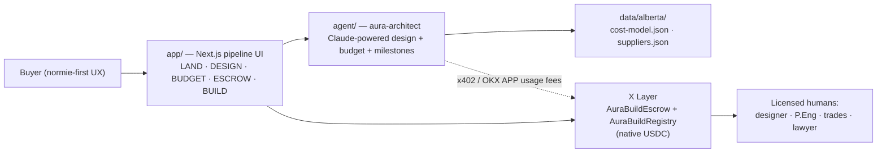

# Architecture

*One product, three packages, one data spine, one chain. Everything open, everything replaceable.*

## Chain configuration (authoritative)

| | Testnet | Mainnet |
|---|---|---|
| Chain ID | **1952** (post-Terigon; legacy docs say 195 — always verify `eth_chainId`) | **196** |
| RPC | `https://testrpc.xlayer.tech/terigon` | `https://rpc.xlayer.tech` |
| Gas token | OKB (faucet: web3.okx.com/xlayer/faucet, ~0.2/day — claim daily) | OKB |
| Native USDC | `0xDec90b78111Ba2fc6FC6d84d8B9ec159A2d4b9B3` | `0xB6CEceAB302E2E4948951eE7843FC24E92933061` |
| Explorer | OKLink X Layer testnet | `https://www.oklink.com/xlayer` |

**Rule: native USDC only.** Three USDC variants circulate on X Layer (native, USDC.e, USDC_Bridged); integrations hard-code the native address. Bridging in: Circle CCTP from Base/Ethereum (burn-and-mint, no wrapped risk).

## contracts/ — the trust layer

- **`AuraBuildEscrow.sol`** — one instance per build. Homeowner funds milestones in USDC; release needs 2-of-3 (homeowner, builder, arbiter). Every release retains a configurable statutory holdback (default 10% — Alberta Prompt Payment and Construction Lien Act) releasable only after a holdback period (default 60 days). Cancel refunds unreleased funds. OpenZeppelin SafeERC20 + ReentrancyGuard; custom errors; full event log. **Production note:** a real deployment holding six figures gets an independent audit first (budgeted in ROADMAP).
- **`AuraBuildRegistry.sol`** — ERC-721; one token per build. Stores designHash, budgetHash, escrow address, status (Designed → Funded → UnderConstruction → Complete). This is the RWA: a verifiable, non-financial on-chain record of a real home coming into existence. Deliberately NOT a fractional-ownership token (that's a securities distribution in Canada — see FEASIBILITY §5).
- Hardhat; networks `xlayerTestnet` / `xlayer`; key via env `PRIVATE_KEY`.

## agent/ — the brain

`aura-architect` (TypeScript, plain tsc): pure-function pipeline so any AI or human can extend it.

- `types.ts` — the domain language: Questionnaire, Parcel (county/district/minDwellingSqft/aquifer/gridDistance), DesignBrief (SIP spec, solar kW, battery kWh, water source, septic type, glazing FDWR), BudgetLine, MilestoneSchedule.
- `pipeline.ts` — questionnaire → constraint-checked design brief → LOW/MID/HIGH budget from `data/alberta/cost-model.json` → milestone schedule with the 10% holdback modeled.
- `claude.ts` — Claude narrates the design brief and reasons about tradeoffs (model: latest Sonnet; env `ANTHROPIC_API_KEY`), with a deterministic offline fallback so demos never break and contributors without keys can run everything.
- CLI: `npm run demo` reads a sample questionnaire and writes design-brief/budget/milestones JSON to `out/`.

Constraint checks are the product's teeth — each one guards a real five-figure mistake: district minimum dwelling size, FDWR ≤ 22% (else the paid energy-model path), SIP chase freeze warnings, aquifer flag → cistern default, winter solar sizing floor.

## app/ — the face

Next.js (app router, TypeScript, Tailwind). Design language: `#050807` ground, emerald `#10b981` accent, teal/violet aurora highlights, off-white `#e7ece9` type, hairline borders, uppercase tracked labels, no crypto-glow clutter. Pages map 1:1 to the pipeline stages; wallet flow via wagmi/viem with hand-defined X Layer chains (both networks). Normie-first: CAD-readable pricing everywhere, wallet complexity progressively disclosed, account abstraction on the roadmap (X Layer's documented AA stack: Particle Network + Safe — Pimlico does not support chain 196).

## data/ — the spine

`data/alberta/cost-model.json` + `suppliers.json`: researched, sourced, structured for machine consumption. This is the moat nobody else bothered to build — the app is only as honest as this data, so every entry carries its basis and the directory takes PRs. New provinces arrive as new `data/<region>/` packs; nothing else changes.

## Payments & fees

- **Card-first onboarding:** the primary user has no crypto — Visa/Mastercard in, an integrated fiat on-ramp (MoonPay/Transak/Banxa/Onramper class) mints USDC toward the escrow (direct to X Layer where supported, else Base + CCTP under the hood). No exchange account required, ever. BYO-USDC remains the second door.
- Build funding: USDC milestone escrow (above).
- Platform fee: "ridiculously affordable" — x402-family metered micropayments on agent runs (OKX Agent Payments Protocol, which settles on X Layer, is the integration target); free during the hackathon.
- Third-party services (design tools, energy modeling): paid per-use in USDC through the same rails — the agent buys what it needs.

## What stays human (by design and by law)

Permit set finishing (residential designer), truss/SIP engineering (P.Eng), solar/battery wiring (licensed electrical contractor), septic (certified installer), well drilling, conveyancing (lawyer, CAD trust account). The agent orchestrates and schedules these; it never pretends to replace them. That's not a limitation — it's why the output is a real house and not a rendering.
