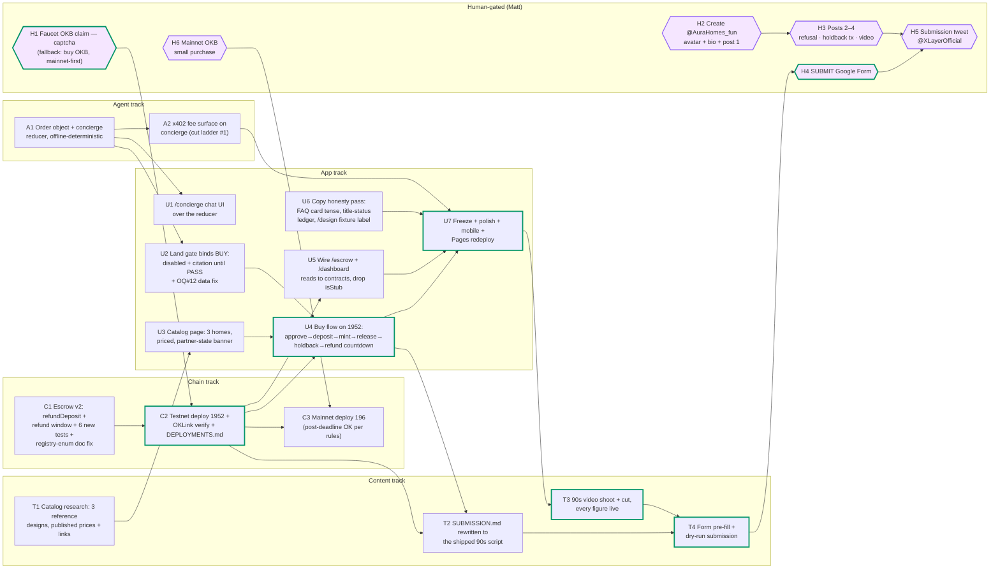
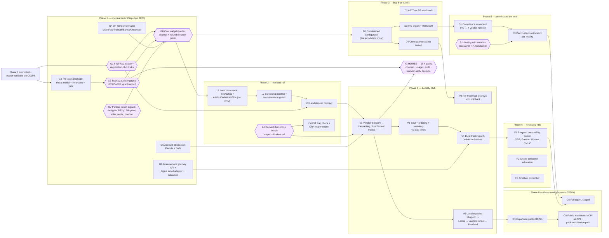

# Gap Analysis — what we say vs what we have

> [!CAUTION]
> **Archived audit snapshot (August 10, 2026).** The facts and line references
> below describe that day's repository and live site. They are not current
> status. Testnet contracts are now deployed, HTTPS is live, the project X
> account is `@AuraHomes_fun`, and the escrow-led product framing was retired.
> Use [`ROADMAP.md`](ROADMAP.md), [`SUBMISSION.md`](SUBMISSION.md), and a fresh
> repository/test run for current truth.

*Written 2026-08-10 by a fresh-context gap analyst. Every "exists" claim below was verified by execution this pass — `npx hardhat test`, `npm run demo`, `npm run brain`, `npm run memory`, `npm run mcp:smoke`, live RPC reads against chain 1952, live HTTPS checks against aurahomes.fun, and source reads of `app/`, `agent/`, and `contracts/`. Nothing was accepted from docs. Measured against the promise surface a visitor actually sees: the live site, `app/components/story/copy.ts`, README.md, and the grand design in `docs/research/ROADMAP-LONG-FORM.md`.*

---

## Executive verdict

1. **Where we are:** the substrate is real and verified — contracts 10/10 tests, the agent pipeline reconciles to the dollar (LOW $199,100 / MID $301,280 / HIGH $443,900), brain/memory/MCP all green, 8 routes serving 200 at aurahomes.fun — but **every money-moving surface is a fixture and the chain is empty** (deployer `0x831F…f260`: balance 0x0, nonce 0x0, re-verified live this pass).
2. **The site now sells a front door that has zero code:** `/overview` labels "Buy a home with USDC on X Layer" as **Live now**, and none of concierge, catalog, BUY control, refund window, or deployment exists — grep of the repo finds "concierge" only in docs.
3. **The single biggest risk:** the testnet deploy has been human-gated on a 30-second faucet captcha for **five consecutive audits**, and the buy flow, the video, and the submission links all queue behind it; the fallback (buy a little OKB, deploy mainnet-first — the rules allow it) must trigger if the captcha isn't solved by Aug 11.
4. **What wins the hackathon:** the refusal-then-consequence demo — an AI concierge that says **no** with a bylaw citation, then a real native-USDC reservation deposit on 1952 with the 10% statutory holdback visibly retained and a refund countdown the buyer alone controls, every figure reproducible from the public repo.
5. **Verdict:** 0 of Audit #6's top-5 builds have landed since it was written (verified: no `refundDeposit` in contracts, no `/concierge` route, no catalog, no email adapter, no pre-audit package). Ship the five Phase-0 MUSTs, cut everything else per the cut ladder, submit Aug 20.

---

## Promise register

Every capability claim the product makes to a visitor. **Label** is what the surface itself tells the visitor: `live-now` (stated or implied as working today), `next` (labeled roadmap), `announced` (labeled announcement), `honest-pending` (feature shown with an explicit not-live label).

### The live site — scroll story (aurahomes.fun/, source: `app/components/story/copy.ts`)

| # | Promise | Where stated | Label |
|--:|---|---|---|
| P1 | "The agent that takes you from USDC on X Layer to the keys of an off-grid eco home — land, design, budget, escrow, and build, orchestrated end to end." IN: USDC · OUT: keys | Hero, copy.ts:29–34 | live-now (brand sentence, no qualifier) |
| P2 | Land: "Real parcels, filtered for what a build actually needs: district dwelling minimums, aquifer reliability, distance to power, and septic soils" | Beat 01, copy.ts:43; /land | live-now |
| P3 | Land OUT: "Shortlist **with title status**" | Beat 01 ledger, copy.ts:48 | live-now |
| P4 | Design: "A short questionnaire becomes a review-ready design package — SIP panels, checked against Part 9 and climate zone 7A" | Beat 02, copy.ts:56 | live-now |
| P5 | Design: "…reviewed and **stamped by licensed professionals** before anything is built" | Beat 02, copy.ts:56 | live-now (process claim) |
| P6 | Budget: "Costed line by line from Alberta suppliers, with no middlemen. Ranges, not promises — low, mid, and high, each with its basis shown" | Beat 03, copy.ts:69; /budget; /faq | live-now |
| P7 | Escrow: "**USDC held in escrow on X Layer**, released on 2-of-3 approval" | Beat 04, copy.ts:78; /escrow header | live-now |
| P8 | Escrow: "Alberta's statutory holdback is modeled on-chain, and the build record is **anchored as it happens**" | Beat 04, copy.ts:78 | live-now |
| P9 | Build: "Permits, professionals, and materials, orchestrated to completion" → "Occupancy permit, keys" | Beat 05, copy.ts:87–93 | live-now (implied) |
| P10 | Rollout honesty line: "the hackathon MVP live now, the Locality Hub next, and the HOMES token announced" | End beat, copy.ts:106; /overview | labeled three ways |

### The live site — /overview, stage pages, /faq

| # | Promise | Where stated | Label |
|--:|---|---|---|
| P11 | Arc 1: "**Buy a home with USDC on X Layer**, with an agent that directs you to the land" | /overview arcs[0], `overview/page.tsx:8–13` | **live-now** (caveat text below it admits fixtures + pending deploy) |
| P12 | Arc 2: the Locality Hub — vendor directory in USDC, contractor payments, inventory, build tracking, tech discovery, locality by locality | /overview arcs[1] | next |
| P13 | Arc 3: a token named HOMES will launch on X Layer; utility deliberately undecided; no token in the hackathon | /overview arcs[2]; /faq #7 | announced |
| P14 | /design: "Tell Aura about your build" → "Generate design" produces a design brief from **your** answers | `design/page.tsx` | live-now (no fixture label on the page) |
| P15 | /escrow: card-first funding — "Pay in CAD with Visa or Mastercard; an on-ramp partner converts… in-flow" | `escrow/page.tsx:60–104` | honest-pending ("On-ramp integration pending", disabled button) |
| P16 | /escrow: wallet funding + 2-of-3 milestone approval against the contract | `escrow/page.tsx:107–176` | honest-pending ("Preview data — contract reads land with the testnet deployment") |
| P17 | /escrow: financing taught in-app — Aave V3 on X Layer, Ledn, the Wealthsimple truth | `escrow/page.tsx:178–231` | live-now |
| P18 | /dashboard: journey state, escrow position, slip detection, weekly digest email | `dashboard/page.tsx` | honest-pending ("Preview data…"; "Email delivery is integration-pending") |
| P19 | /faq #1: "Do I need to own crypto? **No. Pay by Visa or Mastercard; an on-ramp partner converts to USDC in-flow**" | `faq/page.tsx:12–14` | **live-now — flat present tense, no pending label** (contradicts /escrow's own honesty) |
| P20 | /faq #6: "MIT, end to end, from the first commit. The repo publishes the whole truth" | `faq/page.tsx:31–35` | live-now |

### README (the GitHub storefront)

| # | Promise | Where stated | Label |
|--:|---|---|---|
| P21 | Hero: "orchestrates the **entire journey** — design, find the land, find the agent, price every material, fund it in escrow, hire the right trade for every task, and **babysit the build to completion**" | README.md:11 | live-now sentence; §02 adds an honest-state paragraph |
| P22 | Journey steps 1–4: questionnaire, feasibility verdict, design brief, code pre-check | README.md:95–98 | `LIVE` |
| P23 | Journey steps 5–6: parcel filtering + written ACCEPT/REJECT with bylaw citation | README.md:104–105 | `LIVE` |
| P24 | Step 15 "Escrow funding — milestones funded into AuraBuildEscrow on X Layer" and step 20 "Draw releases" | README.md:124, 134 | **`LIVE`** (overstated — see gap table) |
| P25 | Steps labeled `SPEC`: realtor matching, offer/closing, title, contractor sweep, on-ramp, financing flow, ordering/inventory, trade coordination, finishing | README.md:106–135 | honestly `SPEC` |
| P26 | x402 design fee: "metering demo runs, settlement simulated" | README.md:325 | honestly `PARTIAL` |
| P27 | The Brain: typed state machine, slip catching, "emails you on the 95% of days you don't open the app" | README.md:76; VISION req 15 | live-now prose |

### The grand design (docs — feeds the site's rollout story)

| # | Promise | Where stated | Label |
|--:|---|---|---|
| P28 | Phase 0 five MUSTs: testnet+mainnet deploy · escrow v2 (reservation deposit + refund window) · /concierge over an order object · land gate binding BUY · 3-home priced catalog | ROADMAP-LONG-FORM §0.2 | committed MVP, Aug 10–21 |
| P29 | Phases 1–8: FINTRAC + audit + on-ramp + AA + brain service (P1) · land rail (P2) · configurator/buy-or-build (P3) · Locality Hub (P4) · permits + seal (P5) · financing rails (P6) · HOMES gated (P7) · the operating system (P8) | ROADMAP-LONG-FORM | phased, future-tense, gated |

---

## What actually exists (executed evidence, this pass)

**Contracts — BUILT, not deployed.** `npx hardhat test`: **10/10 passing** (escrow happy path with 10% holdback + 60-day maturity, 2-of-3 approvals, arbiter tie-break, cancel/refund, custom bps; registry mint/permissions). **Escrow v2 does not exist:** grep of `contracts/**/*.sol` for `refundDeposit|refundWindow|cooling` returns **zero matches** — the reservation-deposit/cooling-off semantics promised in ROADMAP-LONG-FORM §0.2 M2 are unwritten. Chain state read live via `https://testrpc.xlayer.tech/terigon`: `eth_chainId` = 0x7a0 (1952) ✓, deployer `0x831Fb0C6f8A96dE7c7253bF76C98a780d6E0f260` balance **0x0**, nonce **0x0** — **no contract has ever been deployed by this project**. `contracts/scripts/deploy.js` + `npm run deploy:testnet` exist and are ready (docs/DEPLOYMENTS.md).

**Agent — BUILT, offline-deterministic.** `npm run demo`: runs end to end, narrative `offline-fallback`, writes land-verdicts/design-brief/budget/milestones JSON; Lakeside Estates REJECT fires with the district-not-county citation; budget **LOW $199,100 / MID $301,280 / HIGH $443,900 ex-land** — equals `data/alberta/cost-model.json` to the dollar; 2 constraint notes (winter battery floor 30→42 kWh, SIP chase freeze). `npm run brain`: journey state, guidance, **4 slips (1 CRITICAL)**, digest renders with reconciling money position. `npm run memory`: **MEMORY DEMO PASSED** (capture/consolidate/retrieve/update/forget, all PASS checks green). `npm run mcp:smoke`: **SMOKE PASSED** — 11 tools, 402 challenge on eip155:1952 / native testnet USDC `0xDec9…b9B3` / $0.01, receipt honestly labeled `"settlement": "simulated"`. **No concierge module** (`agent/src/` = pipeline, parcels, brain, mcp — no `concierge/`), **no email adapter** (digest writes HTML to disk, nothing sends).

**App — 8 routes live, money surfaces are fixtures.** Live check this pass: **8/8 pages 200** over HTTPS at aurahomes.fun (/, /overview, /land, /design, /budget, /escrow, /dashboard, /faq). Per-page classification from source:

| Route | Classification | The specifics |
|---|---|---|
| `/` (story) | Real 3D/copy surface | Copy makes the P1–P10 claims; CTA docks into /dashboard |
| `/land` | **Real logic, sample data** | `app/lib/parcels.ts` filters run client-side and genuinely react to input (size/water); data = 4 hand-researched Aug-2026 listings, labeled as samples. Note: this file is a **duplicate** of `agent/src/parcels.ts` logic — two implementations, drift risk |
| `/design` | **FIXTURE, unlabeled** | The 5-step wizard collects answers, then `generate()` returns `designFixture` verbatim — **the questionnaire input is ignored**; a judge who sets 2,000 sqft gets the same 800 sqft narrative, with no on-page fixture label |
| `/budget` | Fixture mirror, exact | `budgetFixture` hand-mirrors cost-model.json (totals match to the dollar today); DIY-or-hire filters genuinely compute over it |
| `/escrow` | **FIXTURE, labeled** | `useEscrowMilestones()` returns fixtures with `isStub: true`; "Approve release" logs to console (`hooks.ts:79`); card door honestly disabled; wallet connect is real wagmi but writes nothing |
| `/dashboard` | **FIXTURE, labeled** | All positions/slips/digest from `fixtures.ts` (a snapshot of real brain output); labeled "Preview data" |
| `/overview` | Static, honest-ish | Arc 1 headline "Buy a home with USDC" labeled **Live now**; caveat text below names fixtures + pending deploy |
| `/faq` | Static | Answer #1 states card-pay in unqualified present tense |

**Audit #6's top-5 marching order — 0 of 5 landed.** (1) Concierge: no code, docs-only grep hits. (2) Escrow v2 refund window: not in the contract, still 10 tests not 16. (3) Three-home catalog: no code. (4) Digest email adapter: no code. (5) Escrow pre-audit package: no doc (grep for threat-model/invariant hits only roadmap prose). Git log since Audit #6 shows design/FX passes on the story site (`e760390`, `0d50735`, `e0b21b5`, `a1bddc7`, `63f0a18`).

**Historical human gates at the time:** faucet unclaimed and the project X account uncreated. Both statements are superseded by the current-state notice above.

---

## The gap table

**BUILT** = real and verified by execution · **FIXTURE** = UI exists, data/effects are fake — with exactly what would surprise a clicking judge · **DESIGNED** = spec/issue only · **MISSING** = claimed but nothing behind it.

| # | Promise | Verdict | What that means precisely |
|--:|---|---|---|
| P1 | End-to-end orchestration, USDC → keys | **DESIGNED** | The spine (design→budget→milestones) executes offline; land runs; escrow/build orchestration is prose. No journey has ever gone end to end |
| P2 | Land filtering (4 named filters) | **BUILT** | Executed in demo + MCP + /land page; caveat: 4 sample parcels, no live listings |
| P3 | "Shortlist with title status" | **MISSING** | No title status exists anywhere — not in `Parcel` types, not on /land. The ledger line overpromises a specific artifact |
| P4 | Questionnaire → review-ready design package | **FIXTURE** (app) / BUILT (agent CLI) | The real pipeline runs in `agent/` with 5 constraint checks; the site's /design wizard **ignores every answer** and prints a canned 800 sqft brief with no fixture label — the worst judge-surprise on the site |
| P5 | "Stamped by licensed professionals" | **DESIGNED** | The Notarius/P.Tech sealing rail is researched (ALBERTA-PLAYBOOK); zero partners signed (ROADMAP-LONG-FORM publishes "signed: none") |
| P6 | Line-item Alberta budget, ranges with basis | **BUILT** | `npm run demo` reconciles to cost-model.json to the dollar; /budget renders an exact mirror (drift risk: hand-mirrored fixture, flagged in long-form §5) |
| P7 | "USDC held in escrow on X Layer" | **FIXTURE** | Contract code real + 10/10 tested; **no USDC has ever been held** — undeployed (nonce 0), UI stubbed, "Approve release" is a console.log |
| P8 | Holdback modeled on-chain; record anchored as it happens | **FIXTURE** | Holdback genuinely lives in contract state with a maturity timer (tested); nothing is on any chain; the registry has never minted |
| P9 | Build orchestrated to completion | **DESIGNED** | Brain demo shows slip-detection/digest on a sample journey; permits/trades/ordering are README `SPEC` rows |
| P10 | Three-arc rollout labels | **BUILT** (as honesty surface) | Accurate except where Arc 1's headline collides with P11 |
| P11 | "Buy a home with USDC on X Layer" — Live now | **MISSING** | There is no BUY control, no order object, no catalog, no reservation deposit, no refund window, and no deployed contract. The headline verb of Arc 1 has no code path at all |
| P12 | Locality Hub | **DESIGNED** | Phase 4 of the long-form plan; labeled "next" — honest |
| P13 | HOMES token | **DESIGNED** | Deliberately announced-not-defined; 5 scored designs exist; honest |
| P14 | /design generates *your* design | **FIXTURE** | See P4 — input-insensitive output, unlabeled |
| P15 | Card-first funding | **DESIGNED** | Honest disabled state; evaluation matrix is Phase 1 work |
| P16 | Wallet funding + 2-of-3 approval in the UI | **FIXTURE** | Labeled "Preview data"; real ABI slice exists in `hooks.ts` but no read/write is wired |
| P17 | Financing taught in-app (Aave/Ledn) | **BUILT** | Panel served live on /escrow with the honest Wealthsimple correction |
| P18 | Dashboard: journey state, slips, digest email | **FIXTURE** | Fixtures are snapshots of real brain output (reconciling); no hosted brain service, no email sending exists |
| P19 | FAQ: "Pay by Visa… converts in-flow" | **MISSING** (as stated) | No on-ramp integration exists; unlike /escrow, the FAQ drops the pending label — a judge can falsify this answer in one click |
| P20 | MIT, open, from the first commit | **BUILT** | Public repo, MIT, real history; verified in Audits #2–#5 (remote push state re-verified there) |
| P22 | Steps 1–4 `LIVE` | **BUILT** (agent) | True in the agent CLI; on the site only via the /design fixture — the label is fair for the repo, thin for the app |
| P23 | Steps 5–6 `LIVE` | **BUILT** | Verdict + citation fire in demo, MCP, and /land |
| P24 | Steps 15 + 20 `LIVE` | **FIXTURE** | "LIVE" is true of code+tests, false of the product: nobody can fund a milestone or trigger a draw release anywhere. Should read `PARTIAL` until deploy + wiring |
| P25 | The `SPEC` rows | **DESIGNED** | Honestly labeled; issue-tracked |
| P26 | x402 metering | **FIXTURE** (honest) | 402 challenge real, settlement simulated and says so in the receipt |
| P27 | Brain "emails you" | **FIXTURE** | Digest renders (real template, real reconciliation); no delivery mechanism exists |
| P28 | Phase 0 five MUSTs | **DESIGNED** | 0 of 5 built as of this pass; M1 human-gated |
| P29 | Phases 1–8 | **DESIGNED** | Future-tense, gated, honest |

**Counts: BUILT 7 · FIXTURE 9 · DESIGNED 10 · MISSING 3** (of 29 registered promises).

The pattern: the *engine* is built and honest; the *transaction* is designed and absent; and three specific sentences on visitor-facing surfaces (P3 title status, P11 "Buy… Live now", P19 FAQ card-pay) currently claim more than any code can back — those three are fix-the-copy-or-build-the-thing items before any judge arrives.

---

## The plan (mermaid graphs)

### Graph A — the 11-day hackathon MVP (deadline Aug 21, 2026 23:59 UTC)

Nodes are one-agent-session work items. Hexagons = **HUMAN-GATED** (Matt only). Edges pass the fake-edge test: B consumes A's output.

**Critical path (bold-stroked):** `H1 faucet → C2 deploy → U4 buy flow → U7 freeze/redeploy → T3 video → T4 dry run → H4 submit` — with `C1 escrow v2` feeding C2 in parallel with H1 on day 1.

**Parallelism:** three independent streams run simultaneously from day 1 — (i) C1 escrow v2 (chain), (ii) A1→U1/U2 concierge + gate (agent/app), (iii) T1→U3 catalog (content/app). U4 is the join point. U6 (copy honesty pass) has **no dependencies** and should land immediately — it removes the three falsifiable claims (P3/P11/P19) regardless of what else ships.

### Graph B — the grand design beyond the MVP (per ROADMAP-LONG-FORM)

Long-pole truth carried from the roadmap: FINTRAC's 8–16 weeks starts the first business day after submission (it is the Phase-2 gate), the auditor's calendar is 4–8 weeks out (book before funds land), and SIP kits are 12–20 weeks from approved drawings — no software changes any of these.

---

## Critical path and the 11-day schedule

**Critical path in one line:** *faucet OKB (Matt, 30 seconds) → escrow v2 + testnet deploy → buy flow end-to-end on 1952 → freeze/polish/redeploy → 90-second video with live figures → dry-run → submit Aug 20.*

| Date | Ship | Gate / note |
|---|---|---|
| **Aug 10** (D1) | **[Matt]** faucet claim · **[Matt]** @AuraHomes_fun + post 1 · C1 escrow v2 written + tests · U6 copy honesty pass (P3/P11/P19) | Faucet is the whole critical path; U6 has zero deps — do it today |
| Aug 11 (D2) | C2 testnet deploy + OKLink verify + addresses recorded | If the captcha slipped again: **[Matt]** buys OKB, mainnet-first |
| Aug 12 (D3) | A1 concierge reducer + order object, offline-deterministic | — |
| Aug 13 (D4) | U1 /concierge UI · U2 land gate binds BUY · **[Matt]** post 2 (the refusal) | — |
| Aug 14 (D5) | T1 + U3 catalog: 3 homes, priced, partner-state banner | — |
| Aug 15 (D6) | U4 buy flow end to end on 1952 · **[Matt]** post 3 (holdback tx) | **Feature-complete checkpoint — cut ladder activates if missed** |
| Aug 16 (D7) | U5 wire escrow/dashboard reads · A2 x402 surface · T2 SUBMISSION.md rewrite | — |
| Aug 17 (D8) | **Feature freeze 23:59** · U7 polish/mobile/Pages redeploy · Audit #7 | Nothing new after this |
| Aug 18 (D9) | T3 video shoot + cut, every figure live · **[Matt]** post 4 | — |
| Aug 19 (D10) | C3 mainnet deploy (**[Matt]** OKB) · T4 form pre-fill + dry run | Mainnet is a bonus, not a gate — rules say testnet during, mainnet after |
| Aug 20 (D11) | **[Matt]** SUBMIT the form · **[Matt]** submission tweet @XLayerOfficial | A full day early |
| Aug 21 | Buffer only | Ship early, not at 23:58 UTC |

**The cut ladder** (from ROADMAP-LONG-FORM §0.6, unchanged because it is correct): if Aug 15 arrives without an end-to-end buy flow, drop in order — (1) x402 fee surface, (2) third catalog home, (3) live-model mode, (4) mainnet deploy moves post-deadline, (5) second parcel scenario collapses to the rejection only. **Never cut:** the deploy, the refusal, the holdback release, the honesty labels.

---

## Human-gated items

Only these cannot be done by an agent; everything else in Graph A is AI-executable.

| Item | Why gated | When | Fallback |
|---|---|---|---|
| Faucet OKB claim | GeeTest captcha (policy: captchas are human steps) | **Today** — blocked five audits running | **[Matt]** buys a small amount of OKB and bridges; mainnet-first deploy is rule-legal |
| Create @AuraHomes_fun + keep it active | Account creation + phone verification; judges weigh an *active* account | **Today** — cost of delay compounds daily | None |
| Build-in-public posts 2–4 + submission tweet | Same account | Aug 13 / 15 / 18 / 20 | None |
| Mainnet OKB | Real money purchase | Aug 19 | Skip — mainnet is post-deadline-legal |
| Google Form submission | Founder's identity | Aug 20 | None |
| KYC | At prize time only | If placed | None |
| `ANTHROPIC_API_KEY` for live-model concierge mode | Founder-supplied secret (OPEN-QUESTIONS #6) | Optional | The demo must film with the key absent — offline-deterministic is the default by design |

---

## Honest risks

1. **The five-audit faucet stall is the project's revealed failure mode, not a hypothetical.** Every schedule above assumes the human gate opens today. If it does not open by Aug 11, the OKB-purchase fallback is no longer optional.
2. **Zero of the five MUSTs exist and the join point (U4) is five sessions deep.** The schedule has no slack after Aug 15. The cut ladder is the plan, not an insurance policy.
3. **The front-door decision (long-form Open Decision A) is still formally open.** This analysis, like the long-form roadmap, assumes the concierge pivot wins. If the founder reverts to questionnaire-first, A1/U1/U3 are wasted sessions — get the confirmation before Aug 12.
4. **Three falsifiable claims are live right now** (P11 "Buy a home… Live now", P19 FAQ card-pay in present tense, P3 "title status"). The project's single differentiator is that a judge can falsify any claim and find it true; these three currently fail that test. U6 costs under an hour and has no dependencies.
5. **The /design wizard silently ignoring input is a trap for exactly the person we most want to impress.** Either wire the real pipeline logic client-side (it is already TypeScript in `agent/src/pipeline.ts`) or put a fixture label on the output — before the freeze.
6. **New money-moving contract code days before the demo.** The refund window is the exact path an attacker (or a judge reading the diff) will probe. The six new tests must each be able to fail, and the fund-conservation invariant must hold across fund/refund/release/holdback/cancel.
7. **Fixture-mirror drift.** `/budget` and `/land` both hand-mirror source-of-truth data (`cost-model.json`, `agent/src/parcels.ts`). Exact today — verified — but every model edit is a chance to break the "reconciles to the dollar" claim. Build-time import is the Phase-1 fix; until then, re-verify after any model change.
8. **Concurrent-agent contention in `app/`.** Other agents are editing the app right now (dirty `.gitignore`, active design passes); Audit #4 recorded one corrupted-build collision already. The buy-flow sessions should claim files loudly and rebuild clean.
9. **Wallet UX on demo day:** injected-wallet only, no AA; gasless exists only inside OKX Wallet. The filming machine needs a funded test wallet prepared before Aug 18, not on it.
10. **The X account is not just a checkbox** — "dedicated X account kept active" is a verbatim judged requirement, and it has been 404 for the entire project life. Every day it stays uncreated is scored.

---

*This file is owned by the gap-analysis pass of 2026-08-10. Sources of record: [AUDIT-LOG.md](AUDIT-LOG.md) (Audits #1–#6), [ROADMAP-LONG-FORM.md](research/ROADMAP-LONG-FORM.md), [VISION.md](VISION.md), [ROADMAP.md](ROADMAP.md). Anchors executed fresh for this document; nothing graded from docs alone.*
