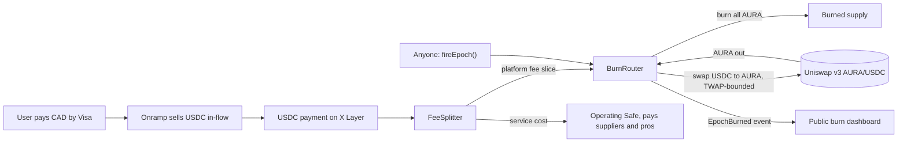
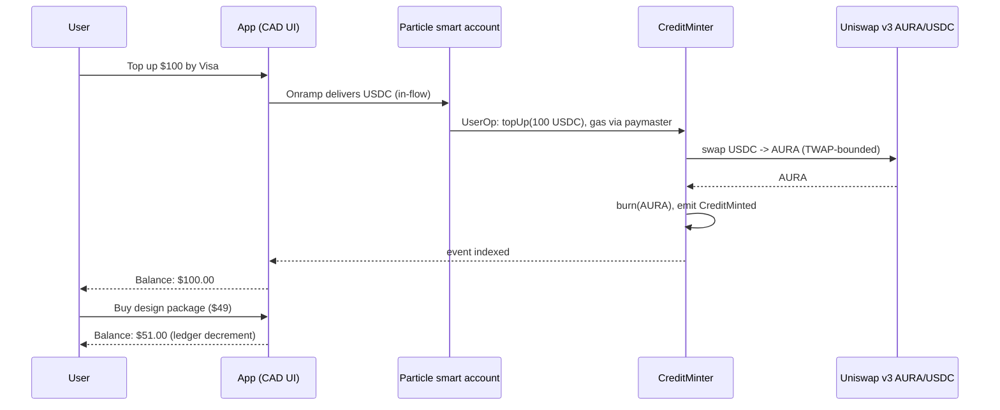
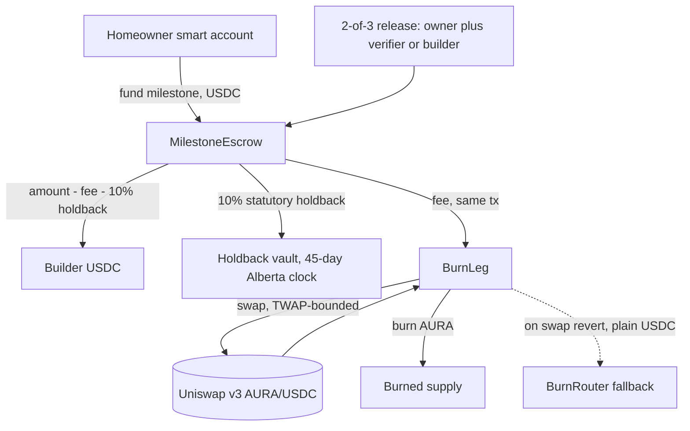
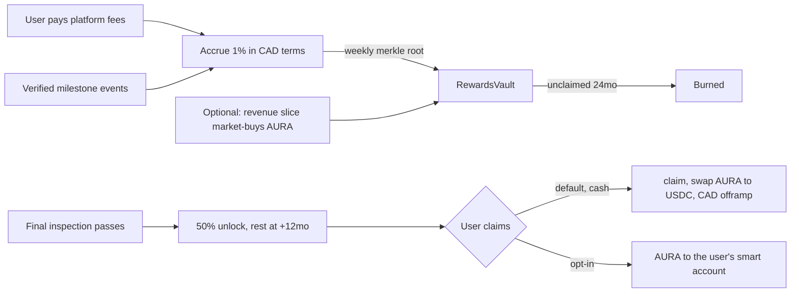
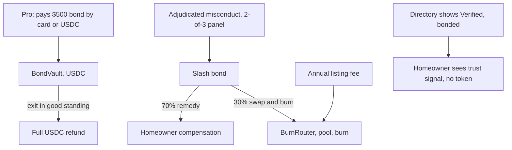

# Token Architecture Designs — Five Concrete Options for an Invisible Token

*Engineering document. Written 2026-08-09. Companion to [TOKEN-RESEARCH.md](TOKEN-RESEARCH.md), which holds the verified X Layer facts (gas costs, DEX listing path, AA stack, legal research) this doc builds on. Nothing here commits Aura Homes to launching a token — VISION.md #8 says the token, "if ever," is invisible, and TOKEN-RESEARCH.md's recommendation (no token for the hackathon) stands. This doc exists so that IF a token launches, the architecture is already designed, scored, and honest about its trade-offs.*

**Header assumptions, stated plainly:**

1. **Trading pair: AURA/USDC on X Layer (chain 196).** The founder's dictation said the token would be "paired with SpaceX" — this is near-certainly a speech-to-text transcription of **USDC**, which is the only reading consistent with the rest of the brief (native Circle USDC is the app's settlement asset, live on X Layer since Aug 2026, and the pool venue is Uniswap v3). This doc assumes AURA/native-USDC. If the founder meant something else, say so and this doc gets revised.
2. **The invisibility mandate is absolute.** "People don't even know they're using a token, but that token is still being transacted on the blockchain, even if they're paying cash/Visa." Every design below is scored first against that bar: the non-crypto user sees CAD prices, a Visa checkout, and dollar balances — never a ticker, never a swap screen, never gas.
3. **Standing constraints inherited from TOKEN-RESEARCH.md** (do not re-litigate without new evidence):
   - **No transfer tax in the token contract.** OKX DEX's automated risk scanner flags tax-on-transfer as honeypot-adjacent and can warning-label or buy-disable the token in the exact interface we need. All value coupling is buyback-and-burn from revenue or atomic burn-on-usage via a plain `ERC20Burnable`.
   - **AA stack is Particle Network + Safe.** X Layer's documented account-abstraction stack. **Pimlico does not support chain 196** — do not plan on Pimlico/ZeroDev; it's Particle's bundler/paymaster or self-hosted.
   - Native USDC only: mainnet `0xB6CEceAB302E2E4948951eE7843FC24E92933061`, testnet `0xDec90b78111Ba2fc6FC6d84d8B9ec159A2d4b9B3`. Testnet chain ID **1952**.
   - Gas is effectively free (0.02 gwei measured; full token launch ≈ $0.013). Cost lines below therefore count engineering, liquidity, legal, and audit — not gas.
   - CSA Staff Notice 46-308 is the legal lens: substance over form, and nearly every token sold to raise funds is a security. "Utility" labeling exempts nothing.
4. **Oracle gap (flagged, needs verification before any build):** no confirmed Chainlink price feed on X Layer was found in the Aug 9 research pass. Every design that needs a USDC/AURA price uses the Uniswap v3 pool **TWAP with hard sanity bounds** (max deviation per epoch, min observation window). If a real feed exists by build time, substitute it.

**Shared base layer (all five designs):** `AURA` is an OpenZeppelin `ERC20 + ERC20Burnable + ERC20Permit`, fixed supply, no owner mint, no tax, no hooks. Supply reduction happens only through `burn()`/`burnFrom()`. Burn events feed a public dashboard from day one. Genesis split per TOKEN-RESEARCH.md Phase 1 (ecosystem tranche, vested team 10–15%, Safe-multisig treasury).

---

## Architecture 1 — Revenue Fee-Router Buyback-and-Burn ("Exhaust Loop")

The token lives entirely on the platform's side of the ledger. Users pay in CAD/USDC; a fixed slice of **platform revenue** (the usage fee from VISION.md #11 — small enough to be an encouragement) accrues in USDC, and a keeper-fired router periodically market-buys AURA from the pool and burns it. No user ever touches, holds, or routes through the token.

### 1. Mechanics

Contracts:

- `AURA` — the shared base ERC-20.
- `FeeSplitter` — receives every platform-fee USDC transfer; splits `burnBps` to the `BurnRouter`, remainder to the operating Safe. Immutable split percentages per deployment; changing them means deploying a new splitter (announced, auditable).
- `BurnRouter` — holds accrued USDC; exposes a **permissionless** `fireEpoch()`: swaps its full USDC balance for AURA on the Uniswap v3 AURA/USDC pool (exact-input, slippage bounded by pool TWAP ± tolerance), then calls `AURA.burn()` on everything received, emitting `EpochBurned(usdcIn, auraBurned, epoch)`. A small fixed USDC bounty to `msg.sender` makes keeping self-incentivized — no reliance on a keeper network existing on X Layer (none is confirmed).

### 2. What the non-crypto user sees

Nothing token-shaped, because the token is not on the user path at all. The user's journey is the already-planned card-first flow: Visa checkout → in-flow onramp (MoonPay/Transak class) delivers USDC → payment settles. Their receipt is in CAD. The AA layer (Particle social-login smart account + paymaster covering gas in OKB) exists for the *payment* UX, not the token — the token machinery runs on the platform's own contracts after the user has left. This is the only design of the five where the invisibility guarantee is structural rather than engineered: there is no edge case (refund, price move, claim screen) that can leak the token to a user.

### 3. On-chain footprint

- Per user payment: one USDC transfer (or one UserOp bundle if the user pays from their smart account) into `FeeSplitter`.
- Per epoch (daily or weekly): one `fireEpoch()` tx = one Uniswap v3 swap + one burn. That's it.
- Public, permanent trail: `EpochBurned` events reconcile revenue → buyback → supply reduction to the cent. The dashboard reads only chain state.

### 4. Tokenomics coupling

Burn is strictly proportional to real platform revenue — the gold-standard model TOKEN-RESEARCH.md identifies ("buyback-and-burn from real revenue... fully verifiable on-chain"). Honest limits, stated: buy pressure exists only when revenue exists; the token has no intrinsic claim on anything (a burn is not a dividend); value accrual is reflexive supply-reduction, nothing more. That honesty is publishable and defensible. There is no demand-side mechanism — nobody *needs* AURA for anything in this design.

### 5. Canadian legal posture (CSA SN 46-308)

The strongest of the five. The platform never sells, distributes, or promises the token to anyone; users cannot acquire it through the app at all. Whoever holds AURA bought it on the open market with no representations from Aura beyond the published burn mechanics. The investment-contract analysis still applies to the *original distribution* (genesis/LP seeding — handled per TOKEN-RESEARCH.md Phase 1/2 with counsel), but the ongoing app mechanics add no securities surface. This is the posture counsel is most likely to bless.

### 6. Cost to build

- Contracts: `FeeSplitter` + `BurnRouter` ≈ 250 lines of custom Solidity. Slither/Aderyn free; entry-tier audit (~$5K) once the router regularly holds four-figure USDC.
- No new frontend. Burn dashboard: one static page reading events (~2 days).
- LP seed as per TOKEN-RESEARCH.md ($0 single-sided to $5K paired). Legal ~$2–5K.
- Engineering estimate: **1–2 weeks total** including tests against the frozen anchors.

### 7. Verdict

The boring, correct answer. Perfect invisibility because there is nothing to hide — the token simply isn't in the user's causal path. Weakest demand-side story, but the only design with no legal or UX failure mode. **Scores — invisibility 10, legal safety 9, genuine value coupling 7, hackathon-followup practicality 9. Total 35/40.**

---

## Architecture 2 — Prepaid Platform-Credit Behind AA Wallets ("Powerwall")

Users top up a dollar-denominated credit balance for **platform services** (AI design runs, document packages, budget refreshes — never construction dollars, which stay pure USDC to suppliers). Each top-up atomically market-buys AURA and burns it, minting an equal CAD-denominated internal credit. Spending credits is an off-chain ledger decrement against an on-chain-proven prepaid burn.

### 1. Mechanics

The naive version — hold AURA as the credit — is rejected up front: it exposes users to token price risk on their prepaid balance, which is both a UX betrayal and the strongest possible "investment" fact pattern. Instead, **burn-at-top-up**:

- `CreditMinter` — receives the user's top-up USDC (from their Particle smart account via session-key UserOp), swaps 100% of the platform-fee-bearing portion for AURA on the pool (TWAP-bounded), burns it, and emits `CreditMinted(account, usdCents, auraBurned)`. The app's backend indexes the event and credits the user's ledger in CAD.
- Credits are **non-transferable, non-refundable-to-token, USD/CAD-denominated ledger entries** — deliberately not an ERC-20, so there is no second token to regulate and nothing for a user to trade. Refunds, if offered, are fiat/USDC from treasury (an operational cost, disclosed), never a re-mint of AURA.
- Spending: ordinary backend decrement; each service run references the covering `CreditMinted` event batch for auditability.

### 2. What the non-crypto user sees

"Add funds" → Visa → "Balance: $100.00" → service purchases decrement it. Statement lines in CAD. The AA layer does all the lifting: Google login creates the Particle smart account; the onramp sells USDC straight into it; a session key pre-authorizes the `topUp` call so there is no signing ceremony; the paymaster pays gas. The swap-and-burn is one atomic hop inside the top-up transaction — AURA exists for one block and never appears in any balance. Leak surfaces that must be engineered shut: refund flows (fiat only), receipts (CAD only), and the block explorer (a curious user who finds their smart account on OKLink will see a swap — acceptable; the *app* never shows it).

### 3. On-chain footprint

- Per top-up: one UserOp bundle = USDC transfer + swap + burn + event. This is the highest-frequency on-chain buy pressure of any design — every top-up is a market buy.
- Per spend: nothing on-chain (ledger). Optional: batched daily `SpendAnchor` merkle root for public reconciliation of ledger vs. burned prepayments.

### 4. Tokenomics coupling

Strong and front-loaded: demand arrives at prepay time, before usage. It is genuine (each burn is backed by a real customer prepaying for real services) but note the honest asymmetry: the platform receives the USDC *value* only in the form of burned AURA — i.e., **the platform is donating its fee revenue to holders as burn**. Operating costs must then be covered by margin elsewhere or by burning only the fee slice of top-ups (recommended: route the service-cost portion to the operating Safe, burn only the fee slice — the diagram's `topUp` splits internally, same as Architecture 1's splitter).

### 5. Canadian legal posture

Materially riskier than Architecture 1. Even though users never *hold* AURA, the platform is causing purchases of it with customer funds, and the credit product is a prepaid instrument (possible payment-regulation angles — Retail Payment Activities Act registration is worth a counsel question, in addition to SN 46-308). Mitigations that matter: credits are consumable-only, non-transferable, never marketed with any value-accrual language, and the token is never deliverable to the customer. Counsel review is mandatory, not optional, before this ships.

### 6. Cost to build

- Contracts: `CreditMinter` with split + swap + burn ≈ 300 lines; session-key integration with Particle; TWAP guard. Audit needed before real money flows (~$5–10K — it custodies user top-ups transiently).
- App work: top-up UI, credit ledger, refund ops, reconciliation dashboard. **3–5 weeks.**
- Ongoing: onramp fees on every top-up (2–4%) are a real margin cost.

### 7. Verdict

The most "product-shaped" design — credits are a familiar SaaS pattern and every top-up is organic buy pressure. But it buys that coupling with real legal surface, real engineering, and a permanent obligation to keep three leak surfaces sealed. **Scores — invisibility 8, legal safety 6, genuine value coupling 8, practicality 6. Total 28/40.**

---

## Architecture 3 — Escrow-Rail Atomic Fee-Burn ("Holdback Rail")

The token couples to the product's spine: the USDC milestone escrow (stage 4 of LAND → DESIGN → BUDGET → ESCROW → BUILD, with Alberta's 10% statutory holdback modeled on-chain). On every milestone release, the platform's fee (basis points of the release) is atomically swapped to AURA and burned **inside the release transaction**. The burn happens at the exact money moment of the product.

### 1. Mechanics

- `MilestoneEscrow` (exists in `contracts/` scaffolding; 2-of-3 release, 10% holdback) gains one addition: `releaseMilestone()` computes `fee = amount * feeBps / 10000`, transfers `amount - fee - holdback` to the builder, retains holdback, and hands `fee` to an embedded `BurnLeg` that swaps USDC→AURA (TWAP-bounded) and burns, all in the same transaction. If the swap leg reverts (pool empty, TWAP breach), the fee falls back to plain USDC transfer to the `BurnRouter` of Architecture 1 for later burning — **a milestone release must never be blockable by token-market conditions.** This fallback is load-bearing; without it, a thin pool could freeze a construction payment.
- Explicitly rejected variant, recorded for honesty: routing the *entire* builder payout USDC→AURA→USDC through the pool to manufacture volume. That is wash-adjacent volume, costs LP fees and slippage on five-figure settlements, and is exactly the metric-gaming a hackathon judge or the OKX risk scanner should punish. The fee slice only.

### 2. What the non-crypto user sees

The milestone screen they already have: "Milestone 4 released — $38,500 to builder, $4,278 holdback retained (Alberta 45-day clock), platform fee $192." All CAD. The homeowner funds escrow through the same card-first onramp path; their Particle smart account signs releases (session-scoped, paymaster gas). The fee line is disclosed as a dollar amount; that it exits reality as a token burn is visible only on the burn dashboard and the block explorer. Builders and verifiers likewise see only USDC in/out.

### 3. On-chain footprint

- Per milestone: one release transaction containing builder transfer + holdback move + swap + burn + events. The burn shares a transaction hash with a real construction payment — the strongest possible on-chain proof that burns track genuine usage.
- Volume through the pool = fee slice only (honest, small: 50 bps of a $40K milestone is $200).

### 4. Tokenomics coupling

The purest usage signal available to this product: burns are proportional to **construction dollars actually released through escrow** — the number the whole company exists to grow. It is Architecture 1's coupling but anchored to the flagship metric and provable per-transaction rather than per-epoch. Same honest limit: fee-sized, so absolute burn volume is small until build volume is real.

### 5. Canadian legal posture

Identical user-side posture to Architecture 1 (no user ever acquires the token) — strong. The new risk is not securities law but **engineering blast radius**: token-swap code now lives inside the contract that custodies six-figure construction funds and a statutory holdback. That raises the audit bar for the escrow itself and means any token-side bug is a construction-fund bug. The fallback leg confines this (worst case: fee burns late), but the audit must prove it.

### 6. Cost to build

- Contract delta on top of the existing escrow: `BurnLeg` + fallback ≈ 150 lines, but it re-opens the escrow for a **full audit** ($10–15K given custody size) — the dominant cost.
- No new user-facing work beyond one fee line. **1 week engineering + audit cycle.**

### 7. Verdict

Architecture 1 grown into the product's spine. Same legal safety, better story, per-tx provable coupling — paid for with audit burden and the coupling of token code into the highest-stakes contract. The right *second* step, not the first. **Scores — invisibility 10, legal safety 9, genuine value coupling 9, practicality 6. Total 34/40.**

---

## Architecture 4 — Completion-Vested Cashback ("Keys Bonus")

Users **earn** AURA (never buy it) as cashback on platform spend — e.g. 1% of fees paid, accrued in CAD terms, vesting against verified build milestones and unlocking fully when the home passes final inspection. A loyalty program whose points happen to be on-chain.

### 1. Mechanics

- `RewardsVault` — funded from the genesis ecosystem tranche (or, better for coupling, refilled by weekly market-buys from a revenue slice, which converts the program into deferred buyback). On each verified milestone event, accrues to the user `rewardCents / twapPrice` AURA, recorded in a merkle root batched weekly (accrual itself costs no per-user gas).
- Vesting: 50% claimable at final inspection, remainder 12 months after occupancy. Unclaimed rewards 24 months post-eligibility are burned (published rule — dormancy becomes deflation, not treasury clawback).
- Claim paths: "**Take it as cash**" (default; one UserOp: merkle claim → swap AURA→USDC → offramp to the user's bank in CAD) or "**Keep it as AURA**" (explicit opt-in; the single deliberate progressive-disclosure moment where the token may become visible, per AI-HANDOFF.md rule 5 — the question "what does the person who has never held a wallet see" is answered: a cash button, checked by default).

### 2. What the non-crypto user sees

"Completion rewards: $412 — unlocks when your home passes final inspection." A savings-jar widget in CAD, framed as loyalty, with zero action required until completion, and then a "Deposit to my bank" button. AA machinery (merkle claim + swap + offramp in one sponsored UserOp) keeps even the claim moment dollar-shaped. The token is visible only to the minority who tap "keep as AURA."

### 3. On-chain footprint

- Weekly: one merkle-root anchor tx; optional one market-buy tx.
- Per claim: one UserOp (claim + swap + offramp handoff).
- Burns: dormancy burns only — sparse.

### 4. Tokenomics coupling

The weakest of the five, and this must be said plainly: cashback is **sell pressure at claim time** unless the vault is refilled by market-buys (in which case the buy pressure is just Architecture 1 wearing a costume, with extra steps and worse timing). Loyalty tokens historically bleed. The vesting-to-completion mechanic is genuinely nice product design (it aligns the reward with finishing a home, the mission metric) but as *tokenomics* it mostly schedules future selling.

### 5. Canadian legal posture

"Free" does not mean safe: the CSA treats token distributions — including some airdrops — as trades, and a distribution to Canadians can require a prospectus or exemption regardless of price. The absence of a fundraising sale weakens the investment-contract limb, and consumable/cash-out framing helps, but this design puts tokens **into Canadian retail hands by default trajectory** (anyone who opts in), which is exactly the exposure Architectures 1 and 3 avoid. Counsel before shipping; expect conditions.

### 6. Cost to build

- Contracts: `RewardsVault` + merkle accrual + vesting ≈ 400 lines; audit ~$5–10K.
- App: rewards widget, claim flow, offramp integration (the offramp is its own vendor onboarding), tax reporting for users (T-slip question — real operational cost). **4–6 weeks.**

### 7. Verdict

Lovely product feature, mediocre token architecture. If Aura wants completion cashback, it can pay it in USDC and skip the token entirely — which is the tell. **Scores — invisibility 7, legal safety 6, genuine value coupling 4, practicality 5. Total 22/40.**

---

## Architecture 5 — Pro-Directory Performance Bond ("Guildpost")

The token faces **professionals**, not homeowners. Builders, septic installers, and solar electricians in the Alberta supplier directory post a refundable performance bond to carry the "Verified — bonded" badge; adjudicated misconduct slashes the bond. The bond is denominated in dollars; the token is the settlement rail underneath.

### 1. Mechanics

Two variants, because the naive one has a flaw that must be recorded:

- **Variant A (token-staked, rejected as primary):** pro's $500 is auto-swapped to AURA and locked in `BondVault`; exit swaps back to USDC. Flaw: the pro bears AURA price risk for the entire listing period — a refund worth $310 because the token dipped is operationally toxic and hands a regulator a clean "investment exposure" fact pattern. Locked TVL is real buy-pressure-plus-supply-sink, but the cost is borne by exactly the tradespeople Aura needs to trust the platform.
- **Variant B (USDC-bonded, token-settled — recommended):** the bond stays USDC in `BondVault` (pro gets back exactly what they posted). On an adjudicated slash, the slashed USDC splits: majority to the wronged homeowner's remedy, remainder swapped-and-burned via the Architecture 1 `BurnRouter`. Additionally, the **listing fee** (annual, small) burns via the same router. Token coupling comes from fees and slashes, not from forced staking.

### 2. What the non-crypto user sees

Homeowner: a "Verified — bonded" badge next to a supplier, and a plain-language explainer ("this pro has posted a $500 performance bond held on a public ledger"). Pro: a card/USDC checkout for a dollar bond, a dashboard showing "$500 bond — in good standing," and a full dollar refund on exit — via the same Particle AA + onramp path as everyone else. Neither party sees AURA in Variant B, ever.

### 3. On-chain footprint

- Per pro onboarding: one bond deposit tx. Per exit: one refund tx. Per slash: one split-and-burn tx (rare by design). Per year per pro: one fee-burn.
- The bond vault's USDC balance is a public, arguable-with-no-one trust anchor for the directory — a genuine product feature independent of the token.

### 4. Tokenomics coupling

Modest and honest: listing fees and slashes burn; nothing else. At realistic Alberta scale (say 200 bonded pros × $100/yr fee) this is thousands of dollars of annual burn — a rounding error next to Architecture 3's escrow coupling. Variant A's TVL sink was the interesting tokenomics, and it was rejected for good reasons; what remains is a fine trust product with a thin token attachment.

### 5. Canadian legal posture

Variant B keeps tokens away from everyone — same strong posture as Architecture 1. New surfaces are non-securities: holding tradespeople's bonds may look like handling client money (trust/escrow rules, provincial consumer-protection angles for the compensation pool), and the slashing adjudication needs contractual grounding in the pro's terms of service. B2B framing helps; counsel still reviews the bond terms.

### 6. Cost to build

- Contracts: `BondVault` + slash logic + panel wiring ≈ 350 lines; audit ~$5–10K (custodies third-party funds).
- App: pro onboarding, bond dashboard, dispute/adjudication workflow — the adjudication process is the real cost, and it is product/ops work, not token work. **4–6 weeks.**

### 7. Verdict

A genuinely good directory-trust feature that Aura should probably build *anyway* — with the token contributing little. Build the bond in USDC; point its fees and slashes at whatever burn router exists. As a token architecture it is an accessory, not an engine. **Scores — invisibility 9 (Variant B), legal safety 8, genuine value coupling 5, practicality 5. Total 27/40.**

---

## Comparison

| | A1 Exhaust Loop | A2 Powerwall | A3 Holdback Rail | A4 Keys Bonus | A5 Guildpost |
|---|---|---|---|---|---|
| Token touches users? | Never | Transient (1 block) | Never | On opt-in claim | Never (Variant B) |
| Invisibility | **10** | 8 | **10** | 7 | 9 |
| Legal safety (SN 46-308) | **9** | 6 | **9** | 6 | 8 |
| Genuine value coupling | 7 | 8 | **9** | 4 | 5 |
| Hackathon-followup practicality | **9** | 6 | 6 | 5 | 5 |
| **Total /40** | **35** | 28 | **34** | 22 | 27 |
| Burn driver | Revenue epoch | Prepay top-ups | Milestone releases | Dormancy only | Fees + slashes |
| New audit surface | BurnRouter (small) | CreditMinter (medium) | Escrow re-audit (large) | RewardsVault (medium) | BondVault (medium) |
| Engineering | 1–2 wk | 3–5 wk | 1 wk + audit | 4–6 wk | 4–6 wk |
| Failure mode | Thin coupling story | Refund/leak surfaces, RPAA question | Token bug near construction funds | Scheduled sell pressure | Token is decorative |

## Recommendation

**Launch with Architecture 1 (Exhaust Loop), designed so that Architecture 3 (Holdback Rail) is its planned second stage.** They share the `BurnRouter`; A3 is literally A1's burn moved inside the escrow release once the escrow's full audit happens anyway.

Reasoning against the four ranking criteria:

- **Invisibility:** A1 is the only design where invisibility requires zero ongoing engineering discipline — the token is simply absent from every user path, so there is no leak surface to defend. That is the most literal reading of the founder's mandate.
- **Legal safety:** A1 (with A3) minimizes the only thing the CSA analysis ultimately turns on — who acquires the token from whom. Nobody acquires it from Aura through the app, full stop.
- **Genuine value coupling:** A1 alone scores 7 (revenue-proportional, verifiable, non-ponzi — but epoch-level). Adding A3 lifts the pair to per-transaction proof that burns equal a fee on real construction dollars — the strongest honest coupling this product can offer without inventing artificial token demand. A2's demand story is stronger on paper but is bought with legal surface and leak-proofing debt; A4 and A5 don't genuinely couple.
- **Hackathon-followup practicality:** A1 is 1–2 weeks of standalone contracts touching nothing user-facing, deployable on testnet 1952 the week after the hackathon without destabilizing the demo codebase, and it degrades gracefully — if the token never launches, `FeeSplitter` still works with `burnBps = 0` and nothing else changes.

Sequencing (consistent with TOKEN-RESEARCH.md's phases): hackathon with **no token**; post-hackathon deploy AURA + splitter/router with no pool ("deploy but don't sell") while counsel reviews; seed the pool per Phase 2; turn on epoch burns; fold the burn into escrow releases (A3) at the escrow's pre-mainnet audit. A2 remains the documented option if a future demand-side mechanism is ever wanted badly enough to pay its legal bill; A4 should be built as plain USDC cashback if built at all; A5's bond should be built as a USDC trust feature on its own product merits.
