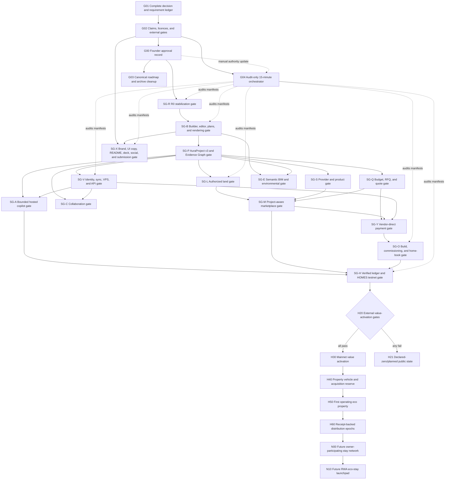
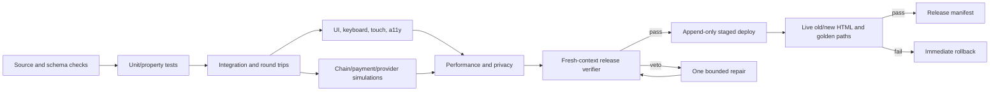

# Aura Homes Full-System Graph v1.1

> **Status: APPROVED — founder-approved August 13, 2026.**
>
> Approval binds the canonical proposed Graph v1.1 Git-blob SHA-256
> `897147D8F5C3FBF065423A64601509B4B3C6FA9DFA1AA114BD32FA0A047144FD`
> at commit `06dffcd5e72b3f0bb46ea2b23605268391fa32d4`. Its checked-out Windows-file
> SHA-256 was `17D137A87B1D544F7D393B35BB807F03F51F5BF315D808C0C8BAA7F08AF9BE85`.
> The separate approval record is
> `docs/plans/approvals/2026-08-13-aura-full-system-graph-v1.1.md`.
>
> **Implementation freeze:** no node after the committed R0 snapshot may start,
> push, deploy, spend money, contact a provider, change DNS, or activate value
> until Matt approves this graph. The recurring orchestrator is audit-only while
> this status remains `PROPOSED`.

**Goal:** turn Aura Homes into a builder-first Project OS that helps a normal
person design an eco home, match suitable land, assemble a real team, understand
cost, pay a quoted provider, run the build, and keep the operating record — while
keeping the X Layer and HOMES work optional, truthful, and behind real gates.

**Primary promise:** **Design the eco home. Match the land. Run the build.**

**Architecture:** one deterministic building graph and one durable project graph;
permissioned evidence adapters; bounded AI that proposes typed actions; direct
provider payments; human/professional completion gates; append-only release and
evidence records; value-bearing contracts disabled until external approval.

**Core stack:** Next.js, React, TypeScript, Three.js/R3F, IndexedDB and Web
Crypto; FastAPI, PostgreSQL, Caddy and Docker Compose on Hostinger; LangGraph for
bounded advisory graphs; Stripe direct/provider-owned rails; viem/wagmi,
OpenZeppelin, Foundry/Hardhat and X Layer; IfcOpenShell and environmental engines
as separately validated services where justified.

---

## 0. Approval packet

### Revision status

Graph v1 was committed at `f783728`, published for approval with SHA-256
`DE8427DA80561BEDFFCA2C5F614142C3001D4CD65C6CAFFBD0E46C2735BF4AC8`, and
approved conversationally on August 13, 2026. Before a hash-bound approval record
or execution-authority update was created, Matt requested a pilot-geography
revision. That approval is therefore superseded. Graph v1.1 returns to
`PROPOSED`; implementation and the recurring orchestrator remain frozen/audit-
only until v1.1 receives its own approval. Matt approved Graph v1.1 in the
project thread on August 13, 2026 with the instruction “go”; the approval record
below binds that instruction to the reviewed proposed graph hash.

The first pilot location is intentionally undecided between **Edmonton, Alberta**
and **Costa Rica**. The selected jurisdiction changes authoritative sources and
qualified reviewers, but not Aura's core product, evidence, safety, privacy,
pricing, provider, payment or build-operation rules.

### What is already committed

| Commit | State | Contents |
|---|---|---|
| `13c507262c35c253752955a0896a7927c77b84ce` | committed locally | Aura brand voice guide |
| `525c88898195e8b53c1826c096232aaa3a2c1fdc` | committed locally | R0 plan preview, explicit commit flow, same-tab persistence, chunk recovery, and append-only static release tooling |

Both commits are authored only as `Matt-Aurora-Ventures
<lucidbloks@gmail.com>`. They have not been pushed or deployed as part of this
approval packet. The implementation baseline was clean before this proposed graph
file was added.

Recorded R0 evidence: 14/14 release-tool tests passed; TypeScript passed; a
temporary two-phase `gh-pages` rehearsal preserved old assets and delayed HTML;
focused plan-preview/commit/reload browser paths passed. A fresh combined static
build, fixed-camera visual regression, vegetation suite and production smoke are
still required by R01–R05 before deployment.

### Frozen backups

- Source/production/DNS backup:
  `C:\Users\lucid\Desktop\aura-homes-backups\20260813-141247-full-system-r0`
- Source tag: `backup/full-system-main-before-r0-20260813-141247`
- Production tag: `backup/full-system-production-before-r0-20260813-141247`

### Approval effect

Approval authorizes execution in dependency order, not every future external
action. Separate gates still apply to provider outreach, paid services, email/DNS
mutation, production payments, legal formation, property acquisition, token
activation, and mainnet deployment.

---

## 1. Inputs reconciled into this graph

This graph treats the following as inputs, not automatically as facts:

1. Every founder instruction in the Aura conversation, including later
   corrections that supersede earlier instructions.
2. The current source tree and test evidence at the commits above.
3. The Claude/Fable handoff supplied three times. The files are byte-identical:
   32,844 bytes with SHA-256
   `2F7611159C76B1D90B76BE5D5A6F39C13DB546835A3A1B332702C531345373CA`.
4. `docs/BRAND-VOICE-GUIDE.md` and existing product documentation.
5. The active Full-System Graph Program supplied by Matt.
6. Rights, regulatory, provider, chain, and open-source facts that can be checked
   against primary sources.
7. The existing `docs/research/NOTEBOOKLM-INSIGHTS.md` record, which says a
   NotebookLM research pass was harvested on August 9, 2026. A fresh sync of the
   currently open notebook remains pending; it must be recorded as a new hashed
   research artifact rather than silently replacing the earlier pass.

### Precedence when inputs disagree

1. Executed agreements, live chain/provider state, law, licences, and signed
   professional decisions.
2. Fresh build/test/runtime evidence.
3. Matt's latest explicit product decision.
4. This approved graph and machine-owned specifications.
5. Active product documents.
6. Brand guidance.
7. Generated copy, decks, and agent summaries.

A founder decision governs intent, but cannot make an unlicensed feed live, make
a provider accept USDC, make a design permit-ready, make a testnet contract safe
for mainnet, or create legal property rights.

---

## 2. Graph engineering contract

The tables below are **program objectives**, not automatically executable work.
Before an agent can receive one, it must be instantiated as a versioned
`ExecutionNode` manifest using this contract:

```text
NODE        Stable node ID and graph version
JOB         One bounded outcome
IN          Typed inputs and their required versions
OUT         Typed output and acceptance schema
DEPENDS     Real data dependencies only
REJECT      Cheapest deterministic vetoes, run first
WORK        One owner and an explicit write set
VERIFY      Fresh-context verifier and anchors
REPAIR      At most one bounded repair loop unless approved otherwise
SIDE EFFECT none | local | remote-read | remote-write | money | legal/value
STATUS      proposed | ready | active | blocked | verified | shipped | retired
```

Rules:

- A program objective cannot become `ready` merely because it appears in this
  document. Its execution manifest must name exact inputs, outputs, dependencies,
  rejection gates, write set, verifier, repair limit and side effects.
- An execution node may start only when all dependencies are verified and no veto
  is open.
- Two nodes may not edit the same write set concurrently.
- AI can propose project commands; deterministic code validates and applies them.
- AI never owns geometry truth, money movement, evidence authenticity, physical
  completion, legal conclusions, or professional approvals.
- A worker never performs its own final verification.
- Missing evidence is `unknown`, never a pass.
- Demonstration data never completes a real project stage.
- Retired history is preserved under an archive label, not mixed into the active
  roadmap.
- Commits use Matt's identity only; no agent or co-author attribution.

### Typed run record

```ts
interface GraphNodeRun {
  graphVersion: string;
  nodeId: string;
  runId: string;
  status: "queued" | "running" | "vetoed" | "blocked" | "verified" | "failed";
  inputHashes: string[];
  outputHashes: string[];
  sourceCommit: string;
  owner: string;
  verifier?: string;
  startedAt: string;
  finishedAt?: string;
  attempts: number;
  tokenCost?: number;
  providerCostUsd?: number;
  sideEffects: string[];
  openGates: string[];
}
```

G04 may advance only an instantiated execution manifest, never a stream box or a
row in a capability table. This prevents the strategic graph from being mistaken
for file-level authorization.

---

## 3. Master dependency graph



### Stream-gate definitions

| Gate | Required verified objectives | Output |
|---|---|---|
| **SG-R** | R00–R05 | Stable live release and manifest. |
| **SG-B** | B00–B39 | One coherent builder/product release. |
| **SG-P** | P00–P09 | Validated AuraProject v3 and command/evidence boundary. |
| **SG-V** | V00–V14 | Hardened hosted foundation and optional identity/sync. |
| **SG-L** | L00–L12 | Authorized pilot land/parcel system. |
| **SG-S** | S00–S06 and S10–S16 | Consented provider/model evidence system. |
| **SG-Q** | Q00–Q08 | Durable budget/RFQ/quote and DIY-or-hire system. |
| **SG-E** | E00–E13 | Semantic handoff, pre-check/seal path and bounded environmental analysis. |
| **SG-A** | A00–A12 | Bounded request and proactive project-brain services. |
| **SG-C** | C00–C04 | Safe asynchronous collaboration; realtime only if C02 passes. |
| **SG-M** | M00–M04 | Project-aware marketplace. |
| **SG-Y** | Y00–Y10 | Verified provider-direct payment capabilities. |
| **SG-O** | O00–O08 | Build operations, commissioning and home book. |
| **SG-H** | H00–H09 | Receipt-backed ledger and complete no-value testnet proof. |
| **SG-X** | X00–X15 | Truth-bound public product, collateral and hackathon completion package. |

The ranges above are release requirements, not permission to run every row at
once. Each row still needs one or more file-level execution manifests.

---

## 4. Program status legend

| Class | Meaning |
|---|---|
| **Adopt** | Useful, in scope, and supported by a real dependency path. |
| **Pilot** | Worth testing behind labels and measurable exit criteria. |
| **Defer** | Potential value, but the prerequisites or economics do not justify it yet. |
| **Reject** | Conflicts with product truth, rights, safety, cost, or the actual customer problem. |
| **External gate** | Code can be prepared, but completion depends on an agreement, professional, provider, legal decision, audit, capital, or live data. |
| **Proposed founder amendment** | A reasoned change to an earlier founder mandate that becomes authoritative only if Matt approves it in G00. |

---

## 5. G-stream — governance, truth, and swarm control

| ID | Job and output | Depends / gate | Class |
|---|---|---|---|
| **G00** | Founder approves graph version and activation boundary. Output: an approval record binding the committed proposed-graph blob hash, version, time, approver and amendments. | G01 and G02 are approval inputs; explicit user approval plus a separate Matt-authored approval commit; no execution before both. | Adopt |
| **G01** | Complete and founder-check `FounderDecision[]` and `RequirementTrace[]`; classify each instruction as active, superseded, conflicted, unresolved or fulfilled. Section 18 is the human-readable approval view. | Conversation/repository/research inputs; preserve original wording and date. Must be complete before G00. | Adopt |
| **G02** | Complete the approval-view `ContentClaim[]`, `ExternalGate[]`, `LicenceRecord[]`, source-expiry rules and capability evidence represented throughout this graph. | G01; fail closed on missing/expired proof. Must be complete before G00. | Adopt |
| **G03** | Make this file the active roadmap, keep `docs/SUBMISSION.md` as demo truth, and move escrow-led/outdated roadmaps into clearly historical archives. | G00; no silent deletion. | Adopt |
| **G04** | Run the 15-minute graph auditor/orchestrator described below. | G02 enables audit-only operation; G00 alone does not grant advancement authority. | Adopt |
| **G05** | Add an independent release verifier with fresh context; it may veto merge/deploy. | Every release candidate. | Adopt |
| **G06** | Build a public/open-source licence boundary, NOTICE/SBOM, dependency pins, secret scanning, and prohibited-source rules. | G02. | Adopt |
| **G07** | Migrate the existing August 9 NotebookLM harvest, the Claude/Fable handoff, and future research into hashed `ResearchArtifact` records with claims, citations, conflicts and expiry; perform a fresh notebook sync as a separate revision. | Existing notes are an input, not live revalidation; never imply a newer notebook state was read when it was not. | Adopt |
| **G08** | Maintain risk, privacy, security, accessibility, cost, and external-dependency registers. | Updated at each verified node. | Adopt |
| **G09** | Produce a weekly graph summary: shipped, blocked, drift, spend, evidence expiry, and next safe nodes. | G04 run records. | Adopt |
| **G10** | Locate the two hackathon collateral destinations previously described as “Creative AI” and “Creative IOKR8TIV”; record repository/owner/branch truth before proposing synchronized updates. | Read-only discovery first; no guessed repository mutation. | Adopt |

### G04 — 15-minute graph orchestrator

The orchestrator is a control plane, not a coding agent.

**Automation record:** `aura-graph-swarm-auditor` is active as a 15-minute
thread heartbeat. Its prompt is unconditionally audit-only: changing a document
status cannot grant authority. After Matt approves a committed graph, advancing
agents still requires a separate, deliberate automation update in this thread.

**Audit inputs**

- approved graph version and hash;
- decision/requirement ledger;
- current branch, commit, dirty files, test evidence, and deployment manifest;
- live agent status and declared write sets;
- external gates and expiry dates;
- cost and side-effect policies.

**Audit output**

```ts
interface GraphAuditReport {
  graphVersion: string;
  checkedAt: string;
  approvalState: "proposed" | "approved" | "paused";
  activeNodes: string[];
  activeAgents: Array<{ agent: string; node?: string; state: string }>;
  drift: Array<{ requirementId: string; finding: string; severity: string }>;
  conflicts: Array<{ writeSet: string; owners: string[] }>;
  idleAgents: string[];
  readyNodes: string[];
  safeFollowups: string[];
  blockedNodes: Array<{ node: string; gate: string }>;
  testOrEvidenceFailures: string[];
  externalActionsRequired: string[];
}
```

**Before approval**

- Inspect and report only.
- Do not move an agent, edit a file, start a node, push, deploy, contact anyone,
  spend, or change infrastructure.

**Possible authority after approval**

- Nothing changes automatically. Matt's explicit approval is first captured in a
  committed approval record that binds the proposed graph blob hash, graph
  version, approval time, and approver identity.
- A separate manual update to this automation may then allow it to remind or move
  an idle agent only onto an already-approved `ready` node whose dependencies are
  verified and whose write set is unclaimed.
- It may retry only the failed node and only within its documented repair limit.
- It may never broaden scope, approve its own output, commit, push, deploy, spend,
  sign, contact a provider, change DNS, activate payments, or cross an external
  gate.
- It stops and asks Matt when intent is ambiguous or a material new decision is
  required.
- It produces a report even when no action is safe.

**Stall policy**

- `idle < 15 min`: observe.
- `idle 15–30 min`: request a compact status and next step.
- `idle > 30 min` with a ready node: offer one safe follow-up.
- same blocker in three consecutive audits: mark the node blocked and escalate.
- conflicting writers, dirty unowned files, or failed anchors: freeze affected
  branch immediately.

---

## 6. R-stream — release-zero stabilization

| ID | Job and output | Acceptance / status |
|---|---|---|
| **R00** | Preserve the committed R0 baseline and backups. | **Verified/committed** at `525c888`; not pushed/deployed. |
| **R01** | Stage append-only static assets, verify old/new HTML, publish assets before HTML, retain newest five or 30 days, and prune separately; wire the same two-stage logic into reviewed release automation without bot-authored source commits. | Tooling committed; production rehearsal and final release verification still required. |
| **R02** | Interactive plan preview, explicit `Use this design`, undoable commit, durable origin/cost/licence/hash, camera reframe, same-tab reload, keyboard/touch parity. | Core code/tests committed; add approved fixed-camera pixel-difference regression and fresh full-browser verifier before deploy. |
| **R03** | Progressive worker-built meadow: dense near grass, mid clumps/cards, far texture, many deterministic flower clusters, and a rich site-neutral Aura botanical palette with a static fallback. Jurisdiction-specific Alberta or Costa Rica presets are optional later assets, not a dependency of R0. | Not started. Must not restore synchronous million-instance rebuild. |
| **R04** | Push verified backup tags, back up again, merge/rebase, push main, build, append-only publish, desktop/mobile smoke, old-HTML compatibility, live hydration and interaction test. | Starts only after R01–R03 and R05 pass and G00 approval. |
| **R05** | Re-encode and serve the landing film as responsive poster-first sources (measured AV1/WebM/MP4 where supported), defer high-resolution bytes until useful, and preserve a composed still so sharpness never causes an LCP or transition regression. | Visual bitrate/quality comparison, network/device matrix and Core Web Vitals gate. |

### R03 quality contract

- Fixed-camera vegetation coverage may not regress more than 2% overall or 5%
  in any key region.
- Flowers must be visible in near and mid fields.
- No promotion task over 50 ms.
- INP ≤160 ms; p95 active frame ≤16.7 ms desktop and ≤33.3 ms mobile.
- No automatic mobile 3D and no always-running loop after settling.
- Sparkle speed remains `0.0625`.
- Quality is increased through progressive geometry, instancing, atlases, LOD,
  authored textures, scheduling, and measurement — not through hidden delay or a
  lower-quality default sold as equivalent.

---

## 7. B-stream — product, geometry, editor, plans, and rendering

### B00–B09: product semantics

| ID | Job and output | Gate / class |
|---|---|---|
| **B00** | One project journey: Requirements → Design → Land/Delivery → Team → Costs → Handoff → Build → Operate. | Adopt |
| **B01** | Keep `Find land + build`, `Build on my land`, and `Buy a finished home` as explicit intake forks. | Adopt |
| **B02** | Preserve separate practical and X Layer journeys over one product truth. | Adopt |
| **B03** | Replace inferred completion with explicit evidence and user confirmation. | Adopt |
| **B04** | Remove ordinary-project escrow/deposit/refund language; keep the existing testnet proof under a noindex lab. | Adopt |
| **B05** | Define the target customer: cost/land/permit/team uncertainty first; crypto optional. Validate with interviews and funnel evidence. | Adopt |
| **B06** | Use `Today`, `Next`, and `Future` presentation labels backed by richer machine states. | Adopt |
| **B07** | Keep the first pilot jurisdiction undecided between Edmonton, Alberta and Costa Rica. Selection requires a separate founder decision; activation requires a passing `PilotJurisdictionContract`. Neither option is the default. | Adopt |
| **B08** | Build normal-user value before token promotion. | Adopt |
| **B09** | Add a coherent app information architecture and journey spine only within active projects. | Adopt |

### Shared pilot jurisdiction contract

```ts
type PilotJurisdiction = "edmonton-alberta" | "costa-rica" | "undecided";

interface PilotJurisdictionContract {
  jurisdiction: PilotJurisdiction;
  authorizedListingAndParcelSources: boolean;
  listingOfferSeparatedFromParcelContext: boolean;
  authoritativeLandUseTitleHazardWaterAccessUtilityEvidence: boolean;
  qualifiedProfessionalAndClosingPath: boolean;
  providerIdentityLicenceCoverageInsuranceAndReferences: boolean;
  localizedBudgetTaxDeliveryFoundationUtilityAndContingencyBasis: boolean;
  hashBoundRfqQuoteAndPaymentCapability: boolean;
  humanVerifiedBuildMilestonesAndHomeBook: boolean;
  privacyRetentionExpiryAndDeletionRules: boolean;
  demonstrationDataExcludedFromRealProgress: boolean;
}
```

The BuilderDocument, BuildingGraph, editor, exports, RFQs, payments, milestone
model and home book remain one implementation in either pilot. Jurisdiction
adapters may identify different authorities, documents, currencies, professional
roles, taxes and land constraints, but they may not weaken the shared contract.
Until Matt selects a jurisdiction and every required field is supported by
current evidence, the land/provider surfaces remain demonstration, user-supplied
or research-only and cannot complete real project progress.

### B10–B19: BuildingGraph v2

| ID | Job and output | Verification |
|---|---|---|
| **B10** | Versioned graph with storeys, elevations, vertices, wall edges, faces, slabs, voids, stairs, shafts, roofs, ridges, and site anchors. | Schema/migration/golden fixtures. |
| **B11** | Non-rectangular footprints, angled walls, snapping, dimensions, alignment, and self-intersection prevention. | Property/invariant tests. |
| **B12** | Stable openings across wall move/split and semantic orphan quarantine/repair. | Mutation/fuzz tests. |
| **B13** | Exact room-face derivation and correctly placed comfort/IFC spaces; preserve published sPMV assumptions and keep the unresolved vapour-pressure coefficient interpretation visibly flagged until independently validated. | Geometric oracle, comfort fixtures and IFC round trip. |
| **B14** | Deterministic gable, shed, flat, and valid convex hipped roofs; explicit zones for concave complexity. | Roof fixture suite. |
| **B15** | Multi-storey duplication/alignment, stacked rooms, shafts, and floor openings. | Storey fixtures and section checks. |
| **B16** | One graph drives 2D, 3D, quantities, comfort, land fit, drawings, budgets, RFQs, DXF, IFC4, ifcJSON, glTF, JSON, and shares. | Consumer equivalence matrix. |
| **B17** | Migrate rotated legacy volumes without deleting the source document. | Recovery and hash fixtures. |
| **B18** | Undo/redo as graph commands with stable identifiers and expected-document hashes. | Command property tests. |
| **B19** | Add clean site anchors, setbacks, service clearances, terrain reference, and north/orientation semantics. | Land-fit integration fixtures. |

### B20–B29: editor experience

| ID | Job and output | Class |
|---|---|---|
| **B20** | Guided editor: Brief → Plan → Shell → Rooms → Openings → Site → Performance → Materials → Review. | Adopt |
| **B21** | Each guided step shows one decision group, known/unknown, project/cost effects, limitations, and confirmation. | Adopt |
| **B22** | Pro desktop: left rail, central canvas, right inspector, model/plan toggle, palette, breadcrumbs, snapping, history, status. | Adopt |
| **B23** | Pro mobile: upper canvas, accessible bottom sheet, persistent 2D/3D/undo/redo/next, 44 px targets and safe areas. | Adopt |
| **B24** | Guided and Pro apply identical commands and produce identical hashes for identical geometry. | Hard release gate |
| **B25** | Fix focus, keyboard, touch, selection announcements, invalid geometry, empty states, and 200% zoom. | Hard release gate |
| **B26** | Demand-render the builder; no global cinematic scroll or decorative always-running effects on app routes. | Adopt |
| **B27** | Contextual limitations adjacent to export, performance, cost, land, provider, and payment decisions. | Adopt |
| **B28** | Natural-language editor requests compile to typed commands; deterministic graph engine previews/vetoes before user confirmation. | Pilot after P00/A00 |
| **B29** | AI renders via OpenRouter remain optional, visible-cost prepared actions; 15% margin only as a disclosed line. | Defer until hosted spend controls |

### B30–B39: plan and material library

| ID | Job and output | Class |
|---|---|---|
| **B30** | Preserve 25 provenance-labelled concepts and run a rights/provenance lint over every artifact and image. | Adopt |
| **B31** | Ingest Tier A sources: Design for Place, FreeFarmhouse, Entropie, OBI, selected WikiHouse, and public-domain USDA plans. | Adopt after exact artifact audit |
| **B32** | Keep OSE and incomplete/open systems as experimental Tier B; inspiration-only sources as Tier C. | Adopt |
| **B33** | Aura-authored clean-room concepts: steel/polycarbonate courtyard pavilion, winter-garden cabin, greenhouse home, A-frame, SIP cabin. | Adopt; never copy ambiguous private plans |
| **B34** | Every item carries source owner, exact artifact/revision/hash, SPDX licence, attribution, change notice, imagery rights, area, tier, jurisdiction, limitations, and cost basis. | Hard gate |
| **B35** | Use Aura-authored renders unless exact image reuse rights are recorded. | Adopt |
| **B36** | Do not call concepts construction-ready, code-approved, structurally engineered, or permit-ready. | Permanent truth gate |
| **B37** | Shared Nordic material library: timber, SIP layers, metal, blackened steel/aluminium, polycarbonate, lime, stone, glass, textiles, water, soil and plants. | Adopt |
| **B38** | KTX2/Basis, meshoptimizer, Draco where measured, route-lazy assets, quality tiers, contact shadows and warm lighting. | Adopt |
| **B39** | Cost ranges persist exact plan origin and proxy method into budget/RFQ/quote. | Adopt / regression gate |

### Eco-doctrine approval decision

Earlier founder documents mandate no concrete and an Atmospheric Water Generator
on every Aura home. The Claude/Fable report repeats those mandates. The proposed
product rule below is therefore an explicit founder amendment for G00 approval,
not a claim that the earlier decision was already superseded:

- **Proposed amendment:** make foundation choice outcomes-based and
  site-appropriate. Screw piles remain a preferred option to compare, but their
  suitability depends on geotechnical, structural, frost, fire, access, cost and
  local professional review. Do not enforce a universal concrete ban in software.
- **Proposed amendment:** make Atmospheric Water Generation an optional scenario
  with climate/output limitations and a dependable primary water plan. Do not
  require AWG on every home.
- **Retain:** reject automatic “code-compliant” or “permit-ready” output.
- **Adopt:** carbon/material/site-disturbance comparisons with explicit system
  boundaries and data quality.
- **Adopt:** interactive sun, shade, water, energy and comfort education when it
  is based on sourced weather/site data and labelled screening or simulation.

If Matt does not approve these two amendments, G01 must preserve the earlier
mandates and create a separate product/safety implementation decision before the
affected builder nodes start.

---

## 8. P-stream — AuraProject v3 and the Evidence Graph

| ID | Job and output | Gate |
|---|---|---|
| **P00** | Version `AuraProjectV3`; replace remaining durable `unknown[]` records with discriminated types. | Migration/future-version tests. |
| **P01** | Typed requirements, listing offers, parcel context, fit, providers, credentials, artifacts, products, delivery, RFQs, quotes, budgets, payments, milestones, inspections, warranties, maintenance, actions, events and runs. | Schema/size bounds. |
| **P02** | Pure `applyProjectCommand(project, command, expectedProjectHash)` boundary used by UI and AI. | Conflict/idempotency tests. |
| **P03** | Canonical serialization; deterministic `keccak256` project/design/budget/site hashes; SHA-256 evidence checksums. | Golden vectors. |
| **P04** | Optional AES-256-GCM portable project bundle with recovery, duplicate, archive, delete, and future-version refusal. | Crypto and recovery tests. |
| **P05** | Source/access/status/confidence/expiry/missing-evidence fields on every durable record. | Validation lint. |
| **P06** | Append-only `ProjectEvent` history and `ArtifactManifest`. | Tamper/invariant tests. |
| **P07** | Demonstration, user-supplied, pilot, partner and live records cannot be silently upgraded. | State-machine tests. |
| **P08** | Full local-first project remains useful without account, API, wallet, or network. | Offline golden path. |
| **P09** | Privacy minimization: precise address, plans, identity, guests, title evidence and private provider files stay off-chain. | Privacy review. |

---

## 9. V/A-stream — accounts, Hostinger, email, and bounded AI

### V00–V19: hosted foundation

| ID | Job and output | Gate / class |
|---|---|---|
| **V00** | Optional email magic-link account, passkey, secure session cookie, optional signed-wallet link. | Security review; anonymous path stays. |
| **V01** | Explicit opt-in sync, cross-device open, export and deletion without lock-in. | Privacy/deletion tests. |
| **V02** | Create `hello@aurahomes.fun`; configure SPF, DKIM and DMARC. | **External/manual Hostinger gate**; no mutation before approval. |
| **V03** | Caddy → FastAPI → one worker → private PostgreSQL on `api.aurahomes.fun`. | VPS snapshot and deploy approval. |
| **V04** | Exact CORS, Origin/CSRF, secure cookies, body/upload/concurrency/rate/provider-spend limits. | Pen/security tests. |
| **V05** | Idempotency for every mutation, ETag/If-Match approvals, transactional outbox, Postgres job queue. | Concurrency tests. |
| **V06** | Random capability URLs, TTL deletion, no private payloads in logs, no internal/provider disclosure in health. | Security gate. |
| **V07** | `/healthz`, `/readyz`, migrations, structured audit events and OpenTelemetry. | Operations gate. |
| **V08** | Nightly `pg_dump -Fc`, encrypted restic offsite, 7/4/6 retention and weekly restore proof. | **External bucket credentials**. |
| **V09** | Provider portal for consent, legal entity, evidence, product, delivery, quote, payment capability and data rights. | Partner agreements. |
| **V10** | Public APIs from the approved program with cursor pagination, request IDs and stable error codes. | API contract tests. |
| **V11** | Separate licensed/TTL listing storage from user project and derived screening records. | Feed agreement rules. |
| **V12** | Pinned images/dependencies, non-root/read-only containers, secret scan, SBOM and vulnerability gates. | Release gate. |
| **V13** | Do not store provider/model API keys in IndexedDB. | Permanent security rule. |
| **V14** | No production request to localhost unless explicitly in development. | Regression gate. |

### A00–A19: copilot graph

| ID | Job and output | Gate / class |
|---|---|---|
| **A00** | Bounded LangGraph advisory/research flows; deterministic domain services own geometry, state and money. | Adopt after P00/V03. |
| **A01** | Validate/minimize → cheap veto → parallel adapters → normalize → fresh verifier → synthesis → prepared action → simulation → human decision → outbox → independent receipt verifier. | Adopt |
| **A02** | Strict JSON schema, pinned models, denied data collection/ZDR where supported, two attempts max. | Adopt |
| **A03** | Node/run/session/day/month budgets for calls, tokens, time and USD; clear 402/429. | Adopt |
| **A04** | Evidence citations, assumptions, missing facts and unsupported-claim refusal in every response. | Adopt |
| **A05** | AI never contacts, sends, signs, bridges, pays, approves work, or completes milestones without explicit user action. | Permanent invariant |
| **A06** | Deterministic offline concierge fallback. | Adopt |
| **A07** | Evaluate KR8TIV Kraken/Cipher/KIN assets only after existence, licence, model/data provenance, privacy and benchmark audit. | Pilot; no assumed reuse |
| **A08** | Architecture RAG retrieves only rights-cleared, jurisdiction-labelled concept/examples; never treats retrieved plans as compliance proof. | Pilot |
| **A09** | Visible provider cost + disclosed 15% service margin only after hosted metering exists. | Defer until billing/terms |
| **A10** | Persistent project brain computes deterministic slip rules from schedule, quote/evidence expiry, unresolved blockers, design/budget/site hash drift, dependencies and weather windows; AI may explain but does not invent the signal. | Adopt after P00/O00 |
| **A11** | User-controlled material-change and weekly email digests from `hello@aurahomes.fun`, with explicit opt-in, frequency controls, unsubscribe, quiet periods and no private document contents in telemetry. | V02/email delivery and privacy gate |
| **A12** | Predicted-versus-actual outcome ledger for cost, schedule, lead time and performance; learn only from consented, minimized observations and never train on private projects by default. | Pilot after first real build; re-identification/retention review |

---

## 10. L-stream — authorized land and parcel graph

| ID | Job and output | Gate / class |
|---|---|---|
| **L00** | Separate `ListingOffer` from `ParcelContext`; public geometry is not automatically for sale. | Adopt |
| **L01** | BYOD import for authorized listing CSV/JSON or RESO Common Format where applicable, survey/title files, municipal GIS, zoning documents and external links. | Adopt; local parsing first |
| **L02** | For the selected jurisdiction, obtain an authorized broker, listing or partner feed with explicit display, photo, refresh, deletion, analytics, caching and derived-fit rights. Edmonton may use a licensed Canadian feed; Costa Rica requires its own written provider terms. | **External agreement** |
| **L03** | Never scrape listing, land, brokerage, business-rating, search or review sites; use only licensed feeds, explicit partner rights, public data with compatible terms or user-supplied records. | Permanent rule |
| **L04** | Build one source registry per candidate jurisdiction: Edmonton/Alberta cadastral, zoning and terrain evidence or Costa Rica national/municipal equivalents. Every layer requires an exact rights, date, geography and fitness-for-use audit before activation. | Agreements/licence audit |
| **L05** | Apply the same screening contract in either jurisdiction: footprint, setbacks, land use, access, slope/topography, hazards, water, utilities and unresolved professional/document gates. | Pilot |
| **L06** | Remain a neutral display/link-out tool until the selected jurisdiction's brokerage/legal scope is documented; no negotiation, offer preparation, representation claim, transaction-based referral fee or property-fund handling. | **External legal gate** |
| **L07** | Require current authoritative land-use/zoning, certified title/cadastral evidence, water availability, access/utilities, topography and qualified professional review before confirmed fit. | Human/professional gate |
| **L08** | Exclude protected or special land regimes, unresolved possession, ambiguous title, missing access/water, and any jurisdiction-specific hard constraint from the pilot until resolved. | Hard veto |
| **L09** | Do not expose owner names or private title evidence. Closing remains with a qualified local lawyer, notary or other authorized professional for the selected jurisdiction. | Privacy/legal gate |
| **L10** | Do not set parcel-count, locality or partner-volume targets until the jurisdiction is selected and source/partner rights are confirmed. | Founder/partner decision |
| **L11** | Fit result explains source/date, screening vs confirmed, assumptions, flags and required next evidence. | Release gate |
| **L12** | Use compliant PMTiles or approved tile provider before real traffic; retain accessible list view and attribution. | Defer until traffic/data |

---

## 11. S/M-stream — real contractors, manufacturers, and marketplace

### Contractor graph

| ID | Job and output | Gate |
|---|---|---|
| **S00** | `ProviderOrg` with legal-entity matching, service area, project type and consent status. | Adopt |
| **S01** | Distinguish `owner-attested` from `authority-verified`; a checkbox cannot satisfy a mandatory gate. | Hard truth gate |
| **S02** | In either jurisdiction, require exact legal-entity match, applicable builder/professional/trade authorization, worker coverage, current insurance, service area, comparable work and consented references. | Source/document required |
| **S03** | A jurisdiction adapter maps the shared provider gate to Edmonton/Alberta or Costa Rica authorities and documents without changing what must be proven; every source is labelled only for the fact it actually establishes. | Source/document required |
| **S04** | Explain comparison scoring but never say “Aura vetted.” Jurisdiction-specific safety or enforcement records are context, not workmanship proof. | Hard copy gate |
| **S05** | Seed prospects internally from lawful directories; publish only consented/user-entered case files. | Consent gate |
| **S06** | Define provider-count and trade-coverage targets only after pilot selection; launch requires consented coverage for the selected jurisdiction's essential design, site, foundation, shell, MEP, utility and professional scopes. | External outreach |

### Manufacturer/home model graph

| ID | Job and output | Gate |
|---|---|---|
| **S10** | Separate `ResearchLead`, `FinishedHomeModel`, `DeliveryCapability`, `ListingOffer` and `OrderableOffer`. | Adopt |
| **S11** | An orderable offer requires verified entity, exact configuration, destination, price/quote, shipping, inclusions, certifications, warranty, lead time, payment destination and media/data rights. | Hard gate |
| **S12** | Require the selected jurisdiction's retail-home seller, plant/model certification, local engineering and material-conformity evidence where applicable. | Authority evidence |
| **S13** | For every destination, reconcile the exact delivery route and landed cost, including freight, tax/duty, customs or interprovincial requirements, port/yard handling, inland delivery, foundation, crane and installation where applicable. | Partner/professional evidence |
| **S14** | Catalog UI: image → model/maker → price → delivery → size/bedrooms → view/save/compare/request quote. | Adopt |
| **S15** | Missing price copy: “Reliable pricing not found — request a quote.” Sources/caveats live in progressive details. | Adopt |
| **S16** | Initial target: 5–10 consented manufacturers/models, fewer only with explicit coverage. | External outreach |

### Marketplace

| ID | Job and output | Gate |
|---|---|---|
| **M00** | Marketplace lives inside the active project and ranks only against requirements, design, site, region and evidence freshness. | P00/L/S/Q |
| **M01** | Save, compare (up to three), shortlist and prepared inquiry work across devices after opt-in sync. | Adopt |
| **M02** | No abstract readiness score in customer cards; expose missing facts and dated sources. | Adopt |
| **M03** | Local/baked rights-safe images, EXIF stripped, optimized, hashed, permission reference retained privately. | Hard rights gate |
| **M04** | Deleted/expired listings disappear per provider agreement without corrupting the user's project history. | Feed deletion tests |

---

## 12. Q/Y-stream — budgets, RFQs, quotes, and payments

### Budgets and RFQs

| ID | Job and output | Gate |
|---|---|---|
| **Q00** | Budget binds design, site, region, foundation, utilities, delivery, finish, shipping, tax, contingency, source and date. | Adopt |
| **Q01** | Keep Edmonton/Alberta and Costa Rica research scenarios separate until a pilot is selected and a localized source basis passes the shared contract. Unsupported geography may show a named reference benchmark, but never relabel it as local pricing. | Hard truth gate |
| **Q02** | Reconcile the current Alberta anchor and all unbudgeted lines. If Costa Rica is selected, create an equivalently sourced local anchor before publishing a “whole project” range there; no reference model may be relabelled local. | Data gate |
| **Q03** | Comparable RFQ packages for design, engineering, foundation, shell/home, MEP, solar, water/septic, interiors, GC, delivery and installation. | Adopt |
| **Q04** | RFQ includes drawings, quantities, assumptions, exclusions, schedule, response template, hashes and manifest in PDF/JSON. | Adopt |
| **Q05** | Quote import maps line items, allowances, omissions, originals and evidence checksums. | Adopt |
| **Q06** | Any design/site/utility/region/delivery/finish/shipping/tax/contingency change invalidates old basis and explains why. | Hard regression gate |
| **Q07** | Publish an open, versioned RFQ/quote schema for consented suppliers. | Adopt after V10 |
| **Q08** | Per work package, offer `DIY`, `hire`, or `professional required` from a jurisdiction/source-dated scope rule; show owner-buildable tasks, safety/permit/insurance limits, material lists and the corresponding RFQ without implying the user may legally self-perform restricted work. | Adopt; professional/legal scope review |

### Vendor-direct payment graph

| ID | Job and output | Gate / class |
|---|---|---|
| **Y00** | Quote-level `PaymentCapability`; never infer support from provider marketing or another product. | Adopt |
| **Y01** | State machine: draft → action → processing → settled/failed/expired; settled → refund requested → partial/refunded/disputed. | Adopt |
| **Y02** | Use provider-direct fiat rails approved for the selected jurisdiction and exact vendor/country pair. Edmonton may use Stripe Connect direct/provider-owned Checkout, cards for smaller invoices, and PAD/bank/wire for larger ones; Costa Rica requires its own approved processor, provider-hosted invoice or bank-transfer route before fiat is shown. | **Processor approval + vendor contracts + jurisdiction/legal scope** |
| **Y03** | Signed webhook verification, dedupe, canonical provider fetch, idempotency and append-only receipt. Return URL never settles. | Hard security gate |
| **Y04** | Native Circle USDC direct vendor transfer on X Layer mainnet only for a real quote, verified recipient and supported vendor. | **Legal/provider/mainnet product gate** |
| **Y05** | Verify chain 196, current Circle token, code/decimals/balance/recipient/expiry; require wallet signature; verify transfer through two sources. | Hard chain gate |
| **Y06** | Record fair-market-value basis/time; vendor refunds are new transfers; show irreversibility and full recipient. | Accounting/UX gate |
| **Y07** | OKX/X Layer or Circle CCTP is a user-controlled prepared action with asset/network/gas/fee/time/recovery explanation. | Provider validation |
| **Y08** | Never bridge, swap, sign or forward autonomously. ChangeNOW remains unavailable until exact transaction route/terms/compliance/failure handling are proven. | Permanent rule |
| **Y09** | Keep ordinary commerce metadata, accounts and routes separate from HOMES. | Hard architecture gate |
| **Y10** | Hyperswitch evaluation only when two or more real PSPs justify orchestration; it is not a custody/compliance shortcut. | Defer |

---

## 13. O-stream — build and home operations

| ID | Job and output | Gate |
|---|---|---|
| **O00** | Typed milestones: draft → review → approved → in progress → evidence submitted → verified → complete, plus blocked/disputed/cancelled. | Adopt |
| **O01** | Milestone carries owner/company, dependencies, dates, quote/budget, payment, evidence, reviewer role, inspection, changes, blockers and immutable history. | Adopt |
| **O02** | Only named human/professional role can verify physical completion. AI may summarize or flag gaps. | Permanent invariant |
| **O03** | Schedule/critical path, permits, RFQs, procurement, delivery, inspections, photos, change orders, deficiencies and payment reconciliation. | Adopt |
| **O04** | Approval cards and prepared actions for each consequential state transition. | Adopt |
| **O05** | Commissioning: systems, test results, unresolved issues, professional sign-off and owner training. | Human/professional gate |
| **O06** | Home book: final/as-built records, permits, inspections, equipment, materials, warranties, manuals, maintenance, energy/water logs and checksums. | Adopt |
| **O07** | Optional Home Assistant, OpenEMS, EmonCMS, Mosquitto and Node-RED connectors. | Defer until first operating home |
| **O08** | Stay operations: booking-channel data only through authorized APIs; guest/privacy boundaries; property accounting separate from project design. | Future/external |

---

## 14. E/C-stream — BIM, environmental analysis, and collaboration

### Semantic BIM and environmental decision support

| ID | Job and output | Gate / class |
|---|---|---|
| **E00** | Map BuildingGraph semantics to IFC4 and validate/round-trip with IfcOpenShell on the VPS/CI. | Adopt after B16/P00 |
| **E01** | Generate review drawings/sections through tested IfcOpenShell capabilities; retain Aura SVG/PDF fallback. | Pilot; drawing API limitations disclosed |
| **E02** | Never label generated IFC/drawings permit-ready or manufacturing-ready without qualified review and exact supplier requirements. | Permanent rule |
| **E03** | Client-side deterministic sun path, shadow, orientation, glazing and simple water/energy education. | Adopt |
| **E04** | Ladybug/Honeybee/EnergyPlus/Radiance/OpenStudio service for sourced weather and bounded simulations. | Pilot after semantic/site inputs |
| **E05** | Simulation outputs carry engine/version, weather file, assumptions, convergence/data quality and “not certification” label. | Hard gate |
| **E06** | Visual environmental feedback: seasonal sun, shade, estimated loads, water availability and uncertainty — useful, calm, optional. | Adopt/Pilot |
| **E07** | Browser CFD and heavy Wasm simulations only after a benchmark proves user value, accuracy and device viability. | Defer |
| **E08** | Carbon/LCA path via Brightway/openLCA/openEPD/bSDD after licensed datasets and system boundaries are defined. | Defer |
| **E09** | Versioned, source-dated rule catalog for narrowly scoped geometric and document pre-checks; each rule names jurisdiction, applicability, required inputs, source clause, effective date and reviewer. | Adopt after L/P; legal/professional review |
| **E10** | Four-state pre-check result: `RULE_SATISFIED`, `RULE_NOT_SATISFIED`, `REVIEW_REQUIRED`, or `UNKNOWN`; missing data can never become a pass. | Hard deterministic gate |
| **E11** | Professional review workspace with evidence, rule trace, comments, override reason, reviewer identity/credential and immutable revision history. | Pilot with a qualified partner |
| **E12** | Export a review/seal package and integrate a signing/professional-seal rail valid for the selected jurisdiction only after provider, identity, credential, retention and signature-validity review. Notarius/ConsignO are Edmonton candidates; Costa Rica requires its own qualified local digital-signature and professional workflow. | External provider/professional gate |
| **E13** | Sealed output records who reviewed which exact hashes and when; Aura still never calls an unreviewed design compliant or permit-ready. | Permanent truth and audit rule |

### Collaboration

| ID | Job and output | Gate / class |
|---|---|---|
| **C00** | Start with asynchronous comments, share/export, review snapshots, issue records and explicit merge/apply. | Adopt after P00/V00 |
| **C01** | Evaluate Yjs CRDT for typed graph commands, not raw geometry mutation. | Pilot |
| **C02** | WebRTC presence/session pilot with Aura-controlled signaling/TURN/privacy plan; public signaling is not a production guarantee. | Defer until C00 proven |
| **C03** | Preserve graph invariants, expected hashes, deterministic merge and recovery under concurrent edits. | Hard gate |
| **C04** | No claim of “zero-cost multiplayer”; publish measured infrastructure and privacy trade-offs. | Permanent truth rule |

---

## 15. H/N-stream — HOMES, property vehicles, and future stay network

### Boundary

HOMES can be fully specified, tested, simulated and audited on testnet. It cannot
be activated as a public value-bearing system merely because the code exists.
The token cannot itself hold registered land. Ordinary Aura remains usable with
no wallet, token or identity check.

### Testnet and ledger nodes

| ID | Job and output | Gate / class |
|---|---|---|
| **H00** | Receipt-backed categorized ledger for realized provider/platform/LP fees, costs, net amounts, rules and block/source evidence. | Adopt |
| **H01** | Dashboard uses discriminated unavailable/declared-zero/stale/mismatch/live states; every non-zero cell derives from events. | Adopt |
| **H02** | Keep trading/LP and service/AI/marketplace ledgers separate; volume is not revenue. | Hard accounting gate |
| **H03** | No-value `HomesToken` testnet, labelled vesting, treasury Safe/timelock simulation and versioned fee allocation. | Adopt after specification freeze |
| **H04** | Property accounting registry, time-weighted/checkpointed eligibility, distribution epoch and USDC Merkle claim simulation. | Testnet only |
| **H05** | Top-200 means eligible time-weighted stakers with exclusions, dispute, dust, expiry and reproducible root; disclose Sybil limitation. | Spec/legal gate |
| **H06** | Top-50 wind-down applies only to reconciled unspent property-acquisition funds under same controls. | Spec/legal gate |
| **H07** | New hardened attestation registry; current testnet registry remains lab provenance and is never reused unchanged. | Security gate |
| **H08** | Slither, Foundry fuzz/invariant/fork, Hardhat, source verification, distinct signers, monitoring and incident runbook. | Hard testnet/audit gate |
| **H09** | Run one complete X Layer testnet proof with distinct roles and public receipts for network validation, test-token approval/deposit/refund and hardened-registry attestation; keep it inside the noindex lab and state exactly what the receipts do and do not prove. | Testnet funds/roles, verified source and fresh explorer/RPC evidence. |

### Hypothesized economics — not activated rights

- Fixed-supply working hypothesis: 30% team vesting, 10% marketing, 10%
  approved exchange reserve, 20% protocol-owned liquidity, 30% public.
- Realized LP fee hypothesis: 60% acquisition reserve, 10% marketing, 10%
  operations, 10% development, 5% burn reserve, 5% protocol-owned liquidity.
- Service-net-margin hypothesis: 60% acquisition reserve, 10% marketing, 10%
  operations, 10% development, 10% maintenance/infrastructure.
- Intended property economics: 60% community / 40% operating team, using net
  profit only after taxes, expenses, reserves, management and maintenance.
- US$200,000 may be displayed only as a proposed first-property target, never as
  an automatic release condition.

These numbers live in one versioned economics specification and are never
retyped independently across code, site, deck or README.

### External activation gates

| ID | Required artifact | Result if absent |
|---|---|---|
| **H20.1** | Signed Canadian/Alberta and/or Costa Rica legal opinions for every jurisdiction actually enabled by the value-bearing system; builder-pilot selection alone does not activate HOMES in either jurisdiction. | Mainnet disabled. |
| **H20.2** | Entity/trust/SPV, title, beneficial-owner, governance and property-account structure. | No property claim. |
| **H20.3** | Securities/offering/dealer/transfer/eligibility route. | No sale, pool, distribution or public rights. |
| **H20.4** | FINTRAC/Bank of Canada RPAA and equivalent AML/payment-service determinations for every enabled jurisdiction. | No custody/routing/forwarding service. |
| **H20.5** | Tax, trust/beneficiary reporting, sales tax or VAT, withholding and accounting design for every enabled jurisdiction. | No distribution. |
| **H20.6** | Venue/liquidity policy, source of capital, Safe signers and timelock. | No market launch. |
| **H20.7** | Independent Solidity and economic audit; verified source; monitoring/incident plan. | Mainnet hard stop remains. |
| **H20.8** | Sufficient operating capital and protocol-owned liquidity. | Test/demo liquidity only. |

**H21 — declared-zero/planned state:** if any H20 gate is absent, the public
dashboard remains connected only to verified testnet or declared-zero sources,
shows the missing gate, and exposes no sale, pool, staking, contribution,
distribution or property-right action.

### If every gate passes

| ID | Job | Notes |
|---|---|---|
| **H30** | Fixed-supply OpenZeppelin ERC-20 Permit, no hidden mint/tax/blacklist/honeypot/max-wallet. | Team allocation goes to labelled vesting wallets at genesis. |
| **H31** | Treasury Safe/timelock, realized-fee router, accounting registry, eligibility staking, epoch registry, Merkle distributor, wind-down distributor and LP policy vault. | Personal/property documents stay off-chain. |
| **H32** | HOMES/native Circle USDC X Layer pool with protocol-owned Uniswap v3 LP NFT in Safe. | No LP burn. US$50 is demo-only; shallow pilots remain controlled. |
| **H33** | OKX CEX listing remains a separate unpromised application. SPACEX pair remains blocked until exact asset/rights/non-affiliation/liquidity verification. | External gates. |
| **H40** | One legal vehicle per pilot property, diligence, appraisal, insurance, operating model, budget and Safe approval. | Reaching target does not release automatically. |
| **H50** | First operating eco property with reconciled income/expense/reserve evidence. | Human/legal/accounting proof. |
| **H60** | Receipt-backed net-profit epochs and claims. | Only approved net profit. |
| **N00** | Future owner-participating eco-stay network with authorized booking/operations rails. | Future, not “decentralized Airbnb” today. |
| **N10** | Future RWA eco-stay launchpad for others to structure projects. | New legal/product graph per project; never template around offering rules. |

### Explicitly rejected HOMES shortcuts

- avoiding legal substance by avoiding words such as “security” or “invest”;
- public mainnet deployment for hackathon optics;
- the existing spoofable registry on mainnet;
- transfer taxes, hidden mints, max-wallet rules, honeypots or undisclosed control;
- autonomous ChangeNOW/bridge/swap/payment execution;
- claiming OKX listing or all trading fees;
- claiming a token owns registered land;
- single-block top-holder snapshots;
- burning the LP position;
- public value launch with US$50 liquidity;
- on-chain personal information, plans, title documents, guests or addresses.

---

## 16. X-stream — brand, copy, README, presentation, and submission

The brand graph consumes product truth; it cannot upgrade a fact.

| ID | Job and output | Gate |
|---|---|---|
| **X00** | Compile vocabulary, banned terms, definitions, labels and the two-journey message kernel. | G01/G02/B00 |
| **X01** | Practical promise: design, land fit, whole-project cost, team checking and project management. Keep both entrance choices visible together; crypto appears at supported payment/end only. | Adopt |
| **X02** | X Layer promise: same real lifecycle first, then provider-supported USDC/public proof, then gated HOMES future. The entrance remains visible beside the practical journey rather than hiding either audience. | Adopt |
| **X03** | Practical hero remains “Eco Homes, Tiny Homes, Unique Stays” and “Design your eco home. Find land that fits. Plan every step to build it.” unless amended at approval. | Proposed lock |
| **X04** | Crypto journey explains X Layer, OKX, USDC, gas, receipts, bridges, HOMES and RWA launchpad in plain language with Today/Next/Future. | Adopt |
| **X05** | Product UI copy, empty/error/stale/offline states and one calm primary action. | Adopt |
| **X06** | Branded extensive README and submission using actual current proof, limitations and source links. | Adopt |
| **X07** | 18-slide master deck plus judge, provider and HOMES cuts; rendered previews; notes/sources; 90-second demo script. | Adopt after product truth freeze |
| **X08** | Aura-authored social card for X/Facebook/Telegram using house/land scene and primary promise. | Adopt |
| **X09** | Brand, claim, source, numeric, accessibility, two-journey and live-route lint with independent veto. | Hard publish gate |
| **X10** | Bind every published artifact to commit, claim-registry hash, decision version, sources and review manifest. | Adopt |
| **X11** | Once G10 identifies the actual targets, update both hackathon collateral destinations from the same claim registry and brand package; verify rendered README/assets independently. | External repository/branch permissions and G10 discovery. |
| **X12** | Capture, edit, caption, render and upload the 90-second hackathon video; every shown capability must be usable and truth-labelled at the recorded commit. | Founder approves final cut/upload destination. |
| **X13** | Complete the hackathon form from the claim registry, live links, source commit, contract/testnet facts and video; preserve a submission receipt. | Founder-only final submission. |
| **X14** | Prepare and schedule build-in-public and required X submission posts with exact tags/links, dated proof and no unapproved future claims. | Founder owns account and presses publish. |
| **X15** | Track founder-only KYC/prize and deadline requirements as external gates; never collect KYC data in the public repo or project graph. | Founder/external organizer action. |

### Copy rules resolved from the brand guide

- Use calm, exact, useful language — “the good builder friend who reads building
  code and Solidity.”
- Preserve Aura's mark, paper/ink/emerald palette and Nordic character.
- Use **MIT software; plan studies keep their listed licences**, not blanket
  “MIT end to end.”
- `Find land` remains the simple customer CTA; `land-fit pilot` is the current
  capability qualifier until authorized live inventory exists.
- Retire ordinary escrow language; use `prepare a payment` or `pay the quoted
  provider` where real support exists.
- Never publish present-tense “permit-ready,” “Aura vetted,” “decentralized
  property trust,” “dividends,” “yield,” “returns,” “buy a home with USDC,” or
  “native USDC” without the exact proof and required gate.
- Do not say “an Airbnb its guests and hosts own” today. Use **future
  owner-participating eco-stay network** until rights exist.
- Derive all numbers from one canonical source. The brand guide's cited Alberta
  triplet conflicts with `data/alberta/cost-model.json` and must not ship until
  Q02 reconciles it.
- Use no exclamation marks unless Matt explicitly changes the existing stricter
  visual-brand rule.

---

## 17. Classification of the Claude/Fable proposals

| Proposal | Decision | Reason and dependency |
|---|---|---|
| IfcOpenShell semantic IFC/validation | **Adopt** | High handoff value after BuildingGraph semantics; LGPL boundary and separate validation service. |
| IfcOpenShell-generated drawings | **Pilot** | Useful but parts of drawing API are experimental; retain deterministic fallback and professional review. |
| “Permit-ready” automated output | **Reject** | Software cannot create jurisdiction/professional approval; use review-ready/engineering handoff. |
| Ladybug/Honeybee/EnergyPlus/Radiance | **Pilot** | Valuable after site/weather/semantic inputs; output is simulation, not certification. Licence must be tracked per component. |
| Browser CFD/heavy Wasm everywhere | **Defer** | Accuracy/device/cost case not established; start with sun/shade and server simulation. |
| Environmental gamification | **Adopt selectively** | Calm interactive sun, shade, water/energy and uncertainty, not arcade scoring or false precision. |
| Yjs CRDT collaboration | **Pilot after async** | CRDT cannot be allowed to bypass graph invariants; signaling/TURN/privacy are real infrastructure. |
| “Free public WebRTC multiplayer” | **Reject as a claim** | Public signaling is not a production SLA and P2P is not universally reachable/free. |
| Hyperswitch now | **Defer** | One provider/direct rails are simpler; evaluate only after multi-PSP need. Not a compliance escape hatch. |
| KR8TIV Kraken/Cipher reuse | **Audit/Pilot** | Verify repository, rights, data provenance, privacy and benchmark first. |
| BYOD land import | **Adopt** | Immediate lawful bridge before licensed live feeds. |
| Open RFQ protocol | **Adopt** | Strongest route to current supplier prices with consent and hash binding. |
| Universal screw-pile/no-concrete rule | **Proposed founder amendment** | Earlier doctrine mandates it; this graph asks Matt to approve site/professional comparison rather than a universal software rule. |
| AWG on every home | **Proposed founder amendment** | Earlier doctrine mandates it; this graph asks Matt to approve an optional climate-bounded scenario with dependable primary water. |
| Testnet Proof-of-Build badge | **Defer/reframe** | A hash proves a file/state, not quality/compliance; consider signed professional evidence later, not an empty soulbound badge. |
| Soulbound credential unlocks “verified builder” status | **Reject** | No authority/evidence basis; creates misleading status. |
| “Zero-cost” advanced platform | **Reject as promise** | Local computation reduces cost but hosted services, signaling, maps, AI and operations have real costs. |
| Aggressive OSS ingestion | **Adopt with gate** | Exact licence, NOTICE, provenance, security, maintenance and bundle-cost review per dependency. |

---

## 18. Requirements traceability ledger

This ledger is the human-readable G01 approval input and confirms where the
founder's repeated inputs land. Execution remains frozen until Matt validates or
amends it. A machine-readable derivative may be created after approval, but it
cannot change classifications without returning the graph to `PROPOSED`.

| Founder objective | Graph nodes | Status |
|---|---|---|
| Preserve Claude local work and do not overwrite user changes | R00, G03, release protocol | Committed/backed up |
| Commit only as Matt | G rules, release protocol | Enforced for current commits |
| Back up before live changes | R00/R04 | Backup complete; deploy pending |
| Fix model cards not changing 3D editor | R02 | Committed; final live release pending |
| More grass, more flowers, still fast | R03 | Proposed, not started |
| Centre the real staged loader and preserve poster/WebGL/reduced-motion fallback | R03/R05, X, quality gates | Partially implemented earlier; fresh release audit required |
| Keep sparkle/light-star motion 75% slower | R03 | Required value `0.0625`; current R0 audit says this is not yet complete |
| Improve landing video/loader/transition speed | R03/R05, X, quality gates | Partially implemented earlier; fresh release audit required |
| Increase landing-film sharpness without slowing first load | R05 | Planned and performance-gated |
| Nordic polish/materials/motion/3D | B37–B38, R03 | Planned |
| One durable builder document/project | P00–P09 | v2 exists; v3 planned |
| Non-rectangular/multi-storey graph | B10–B19 | Planned |
| Guided and Pro editor overhaul/mobile | B20–B29 | Partial → planned |
| Many interesting rights-cleared plans | B30–B39 | 25 current; audited expansion planned |
| A-frame/SIP/steel/polycarbonate homes | B31/B33/B37 | Included with clean-room constraint |
| Cost estimates tied to real basis | B39, Q00–Q02 | Partial → planned |
| MLS/live land inside app | L00–L12 | Authorized-feed external gate; BYOD/pilot first |
| AlbertaLand/REALTOR/BBB research | L03/S rules | Scraping rejected; lawful links/feeds only |
| First pilot location: Edmonton or Costa Rica | B07 and shared pilot contract, L00–L12 | Undecided; identical core readiness rules, jurisdiction-specific evidence adapters |
| Real contractor search and scoring | S00–S06 | Planned with evidence/consent, never “vetted” |
| Manufacturers globally/crypto support | S10–S16, Y | Planned quote-by-quote; global claim rejected |
| Buy or build journey | B01, M, Y | Included |
| Remove “purchase evidence” and simplify `/buy` around actual homes | S10–S16, M00–M04 | Included; only substantiated models qualify |
| Stripe/cash and X Layer options together | Y02/Y04 | Only for real supported quote |
| OKX/X Layer/CCTP guidance | Y07, X04 | Prepared user action, no automation |
| OpenRouter copilot and 15% uplift | A00–A09 | Planned with disclosure/spend controls |
| Persistent project brain, slip alerts, weekly/material-change email and learning | A10–A12 | Planned with opt-in/privacy and real-outcome gates |
| Hostinger VPS/API/email | V02–V14 | Planned; external credentials/mutation gates |
| Build operations/home book | O00–O08 | Planned |
| DIY or hire on every work package | Q08 | Planned with jurisdiction/professional scope rules |
| User-owned/decentralized stay vision | N00 | Future and conditional wording |
| HOMES dashboard/FAQ/token/trust/economics | H stream, X | Testnet/spec now; mainnet externally gated |
| Top 200 and top 50 mechanics | H05/H06 | Reframed as time-weighted eligible testnet spec |
| 60/40 property and separate fee allocations | H economics | Versioned hypothesis; no live rights |
| US$200k first-property target | H economics/H40 | Proposed display only; no auto-release |
| HOMES/USDC, SPACEX, OKX listing | H32/H33 | HOMES/USDC intended; others conditional/unpromised |
| RWA launchpad for owner projects | N10 | Future, new legal graph per project |
| Dual eco/crypto landing journeys | X01–X04 | Existing foundation; truth/copy pass planned |
| Keep both journey choices visible with no hidden/default selection | X01–X02 | Included |
| Keep practical story crypto-free until supported payment/final future beat | X01, X09 | Included as a journey-lint rule |
| Use “Eco Homes, Tiny Homes, Unique Stays” practical kicker | X03 | Proposed lock for approval |
| Social card and share links | X08 | Planned |
| Stunning README/submission/deck | X06–X07 | Planned after truth freeze |
| Update both “Creative AI” and “Creative IOKR8TIV” hackathon destinations | G10, X11 | Planned; targets must be discovered, not guessed |
| Compliance pre-check, professional override and sealing last mile | E09–E13 | Planned as a qualified-review workflow, never automated permit approval |
| Hackathon video, form, X post, build-in-public and KYC gates | X12–X15 | Planned; final publication/KYC remain founder-only |
| Presentation tooling/master deck | X07 | Included |
| NotebookLM and Claude handoff | G07 | August 9 notebook harvest and current Claude/Fable handoff are inputs; fresh notebook sync remains pending |
| Open-source research/integration | G06, E/C, classification table | Included with licence/security gate |
| Graph engineering and swarm orchestration | G04 and all node contracts | Central operating model |
| 15-minute alignment/idle-agent loop | G04 | Automation active in audit-only mode; authority transition requires a separate manual update after approval |

---

## 19. Verification graph



Minimum anchors:

- TypeScript, unit, migration, invariant, browser, axe and static build.
- BuildingGraph geometry, command, room/roof/storey and consumer equivalence.
- JSON/DXF/IFC/ifcJSON/glTF/share/export round trips.
- Plan preview visual difference, commit/undo/reload/origin/cost/licence.
- Evidence provenance/expiry/rights/deletion and demo-data exclusion.
- Auth/session/CSRF/rate/idempotency/deletion/backup restore.
- Copilot schema, budget, retry, veto and confirmation.
- Stripe test webhook and X Layer dry-run/testnet receipt verification.
- Milestone authority/event history and home-book completeness.
- HOMES accounting and Solidity unit/fuzz/invariant/fork tests.
- Desktop/mobile/keyboard/touch/200% zoom/reduced motion/WebGL failure/offline.
- Old and new production HTML resolve retained assets and hydrate.
- LCP ≤2.0 s, INP ≤160 ms, CLS ≤0.08 and vegetation gates from R03.

---

## 20. Release waves and realistic boundaries

| Wave | Verified outcome | Dependency / timing class |
|---|---|---|
| **W0** | Graph approval, governance, R0 grass/flowers, full stabilization deploy. | 1–3 days after approval |
| **W1** | BuildingGraph/editor/plan/material/budget release. | 1–3 weeks |
| **W2** | AuraProject v3, optional identity/sync, hardened VPS and deterministic APIs. | 3–6 weeks |
| **W3** | BYOD plus authorized land and consented providers in the selected pilot jurisdiction: Edmonton, Alberta or Costa Rica. | 6–12 weeks after selection; agreements/outreach |
| **W4** | RFQ/quote, bounded copilot, provider-direct payment pilot. | 8–16 weeks; legal/provider gates |
| **W5** | Build operations, commissioning and home book. | 12–20 weeks; pilot project |
| **W6** | Semantic IFC/environment services and async collaboration; realtime pilot only if justified. | After graph/project foundation |
| **W7** | Complete no-value HOMES testnet suite, audits and verified dashboard adapter. | 4–8 weeks after spec freeze |
| **W8** | HOMES mainnet/property/stay network. | Only after all H20 gates; realistically 6–18+ months |

These are planning ranges, not commitments. External agreements, professional
review, legal decisions, provider underwriting, capital and physical construction
cannot be compressed by adding agents.

---

## 21. Deployment and side-effect protocol

For each approved vertical slice:

1. Resolve node/version/write-set and verify dependencies.
2. Confirm clean worktree; fetch without overwriting user work.
3. Back up source, production, DNS and VPS/database as relevant.
4. Run deterministic rejection gates first.
5. Implement with tests, then run independent verifier.
6. Commit only as `Matt-Aurora-Ventures <lucidbloks@gmail.com>`.
7. Rebase against current remote main.
8. Push source only after verification and applicable approval.
9. Build with `GH_PAGES=1` and commit-specific deployment ID.
10. Stage retained/new assets; verify every reference and archived HTML.
11. Publish HTML only after asset verification.
12. Smoke-test live desktop/mobile and old/new HTML.
13. For API changes, back up DB/VPS, migrate, deploy pinned containers, verify
    health/readiness/queue/email/telemetry/backups.
14. Roll back on any critical product, truth, security or performance failure.

The orchestrator may audit this protocol but may not perform remote writes,
commits, pushes, deployments or external actions.

---

## 22. Approval checklist

Approval means Matt agrees with these product decisions:

- Builder/project operations and verified supply outrank token promotion.
- The graph includes all ideas, but Adopt/Pilot/Defer/Reject/External Gate is
  authoritative.
- R0 grass/flowers and stabilization are the first implementation after approval.
- Live MLS/listing/provider/payment work begins with agreements and consent, not
  scraping or invented data.
- The first builder pilot remains undecided between Edmonton, Alberta and Costa
  Rica. Both choices must pass the same `PilotJurisdictionContract`; choosing a
  country does not waive evidence, professional, privacy, cost, payment or build-
  operation gates.
- Aura remains useful without account, wallet, token or hosted AI.
- No automated permit/compliance/engineering claim.
- Approve the proposed amendment from the older doctrine: compare foundations by
  site/project evidence rather than enforcing a universal concrete ban or screw-
  pile mandate, and treat AWG as an optional climate-bounded system rather than a
  required feature on every home.
- Ordinary payments are provider-direct; escrow remains a lab.
- HOMES is fully specified/tested on testnet while mainnet value remains disabled
  until every H20 artifact exists.
- The 15-minute orchestrator remains audit-only until a separate manual authority
  update after approval. Any later authority is limited to already-approved,
  ready, conflict-free nodes; it never commits, deploys, spends or crosses gates.
- Brand and presentation are generated from the claim registry, not vice versa.

**Approval phrase:** `Approve Aura Full-System Graph v1.1`.

Any requested change produces a new graph revision and resets G00 to `PROPOSED`
until that exact revision is approved.

---

## 23. Primary sources for contested additions

- IfcOpenShell API/drawing documentation:
  <https://docs.ifcopenshell.org/ifcopenshell.html> and
  <https://docs.ifcopenshell.org/autoapi/ifcopenshell/draw/index.html>
- Ladybug Tools and Honeybee:
  <https://www.ladybug.tools/about.html>,
  <https://www.ladybug.tools/honeybee.html>, and
  <https://www.ladybug.tools/honeybee-energy/docs/>
- Yjs and provider model: <https://github.com/yjs/yjs>
- Hyperswitch: <https://github.com/juspay/hyperswitch>
- Candidate listing standards and Canadian feed research (not selected adapters):
  <https://www.reso.org/reso-web-api/> and
  <https://www.crea.ca/technology/realtor-ca-for-realtors/realtor-ca-tools/realtor-ca-ddf/>
- X Layer network information:
  <https://web3.okx.com/onchainos/dev-docs/xlayer/developer/build-on-xlayer/network-information>
- Circle USDC addresses and CCTP:
  <https://developers.circle.com/stablecoins/usdc-contract-addresses> and
  <https://developers.circle.com/cctp/concepts/supported-chains-and-domains>
- Stripe Connect/direct charges:
  <https://docs.stripe.com/connect/charges>
- Candidate Costa Rica listing, land, professional and lodging sources remain in
  historical research. They are not selected production adapters or evidence of
  pilot readiness until the jurisdiction decision and source-by-source audit.
- Ethereum/security doctrine: installed EthSkills and the repository's current
  mainnet hard-stop remain required inputs to any H-stream contract work.
