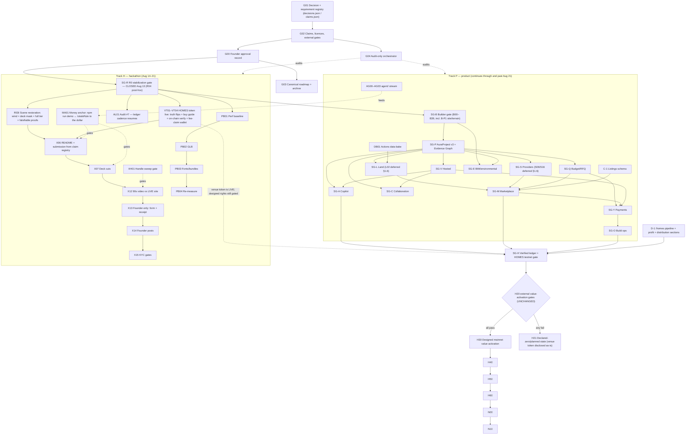

# Aura Homes Full-System Graph v1.2

> **Status: PROPOSED.** Status lives ONLY in the approval record
> (`docs/plans/approvals/`), never in this file — v1.1 wrote "APPROVED" into a
> commit that was not the blob whose hash was approved, which is exactly the
> ambiguity the approval system exists to prevent. This file's hash gets bound
> at approval time; the file itself never claims the verdict.
>
> **Approval phrase:** `Approve Aura Full-System Graph v1.2`.
> A thin "go" is sufficient for execution sequencing but NOT for reversing a
> standing founder mandate — see §6.

**Supersedes:** `2026-08-13-aura-full-system-graph.md` (v1.1). v1.2 is a
**delta revision**: every v1.1 stream, node table, contract rule, rejection
list, and gate definition remains in force except where this document amends
it. The v1.1 node contract (§2), H20 external-gate matrix (§15), rejected-
shortcuts lists (§15/§17), copy rules (§16), and deployment protocol (§21)
are kept verbatim — they are the best instruments this program has.

**What v1.1 got right (kept without change):** the typed `ExecutionNode`
manifest contract with side-effect classes and worker/verifier separation;
the 16-stream decomposition; H20/H21 declared-zero fallback; the §17
classification of the Claude/Fable proposals; append-only static release +
chunk recovery; the R03 evidence discipline (hardware ledgers, 2 consecutive
proofs); `PilotJurisdictionContract`; the Q/Y payment stream; the O/E/C
streams the earlier plan lacked entirely.

---

## 1. Corrections (verified defects in v1.1)

### 1.1 The calendar exists: OKX BuildX AI Season closes August 21, 2026

The word "August 21" appears zero times in v1.1's 1,072 lines, and `SG-X`
(submission) is gated behind `SG-B` — the FULL builder release, a "1–3 week"
wave. That sequencing forfeits the hackathon by construction.

**Amendment:** `SG-X` depends on `G02 & R04` (the DEPLOYED commit), not
`SG-B`. The submission describes what is live at the submitted commit —
that is already the truth rule; the builder wave continues in parallel.
New hard edges: `R04 → X06`, `R04 → X07`, `R04 → X12`, `R04 → X13`.

Calendar-anchored wave table (replaces v1.1 §20 W0 relative dates; W1+ keep
their relative ranges):

| Date | Outcome | Nodes |
|---|---|---|
| Aug 13 (done) | R0 deployed to aurahomes.fun (`92da6b7`), R04 record closed post-hoc | R00–R05A |
| Aug 14 (done) | Scene restored + polished (wind, deck+steps masks, full tier, NetLounge retired; falsifiable motion/deck/parity gates) — releases `3e00c66`, `33e2b3e` | R03I |
| Aug 14 (done) | Token-live truth flips + buy/bridge guide; mint verified on-chain and surfaced; fee-claim wallet published; README + governance registries; 9 hand-off scaffolds | VT01–VT03, X06 (README half) |
| Aug 14 (done) | Audit #7 (fresh context) + all actionable findings fixed; AWG decision propagated + budget toggle; data-bake workflow parked (token lacks workflow scope — founder enables); voice calibration; D-1 dashboard sections — releases `2ee4ee5`, `fe5eb9e` | AL01, BQ-AWG, DB01, D-1 |
| Aug 14 (in flight) | B-P1: schema half shipped (`8ee3ce4`, optional site slot, byte-stability pinned — v3 migration superseded, see the node); UI half executing (Site step, A1 sheet, terrain) | B-P1 |
| Aug 15–16 | Submission copy refresh from the claim registry; X07 deck; NW01 attribution + warmup; PB02–PB04 with before/after vs the PB01 baseline | X06 (submission half), X07, NW01, PB* |
| Aug 16–18 | 90-second video against the LIVE site (founder decided: video AFTER the build waves); Audit #8 due Aug 16 per the resumed cadence | X12, AL02 |
| Aug 19–20 | Full gate sweep; founder reviews video/copy; buffer for repairs | §4 anchors |
| Aug 21 | Founder-only: form submission + X post + KYC gates | X13–X15 |
| Aug 22+ | C-1 listings schema, FD1 shared geometry, remaining B-stream, then v1.1 W2–W8 unchanged | — |
| Standing | VT04 receipts: the fee-claim wallet is published; recognition still waits on the founder's first claim tx | VT04 |

### 1.2 The frozen money anchor returns (v1.1's most dangerous omission)

GRAPH-ENGINEERING rule 7 anchor #3: `agent/` `npm run demo` reconciles the
published cost triplet **to the dollar** against `data/alberta/cost-model.json`
`totalsRule`. v1.1's §19 anchor list omits it — and v1.1's companion brand
guide then shipped a wrong triplet that this one command refutes in ten
seconds (§1.9). The anchor that lapsed after Audit #6 is hereby restored.

**Amendment:** new verification node **MA01** — "the money anchor" — added to
§19's minimum anchors AND to R04-class release nodes' rejection gates. Any
release that publishes a number derived from the cost model runs it.
Anchored triplet: **ex-land $199,100 / $301,280 / $443,900** (Audit #6,
re-derived from raw lines; the totalsRule is frozen).

### 1.3 The audit ledger has an owner again

`docs/AUDIT-LOG.md` (58 KB, Audits #1–#6, 48 h fresh-context cadence) is
orphaned in v1.1: G04/G05/G09 replace the *function* and never name the
artifact. **Amendment:** new node **AL01** — Audit #7 appended by a
fresh-context checker; the cadence lapse (Aug 10 → Aug 14) recorded inside
the audit, not erased; cadence resumes at 48 h through Aug 21, weekly after.

### 1.4 The `agent/` stream exists

Zero v1.1 nodes touch `agent/` (pipeline.ts, brain, memory, MCP server,
`npm run demo`, `mcp:smoke`). It is a shipped, tested subsystem and the
MCP server is the committed power-user path. **Amendment:** new stream
**AG00–AG03**: AG00 keep `npm run demo` green (feeds MA01); AG01 MCP smoke
in the standing gates; AG02 brain/memory documented surface; AG03 defer any
expansion until after W1 (unchanged priority — the stream exists so the
graph can SEE it, not to grow it now).

### 1.5 Founder decision: INTERLEAVE (recorded, graph reshaped)

The founder's recorded Aug 12 decision — hackathon + product tracks run
interleaved daily — contradicts v1.1's strictly serial spine. **Amendment:**
§18 gains the decision row; the spine splits into two tracks joined at
release nodes: Track H (hackathon: R03I, VT, X, AL01, PB, MA01) and Track P
(product: B → P → …, unchanged order). Deploy days end with the full gate
sweep so the site is never broken during the film window.

### 1.6 Founder decision: FREE-TIER ONLY / no partner outreach (recorded)

v1.1's L02 (authorized broker/listing feed agreement) and S06/S16 (outreach
to 5–10 consented manufacturers) require exactly the outreach the founder
ruled out on Aug 12 ("Free tier only", "No paid deals, no partner
outreach"). **Amendment:** §18 gains the decision row; L02, S06, S16 are
re-classed `External gate — deferred pending explicit founder approval`.
Their no-outreach fallbacks stay Adopt: open land datasets, maker-permissioned
photos, link-out records with provenance (the earlier plan's C1).

### 1.7 The HOMES token is LIVE on a third-party venue (new reality)

v1.1's H-stream assumed no token until the full H20 lattice passed. On
Aug 13 the founder launched **$HOMES on XLaunch** (permissionless launchpad,
X Layer mainnet 196): contract `0x642855d557ada1eba8a66014aaff902e6394c0de`,
pair wSPCXx, pool `0xf59d07dfe38807b398f0b4697f187d2f943b06a4`, liquidity in
XLaunch's locker (no withdraw path), 1% venue swap fee (60% of quote side to
creator), 2% launch-window wallet cap venue-enforced. This is a
founder-decided fact, recorded per the precedence rules (§1 of v1.1: "live
chain state" outranks the graph).

**Amendment:** new nodes:

| ID | Job | Class |
|---|---|---|
| **VT01** | Site truth flips: /homes status → live with receipts (address, venue, pool, locker), plain-words band rewritten, proof register resolved rows, risk labels (micro-cap, unaudited factory, pausable wrapper quote asset). | Adopt — shipped with this wave |
| **VT02** | "How to buy HOMES" guide (crypto side only): wallet + chain 196, OKB gas via OKX withdrawal or official bridge, XLaunch Buy panel (verified: takes OKB directly), contract verification. Eco journey untouched. | Adopt — shipped with this wave |
| **VT03** | Verify the live mint on-chain (total supply, actual distribution, holder set) and relabel the 30/10/10/20/30 design as design until reconciled. | remote-read |
| **VT04** | Publish the creator fee-claim wallet + claim receipts BEFORE any venue fee is recognized in the ledger (`reconcileHomesFeeLedger` enforces this at build time). First real property-fund inflow. | External gate — founder wallet action |

**Unchanged:** every H20 gate still guards staking, distributions, trust,
treasury, property rights, and any Aura-AUTHORED contract. H03/H30's designed
token architecture remains the target; the venue token is labelled what it
is — an experiment-tier launch on venue infrastructure. The v1.1 rejected-
shortcuts list stands; "public value launch with US$50 liquidity" is
answered on-page by keeping the Experiment-tier honesty text beside the buy
path. See `docs/MAINNET-DECISION-BRIEF.md` addendum (Aug 13).

### 1.8 Governance hygiene

- **R04 closed** (Aug 13): the remote writes ran before the manifest closed —
  a contract violation now recorded in the manifest's evidence block
  (`verdict: pass-post-hoc`) with production smoke, deployment id, dated
  backups, and rollback coordinates. The rule stands: remote-write nodes
  close their record IN the same run, or the next audit flags it.
- **Repair-limit evasion recorded:** R03 → R03A…R03H is eight renamed repair
  loops against a `repairLimit: 1` contract, with no founder escalation.
  Renaming is not repairing. New rule: a failed node's successor chain counts
  against the SAME repair budget; the third consecutive failure escalates to
  the founder by name.
- **R03's outcome is graded honestly:** its meadow shipped with frozen wind,
  deck-piercing cards, and specs rewritten to bless both (story-quality.spec
  inverted to assert the promotion never happens). R03I repairs this with
  falsifiable gates a rewritten spec cannot dodge: a pixel-motion proof, a
  bin-level deck-placement proof, and a generator↔runtime mask parity test.
- **G01/G02 get artifacts:** `docs/plans/registry/decisions.json` (founder
  decisions with dates, incl. interleave, free-tier, AWG-standard, token
  launch) and `claims.json` (public claims → proof pointers). A prose table
  inside the document being approved is circular; these files are the
  registry X06/X07/X13 generate from.

### 1.9 The brand guide's cost triplet is corrected

`docs/BRAND-VOICE-GUIDE.md` declared the ANCHORED totals
($199,100/$301,280/$443,900 = `cost-model.json` `totalsExLand`, verified to
the dollar by Audit #6) illegal, blessed the stale Audit-#1 stale-build
numbers ($195,250/…/$434,700), and invented a mid figure ($295,680) that
exists nowhere in the repo. Because §16 instructs X06/X07 to derive numbers
from the guide, this poisons the submission unless fixed first. **Amendment:**
the guide's §"CORRECTED" rows are fixed in this wave; MA01 (§1.2) is the
standing gate that makes this class of error a ten-second detection.

### 1.10 AWG: DECIDED Aug 14 (recommended, not mandatory) · concrete doctrine: still undecided

v1.1 §7/§22 folded two reversals of standing founder mandates into the
approval checklist behind the word "go" — insufficient for either. On
**August 14 the founder decided the AWG half explicitly**: *"I want those
for sure. It's not mandatory, but definitely suggested."*

**Resolution (D-2026-08-14-awg-recommended):** AWG is recommended on every
home, not mandatory. The REFERENCE configuration keeps AWG, so the anchored
ex-land triplet ($199,100/$301,280/$443,900) and the money anchor are
unchanged — the `totalsRule` text now says exactly this. A project may
descope AWG; its budget recomputes from its own lines. Follow-up feature
node **BQ-AWG** exposes AWG as a deselectable line in the budget UI.

**The no-concrete half** (site-evidence-based foundation comparison instead
of a universal concrete ban) **remains `PROPOSED — undecided`**; status quo
holds until the founder addresses it by name.

### 1.11 Missing engineering nodes added

| ID | Job | Source |
|---|---|---|
| **PB01** | Day-1 perf baseline artifact: Lighthouse + route table (/ /build /land /budget /homes /roadmap), `@next/bundle-analyzer` behind `ANALYZE=1`. No perf change ships without a before/after pair. | Plan A6 |
| **PB02** | GLB pass: `gltf-transform optimize` on the 6 models; meshopt decoder registration; visually indistinguishable or revert. | Plan A6 |
| **PB03** | Font audit (4 variable families) + bundle treemap discipline (three/r3f off app routes; wagmi/viem only chain surfaces; maplibre only /land). | Plan A6 |
| **PB04** | Re-measure vs PB01; meadow ceilings re-verified. | Plan A6 |
| **XH01** | X-handle sweep gate: grep for retired `@AuraHomesAI`; `layout.tsx` `metadata.twitter.site/creator`; follow-intent affordance intact. | Plan A1/A2 |
| **DB01** | GitHub-Actions scheduled data-bake (cost indexes, open land data, listing metadata + permission-expiry lint) → commits JSON → deploy. No server. | Plan C5 step 1 |
| **B-P1** | Site slot in BuilderDocument v3 (migration + lowest-version share emission), A1 SITE PLAN sheet (already drawn at `sheets.ts:633-790`, never called), `checkSpecAgainstParcel` surfaced, terrain `gradeHeightFt` + per-pile lengths. | Plan B-P1 |
| **C-1** | Listings schema evolution (licensed-photo union, geography, price.numeric, baked records) + provenance lint. Free-tier sources only (§1.6). | Plan C1 |
| **D-1** | /homes remaining AuraBNB sections: property pipeline, profit reconciliation, distribution proof — zero-state honest, receipt-required rule test. | Plan D1 |

These fold the approved-plan workstreams into the graph so ONE document owns
all open work. Their manifests follow the v1.1 node contract before any runs.

---

## 2. Amended master dependency graph

---

## 3. Verification graph — anchor additions

v1.1 §19 stands, plus these minimum anchors:

- **MA01**: `agent/ npm run demo` reconciles ex-land $199,100/$301,280/$443,900
  to the dollar vs `cost-model.json` `totalsRule`. (Restored; was rule 7 #3.)
- **Living wind**: meadow-proof `livingWind` — idle frames continue AND
  meadow-ROI pixels move ≥0.4% between frames 1.2 s apart.
- **Deck occlusion**: zero atlas instances inside the deck rect, walkway
  corridor, or house footprint (bin-level decode, spec-pinned).
- **Mask parity**: generator `clearance`/`terrainHeight` === runtime
  `sampleMeadowClearance`/`sampleTerrainHeight` across a 3,000-point grid.
- **Quality promotion**: `data-scene-quality="full"` after the meadow paints
  on hardware that earns it (story-quality.spec, re-inverted).
- **Token truth**: /homes renders the live contract address + venue links;
  eco journey still mentions HOMES exactly once; no Buy in the More menu;
  `homes-live` spec suite.
- **XH01 handle grep**; **SUBMISSION placeholder check**; Lighthouse delta
  vs PB01.

---

## 4. Copy-suggestions checklist (NOT applied — founder approves per line)

The founder owns the words. Each row is a suggestion with its reason; nothing
here ships until he says so, row by row. (The token-status truth flips are
NOT in this list — those he already ordered.)

| # | Where | Current | Suggested | Why |
|---|---|---|---|---|
| 1 | `roadmap/page.tsx:69` + `homes/page.tsx:85` | "an Airbnb its guests and hosts own" | "a future owner-participating eco-stay network — the Airbnb comparison guests already understand, owned by the people in it" | v1.1 §16 bans the bare phrase until rights exist; this keeps the founder's beloved comparison while labelling it future. Two tests pin the current phrase and would be renegotiated. |
| 2 | `homes/page.tsx:237` | "From one transparent rental to a decentralized stay network." (bare present-tense heading) | "From one transparent rental toward a decentralized stay network." | One word ("toward") moves it from claim to direction. |
| 3 | `copy.ts:177/275` | "user-owned Airbnb for eco stays" (×2) | keep once (crypto beat), soften the eco end-sheet instance per #1 | Same §16 rule; the eco journey is the non-crypto audience. |
| 4 | XLaunch token-page ABOUT (venue site, founder-editable) | "HOMES is a planned token…" (mirrors old copy.ts:260) | "HOMES is live on X Layer. The planned decentralized property trust routes 60% of recognized fees toward a first eco home — receipts published at aurahomes.fun/homes." | The venue page now contradicts the site the founder just updated; only he can edit it there. |
| 5 | `faq:92` "How does Aura make money?" | "Today it does not" | add one sentence disclosing the venue's 60% creator fee share accrues to the founder wallet | The claim is now false as stated; disclosure beats deletion. |
| 6 | Brand guide §8 suggested rewrites | pending | approve/reject the guide's §8 rewrite table in one sitting | It has waited since Aug 13; several rows overlap rows above. |

---

## 5. Founder decision registry additions (→ `decisions.json`)

| Date | Decision | Standing |
|---|---|---|
| 2026-08-12 | Interleave hackathon + product tracks daily | Active (§1.5) |
| 2026-08-12 | Free-tier data only; no paid deals; no partner outreach | Active (§1.6) |
| 2026-08-07 | AWG standard on every home; frozen totalsRule | Active — v1.1's contrary amendment UNDECIDED (§1.10) |
| 2026-08-13 | HOMES launched on XLaunch (venue token, wSPCXx pair) | Fact recorded (§1.7); supersedes "SPACEX pool blocked" policy |
| 2026-08-13 | Scene: keep new grass look; restore wind, deck mask, effects; keep all copy/editor changes | Executed in R03I |
| 2026-08-13 | Buy button + how-to-buy/bridge guide on the crypto side | Executed in VT02 |

## 6. Approval checklist

Approving v1.2 means agreeing to: the calendar (§1.1), the restored money
anchor as a hard gate (§1.2), the audit-ledger cadence (§1.3), the two-track
interleave (§1.5), the deferred-outreach re-classing (§1.6), the venue-token
recording with H20 unchanged (§1.7), the governance rules (§1.8), and the
folded engineering nodes (§1.11).

**Explicitly NOT decided by approving v1.2** (each needs its own line from
the founder): the AWG/no-concrete amendments (§1.10), every row of the copy
checklist (§4), the pilot jurisdiction (unchanged from v1.1 — needs a dated
decision node before W3), and VT04's fee-claim wallet action.
