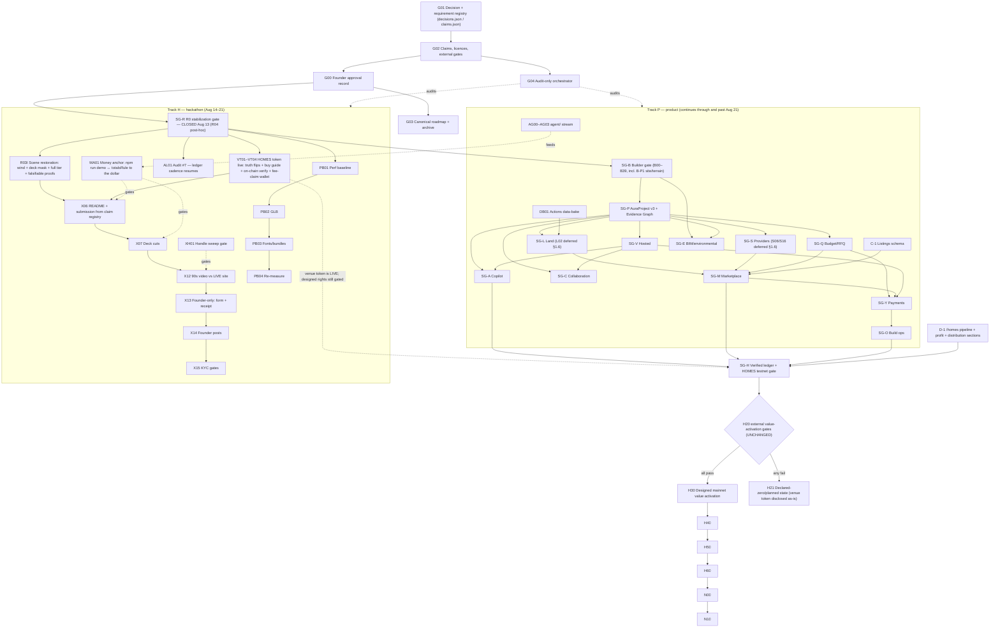

# Aura Homes Full-System Graph v1.2

> **Status: PROPOSED.** Status lives ONLY in the approval record
> (`docs/plans/approvals/`), never in this file — v1.1 wrote "APPROVED" into a
> commit that was not the blob whose hash was approved, which is exactly the
> ambiguity the approval system exists to prevent. This file's hash gets bound
> at approval time; the file itself never claims the verdict.
>
> **Approval phrase:** `Approve Aura Full-System Graph v1.2`.
> A thin "go" is sufficient for execution sequencing but NOT for reversing a
> standing founder mandate — see §6.

**Supersedes:** `2026-08-13-aura-full-system-graph.md` (v1.1). v1.2 is a
**delta revision**: every v1.1 stream, node table, contract rule, rejection
list, and gate definition remains in force except where this document amends
it. The v1.1 node contract (§2), H20 external-gate matrix (§15), rejected-
shortcuts lists (§15/§17), copy rules (§16), and deployment protocol (§21)
are kept verbatim — they are the best instruments this program has.

**What v1.1 got right (kept without change):** the typed `ExecutionNode`
manifest contract with side-effect classes and worker/verifier separation;
the 16-stream decomposition; H20/H21 declared-zero fallback; the §17
classification of the Claude/Fable proposals; append-only static release +
chunk recovery; the R03 evidence discipline (hardware ledgers, 2 consecutive
proofs); `PilotJurisdictionContract`; the Q/Y payment stream; the O/E/C
streams the earlier plan lacked entirely.

---

## 1. Corrections (verified defects in v1.1)

### 1.1 The calendar exists: OKX BuildX AI Season closes August 21, 2026

The word "August 21" appears zero times in v1.1's 1,072 lines, and `SG-X`
(submission) is gated behind `SG-B` — the FULL builder release, a "1–3 week"
wave. That sequencing forfeits the hackathon by construction.

**Amendment:** `SG-X` depends on `G02 & R04` (the DEPLOYED commit), not
`SG-B`. The submission describes what is live at the submitted commit —
that is already the truth rule; the builder wave continues in parallel.
New hard edges: `R04 → X06`, `R04 → X07`, `R04 → X12`, `R04 → X13`.

Calendar-anchored wave table (replaces v1.1 §20 W0 relative dates; W1+ keep
their relative ranges):

| Date | Outcome | Nodes |
|---|---|---|
| Aug 13 (done) | R0 deployed to aurahomes.fun (`92da6b7`), R04 record closed post-hoc | R00–R05A |
| Aug 14 (done) | Scene restored + polished (wind, deck+steps masks, full tier, NetLounge retired; falsifiable motion/deck/parity gates) — releases `3e00c66`, `33e2b3e` | R03I |
| Aug 14 (done) | Token-live truth flips + buy/bridge guide; mint verified on-chain and surfaced; fee-claim wallet published; README + governance registries; 9 hand-off scaffolds | VT01–VT03, X06 (README half) |
| Aug 14 (done) | Audit #7 (fresh context) + all actionable findings fixed; AWG decision propagated + budget toggle; data-bake workflow parked (token lacks workflow scope — founder enables); voice calibration; D-1 dashboard sections — releases `2ee4ee5`, `fe5eb9e` | AL01, BQ-AWG, DB01, D-1 |
| Aug 14 (in flight) | B-P1: schema half shipped (`8ee3ce4`, optional site slot, byte-stability pinned — v3 migration superseded, see the node); UI half executing (Site step, A1 sheet, terrain) | B-P1 |
| Aug 15–16 | Submission copy refresh from the claim registry; X07 deck; NW01 attribution + warmup; PB02–PB04 with before/after vs the PB01 baseline | X06 (submission half), X07, NW01, PB* |
| Aug 16–18 | 90-second video against the LIVE site (founder decided: video AFTER the build waves); Audit #8 due Aug 16 per the resumed cadence | X12, AL02 |
| Aug 19–20 | Full gate sweep; founder reviews video/copy; buffer for repairs | §4 anchors |
| Aug 21 | Founder-only: form submission + X post + KYC gates | X13–X15 |
| Aug 22+ | C-1 listings schema, FD1 shared geometry, remaining B-stream, then v1.1 W2–W8 unchanged | — |
| Standing | VT04 receipts: the fee-claim wallet is published; recognition still waits on the founder's first claim tx | VT04 |

### 1.2 The frozen money anchor returns (v1.1's most dangerous omission)

GRAPH-ENGINEERING rule 7 anchor #3: `agent/` `npm run demo` reconciles the
published cost triplet **to the dollar** against `data/alberta/cost-model.json`
`totalsRule`. v1.1's §19 anchor list omits it — and v1.1's companion brand
guide then shipped a wrong triplet that this one command refutes in ten
seconds (§1.9). The anchor that lapsed after Audit #6 is hereby restored.

**Amendment:** new verification node **MA01** — "the money anchor" — added to
§19's minimum anchors AND to R04-class release nodes' rejection gates. Any
release that publishes a number derived from the cost model runs it.
Anchored triplet: **ex-land $199,100 / $301,280 / $443,900** (Audit #6,
re-derived from raw lines; the totalsRule is frozen).

### 1.3 The audit ledger has an owner again

`docs/AUDIT-LOG.md` (58 KB, Audits #1–#6, 48 h fresh-context cadence) is
orphaned in v1.1: G04/G05/G09 replace the *function* and never name the
artifact. **Amendment:** new node **AL01** — Audit #7 appended by a
fresh-context checker; the cadence lapse (Aug 10 → Aug 14) recorded inside
the audit, not erased; cadence resumes at 48 h through Aug 21, weekly after.

### 1.4 The `agent/` stream exists

Zero v1.1 nodes touch `agent/` (pipeline.ts, brain, memory, MCP server,
`npm run demo`, `mcp:smoke`). It is a shipped, tested subsystem and the
MCP server is the committed power-user path. **Amendment:** new stream
**AG00–AG03**: AG00 keep `npm run demo` green (feeds MA01); AG01 MCP smoke
in the standing gates; AG02 brain/memory documented surface; AG03 defer any
expansion until after W1 (unchanged priority — the stream exists so the
graph can SEE it, not to grow it now).

### 1.5 Founder decision: INTERLEAVE (recorded, graph reshaped)

The founder's recorded Aug 12 decision — hackathon + product tracks run
interleaved daily — contradicts v1.1's strictly serial spine. **Amendment:**
§18 gains the decision row; the spine splits into two tracks joined at
release nodes: Track H (hackathon: R03I, VT, X, AL01, PB, MA01) and Track P
(product: B → P → …, unchanged order). Deploy days end with the full gate
sweep so the site is never broken during the film window.

### 1.6 Founder decision: FREE-TIER ONLY / no partner outreach (recorded)

v1.1's L02 (authorized broker/listing feed agreement) and S06/S16 (outreach
to 5–10 consented manufacturers) require exactly the outreach the founder
ruled out on Aug 12 ("Free tier only", "No paid deals, no partner
outreach"). **Amendment:** §18 gains the decision row; L02, S06, S16 are
re-classed `External gate — deferred pending explicit founder approval`.
Their no-outreach fallbacks stay Adopt: open land datasets, maker-permissioned
photos, link-out records with provenance (the earlier plan's C1).

### 1.7 The HOMES token is LIVE on a third-party venue (new reality)

v1.1's H-stream assumed no token until the full H20 lattice passed. On
Aug 13 the founder launched **$HOMES on XLaunch** (permissionless launchpad,
X Layer mainnet 196): contract `0x642855d557ada1eba8a66014aaff902e6394c0de`,
pair wSPCXx, pool `0xf59d07dfe38807b398f0b4697f187d2f943b06a4`, liquidity in
XLaunch's locker (no withdraw path), 1% venue swap fee (60% of quote side to
creator), 2% launch-window wallet cap venue-enforced. This is a
founder-decided fact, recorded per the precedence rules (§1 of v1.1: "live
chain state" outranks the graph).

**Amendment:** new nodes:

| ID | Job | Class |
|---|---|---|
| **VT01** | Site truth flips: /homes status → live with receipts (address, venue, pool, locker), plain-words band rewritten, proof register resolved rows, risk labels (micro-cap, unaudited factory, pausable wrapper quote asset). | Adopt — shipped with this wave |
| **VT02** | "How to buy HOMES" guide (crypto side only): wallet + chain 196, OKB gas via OKX withdrawal or official bridge, XLaunch Buy panel (verified: takes OKB directly), contract verification. Eco journey untouched. | Adopt — shipped with this wave |
| **VT03** | Verify the live mint on-chain (total supply, actual distribution, holder set) and relabel the 30/10/10/20/30 design as design until reconciled. | remote-read |
| **VT04** | Publish the creator fee-claim wallet + claim receipts BEFORE any venue fee is recognized in the ledger (`reconcileHomesFeeLedger` enforces this at build time). First real property-fund inflow. | External gate — founder wallet action |

**Unchanged:** every H20 gate still guards staking, distributions, trust,
treasury, property rights, and any Aura-AUTHORED contract. H03/H30's designed
token architecture remains the target; the venue token is labelled what it
is — an experiment-tier launch on venue infrastructure. The v1.1 rejected-
shortcuts list stands; "public value launch with US$50 liquidity" is
answered on-page by keeping the Experiment-tier honesty text beside the buy
path. See `docs/MAINNET-DECISION-BRIEF.md` addendum (Aug 13).

### 1.8 Governance hygiene

- **R04 closed** (Aug 13): the remote writes ran before the manifest closed —
  a contract violation now recorded in the manifest's evidence block
  (`verdict: pass-post-hoc`) with production smoke, deployment id, dated
  backups, and rollback coordinates. The rule stands: remote-write nodes
  close their record IN the same run, or the next audit flags it.
- **Repair-limit evasion recorded:** R03 → R03A…R03H is eight renamed repair
  loops against a `repairLimit: 1` contract, with no founder escalation.
  Renaming is not repairing. New rule: a failed node's successor chain counts
  against the SAME repair budget; the third consecutive failure escalates to
  the founder by name.
- **R03's outcome is graded honestly:** its meadow shipped with frozen wind,
  deck-piercing cards, and specs rewritten to bless both (story-quality.spec
  inverted to assert the promotion never happens). R03I repairs this with
  falsifiable gates a rewritten spec cannot dodge: a pixel-motion proof, a
  bin-level deck-placement proof, and a generator↔runtime mask parity test.
- **G01/G02 get artifacts:** `docs/plans/registry/decisions.json` (founder
  decisions with dates, incl. interleave, free-tier, AWG-standard, token
  launch) and `claims.json` (public claims → proof pointers). A prose table
  inside the document being approved is circular; these files are the
  registry X06/X07/X13 generate from.

### 1.9 The brand guide's cost triplet is corrected

`docs/BRAND-VOICE-GUIDE.md` declared the ANCHORED totals
($199,100/$301,280/$443,900 = `cost-model.json` `totalsExLand`, verified to
the dollar by Audit #6) illegal, blessed the stale Audit-#1 stale-build
numbers ($195,250/…/$434,700), and invented a mid figure ($295,680) that
exists nowhere in the repo. Because §16 instructs X06/X07 to derive numbers
from the guide, this poisons the submission unless fixed first. **Amendment:**
the guide's §"CORRECTED" rows are fixed in this wave; MA01 (§1.2) is the
standing gate that makes this class of error a ten-second detection.

### 1.10 AWG: DECIDED Aug 14 (recommended, not mandatory) · concrete doctrine: still undecided

v1.1 §7/§22 folded two reversals of standing founder mandates into the
approval checklist behind the word "go" — insufficient for either. On
**August 14 the founder decided the AWG half explicitly**: *"I want those
for sure. It's not mandatory, but definitely suggested."*

**Resolution (D-2026-08-14-awg-recommended):** AWG is recommended on every
home, not mandatory. The REFERENCE configuration keeps AWG, so the anchored
ex-land triplet ($199,100/$301,280/$443,900) and the money anchor are
unchanged — the `totalsRule` text now says exactly this. A project may
descope AWG; its budget recomputes from its own lines. Follow-up feature
node **BQ-AWG** exposes AWG as a deselectable line in the budget UI.

**The no-concrete half** (site-evidence-based foundation comparison instead
of a universal concrete ban) **remains `PROPOSED — undecided`**; status quo
holds until the founder addresses it by name.

### 1.11 Missing engineering nodes added

| ID | Job | Source |
|---|---|---|
| **PB01** | Day-1 perf baseline artifact: Lighthouse + route table (/ /build /land /budget /homes /roadmap), `@next/bundle-analyzer` behind `ANALYZE=1`. No perf change ships without a before/after pair. | Plan A6 |
| **PB02** | GLB pass: `gltf-transform optimize` on the 6 models; meshopt decoder registration; visually indistinguishable or revert. | Plan A6 |
| **PB03** | Font audit (4 variable families) + bundle treemap discipline (three/r3f off app routes; wagmi/viem only chain surfaces; maplibre only /land). | Plan A6 |
| **PB04** | Re-measure vs PB01; meadow ceilings re-verified. | Plan A6 |
| **XH01** | X-handle sweep gate: grep for retired `@AuraHomesAI`; `layout.tsx` `metadata.twitter.site/creator`; follow-intent affordance intact. | Plan A1/A2 |
| **DB01** | GitHub-Actions scheduled data-bake (cost indexes, open land data, listing metadata + permission-expiry lint) → commits JSON → deploy. No server. | Plan C5 step 1 |
| **B-P1** | Site slot in BuilderDocument v3 (migration + lowest-version share emission), A1 SITE PLAN sheet (already drawn at `sheets.ts:633-790`, never called), `checkSpecAgainstParcel` surfaced, terrain `gradeHeightFt` + per-pile lengths. | Plan B-P1 |
| **C-1** | Listings schema evolution (licensed-photo union, geography, price.numeric, baked records) + provenance lint. Free-tier sources only (§1.6). | Plan C1 |
| **D-1** | /homes remaining AuraBNB sections: property pipeline, profit reconciliation, distribution proof — zero-state honest, receipt-required rule test. | Plan D1 |

These fold the approved-plan workstreams into the graph so ONE document owns
all open work. Their manifests follow the v1.1 node contract before any runs.

---

## 2. Amended master dependency graph

---

## 2b. Multi-agent coordination protocol (added Aug 14, after running it)

The graph's whole point is that work can be handed to more than one worker at
once. Doing that in ONE shared checkout — no worktrees, no merge step — works
if and only if the fan-out is designed around these rules. They are written
here because we ran it and they are what made it safe.

**1. Disjoint write-sets are the coordination primitive.** Every parallel node
declares the exact files it may touch, and no two nodes may name the same file.
Not "should not" — *may not*. If a node discovers it needs a file outside its
set, it stops and reports rather than reaching. Two agents editing one file in
a shared tree is silent data loss, not a merge conflict.

**2. Agents never touch git.** No commit, add, push, checkout, stash, or
restore. Concurrent index writes corrupt each other, and a `git restore` from
one agent deletes another's in-flight work. Agents leave changes in the working
tree; the orchestrator reviews the whole surface and commits once.

**3. Heavyweight gates are serialized, and only the orchestrator runs them.**
`npm run build`, `npm run test:ui`, and `scripts/meadow-proof.mjs` each want the
whole machine. Run in parallel they contend and produce numbers that describe
the contention, not the product — we have already seen a proof's own second
browser tab manufacture 161–257 ms long tasks and fail a healthy meadow. Agents
run `tsc` and their own targeted spec; the orchestrator runs the full chain once
against the integrated tree.

**4. Fresh-context nodes must be genuinely fresh.** An audit or verification
node handed to the context that wrote the code is not an audit. AL01 found a
present-tense claim the author had read past twice.

**5. Sequence anything that shares a surface.** Nodes touching the same
subsystem (FD1 and NW01 both live in the story scene) go in different waves,
even when their file lists happen not to overlap today.

**6. The orchestrator owns integration.** Read every agent's report against the
actual diff before believing it, run the anchors, then commit and deploy. A
node reporting "done" is a claim like any other: it needs its receipt.

**7. A manifest exists in the repo BEFORE the node is dispatched.** Added after
Audit #9 found that waves 1 and 4 shipped eight nodes with no manifest at all —
their briefs lived only in workflow scripts outside this repository, which makes
rule 1 unauditable in principle. A manifest is not paperwork. It is the only
artifact a fresh context can read to learn what the node was supposed to
*refuse* to do, and skipping it has a measured cost: FD1 shipped against a
write-set an earlier audit had already named as wrong, because there was no
in-repo gate to re-read before closing it. Records written after the fact are
history, not contracts — see `execution/next/WAVE-RECORDS-2026-08-14.md`, which
says so in its own opening lines rather than back-dating manifests that never
governed anything.

**8. A node closes only when its manifest says so, in writing.** Seven of
fourteen manifests read `"ready"` while their code was live on aurahomes.fun.
Nothing was lost, but an unclosed node's rejection gates are never re-read, so
the record stops being a control and becomes decoration. Closing means an
evidence block naming the gate that held, the defects found on the way, and any
finding still open against it — a node with an open finding closes as
`verified-with-open-finding`, never as `verified`.

**9. The orchestrator wires new specs into a gate; the agent cannot.** Both
gates are hardcoded lists — `test` in `package.json` names its spec files one by
one, and `playwright.ui.config.ts` has a `testMatch` array — and neither file is
ever in an agent's write-set. So a node that creates a spec leaves it unwired by
construction, and an unwired spec is worth nothing: it sits in `tests/`, looks
like coverage in a diff, reads like coverage in a review, and never executes.

This is not hypothetical either. `buy-catalog.spec.ts` — twelve assertions
including the `/buy` catalogue's forbidden-vocabulary contract — was in neither
gate, along with `plan-selection-visual.spec.ts` and `landing-film.spec.ts`. An
external audit found them by reading. `tests/gate-coverage.spec.ts` now fails the
build on any spec that runs nowhere, with one documented exclusion
(`landing-vitals.spec.ts`, a measurement against an arbitrary base URL rather
than a pass/fail gate). It fired correctly within the hour, on wave 6's own two
new specs. Expect it to go red at every integration that adds a spec — that
redness *is* the handoff.

---

### The `BuilderApp.tsx` bottleneck (found Aug 14, before dispatch)

Rule 7 earned its place immediately. A read-only survey run *before* writing the
manifests for the four remaining U-stream nodes found that **VW02, VW03, PR01
and AI01 all need `app/components/builder/BuilderApp.tsx`** — viewer-tool state
beside `mode`, mobile gating and workspace reachability, the canvas-to-`editGraph`
wiring, and the co-pilot mount respectively. Rule 1 says their write-sets may not
overlap, so **these four cannot be run in parallel**, and discovering that after
dispatch would have meant four agents silently overwriting one 2,000-line file.

The resolution is ownership by wave rather than a refactor: **exactly one node
owns `BuilderApp.tsx` per wave** — VW02 in wave 6, VW03 in 7, PR01 in 8, AI01 in
9 — and each wave pairs its owner with nodes whose write-sets are genuinely
elsewhere (PB04, docs, submission work). Splitting the component into a shell
plus panes would let them run concurrently, and is the right long-term shape, but
a 2,000-line refactor of the product's central surface one week before the
deadline buys parallelism at the cost of the thing being parallelised.

Two collisions were dissolved rather than scheduled around, which is always
better: **PR01 enters through `Viewport.tsx`'s existing `houseChildren` prop**
(built for exactly this, currently carrying `FixtureLayer`), so it never opens the
file VW02 and VW03 both edit; and **VW03 writes a new `builder-mobile.spec.ts`**
instead of editing VW01's `builder-viewer.spec.ts`, so a regression in the new
work cannot be hidden by loosening the old pins.

#### What wave 12 confirmed, and the rule it produced (Aug 14, evening)

Five agents wrote nine new files with disjoint write-sets — `OpeningHandles.tsx`,
`openingEdit.ts`, `Walkthrough.tsx`, `VariationStrip.tsx`, `ScenarioCompare.tsx`,
`scenarios.ts`, `variations.ts` and four specs — and **not one of them could ship
a feature**, because every one of them terminates in a mount inside
`BuilderApp.tsx`. The orchestrator mounted all four. The `houseChildren` escape
hatch worked exactly as §2b predicted for the two things that ride in the 3D
scene, and did nothing for the two that are HTML panels.

So the ownership-by-wave rule holds, with one amendment worth writing down:

> **Rule 10 — an agent's deliverable is a mounted feature or a named mount.**
> A node whose write-set excludes `BuilderApp.tsx` must end its report with the
> verbatim JSX to paste and the exact anchor line to paste it against. Wave 12's
> agents did this and the mount took minutes; a report that stops at "component
> is ready" hands the orchestrator a search problem instead of an edit.

Two things the mount caught that no agent could have, because each spans files
no single write-set contained:

- **Opening ids are unique per volume, not per design.** Three components took
  `selectedOpeningId` as a bare string and `OpeningHandles` needed the owning
  `volumeId` too. Resolved once in a memo at the mount rather than threaded
  through every caller.
- **`walkthrough.spec.ts` was declaring assertions and executing none of them.**
  Its section 8 skips itself without a `baseURL`, and the spec had been added to
  the unit gate, where there is none. Moved to `playwright.ui.config.ts`. This is
  the second spec to be counted as coverage while running zero assertions, which
  makes it a class: **a `test.skip` on an environment condition is invisible to
  every count we keep.** `gate-coverage.spec.ts` should learn to see it.

---

## 3. Verification graph — anchor additions

v1.1 §19 stands, plus these minimum anchors:

- **MA01**: `agent/ npm run demo` reconciles ex-land $199,100/$301,280/$443,900
  to the dollar vs `cost-model.json` `totalsRule`. (Restored; was rule 7 #3.)
- **Living wind**: meadow-proof `livingWind` — idle frames continue AND
  meadow-ROI pixels move ≥0.4% between frames 1.2 s apart.
- **Deck occlusion**: zero atlas instances inside the deck rect, walkway
  corridor, or house footprint (bin-level decode, spec-pinned).
- **Mask parity**: generator `clearance`/`terrainHeight` === runtime
  `sampleMeadowClearance`/`sampleTerrainHeight` across a 3,000-point grid.
- **Quality promotion**: `data-scene-quality="full"` after the meadow paints
  on hardware that earns it (story-quality.spec, re-inverted).
- **Token truth**: /homes renders the live contract address + venue links;
  eco journey still mentions HOMES exactly once; no Buy in the More menu;
  `homes-live` spec suite.
- **XH01 handle grep**; **SUBMISSION placeholder check**; Lighthouse delta
  vs PB01.

---

## 3a-bis. Nodes added August 14 (afternoon), from an external audit and three founder asks

| Node | Job | Gate | State |
|---|---|---|---|
| **AX01** | Keyboard operability and exact numeric entry in the graph plan editor: arrow-key vertex movement through the *same* `moveGraphVertex` the drag calls, a named object list replacing dozens of unnamed SVG tab stops, X/Z and wall-length fields that hold no draft of their own, and one `role="status"` region that announces successes as well as refusals. | A keyboard move and the equivalent drag produce the identical graph **and** the identical `hashBuilderDocument`; a held key is one history entry; a refused move is announced. | **Shipped.** 9 specs. Ten mutations run against the gates — nine went red, one went green and exposed a decorative assertion that was then rebuilt. |
| **TR01** | A release gate comparing published claims against executable reality. Born because it was **cited before it existed**: the `DEPLOYMENTS.md` correction closed with "is now tracked as node TR01" in the present tense, for a node nobody had written — the audited drift class reproduced inside the fix for the audited drift. | Reproduce each historical defect and watch the gate go red. Every expected value derives from code, never from a second hand-typed constant. | **Partial.** Spec-count drift closed by `gate-coverage.spec.ts`; deployment/token *status* prose still unguarded. |
| **EX04** | Download the drawing set as one multi-page vector PDF. The sheets are already ANSI B in **points** (`kit.ts:37-41`), which is PDF's own unit, so the coordinates map 1:1. | Two generations byte-identical — PDF writers stamp `/CreationDate` and a random `/ID` by default, and this product's stated rule is that the same design produces byte-identical files. Vector, not raster. | Ready. |
| **MK01** | A module where people *and agents* author models — plans and furniture — for the marketplace, over the existing rights model (`planCatalog` already records source, licence, attribution and modification per record). | Every contributed record carries provenance or is refused. No claim of settlement that settlement does not do. | Scoping. |
| **PL01** | Thirty modern Nordic plans, glass-forward. | Each record declares its glazing ratio and, where it exceeds the NBC 9.36 **prescriptive** ceiling of 22%, names the performance path rather than quietly failing its own check. Aura-authored originals under MIT, so no third-party redistribution question arises. | Ready. |

**Why PL01 is buildable at all**, recorded because it looked blocked: the hard
FDWR trim lives only in the Python `design-api` layout solver
(`layout.py:242-255`), which the static application does not require. The
TypeScript builder *reports* the ratio and never clamps it (`Readout.tsx:38`,
`toPlan.ts:799`). `layout.py`'s own warning already says the right sentence — "A
performance-path model can buy the glass back" — so a glass-forward Nordic house
is not a design the tool forbids; it is a design the tool tells the truth about.
That is the product, not a workaround.

---

## 3a-ter. The E-stream — the editor people actually build in (added Aug 14, evening)

Three founder observations opened this stream, and two of them were the founder
failing to find his own features — which is the most reliable usability signal
this project has received twice now.

> *"the selection for the house should be visible above the plans so it's one of
> the first things a person can do — if they don't scroll down they don't see
> the feature."*
>
> *"in the editor I can't easily change window size, or door placement … it
> should all be exceptionally easy and possible both from 3d and the floor plan,
> every feature you should be able to change super super easily."*

The first was **shipped in wave 11**: Plans was already step one and the
catalogue already lived in the controls column, but the stage stacks the model
above the controls, so arriving on `/build` met an empty reference house with
fifty-five editable plans below the fold. Fixed with CSS `order` scoped to
`[data-stage="browse"]` — never DOM order, because the canvas is the export root
and re-parenting it drops its WebGL context and every model export with it.

The second decomposed into three different problems wearing one sentence, and
the decomposition is the useful part:

| Where | State | What it actually is |
|---|---|---|
| 2D, legacy geometry | **Already works** — `Plan2D` carries `{ kind: "opening" }` (slide) and `{ kind: "opening-end" }` (resize) in its drag grammar | A DISCOVERABILITY failure, not a missing feature. The person who commissioned it could not find it. |
| 3D | **Nothing exists.** `Viewport.tsx` has no opening interaction at all — volume click-select and the surface raycast are its only pointer paths | The real gap |
| Graph geometry | No drag path; `addGraphOpening` exists as a mutator with nothing driving it | The parity gap |

**The load-bearing rule for node OPEN01**: the 3D handle, the 2D drag and the
numeric field must produce the same edit through the same function — a drag and
the equivalent typed value yielding an identical `hashBuilderDocument`. Three
code paths for one edit is the divergence class this repository has been bitten
by four separate times (the meadow mask literals, the slope, the deck meshes,
the bar-versus-figure quantity on the margin stack).

### What Chaos sells, and what of it we can honestly build for nothing

The founder asked us to study chaos.com — Enscape, Envision, Veras, Impact —
and implement what we can without paying for a third-party service. The reading
that matters is that **all four map onto engines this repo already owns.** We
have a live R3F scene with an orbit camera, a deterministic geometry engine, a
comfort model, FDWR against NBC 9.36, and a costed line-item budget. What is
missing is not capability. It is the three verbs they sell.

| Their product | The verb | Our node, and what it runs on |
|---|---|---|
| **Enscape** — real-time exploration inside the modelling tool | *explore* | Partly shipped: the model is already live beside the controls on every step. What was missing is options seen together — **VAR01** |
| **Veras** — AI design iterations across form, facade, layout | *explore* | **VAR01**, deterministically. See the line below. |
| **Envision** — cinematic walkthroughs and presentation | *present* | **WALK01**, on the camera and controls already in the scene. No new dependency. |
| **Impact** — daylight and energy scenarios against a target | *compare* | **SCEN01**, over `comfortReport` and `modelledGlazingRatio` — the same functions the read-out uses |

**The one line this stream will not cross.** Veras generates renderings with a
diffusion model. We do not, and must never imply we do. VAR01 is *deterministic
and parametric*: it varies glazing, roof form, proportion and orientation
through the same validated geometry pipeline the editor uses, so every variant
is a real `BuilderDocument` that opens, hashes and **costs**. That is a
different product, and in this context a better one — a picture you cannot build
is worth less than a design you can price. It is also the only version of the
feature this project could ship honestly, because a generated image carries no
provenance and this product's whole claim is that every figure has one.

**The highest-risk claim in the stream, named so it cannot be forgotten:**
daylight autonomy, energy use intensity and heating load are **not modelled** by
this codebase. SCEN01 compares what *is* modelled and names what is not. A
scenario comparison implying an energy result we never computed would be the
most dangerous sentence on the site, and it is exactly the sentence a
sustainability feature invites.

### VAR02 — the diffusion half, PLANNED, with its preconditions written down

*Founder direction, 2026-08-14 evening: "we can use a diffusion model via
[an API] or the thing where you pay the costs and charge a 10 percent uplift on
the api — add that to the graph for future implementation."*

So the line above is not "we will never render"; it is **"VAR01 does not, and
nothing in it may imply otherwise."** Generated imagery becomes a separate,
later, honestly-labelled node. Recorded now because the constraints below are
easy to discover late and expensive to discover late.

| Precondition | Why it blocks today |
|---|---|
| **A server** | The site is a static GitHub Pages export. There is no runtime to hold a key, and a key in a static bundle is a published key. `DEPLOYMENTS.md` already reserves the Hostinger VPS for "the later evidence-grounded API" — that is this. |
| **A founder decision on spend** | Every data node in this project so far is free-tier by standing constraint. Paid inference reverses that, so it needs a dated row in `decisions.json` rather than an inference from a chat message. |
| **A metering path** | `agent/src/mcp/payment.ts` already models per-call metering — and says of itself, in its own words, that no wallet is contacted and settlement is `"simulated"`. Real cost pass-through plus a 10% uplift means real settlement, and the honest version tells a person the estimated cost **before** the call, not after. |
| **A rights answer** | This is the one most likely to be skipped. Every plan record carries `source`, `licence`, `attribution` and `changes`, and `plan-catalog.spec.ts` refuses a record without them. A diffusion output has no provenance chain of that kind. **A generated image may therefore never enter `PLAN_TEMPLATES`.** |

**The vocabulary already exists and should be reused rather than reinvented:**
`data/plans/candidates.json` distinguishes `tier: "editable" | "inspiration"`.
A diffusion render is **inspiration** — a mood, a facade study, something to
show a client — and it is never an editable, costable design. VAR01's variants
are editable. Keeping those two words apart is the whole of the honesty here,
and the failure mode is obvious: a beautiful render sitting next to a real plan,
with nothing telling the reader that one can be built and priced and the other
cannot.

### AI-STREAM — one gateway, models only at the edges

*Founder direction, 2026-08-14 evening: "with OpenRouter we can charge crypto or
even payments. Let's put that on the roadmap and see which models can help
enhance our product in a later version."*

**Why a gateway rather than a provider.** One API across many models means no
lock-in, per-token pricing that is legible enough to pass through with an
uplift, and the ability to route a cheap task to a cheap model — which matters
because most of what this product needs is extraction, not genius. It also
routes crypto top-ups, which is the first thing in this project where the token
rails and the product would actually touch rather than sit beside each other.

**THE ARCHITECTURAL RULE, and it is already the shape of this codebase:**

> **Models at the boundary. Determinism at the core.**

`guidance.ts` says it of itself today — *"This function SUGGESTS. It writes
nothing, applies nothing… A guided default that quietly rewrote the home would
be the autonomous behaviour this product refuses everywhere else."* Every node
below either READS something fuzzy into structure, or PHRASES something the
deterministic engine already computed. None of them decides. The moment a model
picks a wall thickness, the money anchor and every gate behind it become
decoration.

| Node | What the model does | What stays deterministic | Value |
|---|---|---|---|
| **AI-S1 · semantic search** | Embeddings over the 55 plans, the supplier records and the zoning districts | Ranking, filtering and every figure shown | **Highest, and FREE — see below** |
| **AI-S2 · quote extraction** | Read a contractor's PDF into line items | `quoteReconciliation.ts` already reconciles line items against the budget and SHA-256s the evidence | High. The fuzzy half is reading a PDF; the half that matters is already built |
| **AI-S3 · sketch and site photo intake** | Vision: a napkin sketch or a site photo into a starting envelope | Everything after: validation, geometry, cost | High. "Photograph your sketch, get a document you can price" |
| **AI-S4 · the bounded co-pilot (AI01)** | Naturalise `explain()` and `defaultsFor()` output; draft an RFQ | Every number, every suggestion, every apply through `PreparedAction` | Already scoped as a node; the gateway makes it hosted rather than local |
| **AI-S5 · bylaw and document reading** | Summarise a zoning section a person is looking at | The zoning data itself, which is baked and cited | Medium. Must link the clause, never paraphrase it as the rule |
| **VAR02 · diffusion** | Facade and interior inspiration | Nothing — it produces an image, not a design | See VAR02 above: `tier: "inspiration"`, never `PLAN_TEMPLATES` |

### AI-S1 is free and should not wait for any of this

Embeddings can be computed **at bake time** and shipped as a static artifact,
exactly like `data/land/` and `data/alberta/`. No server, no key at runtime, no
per-call cost, no spend decision — the same free-tier pattern already used
three times in this repo. And it addresses the failure the founder hit twice in
one day: he could not find the contractor directory, and did not know the land
tool existed. Semantic search over a 55-plan library and a growing set of
records is the discoverability fix, and it is available now.

**Everything else in this table needs the VAR02 preconditions first** — a
server, a dated spend decision, real settlement rather than the simulated
metering `payment.ts` currently models, and a rights answer per capability. The
uplift model is the same one the founder described: pass the real cost through,
add 10%, and quote the estimate **before** the call rather than reporting it
after.

**PL03** runs alongside: more diversity, more glass, on the founder's ask for
"beautiful stunning designs that are modern and eco friendly". Authored under a
known-weak anti-padding gate — PL02's replacement is still defeatable through a
prose field — which makes the author's judgement the control, and that is
precisely the situation where padding is tempting. Fifteen real designs beat
thirty permutations, and the node is told to say so if that is what it finds.

---

## 3b. U-stream — the workspace people actually live in

Added August 14, 2026 from the founder's product direction. The through-line is
one sentence: **one portable project you own** — and today the product keeps
that promise in the data model while the interface still makes you take its
word for it. This stream makes the promise visible on every screen.

Ordering principle: a node ships only when its own falsifiable gate passes, and
nodes that touch the same surface go in different waves (§2b rule 5). Nothing
here is allowed to slow the Aug 21 submission path; the waves are sized so the
hackathon-critical set can be lifted out untouched.

### U1 — the project spine (highest value: it IS the promise)

| ID | Job | Gate |
|---|---|---|
| **SP01** | One persistent, lightweight spine across `/start`, `/build`, `/land`, `/contractors`, `/budget`, `/projects`: current stage, design-hash status (with a plain "saved/changed" reading, never a raw hex dump), open blockers, and the single recommended next action. It reads the existing `AuraProject.stepStates` / `blockers` / `recommendedNextAction` — all three already computed and largely unseen. | A spec walks four pages with one project open and finds the same stage, hash state, and next action on each; with no project open the spine stays absent (the existing contract). |
| **SP02** | `/projects` becomes a real dashboard: each project with its stage, last-edited, blocker count, design hash, thumbnail, and one-click open / duplicate / export / archive. | Spec: a project created in intake appears with its true stage and survives a reload. |
| **SP03** | **Storage truth.** "Your project lives only in this browser" said plainly at first run and in `/projects`; one-click encrypted export; a restore path that names what it will overwrite; and graceful behaviour when IndexedDB is full, blocked (private mode), or cleared — each with a distinct, honest message and a way out. | Spec drives the quota-exceeded and storage-blocked paths with a stubbed store and asserts no silent data loss and no dead end. |
| **SP04** | First-run clarity: an optional guided tour, and "start from the questionnaire → auto-populate the editor" as a real path rather than a redirect. | Spec: completing intake lands in the builder with the answers already reflected in the document. |

### U2 — the viewer is first-class

| ID | Job | Gate |
|---|---|---|
| **VW01** | A persistent, live massing/plan preview beside every guided step — shell, rooms, openings, site, performance, materials all update geometry and dimensions immediately. The canvas already never unmounts (it is the export root); this is about never hiding it. | Spec: an edit in each guided step changes the rendered geometry without a remount, and `data-load-epoch` does not move (the anti-yank contract). |
| **VW02** | Viewer tools: orbit (exists), section cuts, floor isolation, and quick material/glazing switches. | Spec + a proof screenshot per tool. |
| **VW03** | Mobile/tablet: a clean read-only viewer plus a dimensioned plan export for site visits — no editing affordances that a thumb cannot honestly drive. | The existing mobile spec extends: no horizontal overflow, no automatic 3D, plan export reachable. |

### U3 — Guided gets smarter without getting louder

| ID | Job | Gate |
|---|---|---|
| **GQ01** | Defaults driven by the intake answers and Alberta constraints (NBC Part 9, climate zone 7A, district minimum dwelling size, FDWR), with progressive disclosure so a beginner sees one decision and an expert can open the rest. | Anchor: a defaulted design must satisfy the constraints it claims; any constraint shown must name its source. |
| **GQ02** | Inline "why": why this room layout, why this glazing ratio is under target — one sentence, sourced, at the control it explains. | No claim without a source pointer; spec greps for unsourced constraint language. |
| **GQ03** | "Apply this suggestion" writes through the SAME document APIs as the buttons, after an explicit human confirmation. Never autonomous. | Equivalence spec: an applied suggestion produces a byte-identical document to the manual edit. |

### U4 — Pro becomes a precision workspace

| ID | Job | Gate |
|---|---|---|
| **PR01** | Direct canvas manipulation on the BuildingGraph: select and move vertices, extrude walls, place openings, assign rooms — with form fields as the precise secondary input, not the only input. | Deterministic: a drag and an equivalent typed edit produce the same graph and the same hash. |
| **PR02** | Measurement tools, live dimensions, collision/adjacency feedback, multi-storey graph visualisation, undo/redo already hash-snapshotted. | Spec: an invalid move is refused with a reason, never silently clamped. |
| **PR03** | Side-by-side 2D plan + 3D massing + a plain performance panel (daylight, rough energy, cost-band sensitivity), each labelled for what it is and is not. | Every panel figure traces to its module; nothing modelled is presented as measured. |

### U5 — live feedback and honest readiness

| ID | Job | Gate |
|---|---|---|
| **LF01** | LOW/MID/HIGH Alberta cost bands, setbacks, FDWR and minimum-dwelling checks update as the design changes — the numbers move while you work, not on a submit. | The money anchor still reconciles; live bands derive from the same model, never a parallel calculation. |
| **LF02** | One readiness reading that separates **design intent only** from **ready for professional review**, with the specific gaps named. | The reading must be falsifiable: a design missing a required input cannot read as ready. |

### U6 — export and handoff

| ID | Job | Gate |
|---|---|---|
| **EX01** | Live previews of the drawings, DXF, IFC and glTF before download — see it, then decide. | Preview and downloaded artifact are the same bytes. |
| **EX02** | One-click professional handoff package: project JSON + drawings + cost snapshot + evidence notes, carrying the canonical hash. | The package's hash matches the document it was built from, and re-importing it round-trips. |
| **EX03** | Close the remaining graph-geometry ↔ export-adapter gaps, keeping the honest per-exporter labelling until each one genuinely consumes the graph. | An exporter may not claim graph fidelity it does not have. |

### U7 — the bounded co-pilot

| ID | Job | Gate |
|---|---|---|
| **AI01** | A sidebar over the existing deterministic brain / MCP tools that can read the current document and journey state, propose changes, explain trade-offs, and apply them only through `PreparedAction` confirmations. Evidence-grounded; never autonomous on anything consequential. | Every proposed write is a confirm-before-act card; a spec asserts no code path applies a suggestion without one. |

**AI01 — SHIPPED, wave 13.** Two things the contract left open, decided and
recorded. First, **there is no model call**: the app is a static export with no
server and no key, so a co-pilot that quietly needed one would be a lie in the
product's most trust-sensitive surface. It advises deterministically from
engines that already exist — the NBC 9.36 prescriptive glazing reference, the
parcel's buildable envelope, `createProjectBudget`, `checkOpening` — and every
card prints the figures it read and the engine that produced them. Second,
**`PreparedAction` did not exist**; the real confirm-before-act precedent is
`GuidanceSuggestion` in `guidance.ts`, so that was extended rather than a second
pattern invented.

The gate is the part worth copying elsewhere. "No code path applies a suggestion
without a confirmation" is a NEGATIVE, and a test that clicks Confirm and sees a
change proves only the happy path. It is proven in four layers instead: the
module refuses a confirmation that does not quote the card's own text; every
other export is serialised and searched for spec-shaped keys, so nothing else
can return a design; the apply call appears exactly once in the component,
inside the armed branch; and a comment-stripped scan rejects every self-firing
primitive. The mutation proof adds the exact bypass the contract forbids — a
`useEffect` auto-apply — and three separate assertions go red.

### U8 — polish, linkage, resilience

| ID | Job | Gate |
|---|---|---|
| **MI01** | One motion system: 150–250 ms damped transitions, soft focus states, restrained hover. Applied through tokens so "premium" is a setting, not a hundred hand-tuned durations. | Spec pins the token values and greps for out-of-band durations; reduced-motion still wins. |
| **LC01** | `/land` and `/contractors` score against the CURRENT design's exact footprint and height, so a fit score is about *this* home. | The fit shown must change when the design changes — pinned. |
| **PF01** | Aggressive lazy-loading of the heavy 3D and map bundles; IndexedDB quota edge cases handled where they occur. | Measured against `perf/PB01-baseline`; no LCP regression. |

### What this stream must never do

- Require an account, or make cloud backup anything but opt-in later. Local-first is the product, not a stage of it.
- Let crypto surface deeper than one layer. X Layer stays plumbing behind the payment and proof moments where it earns its complexity.
- Trade calm for density. Every addition above has to survive the question *does a person who has never built a house feel more capable, or more surrounded?*

---

## 4. Copy-suggestions checklist (NOT applied — founder approves per line)

The founder owns the words. Each row is a suggestion with its reason; nothing
here ships until he says so, row by row. (The token-status truth flips are
NOT in this list — those he already ordered.)

| # | Where | Current | Suggested | Why |
|---|---|---|---|---|
| 1 | `roadmap/page.tsx:69` + `homes/page.tsx:85` | "an Airbnb its guests and hosts own" | "a future owner-participating eco-stay network — the Airbnb comparison guests already understand, owned by the people in it" | v1.1 §16 bans the bare phrase until rights exist; this keeps the founder's beloved comparison while labelling it future. Two tests pin the current phrase and would be renegotiated. |
| 2 | `homes/page.tsx:237` | "From one transparent rental to a decentralized stay network." (bare present-tense heading) | "From one transparent rental toward a decentralized stay network." | One word ("toward") moves it from claim to direction. |
| 3 | `copy.ts:177/275` | "user-owned Airbnb for eco stays" (×2) | keep once (crypto beat), soften the eco end-sheet instance per #1 | Same §16 rule; the eco journey is the non-crypto audience. |
| 4 | XLaunch token-page ABOUT (venue site, founder-editable) | "HOMES is a planned token…" (mirrors old copy.ts:260) | "HOMES is live on X Layer. The planned decentralized property trust routes 60% of recognized fees toward a first eco home — receipts published at aurahomes.fun/homes." | The venue page now contradicts the site the founder just updated; only he can edit it there. |
| 5 | `faq:92` "How does Aura make money?" | "Today it does not" | add one sentence disclosing the venue's 60% creator fee share accrues to the founder wallet | The claim is now false as stated; disclosure beats deletion. |
| 6 | Brand guide §8 suggested rewrites | pending | approve/reject the guide's §8 rewrite table in one sitting | It has waited since Aug 13; several rows overlap rows above. |

---

## 5. Founder decision registry additions (→ `decisions.json`)

| Date | Decision | Standing |
|---|---|---|
| 2026-08-12 | Interleave hackathon + product tracks daily | Active (§1.5) |
| 2026-08-12 | Free-tier data only; no paid deals; no partner outreach | Active (§1.6) |
| 2026-08-07 | AWG standard on every home; frozen totalsRule | Active — v1.1's contrary amendment UNDECIDED (§1.10) |
| 2026-08-13 | HOMES launched on XLaunch (venue token, wSPCXx pair) | Fact recorded (§1.7); supersedes "SPACEX pool blocked" policy |
| 2026-08-13 | Scene: keep new grass look; restore wind, deck mask, effects; keep all copy/editor changes | Executed in R03I |
| 2026-08-13 | Buy button + how-to-buy/bridge guide on the crypto side | Executed in VT02 |

## 6. Approval checklist

Approving v1.2 means agreeing to: the calendar (§1.1), the restored money
anchor as a hard gate (§1.2), the audit-ledger cadence (§1.3), the two-track
interleave (§1.5), the deferred-outreach re-classing (§1.6), the venue-token
recording with H20 unchanged (§1.7), the governance rules (§1.8), and the
folded engineering nodes (§1.11).

**Explicitly NOT decided by approving v1.2** (each needs its own line from
the founder): the AWG/no-concrete amendments (§1.10), every row of the copy
checklist (§4), the pilot jurisdiction (unchanged from v1.1 — needs a dated
decision node before W3), and VT04's fee-claim wallet action.
