# Aura Homes Full-System Operating Graph v2.0

**Status:** PROPOSED — not executable authority until founder approval is pinned to the exact proposal commit and Git-blob SHA-256

**Proposed:** August 22, 2026

**Source snapshot:** `kr8tiv-ai/aura-homes@710d5a858c689668dd8961d85b3d75ee96dbc38a`

**Prepared on:** `codex/aura-graph-v2`

**Founder:** Matt

This graph turns the founder's August 22 answers into one operating system for the product. On exact founder approval, it supersedes Graph v1.1, the unapproved Graph v1.2 proposal, the remaining-tree plan, and conflicting strategic rows in `ROADMAP.md`, `VISION.md`, or other planning documents. Those files remain historical evidence; they do not retain execution authority where they conflict with this graph.

Approval is exact, not inferred. A later approval record must name both:

1. the proposal commit containing this file; and
2. the Git-blob SHA-256 of this exact file.

Until then, every node below is a proposal. No strategic table row is an executable job.

---

## 1. The product, in one sentence

**Aura Homes turns a picture, sketch, or idea into a trustworthy, editable, costed cabin project that a normal person can understand, change, save, and hand off.**

The first magic moment is deliberately simple:

> Drop in a picture → receive a constrained cabin proposal → edit the real plan → export something useful.

Models may interpret what a person means. Deterministic software owns geometry, validation, cost arithmetic, versioning, and export truth.

---

## 2. Company and product boundary

Aura has three connected arms. They share a story and can share verified data, but they are not one legal, financial, or product object.

| Arm | Role | Public promise | Must never imply |
|---|---|---|---|
| **Aura Platform** | The primary company and product | Approachable cabin-design software, project intelligence, technical outputs, and professional handoff | That AI output is a permit set, engineering, approval, or a guaranteed build price |
| **Aura Developments** | A separate architect-led hospitality developer and proof customer | Uses the platform for Alberta/Canada and later Costa Rica projects | That every software user is investing in, buying from, or represented by the developer |
| **HOMES / community / future fund** | A connected but separate community and capital lane | Truthful token, treasury, community, and—only after legal structuring—fund information | That a token automatically represents equity, fund ownership, a return, or a claim on a property |

The two public journeys stay together:

- people who want to design an excellent cabin without learning professional software; and
- crypto-native people who want to understand HOMES, the community, and any properly authorized path for funding the first houses.

They may use one front door and one project story. The software path remains usable without a wallet. The token/fund path remains visibly labeled and cannot borrow credibility from unverified software, property, or investment claims.

---

## 3. Founder decision ledger

These decisions are the product's current intent. A later founder decision may amend them through the change protocol in §18.

| ID | Decision | Operating consequence |
|---|---|---|
| **FD20-01** | The software platform is primary. | Product work is prioritized by user value in the editor, not by hospitality, token, or chain milestones. |
| **FD20-02** | Aura Developments is a separate architect-led hospitality arm. | Development work consumes platform outputs and supplies proof; it does not control the software roadmap. |
| **FD20-03** | HOMES and a possible house-funding vehicle matter, but are a connected side lane. | Build truthful dashboards and data contracts now; gate investment, fund, property, and return claims behind legal evidence. |
| **FD20-04** | Normal editor users and crypto-native users remain in one coherent journey. | No wallet wall before design; no hidden token mechanics inside the editor; navigation and project truth connect the lanes. |
| **FD20-05** | The target outcome is dramatically better, easier cabin software. | Optimize for time to a useful editable plan, not internal terminology or the number of technical stages. |
| **FD20-06** | A person should be able to drop in a picture and get useful editable plans and technical outputs. | `Picture → Editable Cabin` is the first new vertical slice and the highest-priority product lane. |
| **FD20-07** | Alberta/Canada is the first pilot geography; Costa Rica is a later community geography. | Canadian/Alberta assumptions ship first and must be labeled. Costa Rica gets its own sourced rules and cannot inherit Alberta defaults. |
| **FD20-08** | Real blockchain settlement is low priority. | Keep an explicit simulated transaction sandbox. Real settlement stays blocked by legal, partner, custody, refund, provider, and operational approvals. |
| **FD20-09** | Checkout should be provider-neutral. | A neutral quote/order/payment state machine comes before an OKX, card, wallet, or chain adapter. |
| **FD20-10** | Use OpenRouter. Aura pays initially. A 15% fee/uplift may be charged. | Build hosted routing with hard spend controls and a separately disclosed provider cost and 15% Aura service fee. Do not hide it in project cost. |
| **FD20-11** | The persistent AI brain uses OpenRouter. | Models remain replaceable boundary services; approved project memory is provider-neutral and user inspectable. |
| **FD20-12** | HOMES should become more usable and transparent. | Provide sourced community/treasury/fund dashboards, funds-in/funds-out evidence, and an eventual, legally cleared link to platform usage. |
| **FD20-13** | PropCo/OpCo/BuildCo and investor economics remain internal diligence. | They may be modeled privately but do not become public claims or platform defaults without founder and professional approval. |
| **FD20-14** | Site, professional, RFQ, and quote gates remain before investor-ready or construction release. | The app can produce a design package; it must label what is conceptual, estimated, sourced, professionally reviewed, or construction-ready. |
| **FD20-15** | Website visual design is frozen except wording unless the founder explicitly authorizes a design change. | New functions reuse the existing component language. No global restyle, layout redesign, or scene redesign is authorized. |
| **FD20-16** | All 3D, rendering, engine, and animation behavior is frozen. | No work in the protected surfaces in §6. A blocked worker moves laterally to a non-frozen node. |
| **FD20-17** | Work may move sideways or backward when blocked; it may not skip dependencies. | Gates are lane-local unless the output is genuinely shared. A payment blocker cannot halt useful editor work. |
| **FD20-18** | Earlier direction: run a Sol Ultra graph auditor every 20 minutes. **Superseded on August 22, 2026.** | Historical only; it grants no current authority and creates no scheduled work. |
| **FD20-19** | Turn off and cancel graph auditors. | No recurring graph-audit automation or background audit agent. Use manifest preflight, independent verification, CI, and release checks at explicit work boundaries. |

### Conservative authority default

This graph authorizes planning, local implementation, local tests, and local commits only after exact graph approval and only through committed ready `ExecutionNode` manifests. It does **not** authorize push, deployment, spending, live provider calls, secrets, payments, contracts, property action, professional sign-off, public investment claims, outreach, DNS/infrastructure changes, or mainnet activity. Each requires its named external gate or a new explicit founder instruction.

---

## 4. Authority and evidence order

When two sources disagree, use this order:

1. the founder's latest explicit decision;
2. this exact graph revision and its matching approval record;
3. committed `ExecutionNode` manifests instantiated from this graph;
4. verified runtime and repository evidence at the manifest's source commit;
5. `ROADMAP.md`, `VISION.md`, research, diligence, and historical graphs;
6. agent proposals, drafts, conversation summaries, and strategic tables.

A newer document is not automatically more authoritative. Runtime evidence can prove that a feature exists or a claim is false; it cannot silently rewrite product authority.

---

## 5. Verified starting point

The proposal is grounded in the following August 22 snapshot. These are evidence anchors, not blanket claims that every adjacent feature is complete.

| Evidence | Snapshot |
|---|---|
| Repository | Local `main`, cached `origin/main`, and GitHub `main` all resolve to `710d5a8`. |
| Deployment | GitHub Pages successfully published that source revision; Pages success is not source-test or approval evidence. |
| App baseline | 670 cases collected: 666 passed, 4 skipped; TypeScript check passed. |
| Contracts baseline | 25 Hardhat tests passed. These tests do not authorize live settlement. |
| Agent baseline | Agent build and demo passed; LOW/MID/HIGH budget totals reconcile to CAD `$199,100 / $301,280 / $443,900` with five milestones and a `$30,128` holdback. |
| Existing platform | Persistent projects, 87-plan catalogue, typed `BuildingGraph`, guided/pro editing, deterministic co-pilot, 2D plan work, variants/scenarios, cost bands, drawing/PDF/DXF/IFC/JSON/handoff outputs, owner-stated land flow, locality data, and RFQ/quote evidence are present in some form. |
| Missing product path | No live OpenRouter client and no complete image-to-editable-plan vertical slice exist. |
| Missing commerce | Settlement remains simulated, card checkout is not live, and there is no active usage-fee mechanism. |
| Missing hosted brain | The bounded co-pilot is deterministic; persistent, hosted OpenRouter-backed project intelligence is incomplete. |
| GitHub governance | `main` is unprotected and has no source CI status checks at the current head. |

### Quarantined evidence

- `C:\Users\lucid\Desktop\Kin\aura-graph-v1-1` contains uncommitted scene/Three/meadow restoration work. It is not a source of truth and must not be merged, copied, or used for execution.
- Historical clones and verification worktrees are evidence archives, not current branches.
- `C:\Users\lucid\Desktop\Aura-Homes-Resort-Diligence` is unversioned external diligence. Its useful findings may inform nodes; its economics and entity assumptions have no execution authority.
- Graph v1.2 and the remaining-tree document are proposal/history inputs only until this graph is approved.

### Legacy evidence adoption

Earlier `verified` or `shipped` work may carry forward only through a typed
`EvidenceAdoption` receipt that names its source commit, original evidence,
current consumer, current tests, and any changed assumptions. Earlier `ready`,
`active`, `blocked`, expired, founder-gated, or frozen nodes do not carry their
status forward. They must be reissued as v2 manifests or remain historical.
Retroactive adoption proves an artifact; it never claims that v2 governed work
performed before v2 existed.

---

## 6. Hard visual and 3D freeze

### 6.1 Protected behavior and files

No node may modify, replace, optimize, reformat, regenerate, or indirectly change:

- website scene, story, rendering, animation, camera, lighting, shader, model, texture, geometry, motion, quality-tier, or scene-performance behavior;
- `app/lib/three/**`;
- `app/public/models/**`;
- `app/public/textures/meadow*` and other scene assets;
- `app/workers/meadow.worker.ts`;
- scene/renderer modules such as `Scene*`, `StoryCanvas*`, `Viewport*`, shaders, cameras, lighting, loaders, or 3D geometry adapters;
- the current website visual system, global CSS, page composition, typography, spacing, colors, or layout.

Copy-only wording changes are permitted when they cannot affect rendering or animation. A new functional control inside the 2D/project workspace may reuse existing components and styles, but may not redesign the site or modify global visual rules. Any ambiguity fails closed and moves the work to a planning/test/data node.

### 6.2 Freeze gate

Every implementation manifest must declare `freezeClass` and an exact write set. Before work and before verification:

```text
git diff --name-only <sourceCommit>...HEAD
```

must contain no protected path. A copy-only exception must show that the diff changes literal wording only and that the existing freeze guard is green. Workers cannot approve their own exception.

The image-to-plan feature produces and edits typed 2D/project data. It does not invoke or modify the frozen render path.

---

## 7. How work moves through the graph

### 7.1 Node status

`proposed → ready → active → verification-pending → verified → integration-pending → shipped`

Alternative states are `blocked`, `quarantined`, `retired`, and `superseded`.

- `proposed`: present in this graph but not executable.
- `ready`: a committed manifest exists and all dependencies, rejection gates, authority, write-set, and external gates have been freshly verified.
- `active`: one owner holds the declared write set.
- `verification-pending`: the worker released the write set and supplied evidence; no pass is implied yet.
- `verified`: a different verifier produced fresh passing evidence at the output commit.
- `integration-pending`: verified output awaits the declared integration/release owner and shared gates.
- `shipped`: the release gate and any required deployment approval are satisfied.
- `blocked`: a named dependency or external gate is missing. The lane moves backward or work moves sideways.
- `quarantined`: output or provenance is unsafe or ambiguous; it cannot be integrated until a new manifest imports an exact safe subset.

### 7.2 Lane-local movement

There is no single ceremonial stage lock across the whole company. Each lane moves forward only when its own dependencies are complete. Shared barriers apply only when multiple lanes consume the same truth.

Examples:

- live checkout may be blocked while image intake, plan compilation, local evaluation, and editor work continue;
- Costa Rica rules may be blocked while Alberta data improves;
- HOMES legal structure may be blocked while a read-only sourced dashboard is built;
- any 3D-adjacent task is redirected to 2D data, tests, exports, copy, or documentation.

### 7.3 True shared barriers

| Barrier | What it protects | Required evidence |
|---|---|---|
| **GB0 — authority** | All execution | Exact approved graph revision plus committed `ExecutionNode` manifest |
| **GB1 — core project truth** | Any feature that writes a project | Versioned schema, deterministic validation, canonical hash, reversible preview/commit path |
| **GB2 — data and AI privacy** | Any external model or provider call | Explicit consent, data scope, retention/deletion behavior, secret isolation, abuse control, refusal tests |
| **GB3 — value movement** | Any charge, credit, wallet, token, refund, or settlement | Quote-before-charge, fee disclosure, ledger, idempotency, support/refund/tax/terms gates and founder live-action approval |
| **GB4 — professional truth** | Any investor-ready, permit, engineering, or construction label | Named professional/site/evidence gate and signed review state |
| **GB5 — release truth** | Public release | Fresh tests, accessibility/security checks, claim audit, freeze diff, source-to-deploy provenance |

### 7.4 Executable node contract

Every job must be instantiated as a committed versioned manifest with at least:

```yaml
graphVersion: aura-graph/v2.0@<approved-blob-sha256>
node: IP01
lane: image-to-plan
stage: contract
job: one bounded outcome
inputs: [{name, version, hash}]
outputs: [{name, acceptanceSchema, path}]
depends: [node-or-evidence-id]
reject: [cheapest-deterministic-veto-first]
writeSet: [exact/path/**]
freezeClass: none | copy-only
owner: one worker
verifier: different worker
sideEffects: none | local | remote-read | remote-write | money | legal-value
externalGates: []
verification: [commands-and-artifacts]
repair: {maxLoops: 1, boundary: exact}
status: proposed | ready | active | verification-pending | verified | integration-pending | shipped | blocked | quarantined | retired | superseded
```

A worker never final-verifies its own output. Missing evidence is `unknown`, not green. A demo cannot complete a real provider, payment, professional, property, or legal stage. Overlapping write sets cannot be active at the same time.

---

## 8. Master lane graph

```mermaid
flowchart LR
  G00["G00 exact graph approval"] --> G01["G01 canonical registry + manifests"]
  G01 --> G02["G02 freeze + claim gates"]
  G01 --> G03["G03 source CI + evidence receipts"]

  G02 --> IP01["IP01 image intake contract"]
  IP01 --> IP02["IP02 design-intent schema"]
  IP02 --> IP03["IP03 fake model adapter + fixtures"]
  IP03 --> IP04["IP04 deterministic intent compiler"]
  IP04 --> IP05["IP05 graph/document validators"]
  IP05 --> IP06["IP06 preview, explain, commit, undo"]
  IP06 --> IP07["IP07 project persistence + provenance"]
  IP07 --> IP08["IP08 picture-to-plan evaluation"]

  IP03 --> OR01["OR01 hosted OpenRouter boundary"]
  OR01 --> OR02["OR02 privacy, rate + spend controls"]
  OR02 --> OR03["OR03 image-to-intent live call"]
  OR03 --> IP04

  IP07 --> ED01["ED01 editable 2D workspace handoff"]
  ED01 --> ED02["ED02 useful plan/export bundle"]
  ED02 --> ED03["ED03 technical-status and review labels"]

  IP07 --> AI01["AI01 inspectable project memory"]
  OR02 --> AI02["AI02 provider-neutral model router"]
  AI01 --> AI03["AI03 proposal-only project copilot"]
  AI02 --> AI03
  AI03 --> AI04["AI04 image/site/quote/speech skills"]

  ED03 --> LO01["LO01 Alberta/Canada locality pack"]
  LO01 --> LO02["LO02 site + professional handoff"]
  LO01 --> LO03["LO03 Costa Rica locality pack"]

  OR02 --> CM01["CM01 cost ledger + disclosed 15% fee"]
  CM01 --> CM02["CM02 provider-neutral checkout"]
  CM02 --> CM03["CM03 simulated transaction sandbox"]
  CM03 --> CM04["CM04 optional OKX/card adapters"]
  CM04 --> CM05["CM05 real settlement — external gates"]

  G02 --> HM01["HM01 HOMES truth registry"]
  HM01 --> HM02["HM02 community + treasury dashboard"]
  HM02 --> HM03["HM03 fund transparency — legal gate"]
  CM01 --> HM04["HM04 platform-usage connection"]
  HM03 --> HM04

  ED03 --> DV01["DV01 developer-arm boundary"]
  LO02 --> DV02["DV02 Alberta pilot proof"]
  LO03 --> DV03["DV03 Costa Rica community proof"]

  IP08 --> Q01["Q01 first-magic release gate"]
  ED03 --> Q02["Q02 useful-package release gate"]
  AI04 --> Q03["Q03 hosted-brain release gate"]
  G03 --> Q01
  G03 --> Q02
  G03 --> Q03
```



Priority is read from the product outcome, not diagram position:

1. governance/freeze truth needed to work safely;
2. picture-to-editable-plan thin slice;
3. hosted OpenRouter controls and project brain;
4. useful editable/exported package and Alberta handoff;
5. transparent cost recovery and neutral checkout;
6. HOMES/community transparency and developer proof lanes.

---

## 9. Governance lane — `G`

| Node | Outcome | Depends | Acceptance and rejection gates | Initial state |
|---|---|---|---|---|
| **G00** | Exact v2.0 authority | Founder approval | Approval record names proposal commit and exact Git-blob SHA-256. Reject conversational or agent-inferred approval. | proposed |
| **G01** | Canonical graph registry and manifest schema | G00 | One machine-readable current-graph pointer; schema validates required fields; stale graph refs fail. | proposed |
| **G02** | Freeze, write-set, and public-claim gates | G01 | Protected paths are enumerated; diff gate fails closed; copy-only exception is independently verified; claim checker covers simulated/live/professional states. | proposed |
| **G03** | Source CI and evidence receipts | G01 | App, type, contract, agent, manifest, claim, and freeze checks run against source commits; receipt links source to deploy. No protected-branch setting is changed without approval. | proposed |
| **G04** | Decision/change ledger | G01 | Founder changes are append-only, dated, scoped, and supersession-aware; no chat summary silently edits authority. | proposed |
| **G05** | Point-in-time graph-position check | G01 | At node start, integration, and release, an independent verifier checks authority, dependencies, write sets, evidence, and safe lateral/backward moves. It is invoked explicitly, never scheduled. | proposed |

---

## 10. First product lane — picture to editable cabin (`IP`)

This is the highest-priority new capability. The thin slice ends in the existing project/editor contracts; it does not build a second design system.

### User contract

1. A person selects a reference image or sketch.
2. Aura explains what will leave the device, why, what it costs, and whether it will be retained.
3. Aura extracts a **design intent proposal**, not authoritative geometry.
4. Deterministic code compiles that intent into a constrained candidate `BuildingGraph` / `BuilderDocument`.
5. Existing validators either accept the candidate or name the exact problem.
6. Aura shows assumptions, confidence, cost, and a before/after preview.
7. Nothing changes until the person commits it.
8. The accepted design becomes one undoable, hashable project revision and can enter the existing 2D/export pipeline.

### Nodes

| Node | Outcome | Depends | Acceptance and rejection gates | Initial state |
|---|---|---|---|---|
| **IP01** | Safe image-intake contract | G02 | MIME signature, size, pixel limits, decode timeout, orientation handling, consent, deletion/retention state, and rights/inspiration acknowledgement. Reject malformed, oversized, unsupported, or unconsented input before any model call. | proposed |
| **IP02** | Versioned `DesignIntent` schema | IP01 | Carries requested use, approximate footprint/storeys/rooms/roof/openings/material/climate/siting, assumptions, confidence, and source provenance. It cannot carry free-form geometry as truth. Unknown keys fail. | proposed |
| **IP03** | Provider-neutral adapter plus deterministic fake | IP02 | Same typed request/response/error/cost interface for fixtures and hosted models. Tests run without network, money, or secrets. | proposed |
| **IP04** | Intent-to-project compiler | IP03 | Pure deterministic conversion through existing graph/document factories. Same intent + version = same canonical project hash. No model-generated coordinates enter unchecked. | proposed |
| **IP05** | Constraint and project validation | IP04 | `validateBuildingGraph`, `validateBuilderDocument`, room/topology/opening/span/climate/rights gates, and refusal messages run before preview. No silent repair. | proposed |
| **IP06** | Explainable preview and explicit commit | IP05 | Shows extracted intent, assumptions, unresolved fields, validation result, projected cost, and exact proposed project change. One deliberate commit; one undo step; cancel writes nothing. Reuse existing visual language. | proposed |
| **IP07** | Persistence, provenance, and recovery | IP06 | Accepted revision stores contract/model/rule versions, input fingerprint, consent/retention result, provider-cost evidence, and canonical design hash. Raw image is absent by default after inference. | proposed |
| **IP08** | Evaluation corpus and release threshold | IP07 | Licensed/synthetic sketches and photos cover simple cabin, Nordic glass cabin, A-frame, multi-volume, ambiguous, impossible, adversarial, and privacy cases. Measures schema validity, deterministic acceptance, refusal quality, edit completion, cost, and latency. | proposed |
| **IP09** | Iterative room-plan refinement | IP08 | User can correct room count/use/adjacency and recompile without re-uploading or autonomous mutation. Each iteration is previewed and versioned. | proposed |

### First release threshold — `Q01`

`Picture to Editable Cabin` is releasable only when:

- ≥95% of the approved evaluation corpus returns a valid typed response or a useful refusal;
- 100% of committed outputs pass graph and document validation;
- the user can preview, cancel, commit, undo, save, reopen, and export a 2D artifact;
- zero model output bypasses deterministic validation;
- zero raw image is retained contrary to the displayed choice;
- zero protected visual/3D path changes;
- provider cost, Aura fee, and final price are separately recorded where a live model is used;
- accessibility, error, timeout, offline/fake-adapter, and adversarial-file tests are green.

---

## 11. Editor and useful-output lane (`ED`)

This lane extends the existing product instead of replacing it.

| Node | Outcome | Depends | Acceptance and rejection gates | Initial state |
|---|---|---|---|---|
| **ED01** | Image proposal lands in the current editable 2D project | IP07 | Uses the current `BuilderDocument`/`BuildingGraph`, history, project store, and 2D editing primitives. No parallel geometry model or frozen renderer change. | proposed |
| **ED02** | One-click useful cabin package | ED01 | Produces current plan/drawing/PDF/DXF/IFC/JSON/handoff outputs only where supported; every artifact includes source hash, versions, assumptions, and capability/refusal state. | proposed |
| **ED03** | Technical-status ladder | ED02 | Every artifact is visibly one of concept, model-checked, locality-informed, quote-supported, professional-reviewed, permit-submitted, or construction-issued. No automatic promotion. | proposed |
| **ED04** | Normal-person guided corrections | ED01 | Plain-language edits map to existing deterministic actions, show the effect, and remain reversible. Unknown language produces a question/refusal, not a guessed mutation. | proposed |
| **ED05** | Professional handoff workspace | ED03 | Reviewer identity, scope, date, evidence, comments, and signed state are distinct from AI and founder states. | proposed |

`ED02` does not mean that every export is construction-ready. Unsupported consumers must refuse rather than fall back to stale or approximate geometry while presenting it as current.

---

## 12. Hosted OpenRouter and project-brain lane (`OR` / `AI`)

### Boundary rule

**OpenRouter is the model gateway; Aura's versioned project data remains the brain.** A hosted model is replaceable. It receives the minimum approved context, proposes typed changes, and never owns canonical project truth.

### Aura-funded initial model

Aura may fund early calls only after the server-side secret and spend boundary exist. The internal ledger begins in shadow mode even when users are not charged. The commercial unit is:

```text
provider cost
+ separately disclosed Aura service fee = 15% of provider cost
= displayed model-service total
```

No percentage may be hidden inside a cabin budget, token price, contractor quote, tax, or exchange-rate line. A future founder decision may change the fee rule prospectively; every ledger row retains its rule version.

| Node | Outcome | Depends | Acceptance and rejection gates | Initial state |
|---|---|---|---|---|
| **OR01** | Hosted OpenRouter boundary | G02, IP03 | Server-held secret, allow-listed task classes/models, structured output contract, timeout/cancel/error normalization, and no client credential. No live call without explicit activation. | proposed |
| **OR02** | Privacy, abuse, rate, and spend controls | OR01 | Per-user/session/project limits, global daily cap, concurrency cap, input/output byte caps, kill switch, retention setting, redaction, audit receipt, and deterministic fake fallback. | proposed |
| **OR03** | Live image-to-intent task | OR02, IP02 | Model capability is runtime-evidenced; response validates against exact schema; provider/model/version/cost captured; invalid output is refused or retried at most once within cap. | proposed |
| **OR04** | Model capability registry | OR02 | Tasks declare image/text/tool/schema needs and evaluated models. No marketing copy hardcodes “best” or an unverified model. | proposed |
| **AI01** | Inspectable persistent project memory | G01, IP07 | Stores user-approved structured facts, decisions, constraints, artifacts, and provenance; user can view, correct, export, and delete it. Raw chat and uploads are not permanent by default. | proposed |
| **AI02** | Provider-neutral task router | OR02, OR04 | Routes by capability, evaluation, latency, privacy, and budget; records the reason; fails closed when no model satisfies the contract. | proposed |
| **AI03** | Proposal-only project co-pilot | AI01, AI02 | Extends the existing prepare/preview/confirm/apply discipline. Model text cannot mutate project state or mark professional evidence complete. | proposed |
| **AI04** | Bounded skills | AI03 | Image intent, site-photo draft constraints, quote translation, permit-prose draft, and speech-to-known-command grammar ship as separate evaluated tasks. Each has task-specific schemas and refusal gates. | proposed |
| **AI05** | Project-grounded retrieval | AI01 | Only source-addressable project/locality artifacts enter context; answers cite the artifact/version and separate facts, assumptions, and suggestions. | proposed |

Explicitly retired/frozen from earlier proposals:

- model-generated photoreal or geometry-locked 3D rendering;
- autonomous design mutation;
- direct browser storage of a shared Aura provider key;
- AI certification of code, zoning, permit, price, investor status, or construction readiness.

---

## 13. Locality and professional handoff lane (`LO`)

| Node | Outcome | Depends | Acceptance and rejection gates | Initial state |
|---|---|---|---|---|
| **LO01** | Canada/Alberta locality profile | ED03 | Sourced jurisdiction/date/applicability, climate assumptions, known/unknown fields, and expiry. Owner-stated data remains labeled. | proposed |
| **LO02** | Site-specific Alberta pilot flow | LO01 | Parcel/site evidence, zoning/building/fire/energy/septic/water/utility unknowns, professional review checklist, RFQ/quote evidence, and refusal to claim approval. | proposed |
| **LO03** | Costa Rica locality profile | LO01 | Separate sources, units, climate/hazard/material/utility assumptions, and professional gates. No inherited Alberta rule or cost claim. | proposed |
| **LO04** | Locality adapter contract | LO01 | Same source/effective-date/field/evidence/refusal interface across jurisdictions; expired or absent evidence becomes unknown. | proposed |

The product can help prepare a project before all locality facts are known. It cannot quietly replace unknown site facts with a generic Canadian or Costa Rican default.

---

## 14. Commerce and settlement lane (`CM`) — intentionally lower priority

The builder is valuable without blockchain settlement. Commerce must therefore be modular, provider-neutral, and truthful.

| Node | Outcome | Depends | Acceptance and rejection gates | Initial state |
|---|---|---|---|---|
| **CM01** | Model-service cost ledger | OR02 | Immutable provider cost, 15% Aura fee, currency, rate source, task, user/project, rule version, status, refund/credit state. Shadow mode first. | proposed |
| **CM02** | Provider-neutral checkout contract | CM01 | Quote/order/payment/refund states and idempotency do not depend on card, OKX, wallet, chain, or token. Quote expires and cannot silently reprice. | proposed |
| **CM03** | Explicit simulated transaction sandbox | CM02 | Clearly marked simulated balances, receipts, failures, refunds, and reconciliation; cannot be mistaken for money movement. | proposed |
| **CM04** | Optional payment adapters | CM03, GB3 | Card and/or OKX-compatible crypto adapters conform to the same contract. Each requires credentials, terms, tax, refund, support, fraud, and founder activation gates. | blocked |
| **CM05** | Real settlement/escrow | CM04, GB3 | Legal entity, custody, partner/provider, reconciliation, refund, dispute, treasury, security, and operational approvals; independent security verification; explicit live-action approval. Low priority. | blocked |

Existing X Layer and contract demos remain test/sandbox evidence. They do not create a requirement to put ordinary design work onchain.

---

## 15. HOMES, community, and future fund lane (`HM`)

This lane connects to the platform through evidence and disclosed economics, not through implication.

| Node | Outcome | Depends | Acceptance and rejection gates | Initial state |
|---|---|---|---|---|
| **HM01** | HOMES truth registry | G02 | Contract/venue/network/source identifiers, supply and venue facts, fee rules, timestamps, and explicit unknowns. No return, ownership, or house-funding claim without legal evidence. | proposed |
| **HM02** | Community and treasury dashboard | HM01 | Sourced funds/fees in, claims, transfers, balances, and use-of-funds categories; gross/provider/Aura/treasury amounts separated; reconciliation and missing-data states visible. | proposed |
| **HM03** | Future fund transparency contract | HM02, GB3, legal structure | Only an approved entity, offering/participation terms, eligibility, custody, property rights, reporting, conflicts, and professional advice can activate investment/fund language. Token and fund interests remain separate unless counsel documents a link. | blocked |
| **HM04** | Platform-usage connection | HM02, CM01 | A prospective rule can route a disclosed portion of realized platform revenue only after legal, tax, treasury, governance, accounting, and founder approval. Never retroactive; every rule version is auditable. | blocked |
| **HM05** | Community project proof | HM02, DV02 | Dashboard links verified project milestones, receipts, and outcomes without presenting estimates as money spent or tokens as property ownership. | proposed |

The software and HOMES journeys stay adjacent in product storytelling. The editor does not require a token, and token ownership does not unlock professional or construction truth.

---

## 16. Aura Developments lane (`DV`)

| Node | Outcome | Depends | Acceptance and rejection gates | Initial state |
|---|---|---|---|---|
| **DV01** | Separate-arm data and claim boundary | G02, ED03 | Entity/role labels, conflict disclosures, internal vs public data classification, and no implied platform guarantee. | proposed |
| **DV02** | Alberta/Canada pilot proof | DV01, LO02 | Real parcel, professionals, suppliers, approvals, quotes, contracts, construction, and operations advance only with their external evidence. Platform learns through versioned de-identified artifacts where permitted. | blocked |
| **DV03** | Costa Rica community proof | DV01, LO03 | Separate local entity/professional/property/community gates and jurisdiction-specific evidence. | blocked |
| **DV04** | Internal entity/economics diligence | DV01 | PropCo/OpCo/BuildCo/fund assumptions stay private, scenario-labeled, source-dated, and founder/professional reviewed before any public use. | proposed |

---

## 17. Milestone views and release gates

Milestones summarize outcomes; they do not override node dependencies or freeze rules.

### Release-gate nodes

| Gate | Candidate | Pass contract | Initial state |
|---|---|---|---|
| **Q01** | Picture to Editable Cabin | §10 thresholds, independent evidence, source CI, live-provider privacy/spend receipts, and zero protected-path changes. | proposed |
| **Q02** | Useful cabin package | Current project hash survives save/reopen/export; supported exports round-trip; unsupported consumers refuse; status/claim/a11y/freeze gates pass. | proposed |
| **Q03** | Hosted Aura brain | Task evaluations, project-memory inspect/delete/export, model fallback, provider-cost ledger, privacy/abuse/spend controls, and zero unconfirmed writes pass. | proposed |

| Milestone | User-visible outcome | Required nodes | Release gate |
|---|---|---|---|
| **M0 — Governed start** | One authoritative graph and safe execution protocol | G00–G05 | Exact approval, manifests, freeze guard, evidence receipt |
| **M1 — First magic** | A picture/sketch becomes an editable, saved cabin plan | IP01–IP08, OR01–OR03, ED01 | Q01 thresholds and GB1/GB2/GB5 |
| **M2 — Useful package** | The person can make changes and export an honestly labeled package | ED02–ED05, LO01 | Q02, professional-status truth, GB4/GB5 |
| **M3 — Persistent Aura brain** | The project remembers approved facts and OpenRouter proposes useful next steps | OR01–OR04, AI01–AI05 | Q03, privacy/spend/evaluation gates |
| **M4 — Alberta handoff** | A Canadian pilot project can move from concept toward sourced professional work | LO02, DV01 | Site/professional gates; no automatic permit/construction claim |
| **M5 — Transparent cost recovery** | Model-service cost and 15% fee are visible; sandbox checkout works | CM01–CM03 | GB3 and simulated-state claim audit |
| **M6 — Optional live commerce** | Approved card/OKX payment path, later settlement | CM04–CM05 | All external gates plus explicit live-action approval |
| **M7 — Community truth** | HOMES/community/treasury information is useful and sourced | HM01–HM02, HM05 | Claim/legal/data reconciliation gates |
| **M8 — Authorized fund connection** | A legally structured funding path, if chosen | HM03–HM04 | Legal/custody/tax/governance/property/founder approval |

Work may advance M1, M2, M3, M4, M5, and M7 in parallel where their node dependencies permit. M6 and M8 remain externally blocked; they do not block the core platform.

---

## 18. Verification, redirection, and change control

### 18.1 Point-in-time correction loop

There is no recurring graph auditor. The August 22 cancellation is a standing
founder decision, and this graph must not recreate the loop under another name.

At node preflight, integration, and release, an explicitly invoked independent
verifier reconciles:

- the approved graph revision and decision ledger;
- the relevant manifest, dependencies, status, owner, and write set;
- repository/worktree state and the protected-path diff;
- fresh tests, evidence, claims, and external gates; and
- available lateral or backward work when the current node is blocked.

When drift is material, it returns one bounded correction with the evidence
receipt:

```text
CORRECTION
node: <active node>
violated gate: <exact dependency/invariant>
evidence: <commit/path/test/manifest>
safe move: <backward repair or lateral ready node>
authority required: <none or named founder/external gate>
```

The verifier cannot edit the candidate output, approve its own exception, spend,
deploy, or cross external gates. The primary task remains the operator and either
applies the correction or records evidence for why it does not apply. Hard-freeze,
security, privacy, or value-movement drift blocks only the affected node and
moves work to a safe lane; ordinary prioritization disagreement does not halt
healthy work.

### 18.2 Change protocol

1. Record the new founder decision and the graph clauses/nodes it changes.
2. Draft a numbered graph revision; do not edit the approved artifact in place.
3. Compute proposal commit and Git-blob SHA-256.
4. Obtain an exact founder approval record.
5. Mark replaced nodes `superseded`; preserve evidence and history.
6. Rebase or retire manifests whose graph version or dependency truth changed.

No agent can grant itself more authority through a graph edit.

---

## 19. Product measures

The core scoreboard is about useful software:

| Measure | Why it matters | Initial target for M1 |
|---|---|---|
| Time to first editable plan | Tests the simple promise | Median under 3 minutes excluding provider outage |
| Typed model outcome | Models must return usable structure or a useful refusal | ≥95% on approved corpus |
| Deterministic acceptance | Core geometry must stay trustworthy | 100% of committed projects pass validators |
| Preview-to-commit clarity | People must understand the proposal | No mutation before explicit commit; cancel is zero-write |
| Edit completion | The output must be manipulable, not a picture | ≥80% of test users complete one guided edit without help |
| Save/reopen/export | The result must become a project | 100% on supported corpus cases |
| Provider economics | Aura-funded use needs a boundary | Every call records cost; 15% fee shown separately when charged |
| Privacy | Trust is part of the product | 100% consent; raw image deleted by default after inference |
| Claim truth | Concepts must not masquerade as professional work | Zero unsupported permit/engineering/construction/investment claims |
| Freeze integrity | Preserve the site the founder likes | Zero protected-path or visual-design changes |

Later targets require real user evidence and are changed through the decision ledger, not by lowering a failing test after the fact.

---

## 20. First activation sequence after approval

Approval does not make every row ready. It unlocks the following manifest sequence:

1. **G01/G02:** commit the graph registry, manifest schema, protected-path policy, and graph/freeze validators.
2. **G03:** add source CI/evidence receipts without changing deployment or branch settings.
3. **IP01/IP02:** specify image intake and `DesignIntent` contracts with adversarial fixtures.
4. **IP03:** implement the provider-neutral adapter and deterministic fake.
5. **IP04/IP05:** compile only to existing project contracts and validate.
6. **IP06/IP07:** integrate preview/commit/persistence through existing component patterns, without visual redesign or 3D changes.
7. **IP08/Q01:** run the fixed evaluation set and a fresh independent release check.
8. **OR01/OR02:** build hosted OpenRouter controls locally; stop at the activation gate until secrets, budget, privacy, terms, and founder live-call approval exist.
9. Proceed laterally through ED/AI/LO/HM work while CM04/CM05/HM03/HM04/DV02/DV03 wait on their true external gates.

The first executable implementation manifest must be committed only after G00. The safest first vertical slice is `IP01 → IP08`, not payments, settlement, HOMES economics, or new rendering.

---

## 21. Approval block

This proposal becomes the canonical graph only when a founder-authored approval record states, in substance:

> I approve Aura Homes Full-System Operating Graph v2.0 at proposal commit `<commit>` and Git-blob SHA-256 `<sha256>`. It supersedes Graph v1.1, proposed Graph v1.2, the remaining-tree plan, and conflicting earlier planning documents. The website visual design and all 3D/rendering/animation/engine behavior remain frozen. External gates remain external.

The approval record must live at:

`docs/plans/approvals/2026-08-22-aura-full-system-graph-v2.0.md`

No placeholder, agent signature, or inferred consent activates this graph.
