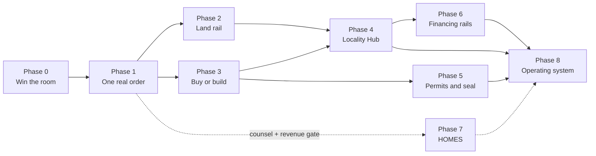

# The Long Roadmap — from X Layer to the property, the supplies, and the keys

*Written August 10, 2026. This is the canonical long-form rollout plan for Aura Homes: the full grand design, phased, with every honest dependency published next to the thing it blocks. [ROADMAP.md](../ROADMAP.md) keeps the three-arc summary the founder settled on; [PHASED-ROADMAP.md](../PHASED-ROADMAP.md) keeps the commercial framing; the site's `/overview` page summarizes this file. Where the three disagree on sequencing detail, this file is the one that was written with the dependency graph in front of it — and § 2 reconciles the numbering so nobody has to guess.*

**The sentence this roadmap has to earn:** a person with a card and no crypto ends up living in an off-grid eco home they chose, on land they own, built by trades they can name, paid for through rails they never had to understand — and every limitation was published before they hit the button.

---

## 1. How to read this file

Each phase carries the same six fields, deliberately:

| Field | What it means |
|---|---|
| **Goal** | The one sentence the phase has to make true. |
| **What ships** | Artifacts a person can open, run, or transact against. Not intentions. |
| **What it makes possible** | The next phases this one is a precondition for. |
| **Dependencies and blockers** | The honest list, including the ones we cannot fix ourselves. |
| **Published limitations** | What the phase still cannot do, stated in the phase itself rather than a footnote. |
| **Done when** | The falsifiable test. If it cannot fail, it does not count. |

Three standing rules from the house voice apply to every line below: ranges carry their basis, unbuilt things are written in future tense with a status label, and a limitation is published next to the feature it limits rather than at the bottom of the page.

**One structural rule that decides most of the sequencing:** *nothing that touches other people's money moves to mainnet before the legal spine in Phase 1 exists.* Phase 0 is a testnet demo with a mainnet contract deploy for the judges — no third-party funds, no custody, no partner obligations. That is not timidity, it is the difference between a hackathon entry and an unregistered money services business.

---

## 2. Numbering, reconciled once

Three numbering systems exist in this repo and all three are load-bearing to somebody. This table is the translation layer; it does not replace them.

| This file | [ROADMAP.md](../ROADMAP.md) arcs | [PHASED-ROADMAP.md](../PHASED-ROADMAP.md) founder phases | Calendar (planned, not promised) |
|---|---|---|---|
| **Phase 0 — Win the room** | Arc 1 | Phase 1 (hackathon MVP) | Aug 10–21, 2026 |
| **Phase 1 — Make one order real** | Arc 2 · Proof | Phase 2a | Sep–Dec 2026 |
| **Phase 2 — The land rail** | Arc 2 · Proof | Phase 2b | Dec 2026 – Q2 2027 |
| **Phase 3 — Buy it or build it** | Arc 2 · Product | Phase 2c | Q1–Q3 2027 |
| **Phase 4 — The Locality Hub** | Arc 2 · Product | Phase 3b (partial) | Q2 2027 – Q2 2028 |
| **Phase 5 — Permits and the seal** | Arc 2 · Product | Phase 3a | Q3 2027 – Q1 2028 |
| **Phase 6 — Financing rails** | Arc 2 · Product | — (implicit) | Q4 2027 – Q3 2028 |
| **Phase 7 — HOMES** | Arc 3 | — (deliberately separate) | Gated, not dated |
| **Phase 8 — The operating system** | Arc 2 · Horizon | Phase 3c | 2028+ |

When somebody says "Phase 1" without qualifying it, they almost always mean the founder's Phase 1 — the USDC buy flow — which is **Phase 0** here. That collision is the single most common source of confusion in this repo. Quote the sentence, not the number.

---

## 3. Ground truth this roadmap stands on

Every phase below assumes these. They were verified or re-verified for this document on **August 10, 2026**; anything time-sensitive carries its check date and should be re-verified before it is relied on in a permit application, a contract, or a deploy.

**Chain and money**

- X Layer mainnet chain ID **196**, testnet **1952**; gas token OKB; EVM-equivalent, so Hardhat and Foundry work unmodified. Assert `eth_chainId` before every deploy — legacy docs still say 195.
- **X Layer runs OP Stack, not Polygon CDK.** Trade press still repeats the CDK/zkEVM description ([Cointelegraph](https://cointelegraph.com/news/circle-native-usdc-okx-x-layer-cctp), Aug 2026). The repo's own live probe wins over the press: the OP Stack predeploys `0x4200…0015`, `0x4200…0016`, and `0x4200…000F` all carry code with the uniform proxy bytecode signature, non-standard control addresses return `0x`, and measured block time is **1.000 s/block** over both 1,000- and 10,000-block windows (Audit #5, `docs/AUDIT-LOG.md`). Treat any third-party X Layer doc that says "zkEVM" as stale.
- **Native Circle USDC and CCTP are live on X Layer since Aug 6, 2026** ([Circle](https://www.circle.com/blog/now-available-native-usdc-cctp-on-x-layer)). Mainnet `0xB6CEceAB302E2E4948951eE7843FC24E92933061`, testnet `0xDec90b78111Ba2fc6FC6d84d8B9ec159A2d4b9B3` (`app/lib/chains.ts:28–31`). Circle's own post says bridged `USDC_Bridged` liquidity will migrate to native "over time" — meaning both variants circulate right now and pointing at the wrong one strands funds. **Never touch USDC.e.**
- **CCTP is the bridge story, and it is real.** Circle shipped CCTP alongside native USDC on X Layer; CCTP spans 26 chains with native USDC on 36 networks as of that launch. This is what makes "bridge in from Base" a documented path rather than a hope.
- **Gasless stablecoin transfers exist on X Layer through OKX Wallet, sponsored under x402** ([OKX help](https://web3.okx.com/help/okx-wallet-x-layer-0-gas)). A buyer can move USDC without ever holding OKB — but only inside OKX Wallet, which is a product dependency, not a chain property. Any flow that assumes gasless must degrade to "you need a little OKB" outside that wallet.
- **OKX Agent Payments Protocol (APP)** launched April 29–30, 2026: an open agent-commerce standard covering quotes, negotiation, escrow, usage metering, settlement, and dispute resolution, with an SDK for one-time, batch, and usage-based payments settling on X Layer ([whitepaper](https://web3.okx.com/whitepaper/okx-app-whitepaper.pdf), [The Block](https://www.theblock.co/post/399490/okx-agent-payments-protocol-ai-business-cycles-quotes-disputes-transactions)). It is x402-family and explicitly not positioned against x402. An agent that meters its own work and escrows real-world construction payments is the exact shape of what OKX built APP for.
- **Aave V3 is live on X Layer** (deployed March 30, 2026): total market size ≈ **US$115.5M**, ≈ $95.7M available, ≈ $19.8M borrowed, against a chain-wide DeFi TVL of ≈ $116.3M. Crypto-collateral borrowing is a real path on the same chain the escrow lives on — and Aave is essentially the whole of X Layer DeFi, which is itself a concentration risk worth stating.
- **X Layer Ecosystem Fund: US$100M**, aimed at builders with "long-term vision and real technology" rather than launch-and-flip tokens. This is the named funding path for the Phase 1 escrow audit.

**The hackathon (re-fetched from the official page, Aug 10, 2026)**

- Judged on, verbatim: *application of AI, innovation, product completeness, user value, integration with X Layer, growth potential, and contribution to the X Layer ecosystem.*
- Tracks: **AI-RWA** (eligible for the Liquidity Grant) and general AI.
- Prizes: 30K / 15K / 5K USDT judged; **50K USDT Liquidity Grant** for the AI-RWA winner; up to 200K Launch Grant tied to trading-volume milestones (not chasable by an indie build, and wash trading is disqualifying).
- Hard requirements: AI in the product design; **deploy on X Layer testnet during the hackathon, mainnet after**; a dedicated X account kept active; a submission post mentioning **@XLayerOfficial**; KYC possible before payout.
- Deadline **Aug 21, 2026, 23:59 UTC** via the Google Form.
- Read the mainnet requirement precisely: testnet **during**, mainnet **after**. Mainnet before the deadline is a bonus, not a gate. That single reading buys back a day of schedule risk.

**Land, law, and the last mile in Alberta**

- **Enhanced Title Mapping is restricted and we do not qualify.** Altalis licenses ETM — the product carrying owner names, addresses, estate held, registration date, and legal land descriptions — "directly to Utility, Pipeline, Municipalities, organizations requiring emergency response plans to operate in Alberta, and Geomatics service providers serving these industries" ([Altalis](https://www.altalisdata.com/products/title-and-enhanced-title-mapping)). Plain **Title Mapping** is public and gives title polygons plus LINC identifiers with daily updates from Alberta Land Titles. **This corrects ROADMAP.md's Arc-2 line "license Altalis Cadastral + Title/ETM for Parkland + Sturgeon first."** The buildable version is Cadastral + Title Mapping, with per-title detail bought on demand.
- **The per-title fallback is cheap and public:** SPIN2 sells a current certificate of title at **$10.00** per copy and a digital survey plan at **$2.00** ([Alberta Land Titles fee schedule](https://alta.registries.gov.ab.ca/SpinII/feeschedule.aspx)). One shortlisted parcel costs about twelve dollars to verify properly. Screening runs on free and public data; ownership detail is a per-parcel purchase at the moment a buyer is serious.
- Minimum dwelling size is **district-level, never county-level**. Lac Ste. Anne Agricultural 592 sqft, its Country Residential 1,076 sqft; Parkland's only floor-area minimum in Bylaw 2025-12 is 30.0 m² attached to accessory suites, with none on principal dwellings; Sturgeon eliminated minimums except R2 Country Estate at 100 m² (verified against the July 21, 2026 consolidation of LUB 1385/17).
- Alberta lawyers **cannot hold crypto in trust**. Convert-then-close is the proven pattern and stays permanent until the rules change.
- USDC is the only CSA-approved stablecoin in Canada. Custody or routing of user funds makes the operator an MSB — FINTRAC registration, free, 8–16 weeks. Fractional ownership of a home is a securities distribution under CSA SN 46-308.
- Alberta's Prompt Payment and Construction Lien Act imposes the statutory 10% holdback that `AuraBuildEscrow` already models. The Act's proper-invoice and payment-window timings shape Phase 4's contractor payments and must be re-verified against the current Act text before any payment logic depends on them.
- SIP kits: **12–20 weeks from approved drawings to panel delivery.** No software changes this. Every timeline in every phase is downstream of it.

---

## 4. The spine, in one table

Everything below is an elaboration of this.

| Phase | The sentence | The transaction | The risk it retires |
|---|---|---|---|
| 0 | Talk to an agent, get told no, then buy the right home in USDC. | Reservation deposit, testnet | Does the rail work, and can AI be load-bearing rather than garnish. |
| 1 | One real order, one real dollar, legally. | First mainnet deposit under an MSB path | Are we allowed to do this. |
| 2 | And the land. | Land deposit on-chain, closing in fiat by a lawyer | Can the deed and the chain coexist honestly. |
| 3 | Buy it, or build it your way. | A configured build priced from the model | Is constraint-checking the moat we think it is. |
| 4 | The whole supply chain, locally, in USDC. | Vendors and trades paid per milestone | Will suppliers and trades actually take this. |
| 5 | Permits, stamped and sealed. | A sealed package a county accepts | Can compliance be part-automated without lying. |
| 6 | Money that is not only crypto. | CEIP, Greener Homes, collateral loans | Can a normal buyer afford it. |
| 7 | HOMES. | To be decided, after counsel | Is a token additive or a liability. |
| 8 | An operating system others run. | Other people's builds, other provinces | Does it compound without us. |



---

# PHASE 0 — Win the room
### Aug 10–21, 2026 · 11 days · the hackathon MVP

**Goal.** A judge with ninety seconds and no patience sees an AI concierge refuse to sell a home onto land that cannot legally hold it, then complete the purchase on land that can — in native USDC on X Layer, with Alberta's statutory holdback visibly retained by the contract and an on-chain build record flipping status on camera.

**The whole phase in one design decision:** the AI must be able to say **no**, and the chain must be the thing that enforces the consequence. Everything that does not serve that sentence is out of scope, including things that are good.

## 0.1 What already runs (the honest starting line)

Do not rebuild any of this. Verified green in Audit #5 and #6 (`docs/AUDIT-LOG.md`):

- `agent/src/parcels.ts` — the four land filters, with the Lakeside Estates rejection (1,076 sqft district minimum against an 800 sqft design) firing in the demo.
- `agent/src/pipeline.ts` — questionnaire → design brief → five constraint checks → line-item budget → milestone schedule, offline-deterministic, reconciling to the dollar with `data/alberta/cost-model.json` (**LOW $199,100 / MID $301,280 / HIGH $443,900 ex-land**; with land $274,100 / $451,280 / $793,900).
- `agent/src/brain/` — journey state, slips, memory, digest render.
- `agent/src/mcp/` — 11 MCP tools including `journey_memory`, with a real 402 challenge on `eip155:1952` at $0.01 against testnet USDC and an honestly labeled simulated-settlement receipt.
- `contracts/` — `AuraBuildEscrow` (milestones, 2-of-3, 10% holdback with a 60-day maturity timer) and `AuraBuildRegistry` (Designed → Funded → UnderConstruction → Complete), 10/10 tests.
- `app/` — 8 routes live at aurahomes.fun, the 3D scroll story, /land /design /budget /escrow /dashboard /overview /faq.

**Two things are not done and they are the whole critical path:** the contracts are not on chain (deployer `0x831F…f260` at nonce 0, balance 0 — faucet captcha, four audits running), and the Aug 9 pivot's front door (concierge, catalog, buy button, refund window) has zero code.

## 0.2 MUST ship — the five, in dependency order

Nothing outside this list gets built before every item on it is done.

**M1 · Testnet deploy, then mainnet.** *Blocked on a 30-second human captcha.*
The single longest-standing item in the audit log. Claim ~0.2 OKB/day at the faucet for `0x831Fb0C6f8A96dE7c7253bF76C98a780d6E0f260`, run `npm run deploy:testnet`, record addresses in `docs/DEPLOYMENTS.md`, put OKLink links in `SUBMISSION.md`. Claim the faucet **every day from now**, whether or not it is needed — the deposits accumulate and a redeploy after the escrow change will need gas too.
Mainnet deploy is scheduled for Aug 19 and is explicitly **not** a submission gate (the rules say testnet during, mainnet after).

**M2 · Escrow v2: reservation deposit and a cooling-off refund window.** *The only contract work in this phase.*
The existing escrow can only unwind by 2-of-3 `cancel()`. A consumer buying a home needs a unilateral out for a defined period — that is both the consumer-protection answer and the most trust-building eight seconds in the video. Concretely, added to `contracts/contracts/AuraBuildEscrow.sol`:

```solidity
// new immutable, set at construction; 0 disables the window entirely
uint64 public immutable refundWindow;      // seconds after fundMilestone(0)
uint64 public depositFundedAt;             // set on the first funding

error RefundWindowClosed();
error NotDepositMilestone();
event DepositRefunded(uint256 indexed id, uint256 amount);

/// @notice Milestone 0 is the reservation deposit. The homeowner alone may pull it
///         back inside the cooling-off window, with no counterparty approval.
function refundDeposit() external onlyHomeowner whenActive nonReentrant {
    Milestone storage m = _milestone(0);
    if (!m.funded || m.released || m.refunded) revert NotFunded();
    if (block.timestamp > uint256(depositFundedAt) + refundWindow) revert RefundWindowClosed();
    m.refunded = true;
    usdc.safeTransfer(homeowner, m.amount);
    emit DepositRefunded(0, m.amount);
}
```

Tests to add alongside the existing 10 — each of these must be able to fail: refund inside the window succeeds and returns the exact amount; refund one second after the window reverts `RefundWindowClosed`; refund after release reverts; `refundWindow = 0` disables the path; a released milestone's holdback clock is untouched by a deposit refund; sum of all balances is conserved across every path (fund, refund, release, holdback, cancel).
**Resolve the registry-enum contradiction in the same change** (Audit #5 finding #2): `AuraBuildRegistry` says Designed → Funded → UnderConstruction → Complete and `SUBMISSION.md` agrees; `PHASED-ROADMAP.md:78` says Reserved → Contracted → UnderConstruction → Complete. The contract vocabulary wins — it is deployed, tested, and already in the judge-facing doc. Edit the roadmap line, not the enum. Cost: one line. Leaving it costs a judge finding a contradiction in the docs.

**M3 · `/concierge` — the AI front door wired to an order object.**
A chat route that drives the pipeline that already runs. It is the interface to the buy flow, not a sidebar.

- New `app/app/concierge/page.tsx` plus `agent/src/concierge/` exporting a pure reducer: `(state, userTurn) => { nextState, question | verdict | order }`.
- **The order object is the contract between every part of the demo.** Sketch: `{ id, catalogHomeId, parcelId, sqft, offGrid, water, septic, glazingRatio, budgetBand, lineItems[], milestones[], verdict: 'PASS'|'REJECT'|'REVIEW', citations[], depositUsdc, refundWindowHours }`. The escrow funds this. The registry records this. The budget page renders this.
- Deterministic by default, model behind `ANTHROPIC_API_KEY` (OPEN-QUESTIONS #6). **The demo must be filmable with the key absent.** A live-model dependency on demo day is a self-inflicted single point of failure.
- Slot-filling order matters for the narrative: land first. Ask where before asking what, so the rejection can happen before the buyer is attached to a house.
- It answers in CAD, states what is and is not included, and states the 12–20 week SIP lead time without being asked. Answering "what is actually in this price" plainly is a differentiator in a category that refuses to.

**M4 · The land gate, promoted from a page to a checkout condition.**
`parcels.ts` already returns the verdict. Phase 0 makes the verdict **binding**: the BUY control renders disabled with the bylaw citation attached until a passing parcel is selected. Two scripted parcels so acceptance and rejection show back to back — Lakeside Estates (Country Residential, 1,076 sqft minimum, REJECT) and a Sturgeon or Lac Ste. Anne Agricultural parcel (PASS). Ship the one-line data fix in OPEN-QUESTIONS #12 while in there (`sturgeon-range-rd` minimum null → none, with the verified bylaw basis) so the sample stops saying REVIEW for a parcel we have actually verified.

**M5 · Three catalog homes, priced, with the buy flow behind them.**
Exactly three. Reference designs priced from published sources, each with its link, plus Aura's own SIP design priced live from `cost-model.json`. No partner is signed and the demo must not imply one — ship a visible partner state reading *signed: none · in conversation: …* and name targets as targets.
The flow: pick home → pick parcel → verdict → deposit amount in CAD with the USDC figure beside it → approve → `fundMilestone(0)` → registry mint and status flip → release milestone 1 with the 10% holdback visibly retained and its timer running → OKLink links on screen throughout. Gasless through OKX Wallet where available; a plain-wallet fallback path that says "a small amount of OKB is needed" rather than failing silently.

## 0.3 MUST NOT attempt — the anti-scope

This list is the actual skill in an 11-day plan. Each of these is a good idea and each would cost the demo.

| Not now | Why not, in one line |
|---|---|
| Fiat on-ramp integration (MoonPay/Transak/Banxa) | Vendor onboarding and KYC review exceed the entire remaining schedule; the card door already ships as an honest disabled state. |
| Account abstraction (Particle, Safe) | A wallet-layer rewrite four days before a video shoot; the demo works with an injected wallet. |
| Land **purchase** flow | Deeds, lawyers, FinCEN entity reporting, and Alberta's no-crypto-in-trust rule. Phase 2 exists for this. |
| Any token, including a testnet one | No time for securities analysis, judges discount bolt-on tokens, and wash-trading rules make the Launch Grant a trap. Arc 3 says this already. |
| Fractional ownership of anything | Securities distribution under CSA SN 46-308. RealT, the sector's leader in that model, entered voluntary liquidation July 2, 2026. |
| IFC export, HOT2000, Hypar | Heavy, invisible in a 90-second video, and squarely Phase 5. |
| Contractor research sweep | Fan-out research agent plus rating verification; genuinely valuable and genuinely a week. |
| Digest email delivery | Self-contained and small, but it scores nothing a judge can see in 90 seconds. |
| A fourth catalog home | Every additional home is content debt with zero marginal score. |
| New 3D scenes or another grass pass | The site is already the best-looking artifact in the entry. Freeze it except for bugs. |
| Escrow audit, FINTRAC registration | Weeks-to-months processes. Phase 1. Say so in the submission rather than pretending. |
| Multi-province data packs | Growth potential is argued with the architecture and the playbook, not by shipping a second province badly. |

**The rule behind the list:** in Phase 0 we are not building the company, we are building the ninety seconds that funds the company. Anything a judge cannot see, verify, or be moved by in ninety seconds is Phase 1 or later.

## 0.4 Mapping to the seven judged criteria

Each criterion needs one artifact a judge can check in under a minute. This table is also the outline of the submission form.

| Criterion | The artifact | What a judge can verify in <60s |
|---|---|---|
| Application of AI | The concierge's refusal, with the bylaw citation | The buy button is disabled and the reason names a district and a number. The AI is load-bearing: remove it and the purchase is unsafe. |
| Innovation | Alberta's statutory 10% holdback modeled on-chain | Read `AuraBuildEscrow.release()` — the holdback is contract state with a maturity timer, not a UI label. To our knowledge, the first construction escrow that speaks a specific jurisdiction's lien law. |
| Product completeness | Eight live routes, the agent demo reconciling to the dollar, 10+ passing tests | `npm run demo` prints totals identical to `cost-model.json`; `npx hardhat test` passes; the site is live. |
| User value | The published cost model and the honesty ledger | LOW/MID/HIGH with per-line basis, the owner-buildable filter, the AWG winter-zero disclosure. A buyer learns something true and expensive for free. |
| Integration with X Layer | Native USDC escrow on 1952, OKLink tx links, x402 metering | Click a link, see a transaction. |
| Growth potential | The Alberta playbook plus the data-pack architecture | A new province is a data problem: `data/<province>/`. The playbook is the artifact no other team will have. |
| Contribution to the ecosystem | MIT from the first commit, open supplier directory, MCP server, published research | The repo is the contribution, and the research that contradicted our own assumptions is published rather than buried. |

## 0.5 The demo narrative — 90 seconds, shot by shot

Every figure captured live. Nothing re-recorded from fixtures. If a number on screen cannot be reproduced by a judge, it does not go on screen.

| Time | Shot | The line |
|---|---|---|
| 0–8s | Paper ground, the mark, one sentence over the hero | "From dollars on X Layer to the keys of an off-grid eco home." |
| 8–22s | Concierge: "I want an off-grid home, about 800 square feet, on this parcel." | The agent asks where before what. |
| 22–34s | **The refusal.** Verdict card renders REJECT with the citation. | "This district requires 1,076 square feet. Your design is 800. This check is free here. Finding out after you buy the land costs you the land." |
| 34–46s | Switch to the passing parcel. Home + live budget, LOW/MID/HIGH, per-line basis. | "Priced line by line from Alberta suppliers, with no middlemen and every basis published." |
| 46–66s | **BUY.** Approve, fund the deposit in native USDC, OKLink tx on screen, registry status flips. | "Reservation deposit, settled in seconds, for a fraction of a cent." |
| 66–80s | Release milestone 1: builder paid 90%, the 10% holdback visibly retained with its timer. Then the refund window, shown as a countdown. | "Alberta's statutory construction holdback, enforced by the contract. And a cooling-off window the buyer controls alone." |
| 80–90s | Repo URL, MIT, the roadmap line | "The software that would otherwise exist in five years, built in the open, starting in Alberta." |

Filming rules: one take per shot, no speed ramps over transactions, the OKLink page shown at full resolution for at least two seconds, CAD and USDC on screen together, and the words *simulated* or *fixture* rendered on screen for anything that is either.

## 0.6 Day plan, Aug 10–21

Human-gated items are marked **[Matt]** and cannot be delegated. Everything else is AI-executable.

| Date | Ship | Gate |
|---|---|---|
| Aug 10 (D1) | **[Matt]** faucet claim · **[Matt]** create @AuraHomesAI, avatar, bio, post 1 · escrow v2 written | Faucet is the whole critical path |
| Aug 11 | Escrow v2 tests green · testnet deploy · addresses in DEPLOYMENTS.md · registry-enum doc fix | Deploy is the gate for everything downstream |
| Aug 12 | Concierge reducer + order object, offline-deterministic | — |
| Aug 13 | `/concierge` UI, land gate binding the BUY control · post 2 (the refusal) | — |
| Aug 14 | Catalog: three homes, priced line items, source links, partner-state banner | — |
| Aug 15 | Buy flow end to end on 1952: approve → deposit → mint → release → holdback → refund window · post 3 (holdback tx) | **Feature-complete checkpoint** |
| Aug 16 | x402 fee surface on the concierge, honestly labeled · SUBMISSION.md rewritten to the shipped script | — |
| Aug 17 | **Feature freeze 23:59.** Polish, mobile, perf, copy pass, Pages redeploy, Audit #7 | Nothing new after this |
| Aug 18 | Video shoot and cut, every figure live · **[Matt]** post 4 | — |
| Aug 19 | Mainnet deploy · video upload · form pre-filled · dry-run submission | — |
| Aug 20 | **[Matt]** SUBMIT the form · **[Matt]** submission tweet tagging @XLayerOfficial | Submit a full day early |
| Aug 21 | Buffer only. Build-in-public post, nothing else. | Ship early, not at 23:58 UTC |

**The cut ladder.** If Aug 15 arrives and the buy flow is not end to end, drop in this exact order and stop when you are back on schedule: (1) the x402 fee surface, (2) the third catalog home, (3) live-model mode, (4) the mainnet deploy moves to after the deadline, which the rules allow, (5) the second parcel scenario collapses to the rejection only. **Never cut:** the deploy, the refusal, the holdback release, or the honesty labels.

**Two failure modes that have nothing to do with code.** The faucet captcha has blocked this project for four consecutive audits; if it blocks again on Aug 10, the fallback is a small OKB purchase and a bridge to X Layer — a mainnet-first deploy is better than no deploy. And the X account has zero posts against a criterion that explicitly weighs an *active* account; the cost of that delay compounds daily, which makes Aug 10 the deadline for it, not Aug 18.

## 0.7 Published limitations for Phase 0

Stated in the app, in the README, and in the submission — not discovered by a judge.

- No partner is signed. Catalog homes are reference designs priced from published sources, each with its link.
- No fiat on-ramp is live. The card door renders as a disabled, honest "integration pending."
- x402 settlement is metered and demonstrated; where settlement is simulated, the receipt says so.
- The escrow is unaudited. It holds testnet value and a token mainnet deploy, nothing else. An audit is Phase 1 and budgeted at US$15–60K.
- The design output is a **review-ready design package**, never a permit set. An Alberta residential designer finishes it for $1.2–2.7K.
- The registry NFT is a build record, never legal title.

**Done when:** a stranger can open aurahomes.fun, be refused a purchase with a citation, complete a purchase on a passing parcel against testnet USDC, and click through to that transaction on OKLink — and every number they saw is reproducible from the public repo.

---

# PHASE 1 — Make one order real
### Sep–Dec 2026

**Goal.** Turn a working demo into a lawful transaction: one real customer, one real deposit, one real dollar, with the regulatory and security spine that makes a second one routine.

**What ships**

- **FINTRAC MSB analysis and registration.** Free, 8–16 weeks, and it starts on the first business day after the hackathon because the clock is the constraint, not the work. Scope the analysis first: a non-custodial escrow where funds move buyer-to-contract-to-vendor may fall outside MSB, and the answer decides the whole product architecture. Get it in writing.
- **Independent escrow audit.** US$15–60K. Funding path: the X Layer US$100M ecosystem fund, the OKX accelerator pipeline, and the hackathon grant if it lands. Deliverable before the auditor is engaged: the **pre-audit package** (Audit #6's build #5) — threat model, invariant list (fund conservation, holdback monotonicity, role separation, refund-window boundedness), and fuzz targets. Writing it costs nothing and halves the audit's billable discovery.
- **Card-first on-ramp.** Evaluate MoonPay, Transak, Banxa, and Onramper on three axes and publish the comparison: X Layer coverage (direct, or Base plus a CCTP hop), Canadian card success rates, and KYC depth. Card in, USDC into escrow, CAD displayed throughout.
- **Account abstraction** on X Layer's documented Particle plus Safe stack, so no buyer sees a seed phrase and gasless works outside OKX Wallet.
- **The Brain, phase 1:** journey state machine as a service, MCP server extraction, the digest email adapter (Resend or SES class, env-driven, `emailPrefs` opt-in, dry-run-to-disk mode), the slip-rule library, and outcome logging that feeds later phases.
- **Partner bench, signed:** a residential designer, a P.Eng for screw-pile plans, an Insulspan or EnerSmart quote pipeline, two solar installers, two septic designers, and crypto-fluent counsel.
- **One documented pilot order, in public.** Not a pilot build yet — a pilot *order*: a real buyer, a real deposit, a real refund window that expires unused.
- **Candidate ecosystem contribution:** register the concierge in the **ERC-8004 identity registry** on X Layer (identity, reputation, validation singletons; deployment scripts and OKLink verification already exist for X Layer). It is a small, legible contribution to the exact ecosystem the grant is about. Candidate, not committed — it must not displace the legal spine.

**What it makes possible.** Everything. No later phase may touch a third party's money until this one closes.

**Dependencies and blockers**

- FINTRAC processing time is outside our control (8–16 weeks). Start day one.
- An auditor's calendar is typically 4–8 weeks out; book before the money is in hand.
- Banks generally will not mortgage off-grid, owner-built, sub-1,000 sqft homes. The first customers are cash or crypto-collateral buyers, and that is a market-size constraint, not a marketing problem.
- The Owner Builder no-warranty path freezes resale for 10 years via a title caveat. Disclosed in-app, at the point of choice.

**Published limitations.** No land purchase yet. No customization yet. One jurisdiction. Escrow audited but not battle-tested at scale.

**Done when:** a person who is not a friend of the founder has funded a real deposit, seen the refund window open and close, and the ledger export reconciles their CAD fair-market-value bookkeeping for CRA purposes.

---

# PHASE 2 — The land rail
### Dec 2026 – Q2 2027

**Goal.** Add the step the vision puts first and the transaction puts last: find the parcel, prove it can hold the home, and get title into the buyer's name — with the deposit on-chain and the closing exactly where the law requires it, in a lawyer's trust account, in Canadian dollars.

**The sentence that is the whole strategy:** *deposit escrowed on-chain, closing executed by a lawyer in fiat, on-chain record updated on title confirmation.* Never claim the chain holds title.

**What ships**

- **The real land-data stack, corrected.** Free and public first: Alberta Base Features, LiDAR DEMs, RITL encumbrances via Open Data Areas Alberta (ingested as interest-based features, never title-by-title, with a manual-search fallback flag), Edmonton Socrata zoning, and district tables transcribed per county with citations. Licensed second: **Altalis Cadastral plus Title Mapping** — polygons and LINC identifiers, daily-updated, publicly licensable. **Not ETM**, which is restricted to utilities, pipelines, municipalities, emergency-response organizations, and geomatics providers serving them. Ownership detail is bought per parcel at SPIN2's **$10.00 per title** and **$2.00 per plan** at the moment a buyer shortlists it — roughly twelve dollars to verify a parcel properly, which is a line item, not an architecture.
- **The screening pipeline:** CRS-normalize → hard exclusions (floodplain, wetland, slope, crown land, easement) → negative-buffer setbacks with a zero-buildable-envelope guard → weighted ranking → sticky compliance states with immutable audit records. AVPA overlays and straddle-parcel handling join the filter list.
- **Bridge-in guidance as a product surface, not a doc.** Card-first for normal buyers; for crypto-natives, Wealthsimple at 0% USDC → withdraw on Base → CCTP to native USDC on X Layer. CCTP is live on X Layer as of Aug 6, 2026, which is what makes this a supported route rather than a workaround. The app names the variant explicitly at every step: native USDC, never USDC.e.
- **The land deposit contract:** a refundable USDC deposit with conditions (title search clear, district check passed, financing condition), released to the lawyer's instruction or refunded on condition failure.
- **Convert-then-close, productized:** Kraken USDC/CAD at roughly 0.4% taker → wire to trust. Crypto-fluent professionals in the loop (McLeod Law; Greater Property Group closed an $800K Bitcoin Calgary purchase). The app orchestrates; licensed humans close.
- **The GST trap check, automated.** Bare land from a developer, corporation, or subdivider attracts 5% GST; personal-use land from an individual is generally exempt. That is a ~$10K swing on a $200K parcel, and the app should ask about seller status before the offer, not after.
- **CRA barter-disposition ledger export**, shipped as a feature.

**What it makes possible.** The Locality Hub (Phase 4) needs parcels with known districts; permits (Phase 5) need legal descriptions; financing (Phase 6) needs a title to attach CEIP to.

**Dependencies and blockers**

- Altalis licensing terms and redistribution rights must be read before any parcel data is exposed publicly. Licensed data in an MIT repo is a licence violation waiting to happen — **the data packs must separate free-and-redistributable from licensed-and-referenced, structurally.**
- FinCEN reporting on non-financed transfers to entities (effective March 1, 2026) catches exactly what a crypto buyer looks like. KYC and beneficial-ownership capture must be designed in, not bolted on.
- Alberta lawyers cannot hold crypto in trust. Permanent until the rules change.
- Listing supply is thin for off-grid-suitable parcels; the county-by-county rollout is partly a supply problem.

**Published limitations.** The chain never holds title. Screening is advisory and always ends in a human title search before an offer. Ownership data is per-parcel and paid, not bulk.

**Done when:** one buyer owns a parcel whose entire path — screening verdict, encumbrance check, title search, deposit, closing, on-chain record update — is documented publicly end to end.

---

# PHASE 3 — Buy it or build it
### Q1–Q3 2027

**Goal.** Two doors from the same conversation: *buy this home as it is*, or *change it and we will price, source, and constrain-check the result.* One order object, one escrow, two fulfillment paths.

**What ships**

- **The catalog becomes a constrained configurator.** Massing, room program, envelope, and glazing generated against Part 9, climate zone 7A, district bylaws, and FDWR. Generating a plausible design is commodity now (Higharc trained on 3,500 home files and 75,720 room samples; Maket; Snaptrude). **The moat is constraint-checking against a real jurisdiction**, so that is where the engineering goes.
- **The buy-or-build fork, made explicit in the data.** Every configuration carries a fulfillment mode: `catalog` (a manufacturer's unit, priced from published sources), `sip-site-built` (Aura's own, priced from the cost model), or `hybrid`. The escrow milestone schedule differs by mode — a factory unit is deposit, production slot, delivery, siting; a site build is the existing eight-milestone schedule.
- **The A277 decision, made rather than drifted into** (OPEN-QUESTIONS #10). Factory-modular A277 units skip on-site envelope inspection (the safety codes officer checks foundation and utilities only), build dry, and match what Alberta factories actually produce — against a ~2.6 m shipping-width cap and certification voided by post-factory modification. Site-built SIP keeps design freedom and the two-to-three-person erection story, at the cost of on-site inspection of every joint and weather exposure during assembly. **Recommended resolution: offer both tracks in the catalog, default to A277 for the entry tier and SIP for the customized tier**, and publish the trade-off table rather than a preference.
- **Design depth:** IFC export via IfcOpenShell, HOT2000 handoff for the 9.36 performance path, Hypar (≈US$25/mo, real public API) for parametric variants.
- **DIY-or-hire on every line, completed.** The display half shipped in Phase 0's session; this phase adds the research half — a per-build fan-out sweep (per-trade researchers → review and rating verification → ranked shortlist) triggered at the engineering-complete gate, caching into the supplier directory so the network compounds with each build.

**What it makes possible.** Phase 4 needs a bill of materials that varies by configuration. Phase 5 needs an IFC model to run rules against.

**Dependencies and blockers**

- Every generated variant needs a residential designer's finish before permit. The human loop is cheap in Alberta and it does not disappear.
- Truss engineering arrives stamped from the manufacturer; P.Eng authentication has been mandatory since March 1, 2026 (STANDATA 23-BCB-002).
- SIP electrical chases freeze at fabrication and no plumbing goes in exterior SIP walls — the configurator must enforce this or produce unbuildable designs.

**Published limitations.** No tool on earth emits permit-ready NBC Part 9 construction documents; Canada's own government treats automated Part 9 checking as an open research problem. The output stays a review-ready package.

**Done when:** two buyers with the same budget and the same parcel end up with materially different homes, both of which pass the constraint suite and both of which a designer accepts as a starting set.

---

# PHASE 4 — The Locality Hub
### Q2 2027 – Q2 2028

**Goal.** The founder's frame in his own words — *a giant hub with bridges across* — built as the supply side of the product: local vendors, local trades, local materials, settled in USDC where they will take it, tracked against a real build, and rolled out one locality at a time.

This is the largest phase in the roadmap and it decomposes into five shippable sub-phases that can run partly in parallel.

### 4a — The vendor and supplier network

- The directory stops being a JSON file and becomes a transacting surface: `data/alberta/suppliers.json` grows per-entry payment terms, lead times, service radius, and a verifiable basis.
- **Three settlement modes, because vendors are not uniform.** (1) **Direct USDC** — the vendor holds a wallet, paid from escrow per milestone. (2) **Gateway conversion** — payment routes through a processor that auto-converts to fiat into the vendor's account, which is Dubai's proven model (DAMAC since 2017, Emaar on select projects) and the answer that removes the objection killing most partner conversations: *the seller never has to hold crypto*. (3) **Buyer-converted CAD** — Kraken USDC/CAD → e-transfer or wire, with the app recording the disposition for CRA purposes. Mode 3 is the honest default in year one, and saying so beats pretending mode 1 is common.
- **Bridge guidance travels with the payment**, not in a help page: the vendor's accepted rail is shown at quote time so nobody discovers at invoice time that the concrete supplier wants a cheque.

### 4b — Contractor sourcing and payments

- The research sweep from Phase 3 becomes a standing marketplace: ranked local trades per work package, with review verification, trade-record checks, and the licensing constraints the playbook already documents (solar PV and battery wiring require a licensed electrical contractor under CEC s.64; septic installation requires a certified installer; well drilling is licensed work; a homeowner may pull their own electrical, plumbing, gas, and private-sewage permits on a home they own and will occupy — Leduc County confirms this in writing).
- **Per-trade sub-escrows** with their own holdback, so the statutory 10% is retained where the Act actually retains it rather than only at the top level.
- Alberta's Prompt Payment and Construction Lien Act sets the invoice and payment windows that this logic must honour. Re-verify the current timings against the Act text before any code depends on them; the statute has moved once already.
- Payment on inspector sign-off rather than a button, wherever an inspection exists to sign off.

### 4c — Materials, ordering, and inventory

- Bill of materials generated from the configuration, priced against live supplier data, ordered as purchase orders whose hash lands on the build record.
- Lead-time-aware scheduling: the SIP kit at 12–20 weeks from approved drawings is the long pole, and every other order sequences off it. Windows, the Ecoflo unit, and the solar array have their own lead times and their own frost-window constraints.
- Receiving, variance against budget, and a running actual-versus-quoted that the dashboard already has a shape for.

### 4d — Build tracking

- The registry record carries the milestone timeline; each completion attaches evidence (photo hashes, inspection references, delivery confirmations) so the on-chain record means something a lender or a future buyer could rely on.
- The as-built package and the CAD tax ledger fall out of the same data at the end.

### 4e — Locality packs

- A locality is a **data pack plus a bench**: `data/<province>/<locality>/districts.json`, `permits.json`, `suppliers.json`, `contractors.json`, and `cost-overrides.json`, alongside a verified local supplier and contractor bench. The pack format is the product's real architecture — it is what makes "a new province is a data problem, not a rewrite" a testable claim rather than a slogan.
- Rollout order, from the pilot data: **Sturgeon County first** (minimums eliminated in almost all districts, active CEIP, strongest on regulatory permissiveness), then Leduc (one-stop permitting, homeowner trade permits explicit), Lac Ste. Anne (cheapest verified land at $75K–$200K bare parcels, and the district-minimum trap that makes the best teaching case), then Parkland.

**Dependencies and blockers**

- **Vendor adoption is the real risk of this phase, and it is a sales problem, not a software problem.** Mode 3 settlement exists precisely because mode 1 adoption will be slow.
- Trades are scheduled against frost windows and their own backlogs; software does not create capacity.
- Licensed-data redistribution limits (Phase 2) constrain what a public locality pack may contain.
- Every locality pack needs a human to verify the district tables. This does not scale by scraping, and pretending otherwise would reproduce the exact failure the district-minimum check exists to prevent.

**Published limitations.** The platform is the orchestration layer and never the general contractor. Atmos raised US$20M with Sam Altman on the cap table and died in March 2025 by trying to be the builder; that is the cautionary tale, and it is in the repo on purpose.

**Done when:** a build completes with more than half its work packages sourced through the hub, at least one vendor paid in direct USDC, and the actual-versus-quoted variance published.

---

# PHASE 5 — Permits and the seal
### Q3 2027 – Q1 2028

**Goal.** Take the part of the process that eats months and make the software carry the deterministic half honestly, while a credentialed human carries the half that must legally be theirs.

**What ships**

- **The compliance scorecard.** IFC model in → deterministic rule run → **four verdicts: COMPLIANT / NON_COMPLIANT / REVIEW_REQUIRED / UNCERTAIN.** Missing data is always REVIEW_REQUIRED, never an error and never a silent pass. The minimal credible recipe: LLM structured-output parsing of 9.36 and bylaw text → IfcOpenShell targeted extraction → a deterministic Python rule loop → GeoPandas/Shapely setbacks → a gated review UI with professional override.
- **The sealed package.** Calgary and Edmonton reject scanned stamps; **Notarius CertifiO** (identity verified through APEGA, AAA, or ASET) with **ConsignO** digital sealing is the accepted channel, and any post-signature modification breaks the cryptographic seal. The cheaper recurring path for a fixed catalog is **ASET P.Tech professionals** — not C.Tech or C.E.T. — who can legally and independently stamp within their registered scope: repetitive Part 9 SIP details, screw-pile grids, 9.36 forms. **P.Eng remains mandatory for screw-pile foundation plans** (a Part 4 element) and for stacked units.
- **Permit-stack automation** per locality: development permit (≈$231 in Leduc County) → building permit → electrical, plumbing, gas, and private-sewage permits → inspections, with 2–6 weeks typical rural approval and the Owner Builder Authorization path ($95 with warranty, $750 without, decision in ~14 business days).

**The citable evidence this phase rests on** (published as a stat sheet, with the caveat that these are reported pilot results, not our own measurements): permit review reduced from 73 to 32.5 days in the Honolulu CivCheck pilot; 87% and 92% accuracy figures from Seattle; neuro-symbolic approaches at 95.8% translation and 98.3% executability against 72.3% for LLM-only; a reported 90% cut in coding effort; code-update turnaround from 68 hours to 4.2 hours.

**Dependencies and blockers**

- A credentialed professional must be in the loop and paid. There is no version of this where software signs.
- Rule sets are per-jurisdiction and change; a stale rule that returns COMPLIANT is worse than no rule at all. Version every rule set with its source and its check date, and expire it.
- IFC quality from Phase 3 determines whether extraction works.

**Published limitations.** This shortens review, it does not replace approval. A REVIEW_REQUIRED verdict is a success of the system, not a failure of it.

**Done when:** a county accepts a package that came through this rail, and the audit trail shows which verdicts were machine-determined and which a professional overrode.

---

# PHASE 6 — Financing rails
### Q4 2027 – Q3 2028

**Goal.** Answer the question that stops most of these builds before they start — *how does a normal person pay for this* — without ever giving personalized financial advice.

**What ships**

- **Automatic pre-qualification by parcel municipality** across the three public programs the playbook verified: **CEIP**, Alberta's PACE program — property-assessed clean-energy loans repaid on the property tax bill that **transfer with the property on sale**, up to $50K residential, 20-year maximum term, municipality-set fixed rates (verified Aug 2026: Strathcona 2%, Jasper 3%, Calgary ≈5.7%, Edmonton 6% — check the parcel's municipality, and note that an earlier 1.2–3.6% figure in circulation is stale); **Canada Greener Homes Loan** at 0% interest, $5K–**$40K**, 10-year unsecured, retrofit-oriented so new-build eligibility must be confirmed per program rules; and the **CMHC eco improvement refund** at 25% of the mortgage-insurance premium for qualifying energy-efficient homes.
- **Crypto-collateral education, not brokerage.** Aave V3 is live on X Layer itself — market size ≈US$115.5M with ≈$19.8M borrowed as of Aug 2026 — and Ledn in Toronto lends against BTC with USDC or CAD disbursement. The app teaches these paths and links out. It never recommends, never sizes a position, and never routes a loan. **Wealthsimple has no crypto-collateral product**; the correction stays published, and the day they ship one we integrate it.
- **QCAD corridor** when TD custody ships, for one-hop CAD settlement that removes a conversion leg from every payment in Phase 4.
- **Grid-tied as a priced tier** (OPEN-QUESTIONS #11): where a line passes, Solar Club-style retail programs pay ≈35¢/kWh for exports March–October with low single-digit import rates November–February, and the discounted Pre-Solar rate is enrollable up to 180 days before activation — approximately our build window, so enrollment belongs at contract signing. AR 27/2008 caps the array at annual consumption, so size at 100–110% of modeled consumption. Going fully off-grid forfeits all of it. **Off-grid stays the flagship; grid-tied is the smart-money tier, and the app prices both honestly.**

**Dependencies and blockers**

- Program rules change annually; every rate and cap in this phase carries a check date and expires.
- Greener Homes new-build eligibility is genuinely uncertain and must be confirmed before it appears in any pre-qualification result.
- Aave concentration: it is effectively the whole of X Layer DeFi, so a protocol incident there is a product incident here.

**Published limitations.** Educational, not financial advice. We are not licensed advisors and will not become one.

**Done when:** a buyer sees, on their parcel, which programs they likely qualify for with the municipal rate attached and the source cited — and the app has recommended nothing.

---

# PHASE 7 — HOMES
### Gated, not dated

**Goal.** Launch a token on X Layer named **HOMES**, as a rollout phase of its own, with utility decided deliberately rather than retrofitted.

This phase is deliberately dateless. It is gated, and the gates are the point.

**Entry gates — all four, not any one**

1. Canadian securities counsel has reviewed the design against **CSA SN 46-308**. Substance over form: a token sold to raise funds is presumptively a security, and no utility label changes that.
2. The platform has real, recurring usage to burn against. A usage-burn token with no usage is a fundraise wearing a costume.
3. The escrow is audited and has held real value without incident.
4. The founder has decided the utility, and it has been announced as its own phase, in its own words.

**What ships when the gates clear.** The leading design remains **burn-on-usage app credit, invisible to users** — five candidate architectures are already designed and scored in [TOKEN-DESIGNS.md](../TOKEN-DESIGNS.md), with a HOMES/native-USDC pair on X Layer assumed and still awaiting founder confirmation (OPEN-QUESTIONS #8). Launch cost on X Layer is pennies (≈$0.013, measured Aug 9, 2026), so the decision is purely legal and strategic and never technical. Vested team allocation at 10–15%.

**What would make us not launch at all, and that being fine.** If counsel says the design is a security in substance; if usage never reaches the level where a credit token beats simply charging in USDC; or if the token would make the product harder for a normal person to use. The mission is more eco homes built. A token that does not serve that is a liability with a ticker.

**Published limitation.** Announced now, defined later, on purpose. **The hackathon ships no token**, and that decision has not moved.

---

# PHASE 8 — The operating system for small-scale eco construction
### 2028+

**Goal.** Stop being the only operator. Aura Homes becomes infrastructure other people run builds on, in other provinces, under their own brands if they want, with the code MIT and the data packs open.

**What ships**

- **Expansion packs** — `data/bc/`, `data/sk/`, and beyond — proving the claim the architecture has been making since day one: a new jurisdiction is a data problem, not a rewrite. The test is falsifiable: a new province ships without a source-code change outside its pack.
- **The full agent**, staged rather than announced: watches land listings and flags underpriced suitable parcels; negotiates supplier quotes; schedules trades against SIP lead times and frost windows; files permit applications where counties accept them digitally; streams escrow draws against inspector sign-offs; hands every owner a complete as-built and tax ledger.
- **The public interfaces** that make third-party adoption real: the MCP server as the API, documented adapter contracts for land data, cost models, suppliers, and permit rules, and a contribution path where a new locality pack is a pull request with a verifiable basis per entry.
- **Where a jurisdiction puts its registry on-chain, the record can become the title.** Dubai's DLD and PRYPCO Mint prove a land registry *can* run this way — 7.8M tokens on a live secondary market since Feb 20, 2026 — and equally prove it takes a state to do it. Until Alberta does, Aura partners rather than pretends.

**Dependencies and blockers.** Contributor gravity, which is earned by the honesty culture rather than bought; jurisdictional verification, which is human work per locality; and the standing risk that a well-funded competitor copies the playbook, which the MIT licence invites on purpose because more eco homes built is the actual goal.

**Done when:** somebody who has never spoken to us ships a locality pack, and a build completes on it.

---

## 5. Cross-cutting tracks

These do not belong to a phase; they run through all of them, and they are how the roadmap stays honest.

**The audit loop.** The `aura-vision-audit` scheduled task runs every 2 days and appends `## Audit #N` to [AUDIT-LOG.md](../AUDIT-LOG.md), append-only, with authority to flag drift against [VISION.md](../VISION.md). Every audit executes anchors rather than reading docs: `npx hardhat test`, `npm run demo`, `npm run brain`, `npm run memory`, `npm run mcp:smoke`, both app builds, live HTTP and RPC checks. The rule that makes it worth anything: **tool success is not verification**, and a check that cannot fail does not count.

**The honesty ledger.** Every user-facing claim carries one of three labels — *runs today*, *demo or simulated*, *specified, not built* — and the README's journey table already does this. The single most valuable property this project has is that a judge, a buyer, or a contributor can falsify any claim in the repo in under a minute and find it true. Protecting that is worth more than any feature.

**Numbers discipline.** One source of truth for money: `data/alberta/cost-model.json`. The agent, the app, the docs, and a judge's calculator must agree to the dollar, and they currently do (LOW $199,100 / MID $301,280 / HIGH $443,900 ex-land; the 12 non-land lines sum to 181,000 / 269,000 / 386,000 before contingency at 10/12/15%). The `/budget` page renders a fixture mirror of that file, which is a standing drift risk and should become a build-time import in Phase 1.

**Security.** Pre-audit package before Phase 1's audit; invariants tested, not asserted; the refund window and holdback as the two paths most likely to be attacked because they are the two that move money against a clock.

**Cost honesty in the AI stack.** The tiered model strategy in [AI-BRAIN.md](../AI-BRAIN.md) — deterministic code first, small open-weight second, frontier API last, distillation later on rented GPUs — is what lets a "ridiculously affordable" usage fee survive thousands of users rather than being a promise that breaks on contact with an invoice.

**Open source, continuously.** MIT, public from the first commit, the research corpus published including the findings that contradicted our own assumptions, and [AI-HANDOFF.md](../AI-HANDOFF.md) maintained so a lesser model can pick this up without losing the plot.

---

## 6. Phase entry gates

A phase does not start because the calendar says so. It starts when its gate opens.

| Phase | Cannot start until |
|---|---|
| 1 | Submitted. Testnet deploy verifiable on OKLink. |
| 2 | FINTRAC position in writing; escrow audit engaged or scheduled. |
| 3 | One real order has completed a full deposit-and-refund-window cycle. |
| 4 | A parcel has closed through the Phase 2 rail. |
| 5 | IFC export produces models an extractor can read. |
| 6 | Phase 4 has a build to attach financing to. |
| 7 | All four Phase 7 gates. Never earlier, regardless of market conditions. |
| 8 | Two localities running, at least one not operated by us. |

---

## 7. What this roadmap deliberately does not promise

- **A one-click house.** Land, permits, engineer-stamped trusses, and 6–12 months of construction are irreducibly physical. The product orchestrates them and says so.
- **That we become the builder.** We are the orchestration layer. That line is not humility, it is the lesson of a US$20M failure.
- **Permit-ready AI drawings.** Review-ready design packages, finished by a residential designer, forever.
- **Title on-chain.** A build record, never a deed, until a government says otherwise.
- **AWG as a water plan.** Every condenser AWG cuts off around 15°C and 30% relative humidity; Edmonton is below 15°C outdoors for 7–8 months and outdoor winter output is zero. It ships standard, plumbed into the cistern loop, honestly labeled as the summer producer at 10–20 L/day June through September. The cistern or the well does the real work.
- **Speed.** SIP kits are 12–20 weeks from approved drawings. We sell design-to-contract speed, not build speed.
- **A prize.** Top-three at the hackathon is genuinely achievable with a shipped, working demo, and the AI-RWA liquidity grant is a live shot precisely because the track is undefined and most teams will chase generic DeFi. The comparable field size at ETHCC was 53 approved projects, roughly 1-in-26 odds at a top-two prize. Execution in the next 11 days decides it, and a win is not promised.

---

## 8. Open decisions this roadmap is waiting on

| # | Decision | Default in effect | Phase it blocks |
|---|---|---|---|
| A | **Which front door ships** — concierge-and-catalog (Aug 9 pivot) or questionnaire-first (the built product). Audit #5 called this the largest drift risk on the board and it is still open. | This file assumes the pivot wins and Phase 0 builds the concierge over the existing pipeline. | Phase 0, immediately |
| B | Registry status vocabulary | Contract wins: Designed → Funded → UnderConstruction → Complete. Fix `PHASED-ROADMAP.md:78`. | Phase 0 |
| C | A277 factory-modular versus site-built SIP (OPEN-QUESTIONS #10) | Site-built SIP documented; this file recommends offering both tracks from Phase 3. | Phase 3 |
| D | Off-grid flagship versus grid-tied default (OPEN-QUESTIONS #11) | Off-grid stays the flagship; grid-tied priced honestly as a tier. | Phase 6 |
| E | HOMES trading pair (OPEN-QUESTIONS #8) | HOMES/native-USDC on X Layer, assumed, unconfirmed. | Phase 7 |
| F | Usage-fee number (OPEN-QUESTIONS #4) | Free during the hackathon; placeholder under $10 USDC per full design run. | Phase 1 |

---

## 9. Sources

Verified or re-verified August 10, 2026. Repo-internal citations point at the file that carries the primary evidence.

**Chain, money, and the hackathon**
[BuildX AI Season hackathon page](https://web3.okx.com/xlayer/build-x-hackathon) (criteria, tracks, prizes, deadline, hard requirements) · [Circle — native USDC and CCTP on X Layer](https://www.circle.com/blog/now-available-native-usdc-cctp-on-x-layer) (Aug 6, 2026; mainnet address; bridged-liquidity migration) · [Cointelegraph](https://cointelegraph.com/news/circle-native-usdc-okx-x-layer-cctp) and [crypto.news](https://crypto.news/circle-brings-native-usdc-and-cctp-to-okx-x-layer/) (CCTP chain counts; both repeat the stale CDK/zkEVM description) · [OKX Agent Payments Protocol whitepaper](https://web3.okx.com/whitepaper/okx-app-whitepaper.pdf) and [The Block](https://www.theblock.co/post/399490/okx-agent-payments-protocol-ai-business-cycles-quotes-disputes-transactions) (APP scope, x402 relationship) · [OKX Wallet gas-free stablecoin transfers on X Layer](https://web3.okx.com/help/okx-wallet-x-layer-0-gas) · [Aave X Layer market](https://app.aave.com/?marketName=proto_xlayer_v3) and [Cryptopolitan](https://www.cryptopolitan.com/x-layer-defi-tvl-stablecoin-volume-record/) (deployment date, market size, chain TVL) · [OKX X Layer US$100M ecosystem fund](https://www.altcoinbuzz.io/cryptocurrency-news/okx-launches-100m-x-layer-ecosystem-fund/) · [ERC-8004 Trustless Agents](https://eips.ethereum.org/EIPS/eip-8004) and [awesome-erc8004](https://github.com/sudeepb02/awesome-erc8004) (registry triple; X Layer deployment scripts and OKLink verification).

**Alberta land, law, and money**
[Altalis — Title and Enhanced Title Mapping](https://www.altalisdata.com/products/title-and-enhanced-title-mapping) (ETM restriction, Title Mapping attributes, daily updates) · [Altalis Cadastral Mapping](https://www.altalisdata.com/products/cadastral-mapping) · [Alberta Land Titles SPIN2 fee schedule](https://alta.registries.gov.ab.ca/SpinII/feeschedule.aspx) ($10.00 per certificate of title, $2.00 per digital plan) · [Alberta.ca — find land titles, documents or plans](https://www.alberta.ca/find-land-titles-documents-plans).

**Repo-internal (primary evidence lives here)**
[FEASIBILITY.md](../FEASIBILITY.md) (economics, subsystem feasibility, the three founder-assumption corrections) · [ALBERTA-PLAYBOOK.md](../ALBERTA-PLAYBOOK.md) (permits, professionals, district minimums, sealing rail, green financing, GST trap) · [AUDIT-LOG.md](../AUDIT-LOG.md) (executed anchors, the OP Stack live probe, the front-door drift finding, Audit #6's top-5) · [VISION.md](../VISION.md) · [PHASED-ROADMAP.md](../PHASED-ROADMAP.md) (retailer wedge, the goods-versus-deed legal split, partner shortlist) · [TOKEN-RESEARCH.md](../TOKEN-RESEARCH.md) and [TOKEN-DESIGNS.md](../TOKEN-DESIGNS.md) · [research/FOUNDATIONS-NO-CONCRETE.md](FOUNDATIONS-NO-CONCRETE.md) · [research/MARKET-AND-USDC-FEASIBILITY.md](MARKET-AND-USDC-FEASIBILITY.md) · [research/RETAIL-PARTNERS-USDC.md](RETAIL-PARTNERS-USDC.md) · [AI-BRAIN.md](../AI-BRAIN.md) · [OPEN-QUESTIONS.md](../OPEN-QUESTIONS.md).

*Third-party pilot statistics (CivCheck, Seattle, neuro-symbolic accuracy) are as reported by their sources and are not independently verified. Rates, caps, and program rules carry their check date and should be re-verified before any of them appears in a quote, a permit application, or a pre-qualification result.*
